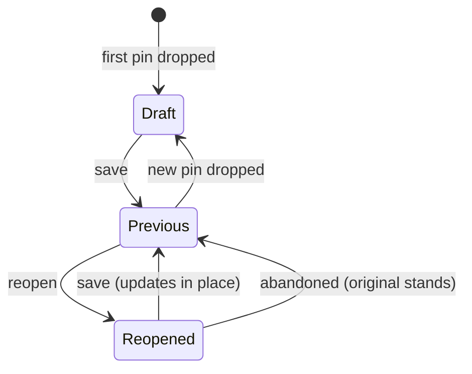

# The check-in as the unit of record

## Summary

Name the **check-in** as the app's unit of record: one or more pins, recorded together. The card view holds the most recent previous check-in — collapsed and read-only — above the open draft check-in, so saved and unsaved work are told apart by structure rather than by a badge. Save is offered only when the draft has something new, and reopening a previous check-in updates its record in place instead of appending a duplicate.

---

## Problem Frame

Leaving the history view drops the user back on the field with pins still on screen and no way to tell whether those pins were ever recorded. Two different states produce that identical picture: a draft that was never saved, and a check-in that was saved moments ago. Nothing distinguishes them.

The state model is the cause. Recording a check-in does not clear the working pins, and the history view always exits to the field regardless of where it was entered from. So the most natural path after saving — save, land on the completion screen, tap through to history, press back — returns the user to a field showing pins that are already recorded, under a button reading `Save · 1`.

Pressing that button is the reasonable move when you can't tell, and it is the wrong one: recording appends a new entry with a new id every time, so the same check-in lands in the diary twice. Users don't discover this until they read their own history.

The vocabulary makes it harder to reason about. The drawer calls the working set "This session" while the returning-user mirror calls a recorded entry "Last check-in" — two names for two different things, one of which also means "browser session." There is no user-facing word for the mark a pin leaves or the group it belongs to, so the interface has no way to say "this one is recorded, that one isn't."

The cost lands on both of the product's stated signals. Saving twice corrupts the diary that feeds history, CSV export, and constellation replay. Hesitating instead — clearing and starting over, or backing out entirely — is a session that never completes.

---

## Key Decisions

**The check-in is the named unit.** A check-in is one or more pins recorded together. It replaces "session" in user-facing copy. The word already exists in the returning-user mirror, so this unifies existing vocabulary rather than inventing a term.

**Recording commits pins out of the draft.** Once recorded, a pin is no longer editable working material. It stays visible as context, but the draft contains only unsaved pins. This makes the saved/unsaved distinction structural — a matter of which group a pin sits in — rather than a color or badge that has to be learned.

**Only the most recent previous check-in stays in the card view.** Earlier ones are reachable through history. This keeps the surface calm and matches the "Last check-in" language already in use.

**Reopening is non-destructive.** A reopened check-in remains recorded; saving again updates that record rather than appending. Abandoning a reopened check-in leaves the original entry standing, so the escape hatch can never cost the user a completed check-in.

**Save is offered only when there is something to record.** An unchanged draft gives the user no action that implies work is pending.

**A previous check-in keeps its pins on the field.** Read-only applies to editing, not to presence. Selecting the collapsed card selects its pins and gives them the emphasis the field already applies to a selected pin, so the recorded check-in stays inspectable on the surface the user is actually looking at.

**The returning-user mirror and the previous check-in are the same surface.** Both describe the last recorded check-in, so they merge into one presentation rather than appearing together.

**Selection has two levels: which check-in is active, and which pin within it is selected.** Today selection is flat — one pin id across everything on the field. With two check-ins on screen, the user needs to move between them before moving within one.

**Changing the active check-in announces itself.** Activating the previous check-in briefly glows its pins and the field before settling; dropping a pin brings the draft forward and selects it. The transition is what tells the user which check-in their next action applies to.

### Check-in lifecycle

---

## Requirements

**Vocabulary**

- R1. User-facing copy names the unit of record a "check-in". "Session" does not appear in user-facing copy.
- R2. The drawer header names what it is showing in check-in terms rather than session terms.

**Draft and previous check-in**

- R3. The card view shows the most recent previous check-in above the draft check-in.
- R4. A previous check-in renders collapsed by default.
- R5. A previous check-in is read-only: its coordinate cannot be adjusted and its words cannot be named or unnamed.
- R6. A previous check-in is visually distinguishable from the draft check-in without expanding it.
- R7. Recording a new check-in replaces the previous check-in shown in the card view; the displaced one remains in history.
- R8. A previous check-in holds all pins recorded together, not only the most recent pin.
- R9. The returning-user mirror and the previous check-in are one surface; the last recorded check-in is presented once, not twice.

**Field**

- R10. A previous check-in's pins remain on the field after recording.
- R11. A previous check-in's pins are distinguishable from draft pins on the field.

**Selection**

- R12. Exactly one check-in is active at a time — either the previous check-in or the draft.
- R13. Activating a check-in briefly glows its pins and the field, then settles.
- R14. Within the active check-in, one pin is selected and its card is the selected card.
- R15. Selecting a pin on the field activates its check-in and selects that pin.
- R16. Dropping a pin makes the draft check-in active, selects the new pin, and brings the draft's cards forward.
- R17. Activating a check-in does not reopen it; inspection and editing stay separate.

**Save**

- R18. Save records the draft check-in and only the draft check-in.
- R19. Save is unavailable when the draft holds nothing new since the last record.
- R20. Recording never produces a second entry for a check-in that was already recorded.
- R21. The save affordance communicates how much is pending, not how many pins are on screen.

**Reopen**

- R22. A previous check-in offers an explicit affordance to reopen it for editing.
- R23. Reopening restores adjustment and naming for that check-in's pins.
- R24. A reopened check-in remains recorded while it is being edited.
- R25. Saving a reopened check-in updates its existing record rather than creating a new one.
- R26. Abandoning a reopened check-in without saving leaves its original record unchanged.

**Discard**

- R27. Discarding affects only the draft check-in; a previous check-in and its record are untouched.
- R28. The discard affordance is named so that it cannot be read as deleting recorded history.

---

## Key Flows

- F1. Record a draft check-in
  - **Trigger:** The user has one or more unsaved pins and presses save.
  - **Steps:** The draft is recorded as a check-in; it becomes the previous check-in and collapses; any prior previous check-in leaves the card view; the save affordance becomes unavailable.
  - **Outcome:** One entry exists. Nothing on screen suggests work is pending.
  - **Covered by:** R3, R4, R7, R18, R19

- F2. Return from history with a previous check-in present
  - **Trigger:** The user leaves the history view and lands back on the field.
  - **Steps:** The previous check-in renders collapsed and read-only, its pins still on the field; no save is offered because the draft is empty.
  - **Outcome:** The user can see that the check-in is recorded without acting to find out.
  - **Covered by:** R3, R4, R5, R6, R9, R10, R19

- F3. Activate a recorded check-in
  - **Trigger:** The user selects the collapsed previous check-in, or one of its pins on the field.
  - **Steps:** That check-in becomes active; its pins and the field glow briefly, then settle; its cards become the ones being navigated.
  - **Outcome:** The user can locate and read what was recorded, and knows their next action applies to it. Nothing has been reopened.
  - **Covered by:** R11, R12, R13, R14, R15, R17

- F4. Add to the record after saving
  - **Trigger:** The user drops a new pin while a previous check-in is on screen.
  - **Steps:** The draft check-in becomes active and its cards come forward; the new pin is selected; save becomes available and refers only to the draft.
  - **Outcome:** Saving records a second check-in containing only the new pin. The earlier pin remains in exactly one entry.
  - **Covered by:** R12, R16, R18, R20, R21

- F5. Reopen and correct a recorded check-in
  - **Trigger:** The user reopens the previous check-in.
  - **Steps:** Its pins become adjustable and nameable again; the record stays in place while editing; saving updates that record.
  - **Outcome:** One entry, corrected. Walking away instead leaves the original entry intact.
  - **Covered by:** R22, R23, R24, R25, R26

- F6. Discard unsaved work
  - **Trigger:** The user discards while both a draft and a previous check-in are present.
  - **Steps:** The draft's pins are removed; the previous check-in, its pins, and its record are untouched.
  - **Outcome:** Nothing recorded is lost.
  - **Covered by:** R27, R28

---

## Acceptance Examples

- AE1. Saving does not leave pending work behind
  - **Covers R18, R19.**
  - **Given** a draft check-in with one pin and no previous check-in,
  - **When** the user saves and then returns to the field from any other view,
  - **Then** one entry exists and no save affordance is offered.

- AE2. The duplicate path is closed
  - **Covers R20.**
  - **Given** a check-in recorded moments ago and still visible on the field,
  - **When** the user attempts the action that previously created a duplicate,
  - **Then** the diary still holds exactly one entry for that check-in.

- AE3. A new pin records alone
  - **Covers R18, R21.**
  - **Given** a previous check-in holding one pin,
  - **When** the user drops a second pin and saves,
  - **Then** two entries exist, each holding one pin, and neither pin appears in both.

- AE4. Abandoning a reopened check-in costs nothing
  - **Covers R24, R26.**
  - **Given** a previous check-in that the user has reopened and adjusted,
  - **When** the user leaves without saving,
  - **Then** the original entry remains recorded with its original coordinate.

- AE5. Discard spares the record
  - **Covers R27.**
  - **Given** a previous check-in and a draft check-in both present,
  - **When** the user discards,
  - **Then** the draft's pins are gone, and the previous check-in's pins and entry are unchanged.

- AE6. A multi-pin check-in stays whole
  - **Covers R8.**
  - **Given** a check-in recorded with three pins,
  - **When** it renders as the previous check-in,
  - **Then** all three pins belong to it, not only the last one dropped.

- AE7. Activating a recorded check-in announces itself
  - **Covers R13, R14, R15, R17.**
  - **Given** a collapsed previous check-in whose pins are on the field and a draft check-in that is currently active,
  - **When** the user selects the previous check-in, or one of its pins,
  - **Then** it becomes the active check-in, its pins and the field glow and settle, one of its pins is selected — and it is not reopened for editing.

- AE8. The last check-in is presented once
  - **Covers R9.**
  - **Given** a returning user whose last check-in would populate both the mirror and the previous check-in,
  - **When** the field loads,
  - **Then** that check-in appears on one surface, not two.

- AE9. A new pin hands the surface to the draft
  - **Covers R12, R16.**
  - **Given** a previous check-in that is currently the active check-in,
  - **When** the user drops a new pin,
  - **Then** the draft check-in becomes active with its cards forward and the new pin selected, and the previous check-in is no longer active.

---

## Scope Boundaries

- Editing or deleting past check-ins from inside the history view. Different surface, separate pass.
- Showing more than one previous check-in in the card view. Rejected in favour of the calmer surface; earlier check-ins stay in history.
- Carrying an unsaved draft across a browser reload. Drafts remain ephemeral.
- Auto-save. The explicit save moment is what makes a check-in feel completed.
- Renaming the diary, history, or constellation surfaces to match the new vocabulary. Worth revisiting once the check-in term settles.

---

## Dependencies / Assumptions

- A recorded check-in is assumed to be the existing diary entry shape — id, timestamp, pins, session duration. Naming the concept does not require a new record type.
- Updating a recorded check-in in place assumes entries can be addressed by id. The current store appends only, so this is new capability rather than existing behavior.
- Merging the returning-user mirror into the previous check-in assumes the mirror's own content — relative time, the relational line, recent rhythm — has a home in the merged surface. Which of it survives is a planning question, not a licence to drop it.
- The field already applies a selection emphasis to a selected pin, and cards and pins already select together. Extending both to previous check-in pins is assumed to reuse that behavior rather than introduce a second one.

---

## Outstanding Questions

**Deferred to planning**

- What session duration means on a check-in that was reopened and saved again — the original sitting, the edit, or the sum.
- The visual treatment that marks a previous check-in as recorded, given it is already collapsed. Frank's usual comparison-prototype pass suits this better than a written decision.
- Whether the legacy selection controls carrying a second discard affordance are still reachable, and if not, whether they should be removed as part of this work.

---

## Sources / Research

- `src/App.tsx` — recording sets the completion view without clearing working pins; history exits to the field regardless of entry point; discard is a bare reset of the working pins.
- `src/hooks/useDiary.ts` — recording appends a new entry with a fresh id on every call. No update-by-id path exists.
- `src/components/EmotionPreview/EmotionDrawer.tsx` — the action bar holding discard and save, and the header naming the working set "This session".
- `src/components/EmotionMirror/MirrorCard.tsx` — the returning-user surface already using "Last check-in".
- `src/components/EmotionField/SelectionControls.tsx` — a second discard affordance, apparently left from the pre-coordinate selection model.
- `STRATEGY.md` — session completion rate and the habit-formation track are the signals this work moves.
- `docs/brainstorms/2026-08-04-adjustable-pin-card-requirements.md` — the adjustable card whose editing affordances this brief switches off at record time.
- `docs/brainstorms/2026-07-09-001-empty-state-returning-mirror-requirements.md` — the returning mirror's own brief; what it was built to carry is the input to merging it.
- `src/components/EmotionField/EmotionField.tsx` — the existing selection emphasis on a selected pin, and the tether pairing a pin with its card.
