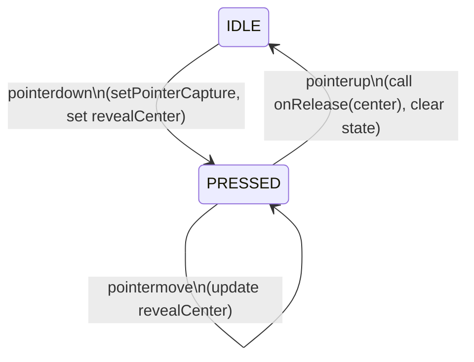

# feat: Traversal v2 — Direct Field Press-Reveal Interaction

## Summary

Replace the v1 press-and-drag virtual viewport model with a direct field interaction: emotion words are ambient-visible at 15% opacity on load, pressing anywhere activates a reveal radius that illuminates nearby words, and releasing within selection distance toggles the nearest word's selection state. This eliminates the multi-gesture overhead of panning a virtual camera and makes every word reachable in one press.

---

## Problem Frame

The v1 model drags a virtual viewport over a zoomed coordinate space (`DRAG_SCALE = 0.2`). To select words in different quadrants, users must sustain multiple drag operations to pan to each region — 5–10+ interactions for 2–3 selections. The `@use-gesture/react` config (`pointer: { touch: true }`) also blocks desktop mouse events, making the experience broken on non-touch surfaces.

V2 maps the emotion space directly to the physical screen. Pressing in a region reveals words there; releasing selects one. No panning required.

---

## Requirements Trace

| Requirement | Plan coverage |
|---|---|
| R1 — Ambient visibility (15%) | U2 (useProximity ambient floor), U3 (EmotionField wiring) |
| R2 — Press-to-reveal | U1 (useFieldGesture pointerdown), U2 (proximity reveal) |
| R3 — Radius follows movement | U1 (pointermove tracking), U2 |
| R4 — Candidate scaling (1.3×, single winner) | U2 (isCandidate in useProximity), U4 (EmotionWord animate) |
| R5 — Select/deselect toggle on release | U3 (onRelease handler in EmotionField) |
| R6 — Empty-space release | U3 (SELECTION_RADIUS guard) |
| R7 — Multi-select + Done button state | U3 (existing multi-select preserved, Done already guards 0) |
| R9 — No virtual viewport | U3 (pinX/pinY state removed) |
| R10 — Coordinate spread audit | U6 (conditional) |
| R11 — Desktop mouse parity | U1 (native pointer events, no touch-only flag) |
| R12 — Selection persistence | U2 (selected words always opacity=1) |
| R13 — Y-axis rendering preserved | U1 (coord mapping), U4 (unchanged rendering) |
| R14 — touch-action: none | U3 (verified retained) |
| R15 — Pointer capture | U1 (setPointerCapture on pointerdown) |

---

## Key Technical Decisions

**Replace `@use-gesture/react` with native pointer events.** The library's `pointer: { touch: true }` option in `useGesturePin` filters out mouse events, breaking desktop. Native `onPointerDown/Move/Up` with `element.setPointerCapture(event.pointerId)` deliver identical semantics on both surfaces with no library overhead. `@use-gesture/react` stays in `package.json` for now — its removal is a follow-up cleanup after v2 is confirmed working.

**Candidate detection runs inside `useProximity`.** The hook already iterates all emotions in one `useMemo` pass to build the results Map. Finding the nearest word to `revealCenter` during that same pass adds zero extra iterations and keeps the logic in one place. `EmotionField` does not need to manage candidate state separately.

**Ambient opacity is a floor, not a gate.** In v1, `opacity: 0` when `dist > VISIBILITY_RADIUS` made all words invisible at rest. V2 changes the floor: outside the reveal radius (or when not pressed), words render at `opacity: 0.15`. The `ProximityResult` interface drops `isApproaching` and adds `isCandidate`.

**Selection logic stays in `EmotionField`, not in the gesture hook.** `useFieldGesture` signals release via an `onRelease(center)` callback. `EmotionField` then does the nearest-word lookup and calls `onSelectionChange`. This keeps the gesture hook decoupled from the emotion data model and mirrors how `useGesturePin` delegated tap handling back to the field.

**Pin component is removed.** There is no persistent pin anchor in v2. `Pin.tsx` is deleted; `EmotionField.tsx` drops its import and pixel-coordinate computation.

---

## High-Level Technical Design

### Gesture state machine



### Component data flow

```mermaid
graph LR
    FG[useFieldGesture] -->|isPressed\nrevealCenter| EF[EmotionField]
    EF -->|revealCenter\nisPressed\nselectedIds| UP[useProximity]
    UP -->|Map&lt;id, ProximityResult&gt;\n{opacity, scale, isCandidate}| EW[EmotionWord ×N]
    EF -->|onRelease callback\n→ nearest word lookup\n→ toggle| APP[App state]
```

### Coordinate mapping for gesture

`coordToPixel(v, px) = (5 + ((v+1)/2)×90)/100 × px` maps `[-1,1]` → `[5%,95%]`.

Inverse for pointer position `(px, py)` in container `(W, H)`:

```
coordX = (px/W − 0.05) / 0.9 × 2 − 1
coordY = −((py/H − 0.05) / 0.9 × 2 − 1)   ← sign inversion: small py = top = high arousal
```

This Y inversion in the mapping is the correct math for the coordinate space — it is **not** the drag-accumulation inversion removed from `useGesturePin`. Word rendering (`toPercent(-emotion.y)`) and the gesture coordinate mapping use the same sign convention independently. (See R13.)

---

## Implementation Units

### U1. Create `src/hooks/useFieldGesture.ts`

**Goal:** New gesture hook using native pointer events. Replaces `useGesturePin.ts`.

**Requirements:** R2, R3, R11, R13, R14, R15

**Dependencies:** none

**Files:**
- Create: `src/hooks/useFieldGesture.ts`

**Approach:**

The hook accepts `{ containerRef, size: { width, height }, onRelease, onFirstInteraction, hasInteracted }`. It returns `{ isPressed, revealCenter, handlers }` where `handlers` is `{ onPointerDown, onPointerMove, onPointerUp }` to spread on the container element.

On `pointerDown`:
- **Guard**: if `size.width === 0 || size.height === 0`, return early — ResizeObserver hasn't fired yet; dividing by zero would corrupt coordinates. Alternatively, read `containerRef.current.getBoundingClientRect()` as a fallback for width/height when `size` is zero.
- Call `event.currentTarget.setPointerCapture(event.pointerId)` (satisfies R15)
- Convert `(event.clientX − rect.left, event.clientY − rect.top)` to coord space using the inverse formula above
- Set `isPressed = true`, `revealCenter = { x, y }`
- Fire `onFirstInteraction` if not yet interacted (preserve existing v1 behavior)

On `pointerMove` (guard: `isPressed`):
- Update `revealCenter` using same coord conversion

On `pointerUp`:
- Call `onRelease(revealCenterRef.current)` with the ref value — **not** the React state snapshot, which may be one RAF behind. The ref is the ground truth for selection; state is for rendering only.
- Set `isPressed = false`, `revealCenter = null`

State held in `useRef` (for revealCenter during move) and `useState` (for re-rendering). Specifically: `isPressedRef` for guards inside event handlers, with a `useState` pair to drive re-renders; `revealCenterRef` updated on every move, committed to state on pointerdown and at a throttled rate or via RAF during move (implementer's call — raw setState on every pointermove is acceptable at this scale).

**Patterns to follow:** `src/hooks/useGesturePin.ts` for the `onFirstInteraction`/`hasInteracted` pattern and the containerRef usage.

**Test scenarios:**
- Pointerdown at container center → `isPressed = true`, `revealCenter ≈ { x: 0, y: 0 }`
- Pointerdown at top-left (5% in from edge) → `revealCenter ≈ { x: -1, y: 1 }` (high arousal, negative valence)
- Pointermove while pressed → `revealCenter` updates to new position
- Pointermove without prior pointerdown → `revealCenter` unchanged
- Pointerup → `isPressed = false`, `revealCenter = null`, `onRelease` called with last center
- Pointer leaves container boundary while pressed (relies on capture) → pointerup still fires and resolves
- `onFirstInteraction` called exactly once on first pointerdown, not on subsequent presses

**Verification:** Hook unit renders; pressing the field sets `isPressed`; moving updates `revealCenter`; releasing calls `onRelease`; desktop mouse and mobile touch both produce identical behavior.

---

### U2. Update `src/hooks/useProximity.ts`

**Goal:** Add ambient state (0.15 floor), replace `isApproaching` with `isCandidate`, support press-reveal model.

**Requirements:** R1, R2, R3, R4, R12

**Dependencies:** none (can be done in parallel with U1)

**Files:**
- Modify: `src/hooks/useProximity.ts`

**Approach:**

New signature:
```
useProximity(
  emotions: Emotion[],
  revealCenter: { x: number; y: number } | null,
  isPressed: boolean,
  selectedIds: Set<string>,
): Map<string, ProximityResult>
```

Updated `ProximityResult`:
```
interface ProximityResult {
  opacity: number;
  scale: number;
  isCandidate: boolean;  // replaces isApproaching
}
```

Logic:

1. **Pre-pass — find candidate**: when `isPressed && revealCenter !== null`, iterate emotions to find the one with minimum distance to `revealCenter`. **Only assign `candidateId` if that word's distance ≤ `VISIBILITY_RADIUS`; if no word is within `VISIBILITY_RADIUS`, `candidateId = null`.** If not pressed, `candidateId = null`.

2. **Per-emotion pass** (branches evaluated in order; first match returns):
   - If `selectedIds.has(emotion.id)` → `{ opacity: 1, scale: 1, isCandidate: false }` — selected words always return `isCandidate: false` regardless of proximity to `revealCenter`; this branch returns early before the `candidateId` check
   - If `!isPressed || revealCenter === null` → `{ opacity: 0.15, scale: 1.0, isCandidate: false }` (ambient)
   - If `dist > VISIBILITY_RADIUS` → `{ opacity: 0.15, scale: 1.0, isCandidate: false }` (ambient floor, not 0)
   - Otherwise → interpolate opacity `0.15 → 1.0` and scale `1.0 → 1.1` over `[VISIBILITY_RADIUS, 0]`; `isCandidate = (emotion.id === candidateId)`

`VISIBILITY_RADIUS`, `SELECTION_RADIUS`, `APPROACH_RADIUS` constants stay exported (APPROACH_RADIUS is no longer used internally but may be referenced in tests — remove only if confirmed unused).

**Patterns to follow:** existing `useMemo` structure in `src/hooks/useProximity.ts`.

**Test scenarios:**
- Not pressed → every word has `opacity = 0.15`, `scale = 1.0`, `isCandidate = false`
- Pressed with `revealCenter = { x: 0, y: 0 }`, word at origin → `opacity = 1.0`, `isCandidate = true`
- Pressed, two words at different distances → only the nearer word has `isCandidate = true`
- Pressed, word at `dist > VISIBILITY_RADIUS` → `opacity = 0.15` (floor, not 0)
- Selected word → `opacity = 1`, `scale = 1`, `isCandidate = false` regardless of press state
- Selected word at same position as reveal center → selected styling wins over candidate
- Pressed, two words at different distances — word A within `VISIBILITY_RADIUS`, word B outside — only word A is `isCandidate = true`; word B stays at `opacity = 0.15`, `isCandidate = false`
- Pressed with no word within `VISIBILITY_RADIUS` anywhere → `candidateId = null`, no word has `isCandidate = true`

**Verification:** All words render at 0.15 on load; pressing near a word brightens it to 1.0; exactly one word has `isCandidate = true` per press; selected words are unaffected by press state.

---

### U3. Update `src/components/EmotionField/EmotionField.tsx`

**Goal:** Remove virtual pin model, wire `useFieldGesture`, handle selection on release.

**Requirements:** R5, R6, R7, R9, R11, R14

**Dependencies:** U1, U2

**Files:**
- Modify: `src/components/EmotionField/EmotionField.tsx`
- Delete: `src/components/EmotionField/Pin.tsx`

**Approach:**

Removals:
- `pinX`, `pinY` state and `setPinX`/`setPinY`
- `useGesturePin` import and call
- `Pin` import, import, and `<Pin>` rendering
- `pinPixelX`, `pinPixelY` computation
- `coordToPixel` helper (only used for pin positioning)

Additions:
- `useFieldGesture({ containerRef, size, onRelease: handleRelease, onFirstInteraction, hasInteracted })`
- Spread `handlers` on the container div instead of `{...bind()}`
- `isPressed`, `revealCenter` from the hook

`handleRelease(center)`:

`SELECTION_RADIUS` = 0.15 coord units (existing constant in `src/hooks/useProximity.ts`). This is ~43% of `VISIBILITY_RADIUS` (0.35) — a release must land within roughly 7% of container width of the nearest word to register a selection. This is the UX tap target; tune during U6 if words feel hard to select.

```
find nearest emotion to center within SELECTION_RADIUS
if found:
  toggle: if selectedEmotions includes it → remove; else → add
else:
  // no-op in this plan — coordinate-only case
  // NOTE: the coordinate-first flag plan (docs/plans/2026-06-24-002-feat-coordinate-first-flag-plan.md)
  // extends this branch to plant a coordinate flag. Do NOT implement as an early return
  // before this point — keep it as a named else branch so the extension is additive.
```

`useProximity` call changes from `(emotions, pinX, pinY, selectedIds)` to `(emotions, revealCenter, isPressed, selectedIds)`.

Container div: keep `touchAction: 'none'`, `overscrollBehavior: 'none'`, `cursor: 'crosshair'`. Spread `handlers` (not `bind()`). Cursor change during press (`isPressed=true`) is deferred — the coordinate-first flag plan (2026-06-24-002 U3) adds a full crosshair component that replaces cursor feedback entirely; traversal v2 ships with a static crosshair cursor.

Done button: `SelectionControls` already shows only when `hasSelections` — this satisfies R7's "Done disabled at 0 selections" (the button is hidden entirely, which is stricter than disabled and acceptable).

**Patterns to follow:** Existing `EmotionField.tsx` structure; tap-detection loop in `useGesturePin.ts` lines 68–91 for the nearest-word search pattern.

**Test scenarios:**
- Field mounts → `<Pin>` is not in the DOM
- Pointerdown + immediate pointerup near an unselected word → word appears in `selectedEmotions`
- Same press near an already-selected word → word removed from `selectedEmotions` (deselect)
- Pointerdown + pointerup in empty space (no word within SELECTION_RADIUS) → `selectedEmotions` unchanged
- Two separate press-release cycles on two different words → both words selected
- Done button/controls absent at 0 selections; present at 1+
- `touchAction: 'none'` is present on the container element

**Verification:** Full press-reveal-select cycle works on desktop mouse and mobile touch; deselect works; multi-select accumulates; no Pin renders; no JS errors from removed imports.

---

### U4. Update `src/components/EmotionField/EmotionWord.tsx`

**Goal:** Consume updated `ProximityResult` (`isCandidate` replaces `isApproaching`, candidate scale = 1.3×).

**Requirements:** R4

**Dependencies:** U2

**Files:**
- Modify: `src/components/EmotionField/EmotionWord.tsx`

**Approach:**

Destructure `isCandidate` instead of `isApproaching` from `proximity`.

Update `animate`:
```
animate={{
  opacity: isSelected ? 1 : opacity,
  scale: isCandidate ? 1.3 : (isSelected ? 1 : scale),
}}
```

No other changes. Y-axis rendering (`toPercent(-emotion.y)`) is preserved unchanged (R13).

**Patterns to follow:** Existing `motion.span` animate pattern in `EmotionWord.tsx`.

**Test scenarios:**
- Word with `isCandidate = true` → `scale = 1.3` in animate props
- Word with `isCandidate = false`, not selected → `scale` from proximity (≤ 1.1)
- Selected word → `scale = 1` regardless of `isCandidate`
- Selected + `isCandidate = true` → selected styling wins (scale=1, amber, text-shadow)
- Non-candidate, non-selected, not pressed → `opacity = 0.15` (ambient)

**Verification:** Pressing near a word causes it to scale to ~1.3; only one word scales up at a time; scale transitions smoothly as the press center moves.

---

### U5. Update hint text in `src/App.tsx`

**Goal:** Reflect the new gesture model in the onboarding hint.

**Requirements:** Resolves the Open Question from the brainstorm

**Dependencies:** none (can be done in parallel)

**Files:**
- Modify: `src/App.tsx`

**Approach:**

Line ~108, change:
```
press and drag to explore
```
to:
```
press near a word to reveal and select it
```

No other changes to hint logic (it still hides after `hasInteracted`).

**Test scenarios:**
- First load (no `ONBOARDED_KEY` in localStorage) → hint text reads "press near a word to reveal and select it"
- After first pointerdown → hint fades out (existing behavior preserved)

**Verification:** Hint shows new text on first visit; disappears after interaction.

---

### U6. Audit and conditionally redistribute `src/data/emotions.ts`

**Goal:** Verify coordinate spread; redistribute if significant clustering is confirmed.

**Requirements:** R10

**Dependencies:** U1–U5 should be working first so the visual result can be assessed

**Files:**
- Possibly modify: `src/data/emotions.ts`

**Approach:**

Audit step: For each quadrant, compute the centroid of words and the min/max spread. Flag if:
- Any quadrant has fewer than 4 words within the central ±0.4 sub-region
- More than 30% of words share x or y coordinates within 0.05 of each other (dense stack)
- Any region of ≥ 0.3×0.3 coord units has zero words

Current known spread: x ≈ [−0.85, 0.90], y ≈ [−0.75, 0.90]. Q3 (low valence, low arousal) and Q4 (positive valence, low arousal) appear less populated from the initial read.

If redistribution is warranted:
- Expand the outer boundary of words to ±0.90–0.95 on both axes where space exists
- Nudge dense clusters apart (minimum 0.08 coord unit separation between any two words)
- Do not change `id`, `label`, `depth`, or `cluster` fields
- Preserve the quadrant each word belongs to (do not move a word across an axis)

If the audit shows the current spread is already sufficient for the success criterion ("all words reachable in 1 press from any area"), skip redistribution and document the finding.

**Execution note:** Run the audit first as a data analysis step; redistribute as a second step only if the audit confirms a problem.

**Acceptance criteria (audit pass threshold):**
- No circular region of radius ≥ VISIBILITY_RADIUS (0.35 units) anywhere in the field contains zero words
- Every quadrant has at least 4 words within the central ±0.4 sub-region
- No more than 30% of words share x or y coordinate within 0.05 of each other (dense stack)
- The center dead zone (no words within VISIBILITY_RADIUS of the origin) must be addressed — by redistribution, adding near-center words, or increasing VISIBILITY_RADIUS

**Sequencing note:** The coordinate-first flag plan (`docs/plans/2026-06-24-002-feat-coordinate-first-flag-plan.md`) has its own U6 targeting `emotions.ts` (center fill). Treat both U6s as a single combined audit and redistribution pass — run them together, not independently, to avoid double-redistribution.

**Test scenarios:**
- Audit reports no region ≥ 0.35 radius with zero words — redistribution not required
- Audit reports center dead zone or quadrant gap — redistribution applied, audit re-run to confirm thresholds met

**Verification:** Visual check: pressing anywhere on the screen illuminates at least 2–3 words within VISIBILITY_RADIUS; no screen quadrant press produces zero reveals.

---

## Scope Boundaries

**In scope:**
- `useFieldGesture.ts` (new), `useProximity.ts`, `EmotionField.tsx`, `EmotionWord.tsx`, `App.tsx` (hint text), optionally `emotions.ts`
- `Pin.tsx` deletion

**Out of scope for this plan:**
- Passive hover reveal (pointermove without press on desktop) — optional enhancement per brainstorm
- Animated reveal radius ring (visual boundary circle) — out of scope per brainstorm
- Word label resize/reflow based on screen size
- Removing `@use-gesture/react` from `package.json` — defer until v2 is confirmed stable
- Definition card discoverability improvements (separate v1 UX finding)

### Deferred to Follow-Up Work

- `@use-gesture/react` package removal from `package.json` and `pnpm-lock.yaml`
- Passive hover reveal on desktop (optional enhancement)
- Minimum touch target enforcement for short words on small screens (Open Question from brainstorm)
- Automatic word nudging for words < 0.05 coord units apart (Open Question from brainstorm)

---

## Risks & Dependencies

| Risk | Likelihood | Mitigation |
|---|---|---|
| `setPointerCapture` unavailable in some older mobile browsers | Low | Standard since iOS 13 / Android 10; acceptable floor |
| `pointermove` fires too frequently on mobile (60Hz+) → jank | Low | At ~40 words, proximity recompute is cheap; no RAF throttle needed initially |
| Removing `bind()` spread breaks any hidden event props from `@use-gesture/react` | Low | `bind()` only added gesture handlers; replacing with explicit `onPointerDown/Move/Up` is equivalent |
| Ambient 15% opacity makes words too hard to read at rest | Medium | Tune during U2 implementation; value is a starting point, not a hard spec |
| Q2/Q3 word density gaps cause some press areas to illuminate very few words | Medium | U6 audit addresses this; VISIBILITY_RADIUS (0.35) is generous relative to expected spread |

---

## Open Questions (Deferred from Brainstorm)

- Is a minimum touch target size needed for short words (< 4 characters) on small screens?
- Should very closely spaced words (< 0.05 coord units apart) be nudged apart automatically?
- Should `APPROACH_RADIUS` constant be removed now that `isApproaching` is gone?

## Open Questions (From Doc Review — Implementation-Time Decisions)

- **U2 test scenario coverage for VISIBILITY_RADIUS boundary**: the "two words at different distances" test doesn't specify whether both are within VISIBILITY_RADIUS. Consider adding an explicit boundary-crossing test case during U2 implementation.
- **useMemo signature — object vs scalars**: changing from `(pinX, pinY)` scalars to `revealCenter: {x,y}` object means new object references always invalidate the memo. Consider `revealCenterX/Y` scalars to match the existing signature pattern, or note the object-reference semantics explicitly.
- **RAF/throttle scale ceiling**: *"raw setState on every pointermove is acceptable at this scale"* assumes ~40 words. If the emotion dataset grows significantly, a RAF throttle may be needed. Document the ceiling (e.g., ≤80 words) when making the implementation call.
- **`isPressed=false` + `revealCenter !== null` transient state**: on `pointerUp`, these are cleared sequentially. React 18 batched updates make this benign, but the authoritative rule is: reveal is active iff `isPressed=true AND revealCenter !== null`; any other combination renders ambient.
- **Candidate scale transition spec for U4**: the `motion.span` in `EmotionWord` should have a fast transition for candidate scale changes (0.1–0.15s, ease-out) since candidate switches on every pointermove. Confirm the existing transition config is appropriate for 60Hz switch frequency.

---

## Sources & Research

- Origin requirements: `docs/brainstorms/2026-06-22-001-traversal-v2-requirements.md`
- Prior v1 interaction plan: `docs/plans/2026-06-17-001-fix-emotion-field-interaction-plan.md`
- External research: not required — local patterns and Pointer Events API documentation sufficient
