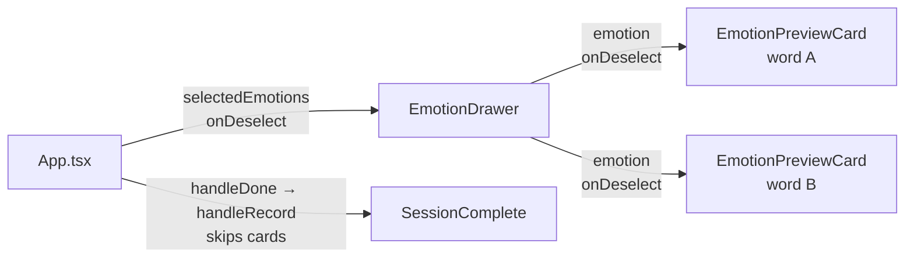

# feat: Emotion Preview Drawer — Immediate Definition on Selection

## Summary

Show a stacked, scrollable preview drawer at the bottom of the field that appears as soon as a word is selected. Each selected word gets a card in the drawer showing its label, description, and related words. Cards are individually dismissable from within the drawer (deselecting the word). Done goes straight to record — no separate card review sequence.

---

## Problem Frame

Selecting a word currently does nothing visible beyond the amber highlight and Done button. The definition card — which is the primary learning vehicle — is hidden behind "Done ✓". First-time users don't know it's there, and experienced users must commit before reviewing. The core product thesis is low-friction vocabulary exposure; putting the vocabulary behind a confirmation gate undercuts it.

The fix is to surface the definition at the moment of selection, not confirmation.

---

## Key Technical Decisions

**Bottom drawer, not right pane.** The app is portrait mobile-first. A right pane would split the 375px viewport in half, leaving ~185px for the emotion field — too narrow for meaningful interaction. A bottom drawer slides up from below, capping at ~40% of screen height, and leaves the upper portion of the field fully interactive for additional selections.

**Stacked cards with per-card deselect.** When multiple words are selected, all their preview cards stack vertically inside the drawer (newest at top). Each card has a × deselect button. This replaces the need to tap Done and then swipe through cards to remove a word — the user manages selection entirely from the drawer.

**Done goes directly to record.** Since the user already sees each word's definition inline during selection, the post-Done card sequence is redundant. `handleDone` now calls `handleRecord` directly, eliminating the `view = 'cards'` transition. `DefinitionCardSequence` becomes unreachable from the main flow and is deferred for cleanup.

**Separate `EmotionPreviewCard` from `DefinitionCard`.** The drawer context requires a different card shape: no progress indicator (`1 of N`), no Next/Record buttons, and a deselect × control. Reusing `DefinitionCard` with prop hacks would couple two different interaction contexts. A new lightweight component reuses the same data layer (`getDescription`) and visual palette.

**Drawer open/close driven by selection count.** The drawer is visible when `selectedEmotions.length > 0` and hidden when 0. `AnimatePresence` in `App.tsx` handles the slide transition. No separate "drawer open" state needed.

---

## High-Level Technical Design

### Component hierarchy in field view



### View state machine change

```mermaid
stateDiagram-v2
    state "Before" {
        [*] --> field_v1
        field_v1 --> cards: Done (selectedEmotions > 0)
        cards --> complete_v1: Record
    }
    state "After" {
        [*] --> field_v2
        field_v2 --> complete_v2: Done → record directly
    }
```

### Drawer layout (mobile, portrait)

```
┌─────────────────────────┐  ← full screen
│                         │
│   emotion field         │  ← upper ~60%, fully interactive
│   words at ambient      │
│   opacity               │
│                         │
├─────────────────────────┤
│ ▼ Handle                │  ← drawer top edge, spring-animated slide-up
│ ┌─────────────────────┐ │
│ │ Word A          [×] │ │  ← EmotionPreviewCard, newest first
│ │ description…        │ │
│ │ related: …          │ │
│ └─────────────────────┘ │
│ ┌─────────────────────┐ │
│ │ Word B          [×] │ │  ← scrollable when overflow
│ │ description…        │ │
│ └─────────────────────┘ │
└─────────────────────────┘  ← bottom 40% max-height, overflow-y: scroll
```

---

## Implementation Units

### U1. Create `src/components/EmotionPreview/EmotionPreviewCard.tsx`

**Goal:** Lightweight single-emotion preview card for use inside the drawer.

**Dependencies:** none

**Files:**
- Create: `src/components/EmotionPreview/EmotionPreviewCard.tsx`

**Approach:**

Props: `{ emotion: SelectedEmotion; onDeselect: () => void }`.

Content layout:
- Header row: emotion label (amber, ~20px, font-weight 300) + × deselect button (right-aligned, `rgba(232, 224, 216, 0.4)`)
- Description text (15px, `rgba(232, 224, 216, 0.85)`, line-height 1.6)
- Related words row (same pill style as `DefinitionCard`, show up to 3)

Card styling: matches `DefinitionCard`'s background (`rgba(24, 20, 16, 0.96)`), border (`rgba(232, 224, 216, 0.12)`), border-radius 16, padding 16px. No backdrop filter needed (drawer handles it).

The × button calls `onDeselect` directly. No confirm step. Minimum touch target: 44×44px via padding expansion (`padding: 12px` on the button element so the visible icon stays small while the hit area meets iOS HIG).

**Patterns to follow:** `src/components/DefinitionCard/DefinitionCard.tsx` for visual palette, `getDescription` usage, and related words rendering. Strip progress indicator and Next/Record/Skip buttons.

**Test scenarios:**
- Renders emotion label in amber and description text
- Renders up to 3 related words as pills
- × button click triggers `onDeselect` callback
- Words with no related IDs: related section absent
- Long description does not overflow card width (text wraps)

**Verification:** Card renders label + description + related pills; × calls the callback; visually consistent with the existing `DefinitionCard` palette.

---

### U2. Create `src/components/EmotionPreview/EmotionDrawer.tsx`

**Goal:** Bottom-sheet container that stacks `EmotionPreviewCard` components for all selected emotions.

**Dependencies:** U1

**Files:**
- Create: `src/components/EmotionPreview/EmotionDrawer.tsx`

**Approach:**

Props: `{ selectedEmotions: SelectedEmotion[]; onDeselect: (id: string) => void; onDone: () => void; onClear: () => void }`.

Layout:
- Absolutely-positioned container anchored to bottom (`position: absolute; bottom: 0; left: 0; right: 0`). `App.tsx` uses `position: relative; width: 100%; height: 100%; overflow: hidden` (full-viewport), so `absolute` anchors to the viewport bottom without the clipping bug `position: fixed` triggers on non-root ancestors with `overflow: hidden`.
- Max height ~42% of viewport (`max-height: 42vh`). Outer container does NOT scroll — the card area inside does.
- Background: `rgba(18, 14, 10, 0.95)` with `backdrop-filter: blur(16px)`. Border-top: `1px solid rgba(232, 224, 216, 0.10)`.
- `touchAction: 'pan-y'` so scroll inside the drawer works normally without interfering with the field's `touchAction: 'none'`.
- `onPointerDown: e.stopPropagation()` to prevent drawer touches from reaching the field gesture handler.

Two-section layout (flex column, fills `max-height: 42vh`):
- **Action bar** (non-scrollable, at top of drawer): Done button + Clear button mirroring the `SelectionControls` style — Done reads "Done ✓ (N)" (enabled), Clear at right. Padding: 12px top, 16px horizontal, 12px bottom. Border-bottom: `1px solid rgba(232, 224, 216, 0.08)`. This replaces `SelectionControls` — remove it from `EmotionField` after this change.
- **Card area** (`overflow-y: auto`, `-webkit-overflow-scrolling: touch`, `flex: 1`): stacks `EmotionPreviewCard` components top-to-bottom. Newest selection at top (reverse the `selectedEmotions` array for display). Gap between cards: 8px. Padding: 8px top, 16px horizontal, `max(16px, env(safe-area-inset-bottom))` bottom.

Animation: Framer Motion `motion.div` with `initial={{ y: '100%' }} animate={{ y: 0 }} exit={{ y: '100%' }}` and `transition={{ type: 'spring', stiffness: 300, damping: 35 }}`.

**Patterns to follow:** `src/components/EmotionField/SelectionControls.tsx` for `onPointerDown: e.stopPropagation()` pattern. `src/components/DefinitionCard/DefinitionCardSequence.tsx` for AnimatePresence/motion patterns.

**Test scenarios:**
- Renders one `EmotionPreviewCard` per selected emotion
- Newest selection appears first (reverse order)
- When `selectedEmotions` is empty: renders nothing (parent wraps in AnimatePresence for unmount)
- Overflow: when 3+ words selected, drawer scrolls internally without body scroll
- `onDeselect(id)` propagates the correct emotion id upward when × is clicked on a card
- Drawer does not steal pointer events from the emotion field above it
- Done button in action bar fires `onDone`; Clear button fires `onClear` which clears all selections and collapses the drawer

**Verification:** Selecting a word causes the drawer to slide up; selecting more stacks cards; deselecting from × removes the card and the drawer collapses if 0 remain; Done and Clear in the action bar work correctly.

---

### U3. Wire `EmotionDrawer` into `App.tsx` and update selection handling

**Goal:** Mount the drawer in the field view, wire deselect-from-drawer back to `selectedEmotions` state.

**Dependencies:** U2

**Files:**
- Modify: `src/App.tsx`
- Modify: `src/components/EmotionField/EmotionField.tsx` (remove `SelectionControls`)

**Approach:**

Add inside the `{view === 'field'}` block (alongside the existing hint and history button chrome), rendered after `<EmotionField>`:

```
<AnimatePresence>
  {selectedEmotions.length > 0 && (
    <EmotionDrawer
      selectedEmotions={selectedEmotions}
      onDeselect={(id) =>
        setSelectedEmotions(prev => prev.filter(e => e.id !== id))
      }
      onDone={handleDone}
      onClear={() => setSelectedEmotions([])}
    />
  )}
</AnimatePresence>
```

The `onDeselect` callback filters `selectedEmotions`. `onDone` and `onClear` are the same handlers previously threaded to `SelectionControls` via `EmotionField` — remove `<SelectionControls>` from `EmotionField`'s JSX (and its import), since the drawer's action bar takes over entirely.

No additional state needed — drawer open/close is derived from `selectedEmotions.length`.

**Patterns to follow:** Existing `AnimatePresence` wrapping of the hint overlay in `App.tsx` (lines ~76–111).

**Test scenarios:**
- 0 words selected: drawer absent from DOM (`AnimatePresence` exits)
- 1 word selected: drawer slides in with 1 card
- Deselect via drawer ×: word removed from `selectedEmotions`, field word loses amber highlight
- Deselect via field (press selected word again, after v2 traversal): drawer card disappears
- Done in drawer action bar → fires `handleDone` → (with U4) goes directly to `complete` view
- Clear in drawer action bar → all selections cleared, drawer collapses
- History button (`view` change) while drawer open: drawer exits with the field view
- New check-in (handleNewSession): drawer closes because selectedEmotions resets to []

**Verification:** Drawer appears on selection, closes on deselect, stays in sync with field highlights.

---

### U4. Change Done flow to skip card sequence and record directly

**Goal:** `handleDone` records immediately instead of transitioning to the card review sequence.

**Dependencies:** none (can be done in parallel with U1)

**Files:**
- Modify: `src/App.tsx`

**Approach:**

Current `handleDone`:
```
if (selectedEmotions.length > 0) setView('cards')
```

New `handleDone` — call `handleRecord` directly:
```
if (selectedEmotions.length > 0) handleRecord()
```

This removes the `view = 'cards'` transition entirely from the Done path. The `view === 'cards'` AnimatePresence branch and `DefinitionCardSequence` are intentionally unreachable after this change — leave them in place for now (removal is tracked in Deferred to Follow-Up Work). `DefinitionCardSequence` is fully superseded by the drawer in this flow.

**Test scenarios:**
- Clicking Done with 1+ words selected → goes directly to `view = 'complete'` (no intermediate `view = 'cards'`)
- Session complete screen shows the same emotions that were previewed in the drawer
- `sessionDurationMs` is correct (timer started on first interaction, ended at Done click)
- Done with 0 words selected: no action (guard already present)

**Verification:** Done click → session complete screen appears without the card sequence interlude; diary entry recorded correctly.

---

## Scope Boundaries

**In scope:**
- `EmotionPreviewCard.tsx` (new)
- `EmotionDrawer.tsx` (new)
- `App.tsx` — drawer mount + Done flow change

**Out of scope for this plan:**
- Desktop right-panel layout (bottom drawer ships to both mobile and desktop; desktop layout enhancement is deferred)
- Gesture-to-dismiss the drawer (swipe down) — deferred
- Passive hover preview without selection (hover-only state for desktop)
- Definition content editing or expansion

### Deferred to Follow-Up Work

- Remove `DefinitionCardSequence` import and the `view === 'cards'` branch from `App.tsx` once confirmed unused
- Remove `AppView = 'cards'` from the type union
- Desktop right-panel variant of the drawer (min-width breakpoint, fixed right panel instead of bottom sheet)
- Swipe-to-dismiss gesture for the drawer

---

## Risks & Dependencies

| Risk | Likelihood | Mitigation |
|---|---|---|
| Drawer overlaps `SelectionControls` (Done/Clear buttons) | Resolved | `SelectionControls` moved into drawer action bar; removed from `EmotionField` (see U2, U3) |
| `touchAction: 'none'` on EmotionField conflicts with `pan-y` inside the drawer | Medium | The drawer uses `onPointerDown: stopPropagation()` to isolate from the field's gesture zone |
| Drawer position on iOS clips with safe-area inset | Resolved | `max(16px, env(safe-area-inset-bottom))` in card area padding (see U2) |
| Card stacking order feels backwards | Low | Newest-at-top is the plan's default; trivially reversed if user prefers oldest-at-top |

---

## Open Questions

- When the user deselects all words from the drawer, the drawer (and its Done/Clear buttons) disappears entirely — verify this edge case during implementation: is it clear to the user that they've "gone back"? The ambient field state (dim words, no selection highlight) should make it obvious.
