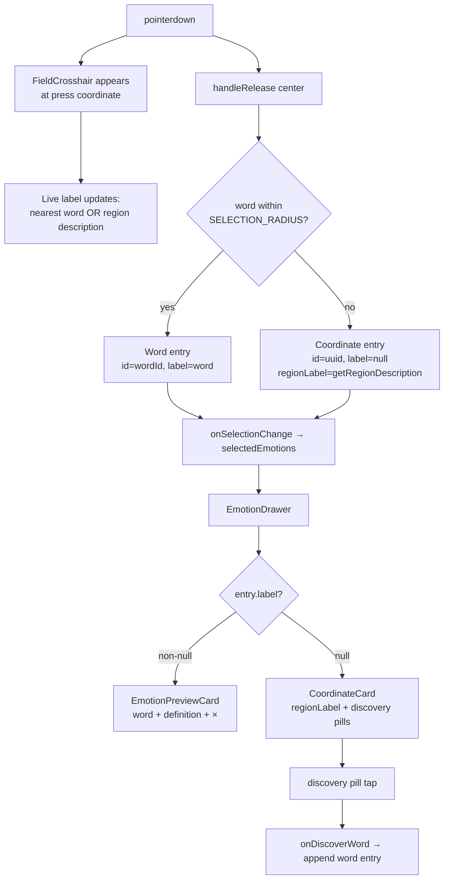

# feat: Coordinate-First Flag Planting — Spatial Emotion Selection

## Summary

Reframe emotion selection as planting a flag in coordinate space. Every press-release records the (x, y) coordinate as the primary datum. If the flag lands within SELECTION_RADIUS of a word, that word becomes the entry's label. If between words, the session shows a region description ("between *tense* and *anxious* — stirred up, a little on edge") plus nearby discovery words in the drawer. A crosshair replaces the cursor during press and shows a live label that updates as the user moves.

---

## Problem Frame

The current word-selection model presents vocabulary as a menu. Users are better at recognizing whether a word fits ("yes / no") than at choosing from near-synonyms. A press between "tense" and "anxious" currently produces nothing — a silent failure — when it carries real information: the user is in that region of activated, negative-valence space. The coordinate is the more precise instrument; the word is the label.

---

## Prerequisites

This plan depends on two pending plans being shipped first:

- **Traversal v2** (`docs/plans/2026-06-22-001-feat-traversal-v2-direct-field-plan.md`) — provides `useFieldGesture.ts` and the `handleRelease(center)` callback in `EmotionField`. This plan extends that callback; it cannot ship without it.
- **Emotion preview drawer** (`docs/plans/2026-06-24-001-feat-emotion-preview-drawer-plan.md`) — provides `EmotionDrawer`. U5 (coordinate card) extends the drawer's render path; it cannot ship without it.

U1, U2, U3, and U6 have no external prerequisites and can proceed in parallel with the traversal v2 and drawer work.

---

## Requirements Trace

| Requirement | Units |
|---|---|
| R1 — Flag at coordinate | U4 |
| R2 — Word label by proximity | U4 |
| R3 — No forced word assignment | U4 |
| R4 — Region description (relational + narrative) | U2, U4 |
| R5 — Discovery words | U5 |
| R6 — Discovery word equivalence | U5 |
| R7 — Multi-flag | U4 |
| R8 — Word distribution coverage | U6 |
| R9 — Crosshair cursor + live label | U3, U4 |
| R10 — Session record | U7 |

---

## Key Technical Decisions

**Schema extension — nullable label, synthetic id for coordinate entries.** `SelectedEmotion.id: string` stays non-nullable. Coordinate-only entries receive a `crypto.randomUUID()` as their `id` at plant time (not a vocabulary ID, but a stable deselect key). `label: string | null` and `cluster: string | null` become nullable; null signals a coordinate-only entry. Two new optional fields are added: `regionLabel?: string` (the relational + narrative description) and `nearbyIds?: string[]` (discovery word IDs within VISIBILITY_RADIUS). Downstream components distinguish entry type by `entry.label === null`. A full discriminated union was considered and rejected as too wide a blast radius (see origin doc). (see origin: `docs/brainstorms/2026-06-24-001-coordinate-first-selection-requirements.md`)

**Region description as a pure data function.** `getRegionDescription(x, y, emotions)` in `src/data/regions.ts` returns `{ relational, narrative, nearbyIds }` synchronously, with no external calls. The relational component is derived from the 2 nearest words within VISIBILITY_RADIUS; the narrative is a lookup table on 9 axis-range zones. This module is pure and easy to test in isolation.

**Crosshair as an absolutely-positioned overlay.** The crosshair renders inside the EmotionField container at the press pixel coordinate. The field container sets `cursor: 'none'` while `isPressed === true`. The crosshair's live label calls `getRegionDescription` with the current revealCenter on each render; this is not memoized per-frame but is cheap (linear scan over ≤188 words).

**Flag planting hooks into traversal v2's `handleRelease`.** The v2 plan's `handleRelease(center)` currently: (a) finds nearest word within SELECTION_RADIUS, (b) toggles selection. This plan adds branch (c): if no word found, create a coordinate-only `SelectedEmotion` with UUID id, null label, and region description from U2, and append to `selectedEmotions`. Deselect of coordinate entries matches by `id` (UUID), same as word entries. Re-pressing near a planted flag deselects it via the same toggle path.

**Coordinate card in the drawer — no × button, discovery pills instead.** When the drawer renders a `SelectedEmotion` with `label === null`, it shows a `CoordinateCard` instead of `EmotionPreviewCard`. The coordinate card has no × deselect (coordinate flags are deselected by re-pressing the same area on the field — consistent with how word deselection works). It shows `regionLabel` as the headline and `nearbyIds` as tappable discovery pills. Tapping a pill calls `onDiscoverWord(wordId)` in App.tsx, which appends a proper word entry alongside the existing coordinate entry. Both coexist in `selectedEmotions`.

---

## High-Level Technical Design

### Entry type detection

```
entry.label === null  →  CoordinateEntry  →  show CoordinateCard in drawer
entry.label !== null  →  WordEntry        →  show EmotionPreviewCard in drawer
```

### Flag planting flow



### Crosshair live label logic

While pressed, `revealCenter` updates on every pointermove. The live label = nearest word within VISIBILITY_RADIUS (using its `label`), or the `narrative` from `getRegionDescription(revealCenter.x, revealCenter.y)` if no word is within range. This mirrors the candidate-word visual (which scales up the nearest word) but gives it a text label the user can read.

### Region description zones (narrative lookup)

| Arousal | Valence | Phrase |
|---|---|---|
| y > 0.3 | x < −0.35 | "on edge, stirred up" |
| y > 0.3 | −0.35 ≤ x ≤ 0.35 | "activated, unsettled" |
| y > 0.3 | x > 0.35 | "energized, lit up" |
| −0.3 ≤ y ≤ 0.3 | x < −0.35 | "tense, guarded" |
| −0.3 ≤ y ≤ 0.3 | −0.35 ≤ x ≤ 0.35 | "in-between, mixed" |
| −0.3 ≤ y ≤ 0.3 | x > 0.35 | "open, receptive" |
| y < −0.3 | x < −0.35 | "heavy, withdrawn" |
| y < −0.3 | −0.35 ≤ x ≤ 0.35 | "quiet, still" |
| y < −0.3 | x > 0.35 | "calm, at ease" |

---

## Implementation Units

### U1. Extend `SelectedEmotion` schema

**Goal:** Allow `SelectedEmotion` to represent both word entries and coordinate-only flag entries without a discriminated union.

**Requirements:** R1, R4, R5

**Dependencies:** none

**Files:**
- Modify: `src/types.ts`

**Approach:**

Change `SelectedEmotion`:
- `label: string | null` — null for coordinate-only entries
- `cluster: string | null` — null for coordinate-only entries
- `id: string` — unchanged; coordinate entries use `crypto.randomUUID()`
- Add `regionLabel?: string` — the relational + narrative string for coordinate entries (e.g., "between *tense* and *anxious* — stirred up, a little on edge")
- Add `nearbyIds?: string[]` — IDs of words within VISIBILITY_RADIUS at plant time, ordered by distance, up to 3

No changes to `DiaryEntry` — it still holds `SelectedEmotion[]`, which now supports both entry types.

Audit downstream code that reads `label` or `cluster` for null-safety: `EmotionWord.tsx` (renders `emotion.label` as text), `DefinitionCard.tsx`, `DiaryHistory` display. Mark these as required null-guards in their respective units.

**Patterns to follow:** `src/types.ts` existing interface style. Keep the interface single — no `|` union type.

**Test scenarios:**
- `SelectedEmotion` with `id: "anxious-1"`, `label: "anxious"`, `cluster: "stressed"` — well-formed word entry
- `SelectedEmotion` with `id: "<uuid>"`, `label: null`, `cluster: null`, `regionLabel: "between tense and anxious"`, `nearbyIds: ["tense-1"]` — well-formed coordinate entry
- TypeScript compiler rejects `label: undefined` (must be explicit null)

**Verification:** TypeScript compiles with no type errors after the schema change. Downstream files with null-safety issues surface as compiler errors (if strict null checks are enabled) or as test failures.

---

### U2. Create region description module

**Goal:** Pure function that converts an (x, y) coordinate into a human-readable region description and a list of nearby discovery word IDs.

**Requirements:** R4, R5

**Dependencies:** none

**Files:**
- Create: `src/data/regions.ts`

**Approach:**

Export: `getRegionDescription(x: number, y: number, emotions: Emotion[]): { relational: string; narrative: string; nearbyIds: string[] }`

**Relational logic:**
1. Filter `emotions` to those within VISIBILITY_RADIUS (euclidean distance ≤ 0.35)
2. Sort ascending by distance
3. Take the nearest 3 for `nearbyIds`
4. Generate `relational`:
   - 0 words: `"at the center of the emotion space"`
   - 1 word: `"in the neighborhood of ${nearest.label}"`
   - 2+ words: `"between ${first.label} and ${second.label}"` (if distances are similar, i.e., within 0.1 of each other) or `"closer to ${first.label} than ${second.label}"` (if the nearest is clearly dominant, distance difference > 0.1)

**Narrative logic:** Map (x, y) to one of the 9 zones in the lookup table (see High-Level Technical Design). Return the phrase string. The narrative is always present — even the center zone has one.

**Combined `regionLabel`:** `"${relational} — ${narrative}"` — callers compose these into `regionLabel` at plant time.

**Patterns to follow:** `src/data/descriptions.ts` for module structure (named export, no class, pure function). Import `Emotion` type from types; do NOT import from `src/data/emotions.ts` directly (pass emotions as a parameter for testability).

**Test scenarios:**
- `(0.5, 0.5)` with full emotion set → relational names two nearby words from the positive-arousal/positive-valence cluster; narrative is "energized, lit up"
- `(0.0, 0.0)` (center dead zone) → relational is "at the center of the emotion space"; narrative is "in-between, mixed"; nearbyIds is `[]`
- `(-0.6, 0.7)` (negative valence, high arousal) → relational names words from the stressed/fear cluster; narrative is "on edge, stirred up"
- Distance tie-break: two words equidistant within 0.05 units → uses "between X and Y" phrasing
- Distance dominance: first word is 0.15 units closer than second → uses "closer to X than Y" phrasing
- Returns exactly 0, 1, 2, or 3 nearbyIds, never more

**Verification:** Unit tests pass for all 9 narrative zones and all 3 relational phrasing branches. `getRegionDescription` with the full emotions dataset returns a non-empty string for every coordinate in a 5×5 grid sweep of [-0.9, 0.9].

---

### U3. Create `FieldCrosshair` component

**Goal:** Inoffensive crosshair that replaces the system cursor while pressed, follows the press point, and shows a live label naming the word or region under the pointer.

**Requirements:** R9 (crosshair cursor, live label)

**Dependencies:** U1 (typed props), U2 (live label computation)

**Files:**
- Create: `src/components/EmotionField/FieldCrosshair.tsx`

**Approach:**

Props: `{ isPressed: boolean; pixelX: number; pixelY: number; liveLabel: string }`

Render only when `isPressed === true`. Position via `position: absolute; left: pixelX; top: pixelY; transform: translate(-50%, -50%)` — centered on the press point.

Visual:
- Two SVG lines (horizontal + vertical), each 28px (14px per arm from center), stroke rgba(232, 224, 216, 0.55), strokeWidth 1
- Small circle at center: r=2, same color, no fill
- Label: `<span>` below the crosshair, ~11px, rgba(232, 224, 216, 0.75), no background — keeps it inoffensive
- `pointerEvents: 'none'` on the whole component so it doesn't intercept the field's gesture events

Framer Motion: `motion.div` with `initial={{ opacity: 0, scale: 0.7 }}`, `animate={{ opacity: 1, scale: 1 }}`, `exit={{ opacity: 0, scale: 0.7 }}` and fast spring (`stiffness: 400, damping: 30`). Wrap in `AnimatePresence` from the parent (EmotionField).

Field container cursor: the parent (`EmotionField`) adds `cursor: 'none'` to its container style when `isPressed` is true. This hides the default pointer while the crosshair is visible.

**Patterns to follow:** `src/components/EmotionField/EmotionWord.tsx` for Framer Motion animate pattern. `src/components/EmotionField/Pin.tsx` for absolutely-positioned field overlay style (Pin is being deleted by traversal v2 — use it as a reference before deletion).

**Test scenarios:**
- `isPressed: false` → nothing rendered (AnimatePresence exits)
- `isPressed: true` → crosshair SVG and label rendered at `(pixelX, pixelY)` with centered transform
- `liveLabel` prop updates → label text updates without remounting
- `pointerEvents: none` → clicking inside the crosshair area still reaches the EmotionField below it
- Positioned correctly at field edge (pixelX=0, pixelY=0) — no clipping behavior specified (accept partial visibility at edges)

**Verification:** Crosshair appears at the press point when a pointer is held down; label shows the nearest word name when over a word, narrative phrase when in empty space.

---

### U4. Flag planting in `EmotionField`

**Goal:** Extend `handleRelease` (from traversal v2 U3) to always commit a flag entry — word entry if close to a word, coordinate-only entry if between words. Render the FieldCrosshair during press and render settled flag markers for coordinate-only selections.

**Requirements:** R1, R2, R3, R7, R9b (settled flag marker)

**Dependencies:** U1, U2, U3; **traversal v2 plan (prerequisite)**

**Files:**
- Modify: `src/components/EmotionField/EmotionField.tsx`

**Approach:**

**handleRelease extension:**
- Current v2 behavior: find nearest word within SELECTION_RADIUS → toggle in selectedEmotions → do nothing if no word found (R6 override)
- New behavior:
  - If word found within SELECTION_RADIUS: toggle word entry as before (no change)
  - If no word found: check if a coordinate entry already exists in selectedEmotions at approximately this (x, y) (within tolerance 0.05 units euclidean). If found → remove it (deselect). If not found → create coordinate entry: `{ id: crypto.randomUUID(), label: null, cluster: null, x: center.x, y: center.y, ...getRegionDescription(center.x, center.y, emotions) }` and append via `onSelectionChange`

**Live label for FieldCrosshair:**
Compute inside the component from `useProximity`'s existing candidate result:
- If a word is within VISIBILITY_RADIUS (proximityMap has a result with non-zero opacity): use the nearest word's `label`
- Otherwise: call `getRegionDescription(revealCenter.x, revealCenter.y, emotions).narrative`

Pass to `<FieldCrosshair liveLabel={...} />`

**Settled flag markers:**
For each entry in `selectedEmotions` where `entry.label === null`, render a settled marker:
- Position: `coordToPixel(entry.x, containerWidth)` / `coordToPixel(-entry.y, containerHeight)` (Y inverted)
- Visual: small crosshair (12px arms, thinner than active crosshair), rgba(232, 224, 216, 0.4) — visually lighter than word selections
- Below: `entry.regionLabel` in ~10px italic text, rgba(232, 224, 216, 0.55)
- Framer Motion entrance: `initial={{ opacity: 0, scale: 0 }}`, `animate={{ opacity: 1, scale: 1 }}`
- `pointerEvents: 'none'` — field gestures pass through

**Cursor:**
Add `cursor: isPressed ? 'none' : 'crosshair'` to the field container style (replacing the static `cursor: 'crosshair'` currently specified in the traversal v2 plan).

**Patterns to follow:** `src/components/EmotionField/EmotionField.tsx` (post-v2) for `handleRelease`, `revealCenter`, and `selectedEmotions` access. `src/components/EmotionField/EmotionWord.tsx` for coordinate-to-pixel rendering pattern.

**Test scenarios:**
- Release at (0.5, 0.4) within SELECTION_RADIUS of "joyful" → word entry for "joyful" added to selectedEmotions
- Release at (0.0, 0.0) (center dead zone, no word nearby) → coordinate entry with id=UUID, label=null, regionLabel="at the center of the emotion space — in-between, mixed" added
- Release at (0.3, 0.3) (between words but within VISIBILITY_RADIUS of some) → coordinate entry with nearbyIds containing closest words, relational in regionLabel
- Re-press near an existing coordinate flag (within 0.05 units) → coordinate entry removed (deselected)
- Two coordinate flags planted in different regions → both appear in selectedEmotions with distinct UUIDs
- Settled flag marker rendered at correct pixel coordinate for each coordinate entry
- FieldCrosshair live label shows word name when revealCenter is near a word, narrative phrase when in empty space

**Verification:** Pressing and releasing in empty space adds a visible settled marker + coordinate entry; pressing again near the same spot removes it. Pressing near a word still selects the word (existing behavior unchanged).

---

### U5. Coordinate card in `EmotionDrawer`

**Goal:** When the drawer renders a coordinate-only entry (label === null), show a `CoordinateCard` with the region description and tappable discovery word pills instead of an `EmotionPreviewCard`.

**Requirements:** R5, R6

**Dependencies:** U1, U2; **emotion preview drawer plan (prerequisite)**

**Files:**
- Create: `src/components/EmotionPreview/CoordinateCard.tsx`
- Modify: `src/components/EmotionPreview/EmotionDrawer.tsx`
- Modify: `src/App.tsx`

**Approach:**

**`CoordinateCard.tsx`:**
Props: `{ emotion: SelectedEmotion; onDiscoverWord: (wordId: string) => void }`

Layout:
- Headline: `emotion.regionLabel` — italic, rgba(232, 224, 216, 0.85), no amber (not a confirmed word selection)
- Subtitle: "nearby" in small label styling
- Discovery pills: `emotion.nearbyIds` mapped to their word labels via a lookup (import emotions list and find by id). Each pill is tappable → calls `onDiscoverWord(wordId)`. Pills that are already in `selectedEmotions` should appear with a checkmark or amber tint (discoverable via parent prop or a `selectedIds: Set<string>` prop).
- No × button — coordinate flags are deselected via field re-press, not from the card. Keep the card clean and invitation-like.
- Card style: same background/border as `EmotionPreviewCard`; region text is lighter (not amber) to signal this is a location, not a committed word

**`EmotionDrawer.tsx` change:**
In the cards render loop, branch on `entry.label === null`:
- `null` → `<CoordinateCard emotion={entry} onDiscoverWord={onDiscoverWord} selectedIds={selectedIds} />`
- non-null → `<EmotionPreviewCard emotion={entry} onDeselect={...} />`

Add props to `EmotionDrawer`: `onDiscoverWord: (wordId: string) => void` and `selectedIds: Set<string>`.

**`App.tsx` change:**
Implement `handleDiscoverWord`:
```
const emotion = emotions.find(e => e.id === wordId);
if (emotion && !selectedEmotions.some(s => s.id === wordId)) {
  setSelectedEmotions(prev => [...prev, { id: emotion.id, label: emotion.label, x: emotion.x, y: emotion.y, cluster: emotion.cluster }]);
}
```
Pass `onDiscoverWord={handleDiscoverWord}` and `selectedIds={new Set(selectedEmotions.map(e => e.id))}` to `EmotionDrawer`.

**Patterns to follow:** `src/components/EmotionPreview/EmotionPreviewCard.tsx` (from drawer plan) for card structure and styling. `src/data/descriptions.ts` for discovery pill label lookup.

**Test scenarios:**
- Coordinate entry in selectedEmotions → drawer renders CoordinateCard (not EmotionPreviewCard)
- CoordinateCard shows regionLabel as italic headline
- CoordinateCard shows discovery pills for nearbyIds (up to 3 words)
- Tapping a discovery pill calls onDiscoverWord with the correct wordId
- Word added via onDiscoverWord → appears in selectedEmotions alongside the coordinate entry; drawer now shows both CoordinateCard and a new EmotionPreviewCard for the word
- Already-selected word in nearbyIds: pill appears with tint/checkmark; tapping is a no-op (guard in handleDiscoverWord)
- Coordinate entry with empty nearbyIds (center zone) → CoordinateCard shows regionLabel only, no pills section

**Verification:** Planting a flag between words causes the drawer to slide up with the CoordinateCard; tapping a discovery pill adds the word card below it; the two coexist in the drawer.

---

### U6. Word distribution audit and center fill

**Goal:** Ensure no coordinate a user is likely to press is more than VISIBILITY_RADIUS (0.35) from any word. Add words to the known dead zones.

**Requirements:** R8

**Dependencies:** none (run in parallel or before U4)

**Files:**
- Modify: `src/data/emotions.ts`

**Approach:**

Research confirmed:
- **Center dead zone** (|x| < 0.30 AND |y| < 0.30): no words. A flag here returns empty nearbyIds and a "center" fallback.
- **Q2 (+valence, −arousal)**: least dense at ~34 words vs. 60 in Q3.

Additions (proposed coordinates — verify against existing words to avoid overlaps):
- Add 3–5 near-center words from the "mixed/ambiguous" cluster: e.g., `contemplative (0.10, 0.10)`, `uncertain (-0.10, 0.20)`, `pensive (-0.15, -0.10)`, `ambivalent (0.15, -0.15)`. These are genuine emotional states in the mild-valence, mild-arousal zone.
- Verify Q2 gaps: add 2–3 words near (0.50, -0.55) if the gap is confirmed.

**Verification check:** After additions, run the sweep from U2 test scenarios — every coordinate in a 7×7 grid of [-0.9, 0.9] should have at least 1 word within VISIBILITY_RADIUS. The center cell (0, 0) should now have a nearby word.

**Test scenarios:**
- Words added don't duplicate existing IDs or coordinates
- After addition, `getRegionDescription(0, 0, emotions).nearbyIds` is non-empty
- After addition, no 7×7 grid cell has empty nearbyIds
- New words have correct cluster assignment matching their quadrant

**Verification:** Grid sweep returns at least 1 nearbyId per cell; center zone shows meaningful discovery words; no duplicate IDs or overlapping coordinates.

---

### U7. Session record display for flag entries

**Goal:** History entries that contain coordinate-only flags render meaningfully — showing regionLabel instead of a missing word label.

**Requirements:** R10

**Dependencies:** U1

**Files:**
- Modify: `src/components/DiaryHistory/DiaryHistory.tsx` (or wherever diary entries are rendered)

**Approach:**

Locate where `DiaryEntry.emotions` are iterated for display. For each `SelectedEmotion` in the history entry:
- `entry.label !== null` → existing display (word label in amber)
- `entry.label === null` → render `entry.regionLabel` in italic, lighter color (not amber — it's a region, not a confirmed word). Consider a small crosshair glyph (✛ or ×) prefix to distinguish it visually from word entries.

No structural change to the diary entry — the `regionLabel` field is already on the entry from U1/U4.

**Patterns to follow:** Existing `DiaryHistory` rendering for `SelectedEmotion` labels. Color palette from `DefinitionCard` (stone-300/amber-300).

**Test scenarios:**
- DiaryEntry with 2 word selections + 1 coordinate flag → history shows 2 amber labels and 1 italic region label
- DiaryEntry with only coordinate flags → session record has no amber labels; all entries show italic regionLabel
- DiaryEntry with no coordinate flags → unchanged from existing behavior
- Long regionLabel (e.g., "between contemplative and pensive — quiet, still") wraps gracefully without overflow

**Verification:** History view renders without null-label crashes; coordinate entries show their regionLabel in a visually distinct style from word entries.

---

## Scope Boundaries

**In scope:**
- Schema extension (nullable label/cluster, regionLabel, nearbyIds on SelectedEmotion)
- Region description module (relational + narrative, lookup table)
- FieldCrosshair component (live cursor with live label)
- Flag planting in EmotionField handleRelease (both word and coordinate paths)
- Settled flag markers for coordinate entries in the field
- CoordinateCard in EmotionDrawer (region description + discovery pills)
- Word distribution audit and center fill
- History display for coordinate-only entries

**Out of scope for this plan:**

### Deferred to Follow-Up Work
- LLM-generated narrative phrases (v1 uses static lookup table; LLM enrichment is an explicit future version)
- Hover-only crosshair on desktop (without a press active) — passive discovery enhancement
- Visual distinction between proximity-selected words and discovery-added words in the history record
- Animated radius ring showing VISIBILITY_RADIUS boundary
- Axis grid lines or valence/arousal labels overlaid on the field
- Named quadrant zones ("the stress cluster") — region description uses relational + narrative prose

---

## Risks & Dependencies

| Risk | Likelihood | Mitigation |
|---|---|---|
| Traversal v2 not yet shipped when this work begins | High (v2 is pending) | U1, U2, U3, U6 have no v2 dependency — start them in parallel. U4 is blocked until v2 ships. |
| Drawer plan not yet shipped when U5 begins | High (drawer is pending) | U5 is explicitly blocked on drawer plan. Build CoordinateCard component but don't wire it until EmotionDrawer exists. |
| Center dead zone still empty after word additions | Low (U6 addresses it) | U6 adds near-center words; U2's center fallback handles the case gracefully even if U6 hasn't shipped yet |
| `crypto.randomUUID()` not available in test environment | Low | Polyfill or mock `crypto.randomUUID` in test setup if Playwright/jsdom doesn't expose it |
| Coordinate deselect tolerance (0.05 units) too tight | Medium | A re-press that's slightly off from a planted flag won't deselect. Tune tolerance during implementation; 0.05 is conservative |
| null label crashes in existing components | Medium | Run TypeScript strict-null check after U1; audit `EmotionWord`, `DefinitionCard`, `DiaryHistory` before U4 ships |

---

## Open Questions

- **Discovery pill: what word label to show?** The pill shows the word's `label` string. Should it also show a tiny description on hover/long-press, or just the label? (Defer to implementation.)
- **CoordinateCard × button:** Not included in this plan (deselect via re-press). If user testing shows this is confusing, add a × that filters by `(x, y)` match in selectedEmotions. Track in follow-up.
- **regionLabel composition:** The plan uses `"${relational} — ${narrative}"` as a combined string. Whether these should be stored separately on the entry (for future LLM enrichment to replace just the narrative part) is a decision for planning the LLM version.

---

## Connections

- Extends `docs/brainstorms/2026-06-24-001-coordinate-first-selection-requirements.md` (origin)
- Supersedes traversal v2 R6 — empty-space release is now valid (see origin)
- Depends on `docs/plans/2026-06-22-001-feat-traversal-v2-direct-field-plan.md` (prerequisite for U4)
- Depends on `docs/plans/2026-06-24-001-feat-emotion-preview-drawer-plan.md` (prerequisite for U5)
- `src/data/regions.ts` is a new sibling of `src/data/descriptions.ts`
