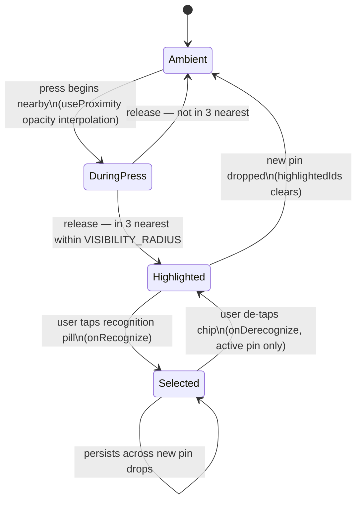
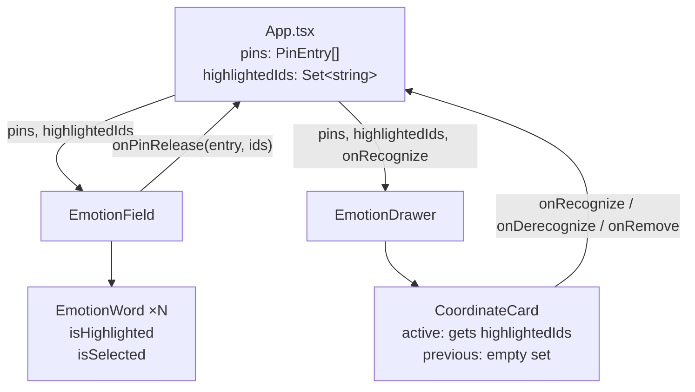
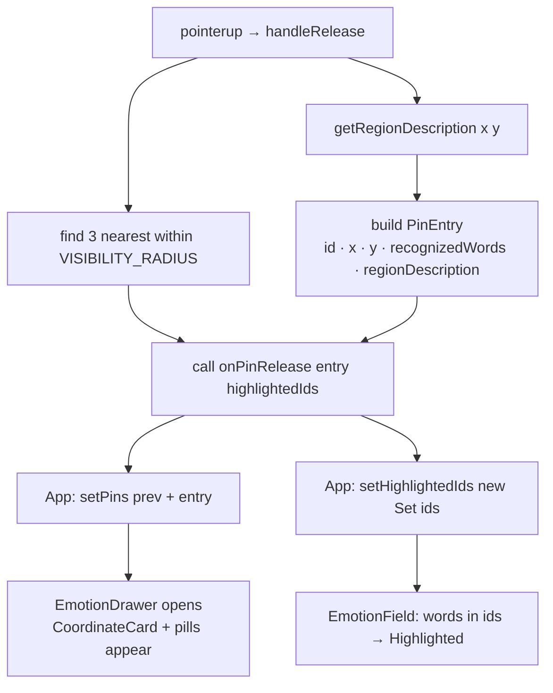

# feat: Coordinate-Primary Recording with Field-Tray Coordination

## Summary

Remove the proximity gate that prevents the tray from opening when a pin lands away from an emotion word. Every pin drop now records a coordinate as the primary and sufficient diary entry, always opens the tray, and surfaces the 3 nearest emotion words as optional recognition pills — synchronized between the field (highlighted state) and the tray. Words are additive vocabulary scaffolding; no word is ever required to complete a check-in.

---

## Problem Frame

The shipped coordinate-first model has a latent contradiction: the field lets you pin anywhere, but the tray only opens when within `SELECTION_RADIUS` of a word. This implies proximity to an emotion word is required to proceed — the opposite of the coordinate-first intent. A second issue: when the tray does open, the nearest word is auto-assigned as the label, positioning the word as a required accurate match rather than optional scaffolding. Both behaviors recreate the precision trap the model was designed to eliminate.

(see origin: `docs/brainstorms/2026-07-01-001-coordinate-primary-field-tray-requirements.md`)

---

## Requirements

**Coordinate recording**
- R1. Every press-release records the (x, y) coordinate as the primary diary entry. No word proximity required.
- R2. The tray opens on every pin drop without exception.
- R3. No word is associated with an entry unless the user explicitly taps a recognition pill. Auto-assignment on proximity is removed.

**Field-tray coordination**
- R4. On pin release, the 3 nearest words within `VISIBILITY_RADIUS` shift to a highlighted state on the field. If fewer than 3 words are in range, show what is available.
- R5. The highlighted words on the field and the recognition pills in the tray are the same set, always in sync.
- R6. When a second pin is dropped, the highlighted set clears and re-derives from the new pin's 3 nearest words. Selected words (already recognized) are unaffected.
- R7. The user may tap any number of recognition pills per pin — zero to three.

**Tray content**
- R8. The coordinate card shows: region description (relational + narrative) and recognition pills. Pills are low-prominence — they must not imply a selection is required.
- R9. Free-text word entry is out of scope. (see origin: R10)

---

## Key Technical Decisions

**`PinEntry` replaces both `SelectedEmotion` and raw `markerCoords`.** The old type combined label + coordinate with a required `label` field. The new `PinEntry` has coordinate, UUID, `recognizedWords: string[]` (emotion IDs, empty by default), and a pre-computed `regionDescription`. The `markerCoords` state is removed; coordinate dot rendering is derived from `pins[].{x, y}`. `SelectedEmotion` is removed from the active flow; `EmotionPreviewCard` is kept but no longer rendered in the tray.

**`highlightedIds: Set<string>` lives in `App.tsx`.** Both `EmotionField` (for word rendering) and `EmotionDrawer` (for pills) need the highlighted set. Lifting to App.tsx avoids sibling communication and keeps a single source of truth.

**`handleRelease` computes and passes highlighted IDs upward.** The existing distance loop in `handleRelease` is the natural home for "find 3 nearest within `VISIBILITY_RADIUS`." The callback signature changes from `onMarkerAdd(coord)` to `onPinRelease(entry: PinEntry, highlightedIds: string[])`, passing both the new entry and the highlight set in one call.

**`isHighlighted` on `EmotionWord` bypasses `useProximity`.** `useProximity` handles during-press word reveal (opacity/scale while finger is down). Post-release highlight state derives from `highlightedIds` in App.tsx, not from the press position. Passing it as a prop keeps the two systems independent — `useProximity` is unchanged.

**`regionDescription` is pre-computed at pin time.** `getRegionDescription(x, y, emotions)` is called in `handleRelease` and the result is stored in `PinEntry`. This ensures the description is available in diary entries for future history rendering without needing the emotions array at read time.

**`CoordinateCard` receives `highlightedIds` only when it is the active (most recent) pin.** Previous pins show only their committed `recognizedWords` (no pills). In `EmotionDrawer`, the last entry in `pins[]` is the active pin and receives the full `highlightedIds`; all others receive an empty set.

**Recognition modifies the most recent pin's `recognizedWords` in place.** `onRecognize(emotionId)` appends to `pins[last].recognizedWords`; `onDerecognize(emotionId)` removes. A recognized word moves from the pill row to a committed chip row in `CoordinateCard`. Words already in `recognizedWords` do not appear as pills.

**LocalStorage schema migration: silent clear.** `DiaryEntry` changes `emotions: SelectedEmotion[]` to `pins: PinEntry[]`. In `readDiary()`, if the first entry has an `emotions` field without a `pins` field, clear localStorage and return `[]`. Acceptable for a dev-stage app with no production data to protect.

---

## High-Level Technical Design

### Word state machine



### Component data flow



### Pin release sequence



---

## Implementation Units

### U1. `PinEntry` type and `DiaryEntry` schema

**Goal:** Establish the new data model that all other units depend on.

**Requirements:** R1, R3

**Dependencies:** none

**Files:**
- `src/types.ts` — add `RegionDescription` and `PinEntry` interfaces; update `DiaryEntry.emotions` → `DiaryEntry.pins: PinEntry[]`; remove `SelectedEmotion` export
- `src/store/diary.ts` — add schema migration check in `readDiary()`
- `src/hooks/useDiary.ts` — update `record()` signature from `SelectedEmotion[]` to `PinEntry[]`

**Approach:** `PinEntry` carries `{ id: string, x: number, y: number, recognizedWords: string[], regionDescription: RegionDescription }`. `RegionDescription` is `{ relational: string, narrative: string }`. `DiaryEntry` replaces the `emotions` field with `pins`. In `readDiary()`, detect old format by checking whether the first stored entry has `emotions` without `pins` — if so, `clearDiary()` and return `[]`.

**Patterns to follow:** Existing `DiaryEntry` / `SelectedEmotion` shape in `src/types.ts`; existing `readDiary` / `clearDiary` pattern in `src/store/diary.ts`.

**Test scenarios:**
- `readDiary()` with no localStorage → returns `[]`
- `readDiary()` with old format (entries have `emotions[]`, no `pins`) → clears storage, returns `[]`
- `readDiary()` with new format (entries have `pins[]`) → returns entries correctly
- `useDiary.record(pins, startMs)` → persists a `DiaryEntry` with `pins` field and correct timestamp/duration
- `useDiary.record([])` → persists an entry with empty `pins[]`

**Verification:** TypeScript compiles with no errors. No runtime errors when calling `record()` with a `PinEntry[]` argument.

---

### U2. Region description data module

**Goal:** Pure function that turns an (x, y) coordinate into human-readable region language for display in the coordinate card and diary history.

**Requirements:** R8

**Dependencies:** none

**Files:**
- `src/data/regions.ts` — new file: exports `getRegionDescription(x: number, y: number, emotions: Emotion[]): RegionDescription`

**Approach:** Two layers of language:
- *Relational* (primary): find up to 2 nearest words within `VISIBILITY_RADIUS`. If two found, produce "between *[A]* and *[B]*". If one found, produce "near *[A]*". If none, produce axis-based fallback ("activated, negative space" — derived from raw x/y sign and magnitude).
- *Narrative* (secondary): map the coordinate to one of 9 arousal/valence zones (3 arousal bands × 3 valence bands) and return a pre-written short phrase. The zone boundaries are implementation constants; the 9 phrases are a lookup table. No external calls; this is fully synchronous and pure.

Emit both fields; callers display relational as the headline and narrative as supporting text.

**Patterns to follow:** `euclideanDist` from `src/hooks/useProximity.ts` for distance computation; `VISIBILITY_RADIUS` constant.

**Test scenarios:**
- Coordinate nearest to "anxious" with one other word in range → relational includes "anxious" and the other word
- Coordinate with only one word in VISIBILITY_RADIUS → "near *[word]*"
- Coordinate with no words in VISIBILITY_RADIUS → axis-based fallback, no undefined/empty
- Each of the 9 arousal/valence zones returns a distinct, non-empty narrative phrase
- Pure function: same inputs always produce same output

**Verification:** All 9 narrative phrases are unique. Relational description is non-empty for any coordinate the field could produce (the existing word distribution audit from the prior plan ensures coverage).

---

### U3. `EmotionField.handleRelease` — coordinate-always, compute highlights

**Goal:** Every release creates a `PinEntry` and computes the highlighted set; word auto-assignment is removed.

**Requirements:** R1, R2, R3, R4

**Dependencies:** U1, U2

**Files:**
- `src/components/EmotionField/EmotionField.tsx` — rework `handleRelease`, update `Props` interface

**Approach:** Replace the existing `if (nearest) { ... } else { // placeholder }` branching with a single unconditional path:
1. Call `getRegionDescription(center.x, center.y, emotions)`.
2. Build a `PinEntry` with `crypto.randomUUID()`, the coordinate, empty `recognizedWords`, and the region description.
3. In a second pass over `emotions`, collect IDs of up to 3 nearest words within `VISIBILITY_RADIUS`, sorted by distance.
4. Call `onPinRelease(entry, highlightedIds)` — the new prop replacing `onSelectionChange` and `onMarkerAdd`.

Remove `onSelectionChange: (emotions: SelectedEmotion[]) => void` and `onMarkerAdd` from the `Props` interface. Add `onPinRelease: (entry: PinEntry, highlightedIds: string[]) => void`.

**Patterns to follow:** Existing distance loop in `handleRelease`; `VISIBILITY_RADIUS` and `SELECTION_RADIUS` from `src/hooks/useProximity.ts`.

**Test scenarios:**
- Release at any coordinate → `onPinRelease` is called (never skipped)
- Release within `SELECTION_RADIUS` of a word → `onPinRelease` called with empty `recognizedWords` (word is NOT auto-assigned)
- Release within `SELECTION_RADIUS` → that word's ID appears in the `highlightedIds` array
- Release at coordinate with 3+ words in `VISIBILITY_RADIUS` → exactly 3 IDs returned, closest first
- Release at coordinate with 1 word in `VISIBILITY_RADIUS` → 1 ID returned
- Release in empty space (no words within `VISIBILITY_RADIUS`) → empty `highlightedIds[]`
- `PinEntry.regionDescription` is populated from `getRegionDescription`
- `onSelectionChange` / `onMarkerAdd` are no longer called

**Verification:** Dropping a pin anywhere produces a visible coordinate card in the tray. No word is auto-selected. TypeScript reports no calls to removed props.

---

### U4. App.tsx state unification

**Goal:** Replace the two separate state buckets (`selectedEmotions`, `markerCoords`) with the unified `pins` model and wire all downstream props.

**Requirements:** R1, R2, R6

**Dependencies:** U1, U3

**Files:**
- `src/App.tsx`

**Approach:**
- Remove `selectedEmotions: SelectedEmotion[]` and `markerCoords: Array<{x,y}>` state.
- Add `pins: PinEntry[]` and `highlightedIds: Set<string>`.
- Add `handlePinRelease(entry: PinEntry, ids: string[])` → `setPins(prev => [...prev, entry])`, `setHighlightedIds(new Set(ids))`.
- Add `handleRecognize(emotionId: string)` → appends to `pins[last].recognizedWords` (immutable update).
- Add `handleDerecognize(emotionId: string)` → removes from `pins[last].recognizedWords`.
- Add `handlePinRemove(pinId: string)` → filters `pins` by id.
- Update `handleNewSession` to clear `pins` and `highlightedIds`.
- Update `handleDone` condition to `pins.length > 0`.
- Update the drawer `AnimatePresence` gate from `selectedEmotions.length > 0` to `pins.length > 0`.
- Update `handleRecord` to call `useDiary.record(pins, sessionStartRef.current)`.
- Update the onboarding hint text: remove "press near a word" — replace with language that describes placing a coordinate.
- Pass `pins`, `highlightedIds`, `onPinRelease`, `onRecognize`, `onDerecognize`, `onPinRemove` to the relevant child components.

**Patterns to follow:** Existing `useCallback` pattern for all handlers; existing `AnimatePresence` gate for the drawer.

**Test scenarios:**
- Pin drop → `pins` gains one entry with correct coordinate
- Pin drop → `highlightedIds` updates to the new set
- Second pin drop → `highlightedIds` replaces previous set (not accumulates)
- `handleRecognize("anxious-id")` → last pin's `recognizedWords` includes "anxious-id"
- `handleDerecognize("anxious-id")` → last pin's `recognizedWords` no longer includes it
- `handlePinRemove(id)` → `pins` no longer contains the entry with that id
- `handleNewSession` → `pins` is `[]`, `highlightedIds` is empty
- `handleDone` with `pins.length === 0` → does not call `record`
- `handleDone` with `pins.length > 0` → calls `record(pins, ...)`

**Verification:** Dropping a pin opens the drawer. "Done" is enabled. "Clear" and new session reset correctly. TypeScript compiles.

---

### U5. Highlighted word state on the field

**Goal:** Words in the current highlighted set render with a distinct visual state on the field — neither ambient nor selected.

**Requirements:** R4, R5

**Dependencies:** U1, U4

**Files:**
- `src/components/EmotionField/EmotionWord.tsx` — add `isHighlighted: boolean` prop and highlighted visual treatment
- `src/components/EmotionField/EmotionField.tsx` — receive `pins` and `highlightedIds` as props; derive `selectedIds` from all pins' `recognizedWords`; pass `isHighlighted` to each `EmotionWord`

**Approach:** `EmotionWord` adds `isHighlighted` to its props. When `isHighlighted` is true and `isSelected` is false, the word renders at full opacity with a warm-but-not-amber tint — visually between ambient and selected, suggesting "nearby but not yet confirmed." When both `isHighlighted` and `isSelected` are true, selected state takes precedence (amber, bold). `EmotionField` derives `selectedIds` from `new Set(pins.flatMap(p => p.recognizedWords))`. `useProximity` is unchanged.

**Patterns to follow:** Existing `isSelected` branch in `EmotionWord` (amber + textShadow); existing `animate` object on `motion.span`.

**Test scenarios:**
- Word with `isHighlighted=true`, `isSelected=false` → opacity at full, distinct tint (not amber, not 0.15)
- Word with `isHighlighted=false`, `isSelected=false` → ambient (opacity 0.15)
- Word with `isHighlighted=true`, `isSelected=true` → selected visual wins (amber)
- After second pin drop, previously highlighted words that are not selected return to ambient
- Words in all pins' `recognizedWords` appear as selected on the field simultaneously

**Verification:** Dropping a pin visibly brightens 0–3 nearby words with the highlighted treatment. Dropping a second pin shifts the highlight set. Selected words remain amber regardless of highlight state.

---

### U6. `CoordinateCard` component

**Goal:** Tray card for a coordinate entry — shows region description, committed recognized words, and (when active) recognition pills.

**Requirements:** R5, R7, R8, R9

**Dependencies:** U1, U2

**Files:**
- `src/components/EmotionPreview/CoordinateCard.tsx` — new component

**Approach:** Props:
```
pin: PinEntry
highlightedIds: string[]     // empty for previous pins
onRecognize: (id: string) => void
onDerecognize: (id: string) => void
onRemove: () => void
```

Layout:
- **Header row:** × remove button (right-aligned), removes the whole pin via `onRemove`
- **Region description:** relational phrase as headline (e.g., "*between tense and anxious*"), narrative phrase below in muted style
- **Recognized words** (when `pin.recognizedWords.length > 0`): row of small chips with word labels and × to derecognize individually
- **Recognition pills** (when `highlightedIds` is non-empty AND a given ID is not already in `recognizedWords`): row of tappable pills below the recognized row; low visual weight — border only, no fill, smaller font. Tapping calls `onRecognize(id)`

Word labels for pills and chips are looked up from `src/data/emotions.ts` by ID.

Pills must not appear for words already in `recognizedWords`.

**Patterns to follow:** `EmotionPreviewCard` layout structure (header row, description, related pills); pill chip style from the existing "Related" section in that component.

**Test scenarios:**
- Renders `pin.regionDescription.relational` and `.narrative`
- With `highlightedIds = []` → no pills rendered
- With `highlightedIds = ["a", "b"]` → two pills rendered
- Tapping a pill → `onRecognize("a")` called
- After "a" is in `recognizedWords`, pill for "a" disappears; chip for "a" appears
- Tapping the chip × → `onDerecognize("a")` called
- Tapping header × → `onRemove()` called
- No pill rendered for a word already in `recognizedWords`

**Verification:** CoordinateCard renders in isolation (Storybook / direct mount). Pills disappear after tap and reappear as committed chips. Remove × clears the card from the tray.

---

### U7. Update `EmotionDrawer` to use `CoordinateCard`

**Goal:** The tray renders `PinEntry` data and routes recognition interactions back to App.tsx.

**Requirements:** R2, R5, R7, R8

**Dependencies:** U1, U4, U6

**Files:**
- `src/components/EmotionPreview/EmotionDrawer.tsx` — update props and render path

**Approach:** New props:
```
pins: PinEntry[]
highlightedIds: Set<string>
onRecognize: (emotionId: string) => void
onDerecognize: (emotionId: string) => void
onPinRemove: (pinId: string) => void
onDone: () => void
onClear: () => void
```

Render `CoordinateCard` for each pin (reversed order, newest first). Pass `highlightedIds` only to the first rendered card (most recent pin); all others receive `[]`. Pass `onRecognize` and `onDerecognize` only to the active card. Update "Done" button label to `Done ✓ (${pins.length})`. The `EmotionPreviewCard` import is removed from this file; the component file is preserved.

**Patterns to follow:** Existing reversed map + `EmotionPreviewCard` pattern; existing spring animation and `onPointerDown` gesture isolation.

**Test scenarios:**
- `pins.length === 1` → one `CoordinateCard` rendered with `highlightedIds` from props
- `pins.length === 2` → two cards; only the first rendered (most recent) gets `highlightedIds`
- Done button shows `Done ✓ (2)` when two pins exist
- Clear button calls `onClear`
- `onPinRemove(id)` routes to the correct card's × handler

**Verification:** Tray opens on pin drop. Multiple pins stack in the tray. Only the most recent pin shows pills. Done count matches pin count.

---

### U8. Downstream view compatibility

**Goal:** `SessionComplete` and `DiaryEntryRow` handle `PinEntry` data without breaking.

**Requirements:** R1 (diary entry records coordinate)

**Dependencies:** U1

**Files:**
- `src/components/SessionComplete.tsx` — update `entry.emotions.length` reference
- `src/components/DiaryHistory/DiaryEntryRow.tsx` — update label rendering for `PinEntry` schema

**Approach:** Minimal non-breaking updates only — no redesign.

`SessionComplete`: replace `entry.emotions.length` with `entry.pins.length`; update the label from "emotion / emotions" to "moment / moments" (or "check-in / check-ins") so it reads correctly for coordinate-only entries.

`DiaryEntryRow`: replace `entry.emotions.map(e => e.label)` with: collect recognized word labels from all pins (`pins.flatMap(p => p.recognizedWords).map(id => emotionLabel(id))`); if any exist, display as before; if none, display the first pin's `regionDescription.relational` as the entry summary. This ensures entries with no recognized words still show meaningful content.

**Patterns to follow:** Existing label join and truncation logic in `DiaryEntryRow`; existing `formatTimestamp` / `count` pattern in `SessionComplete`.

**Test scenarios:**
- `SessionComplete` with `entry.pins.length === 2` → displays "2 moments" (or equivalent)
- `DiaryEntryRow` with pins that have recognized words → shows word labels
- `DiaryEntryRow` with pins that have no recognized words → shows first pin's relational description, not blank
- `DiaryEntryRow` with 8+ recognized words across pins → truncates as before

**Verification:** Session complete screen and history list render without runtime errors. Entries with and without recognized words both display non-empty content.

---

## Scope Boundaries

**In scope:**
- Remove word auto-assignment on proximity
- Tray always opens on any pin drop
- Field-tray coordination: 3-word highlighted set synced between field and tray
- `PinEntry` type unifying coordinates and recognized words
- Region description data module
- Minimal downstream view compatibility (`SessionComplete`, `DiaryEntryRow`)

**Deferred to follow-up work:**
- Redesign of `SessionComplete` and `DiaryHistory` for the `PinEntry` visual language (coordinate maps, pin count summaries, vocabulary growth charts)
- Free-text word entry (explicitly deferred per brainstorm R10)
- Deselect via re-pressing the field area (recognized words currently removed only via chip ×)
- Visual treatment for the overlap state (word both highlighted by new pin and already selected from previous pin — selected wins, treatment is implementation-level)

---

## Open Questions

- **Highlighted visual treatment:** What exact color/weight distinguishes highlighted from ambient and from selected? Placeholder: full opacity, stone-400 instead of stone-300, no amber. Resolve during U5 implementation.
- **Active pin definition for multi-pin recognition:** If the user re-opens the tray and taps a pill from a non-latest card — is that possible? (Current plan: pills only appear on the last card, so this can't happen unless the user drops a second pin without tapping any pills from the first.) Defer to implementation.

---

## Sources & Research

- Origin requirements document: `docs/brainstorms/2026-07-01-001-coordinate-primary-field-tray-requirements.md`
- Prior coordinate-first plan (partially superseded): `docs/plans/2026-06-24-002-feat-coordinate-first-flag-plan.md`
- Product strategy: `STRATEGY.md`
- Grounding dossier (codebase scan): `/tmp/compound-engineering/ce-brainstorm/emotions-wheel-coord-tray/grounding.md`
