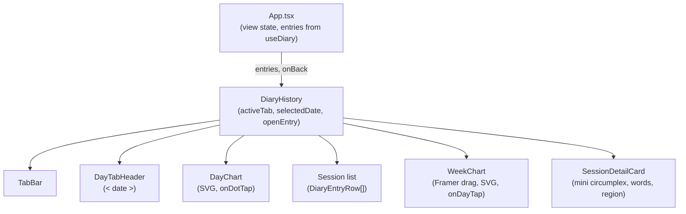
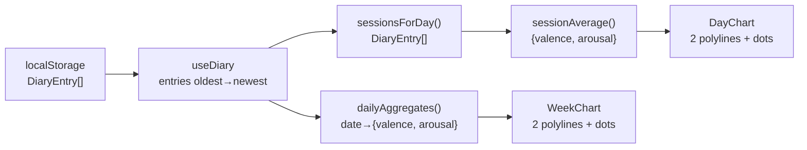

# feat: Diary History Review — Day/Week trend panel

## Summary

Replace the existing flat `DiaryHistory` list with a two-tab panel (Day | Week). Each tab renders two hand-rolled SVG trend lines (valence and arousal) and supports session-level drill-down. The Day tab plots sessions hour-by-hour for a selected date and lists them below the chart; tapping a session opens a detail card with a mini circumplex. The Week tab shows a 30-day horizontally-pannable chart of daily averages; tapping a day column cross-navigates to that date in the Day tab.

Charting is custom SVG — no new library dependency. The `toPercent` coordinate formula already in `EmotionField` applies to all spatial rendering. The swipe-left gesture for opening history is the highest-risk interaction and must be prototyped before its transition animation is wired in.

---

## Problem Frame

`useDiary` accumulates a coordinate-primary record over time, but `DiaryHistory` exposes it only as a reverse-chronological flat list. The compounding signal — how valence and arousal shift across hours and days — is invisible. STRATEGY.md names the reflection surface as the track where that compounding becomes visible. This plan builds the first version of that surface. (see origin: `docs/brainstorms/2026-07-05-002-diary-history-review-requirements.md`)

---

## Requirements

All requirements, flows, and acceptance examples are carried from the origin document.

| ID | Summary |
|----|---------|
| R1 | Swipe-left from field opens history; swipe-right or back control closes it |
| R2 | Day tab (default) and Week tab; tab selection persists within the session only |
| R3 | Day tab: two trend lines (valence, arousal) on a full midnight-to-midnight hourly x-axis |
| R4 | Day chart: one dot per session at mean(pins.x) × mean(pins.y); hourly x-position from timestamp |
| R5 | Day tab: `< date >` header; `>` disabled when selected date is today |
| R6 | Day tab: session list below chart, chronological; shows words or regionDescription fallback |
| R7 | Tapping a session row or chart dot opens a session detail card |
| R8 | Week tab: two trend lines over 30-day rolling window, one dot per day at daily aggregate |
| R9 | Week chart: horizontally scrollable; right edge anchors to today |
| R10 | Days with no sessions: no dot; trend line breaks without interpolation |
| R11 | Tapping a day in the Week chart switches to Day tab with that date selected |
| R12 | Session detail card: timestamp, mini circumplex (pin dots at x,y), deduplicated words, relational text |
| R13 | When no recognized words: detail card omits word row |
| R14 | Detail card dismissed by tapping outside or tapping close control |

Key flows from origin: F1 (open history), F2 (navigate days), F3 (week→day jump), F4 (review session).

Acceptance examples: AE1 (week gap), AE2 (multi-pin + no-word session), AE3 (cross-tab date), AE4 (tap parity: dot and row open same card).

---

## Key Technical Decisions

**Custom SVG, no charting library.** The charts are two polylines per chart plus interactive dots. The `toPercent(v) = 5 + ((v + 1) / 2) * 90` formula in `EmotionField` maps `[−1, 1]` to `[5, 95]`% — the same linear scale applies to SVG coordinate mapping. Adding recharts would add ~60 KB for a feature that needs only lines and circles. Framer Motion (already present) handles the Week chart's horizontal pan.

**Day x-axis: full midnight-to-midnight.** The chart always covers hours 0–23 regardless of when sessions occurred. This ensures consistent framing when navigating between days and avoids the chart jumping as session density changes.

**Session-level aggregation.** Each `DiaryEntry` plots as one dot per line at `mean(pins.x)` (valence) and `mean(pins.y)` (arousal). Individual pin dots are not shown on trend charts. Entries with zero pins are skipped.

**30-day rolling window for the Week chart.** Right edge = today. Pan left to see older data. Line breaks (no interpolation) across days with no sessions. (see origin: AE1)

**Tab and selectedDate state inside DiaryHistory.** `App.tsx` already passes `entries` and `onBack`; there is no reason to lift tab or date state up. `DiaryHistory` owns both internally.

**Swipe-left capture-phase interception.** `useFieldGesture` calls `setPointerCapture` on the field element, which steals subsequent events. To intercept a horizontal swipe before capture, App.tsx adds a capture-phase `onPointerDown` listener that tracks dx/dy as the gesture unfolds. When `dx < −60` and `|dx/dy| > 2`, it releases the pointer from the field (if captured) and calls `setView('history')`. The implementation unit must prototype this isolation before wiring the transition animation.

**Week chart pan via Framer Motion `drag="x"`.** An inner `motion.div` wrapping the full-width SVG (30 × 14 px columns = 420 px) uses `drag="x"` with `dragConstraints` clamped to `[−(420 − containerWidth), 0]`. Starts scrolled to the right edge (today visible). The field has no competing drag gesture in the history view, so there is no conflict here.

**Mini circumplex: absolute-positioned dots.** An 80 × 80 px container with `borderRadius: 50%` and `border: 1px solid var(--oura-border)`. Each pin dot is a 4 px circle at `left: toPercent(x)%, top: toPercent(-y)%`, matching the field's spatial convention exactly. No axis labels in the detail card.

---

## High-Level Technical Design

### Component hierarchy



### Data aggregation flow



### Swipe-left gesture interception sequence

```mermaid
sequenceDiagram
    participant U as User
    participant App as App.tsx (capture phase)
    participant FG as useFieldGesture

    U->>App: pointerdown (starts gesture)
    Note over App: capture phase fires first
    App->>App: begin tracking dx, dy
    U->>App: pointermove (dx=−65, dy=8)
    App->>App: dx<−60 && |dx/dy|>2 → swipe detected
    App->>App: setView('history')
    Note over FG: pointer context cleared; field unaffected
```

---

## Implementation Units

### U1. Data aggregation utilities

**Goal:** Pure functions for session averaging, daily aggregation, 30-day date range, and day filtering. No UI, no side effects.

**Requirements:** R4, R8, R10

**Dependencies:** none

**Files:**
- `src/utils/diaryAggregation.ts` (new)

**Approach:**
- `sessionAverage(entry: DiaryEntry): { valence: number; arousal: number } | null` — returns null when `pins` is empty; otherwise mean of `pins.x` (valence) and `pins.y` (arousal)
- `dailyAggregates(entries: DiaryEntry[]): Map<string, { valence: number; arousal: number }>` — key is `YYYY-MM-DD`; value is mean of all pins across all sessions for that day; skips sessions with no pins
- `sessionsForDay(entries: DiaryEntry[], date: Date): DiaryEntry[]` — filters by calendar day in local time (`new Date(ts).toDateString() === date.toDateString()`)
- `last30Days(): Date[]` — array of 30 Date objects from today−29 to today, inclusive

**Test scenarios:**
- Single-pin session: `sessionAverage` returns that pin's coordinates
- Three-pin session (0.2, 0.4), (−0.1, 0.3), (0.0, 0.2): returns approximately (0.033, 0.300) — covers AE2
- Zero-pin session: `sessionAverage` returns null (not counted)
- Two sessions on the same day: `dailyAggregates` averages all their pins together
- Mixed-day entries: `sessionsForDay` returns only entries matching the target day
- `last30Days` produces exactly 30 entries; index 0 is 29 days ago; index 29 is today

**Verification:** All functions are pure. Pass AE2 pin scenario through `sessionAverage` and confirm result within floating-point tolerance.

---

### U2. DiaryHistory shell — tabs and date navigation

**Goal:** Replace the flat `DiaryHistory` with a tabbed container. Tab state (`activeTab`), `selectedDate`, and `openEntry` (session detail trigger) all live here. The `onBack` → `setView('field')` contract in App.tsx is unchanged.

**Requirements:** R2, R5, R6

**Dependencies:** U1

**Files:**
- `src/components/DiaryHistory/DiaryHistory.tsx` (modify — add tabs, date nav, entry list wiring)
- `src/components/DiaryHistory/TabBar.tsx` (new)
- `src/components/DiaryHistory/DayTabHeader.tsx` (new)

**Approach:**
- `activeTab: 'day' | 'week'` state, default `'day'`
- `selectedDate: Date` state, default `new Date()` (today)
- `openEntry: DiaryEntry | null` state, default null (wired in U7)
- `onDaySelect(date: Date)` — sets `selectedDate` and `setActiveTab('day')`
- **TabBar**: two buttons `"DAY"` | `"WEEK"`, styled as uppercase 9 px gold-dim pills; active tab gets `var(--oura-gold)` text and a bottom border; inactive is `var(--oura-text-3)`
- **DayTabHeader**: `< {formatted date} >` with left/right chevrons; right chevron disabled (`opacity: 0.3; pointerEvents: none`) when `selectedDate` is today; pressing left/right mutates `selectedDate` by ±1 day
- Session list below the Day chart: `sessionsForDay(entries, selectedDate)` sorted chronologically, each as an existing `DiaryEntryRow` with an added `onClick`
- Keep existing header (back button + eyebrow) and outer shell layout from current `DiaryHistory`
- The current empty state `motion.div` is preserved — shown when `sessionsForDay` returns zero entries on the Day tab

**Patterns to follow:** Existing `DiaryHistory` header eyebrow: `9px / 500 / 0.14em / uppercase / var(--oura-gold-dim)`. Back button: `var(--oura-text-2)`. Row border: `1px solid var(--oura-border)`.

**Test scenarios:**
- On mount: `activeTab === 'day'`, `selectedDate === today`
- Pressing Week tab: `activeTab === 'week'`
- Pressing `<`: selectedDate decrements by one day
- Pressing `>` when today: no-op (disabled)
- Pressing `>` when not today: selectedDate increments by one day
- `onDaySelect(pastDate)`: `activeTab === 'day'` and `selectedDate === pastDate`

**Verification:** Tab toggle visible; date header updates correctly; back button calls `onBack`.

---

### U3. Swipe gesture — opening and closing history

**Goal:** R1 swipe-left from the emotion field opens the history panel. Swipe-right within the history panel closes it. The existing button-to-open path is preserved as a fallback.

**Requirements:** R1

**Dependencies:** App.tsx (no new component dependencies)

**Files:**
- `src/App.tsx` (modify — add capture-phase swipe-left detector on the field view)
- `src/components/DiaryHistory/DiaryHistory.tsx` (modify — add Framer Motion drag on the panel container for swipe-right close)

**Approach:**

*Opening (swipe-left from field):*

Add `onPointerDown` in capture phase on the `motion.div` wrapping the field view. Use `useRef` to track the initial pointer position. On subsequent `onPointerMove` events, compute `dx = currentX − startX` and `dy = currentY − startY`. When `dx < −60` and `Math.abs(dx) / Math.abs(dy) > 2`, call `setView('history')`. Clear the ref on `onPointerUp`.

Do not call `stopPropagation` — the capture-phase listener fires before `useFieldGesture`'s `onPointerDown`; no interception needed for pointer events that haven't been captured yet. If the field has already captured the pointer (gesture started on the field itself), the App-level `onPointerMove` may not receive events — this is acceptable, as it means the user started a field interaction rather than a swipe.

**Prototype note:** Before wiring the `setView('history')` call, validate in isolation that pressing and dragging on emotion words does not trigger the threshold. Acceptable false-positive rate is zero — if a normal field interaction can reach `dx < −60` with the horizontal-dominant condition, raise the threshold or add a direction-lock delay.

*Closing (swipe-right from history):*

On the outermost `position: absolute; inset: 0` container of `DiaryHistory`, add `drag="x"` with `dragConstraints={{ left: 0, right: 0 }}` (no scroll conflict — the history panel's internal scroll is `overflow-y: auto` on a child). On `onDragEnd`, if `info.velocity.x > 300` or `info.offset.x > 80`, call `onBack()`. Add `dragElastic={0.1}` for feel. Wrap in `dragListener={false}` on any inner horizontally-scrollable elements (WeekChart container) to prevent gesture conflicts.

**Test scenarios:**
- Horizontal drag on field (dx = −80, dy = 5): history opens
- Diagonal drag on field (dx = −30, dy = −60): history does not open
- Normal press-and-hold on field word: history does not open
- Swipe-right on history panel (offset.x > 80): `onBack` is called
- Swipe-right on the WeekChart horizontal scroll area: panel does NOT close (inner scroll consumes the gesture)
- Existing "history" button tap still opens history (unchanged)

**Execution note:** Prototype the capture-phase gesture isolation first. Confirm that no normal field interaction reaches the `dx < −60 && |dx/dy| > 2` threshold before wiring the view transition.

**Verification:** Open history via swipe; open via button; close via swipe-right; close via back button. All four paths work independently.

---

### U4. Day chart

**Goal:** SVG trend chart for a single selected date. Two polylines (valence in gold, arousal in dim gold) with one interactive dot per session on each line.

**Requirements:** R3, R4, R7; covers AE2, AE4

**Dependencies:** U1, U2

**Files:**
- `src/components/DiaryHistory/DayChart.tsx` (new)

**Approach:**
- Props: `sessions: DiaryEntry[]`, `onDotTap: (entry: DiaryEntry) => void`
- SVG layout: `viewBox="0 0 280 80"` (pixels, scales to container width via `width="100%"`)
- **x-axis mapping:** hour `h` → `x = (h / 23) * 260 + 10` (10 px left margin, 260 px span)
- **y-axis mapping:** value `v ∈ [−1, 1]` → `y = (1 − v) / 2 * 60 + 10` (10 px top margin, 60 px span; +1 at top, −1 at bottom)
- Session x-position: `new Date(entry.timestamp).getHours() + getMinutes()/60` (fractional hour for sub-hour precision)
- `sessionAverage(entry)` from U1 gives the dot's (valence, arousal) coordinates
- Two `<polyline>` elements: connect only consecutive dots where sessions exist (iterate sorted sessions in time order; skip gaps)
- Valence line: stroke `var(--oura-gold)`, opacity 0.9, stroke-width 1.5
- Arousal line: stroke `var(--oura-gold-dim)`, stroke-width 1.5
- Per dot: visible `<circle r="4" />` + transparent hit `<circle r="12" onClick={() => onDotTap(entry)} style={{ cursor: 'pointer' }} />`
- X-axis ticks: 4 labels at hours 0, 6, 12, 18 — `10px / var(--oura-text-3) / uppercase`
- Zero-session state: renders axes and ticks only; no polyline, no dots
- Container: `background: var(--oura-surface); borderRadius: 12px; padding: 8px 0 0`

**Patterns to follow:** Pin dot in `EmotionField` — 4 px radius, gold color. Oura surface card in `SessionComplete`.

**Test scenarios:**
- Zero sessions: SVG renders, no `<polyline>` or `<circle>` elements for data
- One session at 10:00 AM, valence 0.5, arousal −0.3: single dot per line at correct SVG coordinates; no polyline
- Two sessions (10 AM and 3 PM): dots at correct positions; one polyline segment per line connecting them
- Session at midnight (hour 0): dot at left edge; session at 11 PM: dot at right edge
- Covers AE2: session with pins (0.2, 0.4), (−0.1, 0.3), (0.0, 0.2) → valence dot at x≈0.033, arousal dot at y≈0.300; no word row in detail (wired in U6)
- `onDotTap` called with the exact `DiaryEntry` when its dot is tapped
- Covers AE4: dot tap and session row tap (U7) open the same card

**Verification:** Render with mock entries spanning different hours; verify dot x-positions match expected fractional hours; tap a dot and confirm correct entry passed to `onDotTap`.

---

### U5. Week chart

**Goal:** Horizontally pannable SVG trend chart over the 30-day rolling window. Tapping a day column cross-navigates to the Day tab.

**Requirements:** R8, R9, R10, R11; covers AE1, AE3

**Dependencies:** U1, U2

**Files:**
- `src/components/DiaryHistory/WeekChart.tsx` (new)

**Approach:**
- Props: `entries: DiaryEntry[]`, `onDayTap: (date: Date) => void`
- Compute `last30Days()` and `dailyAggregates(entries)` from U1
- Column layout: `COL_WIDTH = 14`, total SVG width = `30 × COL_WIDTH = 420`
- **x mapping:** column index `i` → `x = i * COL_WIDTH + COL_WIDTH / 2` (center of column)
- **y mapping:** same as DayChart: `(1 − v) / 2 * 60 + 10`
- SVG `viewBox="0 0 420 80"`, `width="420"` (fixed, wider than container — parent scrolls)
- Container: `position: relative; overflowX: hidden` (clip)
- Inner `motion.div`: `drag="x"`, `dragConstraints={{ left: -(420 - containerWidth), right: 0 }}`, `initial={{ x: -(420 - containerWidth) }}` (start scrolled to right / today visible)
  - `containerWidth` read via `useRef` + `ResizeObserver` or `useEffect` with `getBoundingClientRect`
- Two `<polyline>` elements: iterate the 30 days in order; if day `i` and day `i+1` both have aggregates, draw a segment between them; skip (break line) if either is absent — this produces the gap behavior in AE1
- One `<circle r="4">` per day that has an aggregate (centered in column)
- Per-column hit area: `<rect width={COL_WIDTH} height={80} fill="transparent" onClick={() => onDayTap(day)} style={{ cursor: 'pointer' }} />`
- Day labels: every 7th column shows day-of-month (`d.getDate()`) as 8 px text below the SVG
- Valence: `var(--oura-gold)` / Arousal: `var(--oura-gold-dim)` (consistent with DayChart)

**Patterns to follow:** Framer Motion `drag` in EmotionDrawer (spring physics, `dragElastic`). Touch action isolation via `dragListener={false}` on child elements that shouldn't pan the chart.

**Test scenarios:**
- All 30 days with data: two continuous polylines, 30 dots per line
- Gap on day 15 (no sessions): polyline segment between day 14 and day 16 is absent; dots on 14 and 16 still present — covers AE1
- Tapping day column for June 30: `onDayTap` called with a Date whose `toDateString()` is "Mon Jun 30 2026" — covers AE3
- Days with no aggregate: hit area still exists (transparent rect) but calls `onDayTap` with a date that has no sessions (Day tab will show empty state)
- Initial render: `motion.div` starts at `x = -(420 - containerWidth)` so rightmost column (today) is visible
- Drag left: older dates scroll into view; at left boundary, drag stops (dragConstraints)

**Verification:** Render with entries spanning 3 of 30 days; confirm gaps in polylines match days with no data; confirm `onDayTap` receives correct Date objects.

---

### U6. Session detail card

**Goal:** Overlay card with session timestamp, mini circumplex showing all pins, deduplicated emotion words, and region description.

**Requirements:** R12, R13, R14; covers AE2, AE4

**Dependencies:** U4 and U5 trigger `openEntry` (but the card itself is independent)

**Files:**
- `src/components/DiaryHistory/SessionDetailCard.tsx` (new)
- `src/components/DiaryHistory/MiniCircumplex.tsx` (new — reusable 80×80 circumplex)
- `src/utils/formatDate.ts` (new — extract `formatDate` from `DiaryEntryRow` for shared use)

**Approach:**
- Props: `entry: DiaryEntry | null`, `onDismiss: () => void`
- Wrapped in `AnimatePresence`; when `entry === null`, card is not mounted
- Backdrop: `position: absolute; inset: 0; background: rgba(12,14,18,0.7)` — `onClick={onDismiss}`
- Card: `position: absolute; bottom: 0; left: 0; right: 0` (bottom sheet style) or `centered with margin: auto` — bottom sheet matches the existing `EmotionDrawer` convention
  - `background: var(--oura-surface); borderRadius: 16px 16px 0 0; padding: 20px`
  - `motion.div: initial={{ y: '100%' }} animate={{ y: 0 }} exit={{ y: '100%' }}` with spring (`stiffness: 300, damping: 35`)
- **Header row:** timestamp (formatted via shared `formatDate`) + `×` close button (`onDismiss`)
- **MiniCircumplex (80×80 px):**
  - Container: `width:80; height:80; borderRadius:'50%'; border:'1px solid var(--oura-border)'; position:'relative'; overflow:'hidden'`
  - For each `entry.pins`: `<div style={{ position:'absolute', width:4, height:4, borderRadius:'50%', background:'var(--oura-gold)', left: toPercent(pin.x) + '%', top: toPercent(-pin.y) + '%', transform:'translate(-50%,-50%)' }}>`
  - Import `toPercent` from `EmotionField` or inline the formula
- **Words row (R13):** collect `entry.pins.flatMap(p => p.recognizedWords)`, deduplicate, resolve each ID to a label via `emotions.find(e => e.id === id)?.label`; render as horizontal pill chips styled like `CoordinateCard` chips; **omit the entire row** if no resolved labels exist
- **Region text:** `entry.pins[0]?.regionDescription.relational.replace(/\*/g, '')` in `13px / var(--oura-text-2)` style; omit if no pins
- Card animation: same spring as `EmotionDrawer`

**Patterns to follow:** `EmotionDrawer` spring animation and `touchAction: 'pan-y'` on the card content. `CoordinateCard` pill chips for word display. `DiaryEntryRow`'s `formatDate` and relational-text rendering.

**Test scenarios:**
- Entry with 2 pins at (0.3, 0.5) and (−0.2, −0.1): both dots appear in mini circumplex at correct positions
- Entry with zero recognized words across all pins: word row is absent (covers R13, AE2)
- Entry with recognized words on multiple pins with duplicates: deduplicated list shown
- Tapping the backdrop calls `onDismiss`
- Tapping `×` calls `onDismiss`
- `entry === null`: card not rendered in DOM (AnimatePresence exit)

**Verification:** Render with a multi-pin entry; verify dot count in mini circumplex matches `entry.pins.length`; verify word deduplication; verify dismiss paths.

---

### U7. Integration wiring and cross-tab navigation

**Goal:** Connect DayChart, WeekChart, and SessionDetailCard into the DiaryHistory shell. Wire `openEntry` state, cross-tab navigation, and the session list click. Validate all four acceptance examples.

**Requirements:** R7, R11; covers AE3, AE4

**Dependencies:** U1, U2, U3, U4, U5, U6

**Files:**
- `src/components/DiaryHistory/DiaryHistory.tsx` (modify — wire all sub-components)

**Approach:**
- Add `openEntry: DiaryEntry | null` state (null = no card shown)
- **Day tab layout** (in order, top to bottom):
  1. `<DayTabHeader>` (date nav)
  2. `<DayChart sessions={sessionsForDay(entries, selectedDate)} onDotTap={(e) => setOpenEntry(e)} />`
  3. Session list: `sessionsForDay(entries, selectedDate).map(e => <DiaryEntryRow entry={e} onClick={() => setOpenEntry(e)} />)` — add `onClick` prop to `DiaryEntryRow` (currently presentational only; add optional `onClick?: () => void`)
- **Week tab layout:**
  1. `<WeekChart entries={entries} onDayTap={(date) => onDaySelect(date)} />`
- **Session detail:**
  - `<AnimatePresence>` wrapping `<SessionDetailCard entry={openEntry} onDismiss={() => setOpenEntry(null)} />`
  - Card renders on top of whichever tab is active (absolute, full-height)
- **Cross-tab nav wiring (F3, AE3):** `onDaySelect` in DiaryHistory already sets `selectedDate` and `setActiveTab('day')` (from U2) — `WeekChart.onDayTap` calls this directly
- **AE4 verification:** Dot tap in DayChart and row tap in session list both call `setOpenEntry` with the same `DiaryEntry` object — same card opens in both cases

**Test scenarios:**
- Tapping a Day chart dot opens session detail card for that session — covers AE4
- Tapping the corresponding session list row opens the same card — covers AE4
- Tapping a Week chart day column switches to Day tab with that date in the header — covers AE3
- After cross-tab jump to June 30, pressing `<` shows June 29 — covers AE3 continuation
- Detail card opens then closes; underlying chart remains visible behind it
- Session detail for a 3-pin no-word entry: card shows mini circumplex, no word row — covers AE2
- Week chart with gap on day 15: polylines break; tapping day 15 column opens Day tab with empty session list

**Verification:** Walk through F1, F2, F3, F4 manually in browser. Confirm all four acceptance examples pass.

---

## Scope Boundaries

**Deferred for later (from origin):**
- Month view or calendar heatmap
- Entry editing or deletion
- Data export (CSV, JSON, or similar)
- Longitudinal analytics beyond the two trend lines (zone distribution, convex hull, daily centroid)
- Cloud sync — LocalStorage remains the sole store

**Outside this product's identity:**
- Social sharing of history data

**Deferred to follow-up work:**
- Axis labels on the trend chart y-axis (positive/calm/negative/activated) — kept off for the minimal Oura aesthetic; add in a follow-up if orientation is unclear to users
- Hover/tooltip on desktop for chart dots — touch is primary; desktop tooltip is a nice-to-have
- Animation on polyline draw (path length reveal) — low carrying cost but deferred to avoid scope creep

---

## Dependencies and Assumptions

- `DiaryEntry` schema is stable at `{ id, timestamp, pins: PinEntry[], sessionDurationMs }`. `PinEntry`: `{ id, x, y, recognizedWords: string[], regionDescription: { relational, narrative } }`. The schema migration guard in `readDiary()` only checks for the old `emotions` field — additive changes to `DiaryEntry` are safe.
- `entries` from `useDiary` is always oldest-first. `DiaryHistory` receives it as a prop from App.tsx and does not subscribe to localStorage directly.
- `toPercent(v) = 5 + ((v + 1) / 2) * 90` from `EmotionField.tsx` is the canonical coordinate-to-percent formula and is reused verbatim (or inlined) in MiniCircumplex.
- `recognizedWords` on `PinEntry` stores emotion IDs, not labels. Labels are resolved via `emotions.find(e => e.id === id)?.label` from `src/data/emotions.ts`.
- Framer Motion `drag="x"` on the WeekChart container does not conflict with `useFieldGesture` because history view and field view are mutually exclusive (`AppView` is one of `'field' | 'history' | …`).
- The capture-phase swipe-left gesture threshold (`dx < −60`, `|dx/dy| > 2`) is a starting point; the implementation must validate it does not trigger during normal field interactions before finalizing.

---

## Open Questions

| # | Question | Status |
|---|----------|--------|
| 1 | Does the capture-phase swipe-left threshold (`dx < −60`, `|dx/dy| > 2`) produce zero false positives against normal field interactions? | Resolve during U3 prototyping |
| 2 | Is a bottom-sheet (slide up from bottom) or a side-panel (slide from right) better for the session detail card on small screens? | Decide during U6; bottom sheet matches EmotionDrawer convention |

---

## Sources and Research

- Origin: `docs/brainstorms/2026-07-05-002-diary-history-review-requirements.md`
- Existing component references: `src/components/DiaryHistory/DiaryHistory.tsx`, `src/components/DiaryHistory/DiaryEntryRow.tsx`
- Coordinate formula: `src/components/EmotionField/EmotionField.tsx` (line 12, `toPercent`)
- Framer Motion patterns: `src/components/EmotionPreview/EmotionDrawer.tsx` (spring slide-up), `src/App.tsx` (AnimatePresence view transitions)
- Design tokens: `src/index.css` (Oura CSS custom properties)
- Data access: `src/hooks/useDiary.ts`, `src/store/diary.ts`
- Strategy: `STRATEGY.md` — reflection surface is an explicit product track
