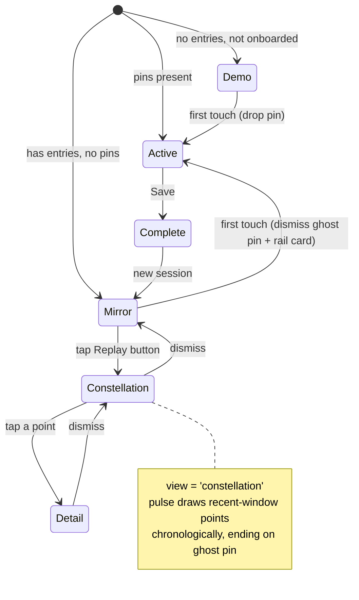

## Summary

Fill the landing empty state with the user's own history in two phases. **Phase A** turns the empty state into a *returning mirror*: a rail card + rhythm strip, a single ghost pin at the last coordinate, a first-run gesture demo for day-zero, and legible axes at rest. **Phase B** adds the *pulse-trace*: a dedicated button plays an electric pulse that draws a recent-window constellation chronologically, ending on that same ghost pin, then persists with tappable points into session detail. Phase B depends on Phase A's ghost pin and shared helpers.

---

## Problem Frame

The landing screen is the ritual-initiation moment, and today it under-delivers there. The right rail is a decorative backdrop with `pointerEvents: none` until a pin is placed (`src/App.tsx`); the axes render at `rgba(201,168,124,0.04)` with drag-only position dots (`src/components/EmotionField/EmotionField.tsx`); and the only "what do I do" hint is gated to first visit via `localStorage`, so returning users see faint crosshairs, ambient words, and dead space.

Separately, the app's reflection value compounds over time (`STRATEGY.md`, Reflection surface track) but is only legible as tabular Day/Week charts in `DiaryHistory`. There is no moment where the user *feels* the arc of their check-ins. These two gaps are addressed together because the pulse-trace's final point is the mirror's ghost pin — they share the field surface, the coordinate mapping, and the recent-window definition.

---

## Requirements Traceability

Phase A carries the mirror doc's requirements; Phase B carries the pulse-trace doc's. IDs below reference the origin docs (see `origin` frontmatter).

- **Phase A (mirror):** R1–R2 → U4; R3 → U5; R4–R5, R9 → U3; R6–R9 → U6; R10 → U2; R11 → U1, U5.
- **Phase B (pulse-trace):** R1, R9 → U8; R2–R3, R5–R6 → U9; R4 → U1, U8; R6–R8 → U10.

---

## Key Technical Decisions

- **KTD1 — Mirror states are sub-states of the existing `field` view, not a new `AppView`.** The current app already renders the hint, drawer, and history button conditionally within `view === 'field'` based on `entries.length` and `pins.length` (`src/App.tsx`). The mirror (demo vs. rail-card+ghost-pin vs. active-with-pins) follows the same pattern. Only the pulse-trace adds a new `AppView` value, `'constellation'`, because it is a full-surface takeover like `'history'`.

- **KTD2 — One shared field-geometry source of truth.** The `[-1,1] → [5,95]%` mapping (`toPercent`) is currently duplicated in `EmotionField.tsx` and `MiniCircumplex.tsx`. Extract it once and route the field, the ghost pin, the constellation, and the retrofit mini-circumplex through it, so every plotted point agrees (see origin: `docs/brainstorms/2026-07-09-002-history-pulse-trace-requirements.md`).

- **KTD3 — Ghost pin reuses the existing pin render at reduced opacity.** `EmotionField.tsx` already renders a pin as a pulse ring + gold dot. The ghost pin is the same mark, quieter, positioned at the most recent entry's coordinate. The pulse-trace's terminal point coincides with it (mirror R3/R11 + pulse R5).

- **KTD4 — Reuse `SessionDetailCard` for constellation point taps.** No new detail surface. Tapping a persisted point opens the same bottom-sheet detail the tabular history uses (`src/components/DiaryHistory/SessionDetailCard.tsx`), passing the tapped `DiaryEntry` (pulse R7).

- **KTD5 — Two distinct buttons; the tabular history is untouched.** The existing `history` button and `DiaryHistory` view stay as-is. The pulse-trace gets its own button with a non-colliding label (default **"Replay"**; final wording is a copy decision, see Open Questions) (pulse R1/R9).

- **KTD6 — One shared recent-window.** Both the rhythm strip and the pulse-trace read the same `recentWindow(entries)` selector (default: **last 14 days**, falling back to the most recent entries when sparse). Defined once so the two surfaces never disagree on what "recent" means.

- **KTD7 — No unit-test framework in this plan.** The repo has no unit-test runner (no vitest/jest/testing-library; only ESLint + a custom spacing lint, with Playwright present but unwired). Verification follows the established project norm: `tsc -b` typecheck + `eslint` + visual check (Playwright available for screenshots). Introducing a test framework is deferred to a separate task (see Scope Boundaries).

- **KTD8 — Electric pulse via framer-motion + SVG path.** The pulse animates along an SVG polyline connecting recent coordinates in chronological order; each point is drawn as the pulse reaches it. `framer-motion` (already a dependency) drives the traveling-pulse and point-reveal timing.

---

## High-Level Technical Design

Empty-state surface selection (all within `view === 'field'` unless noted), plus the pulse-trace takeover:

Pulse-trace playback sequence: **enter** (button) → **draw** (pulse bounces oldest→newest, revealing each point on arrival) → **land** (terminal point = ghost-pin coordinate) → **persist** (full constellation stays) → **inspect** (tap point → `SessionDetailCard`) → **exit** (dismiss → Mirror).

---

## Implementation Units

### Phase A — Returning Mirror

### U1. Shared field-geometry and recent-window utilities

- **Goal:** Create one source of truth for coordinate→field mapping and for the recent-entry window, consumed by both phases.
- **Requirements:** Mirror R3/R11, Pulse R4.
- **Dependencies:** none (foundation).
- **Files:** `src/utils/fieldGeometry.ts` (new — extract `toPercent`), `src/utils/recentEntries.ts` (new — `recentWindow(entries)`), modify `src/components/EmotionField/EmotionField.tsx` and `src/components/DiaryHistory/MiniCircumplex.tsx` to import the shared mapping.
- **Approach:** Move the duplicated `toPercent` into `fieldGeometry.ts` unchanged; retrofit both call sites. Add `recentWindow` returning entries within the window (default 14 days) sorted chronologically, with a sparse-history fallback to the most recent N. Export the window constant for reuse.
- **Patterns to follow:** existing `toPercent` in both files (identical formula); `src/utils/diaryAggregation.ts` for entry-filtering style.
- **Verification (typecheck/lint/visual — no unit runner, KTD7):**
  - Mini-circumplex dots render in the same positions as before the retrofit (visual diff on a session-detail card).
  - Field word/pin positions unchanged after `EmotionField` retrofit.
  - `recentWindow` returns chronologically ascending entries; empty history → empty array; sparse history (older than window) → most-recent fallback set.
- **Verification done when:** `tsc -b` and `eslint` pass and the retrofit is visually a no-op.

### U2. Legible axes at rest

- **Goal:** Make crosshairs and axis labels readable in the resting empty state, with headroom to brighten further during the demo.
- **Requirements:** Mirror R10 (and enables R7).
- **Dependencies:** none.
- **Files:** modify `src/components/EmotionField/EmotionField.tsx`.
- **Approach:** Raise the resting crosshair opacity above the current `0.04` and lift the axis-label contrast, tuned against the dark palette so they read without competing with ambient words. Expose the brightness as a prop/level so U6's demo can push it higher and settle back.
- **Patterns to follow:** existing `AXIS_LABEL` style and crosshair divs in `EmotionField.tsx`; CSS vars in `src/index.css`.
- **Verification:** axes legible on load without dragging (visual); ambient words still readable, not overpowered; demo can raise and restore brightness (validated in U6).

### U3. Empty-state orchestration and first-touch transition

- **Goal:** Choose the surface (Demo vs. Mirror vs. Active) and handle the first-touch handoff to a fresh pin + drawer.
- **Requirements:** Mirror R4, R5, R9.
- **Dependencies:** U1.
- **Files:** modify `src/App.tsx`.
- **Approach:** Within `view === 'field'`, branch on `entries.length` and `pins.length` and the existing onboarding flag: no history + not onboarded → Demo (U6); history + no pins → Mirror (U4 + U5); pins present → existing Active drawer path. First field touch dismisses mirror memory/ghost pin and drops a fresh pin, letting `EmotionDrawer` take the rail (desktop) / sheet (mobile) as it does today.
- **Patterns to follow:** existing conditional rendering of `showHint`, `EmotionDrawer`, and the history button in `src/App.tsx`; `useSidePanelLayout` for the rail/sheet split.
- **Verification:**
  - Covers AE2. Touching the field while the mirror shows dismisses the ghost pin + rail card and drops a live pin with the drawer sliding in.
  - Returning user with pins mid-session sees the Active drawer, not the mirror.
  - New session after Save returns to the Mirror (has entries, no pins).

### U4. Mirror rail content — last check-in card + rhythm strip

- **Goal:** Fill the rail (desktop) / a compact bottom peek (mobile) with the last entry and a recent-rhythm strip.
- **Requirements:** Mirror R1, R2, R5.
- **Dependencies:** U1, U3.
- **Files:** `src/components/EmotionMirror/MirrorCard.tsx` (new), `src/components/EmotionMirror/RhythmStrip.tsx` (new), modify `src/App.tsx` to mount in the rail region when Mirror is active.
- **Approach:** `MirrorCard` shows the most recent entry's region description, a relative timestamp, and its recognized words (reuse the label lookup + region formatting from `SessionDetailCard`). `RhythmStrip` renders the `recentWindow` days as a compact dot sequence conveying cadence. Follow `EmotionDrawer`'s `'rail' | 'sheet'` variant pattern so the same content docks as a rail on desktop and a peek on mobile.
- **Patterns to follow:** `src/components/EmotionPreview/EmotionDrawer.tsx` (rail/sheet variants, `RAIL_WIDTH`), `SessionDetailCard.tsx` (region + word rendering), `src/utils/formatDate.ts` (extend or add a relative-time helper).
- **Verification:**
  - Covers AE1. With one entry from yesterday evening, the rail shows that entry's region + a relative timestamp and a rhythm strip reflecting recent days.
  - No recognized words → word row omitted (mirror `SessionDetailCard` behavior).
  - Desktop shows the rail variant; mobile shows the bottom peek.

### U5. Ghost pin on the field

- **Goal:** Render a single quiet pin at the most recent entry's coordinate, dismissed on first touch.
- **Requirements:** Mirror R3, R11.
- **Dependencies:** U1, U3.
- **Files:** modify `src/components/EmotionField/EmotionField.tsx` (or a small `GhostPin` render within it), wiring from `src/App.tsx`.
- **Approach:** Reuse the existing pin dot/pulse mark at reduced opacity, positioned via the shared `fieldGeometry` mapping. Structure the coordinate list so a future multi-point constellation extends the same render path (mirror R11) — a single-element list today. Dismissed by the U3 first-touch handler.
- **Patterns to follow:** existing pin render block in `EmotionField.tsx` (pulse ring + gold dot).
- **Verification:** ghost pin sits exactly where the last entry was recorded (visual against session detail's mini-circumplex); reads quieter than a live pin; disappears on first touch.

### U6. First-run gesture demo + rail skeleton

- **Goal:** For a day-zero user (no history, not onboarded), demonstrate the gesture and settle to the resting state.
- **Requirements:** Mirror R6, R7, R8, R9.
- **Dependencies:** U2, U3.
- **Files:** `src/components/EmotionMirror/FirstRunDemo.tsx` (new), modify `src/App.tsx` (reuse the existing `useOnboarding` flag).
- **Approach:** Animate a ghost pointer drifting across the field and dropping a pin that pulses and fades, without relying on text for the gesture; brighten the axes (U2 level) during the demo and ride the edge position-dots along the path; show a rail skeleton card ("Your check-in will appear here"). Settle on first touch; never replay once onboarded.
- **Patterns to follow:** existing `useOnboarding` + `showHint` logic and the axis position-dot render (drag-only today) in `EmotionField.tsx`; `framer-motion` sequencing already used across the app.
- **Verification:**
  - Covers AE3. New user → demo plays and axes brighten; touching the field ends it and it does not replay on next load.
  - Covers AE4. Before interaction, crosshairs + labels are legibly visible without dragging.
  - After the first recorded entry, subsequent loads show the Mirror, not the demo (F3).

### Phase B — History Pulse-Trace

### U8. Constellation state and Replay entrypoint

- **Goal:** Add the `'constellation'` view and a distinct button that enters it from the Mirror.
- **Requirements:** Pulse R1, R9, R4.
- **Dependencies:** U1, and Phase A ghost pin (U5).
- **Files:** modify `src/types.ts` (add `'constellation'` to `AppView`), modify `src/App.tsx` (button + view wiring), `src/components/Constellation/ConstellationReplay.tsx` (new — container).
- **Approach:** Add a field-level button labeled distinctly from "History" (default "Replay") that sets `view = 'constellation'`, rendered as a top-level overlay alongside the existing `history`/`complete` overlays. The container reads `recentWindow(entries)` for its point set. The existing `history` button/view is untouched (two distinct entrypoints).
- **Patterns to follow:** existing overlay rendering in `src/App.tsx` (`AnimatePresence` for `cards`/`complete`/`history`); the existing `history` button styling.
- **Verification:**
  - Covers AE2 (pulse doc). An entry older than the window is not included in the point set.
  - Tapping Replay enters the constellation view; the tabular history button still opens `DiaryHistory` unchanged.

### U9. Pulse-trace animation

- **Goal:** Animate the electric pulse drawing the recent-window points chronologically, ending on the ghost-pin coordinate.
- **Requirements:** Pulse R2, R3, R5, R6.
- **Dependencies:** U8.
- **Files:** `src/components/Constellation/PulseTrace.tsx` (new), `src/components/Constellation/ConstellationReplay.tsx` (compose).
- **Approach:** Build an SVG polyline over the recent coordinates (shared `fieldGeometry` mapping); animate a traveling pulse oldest→newest with `framer-motion`, revealing each point as the pulse arrives. The terminal point is the most recent entry — the same coordinate as the ghost pin — so the trace visibly lands there. On completion the full constellation remains (R6).
- **Technical design (directional, not spec):** points reveal on pulse-arrival via staggered opacity keyed to hop index; per-hop duration tuned so a mid-length window neither drags nor flickers. Exact easing/timing is an implementation tuning task (Open Questions).
- **Patterns to follow:** `framer-motion` usage in `EmotionField.tsx` (pulse ring animation) and `SessionDetailCard.tsx`; `MiniCircumplex.tsx` for point plotting.
- **Verification:**
  - Covers AE1 (pulse doc). Pulse travels oldest→newest, drawing each point on arrival, finishing on the point coinciding with the ghost pin.
  - Points appear progressively, not all at once.
  - A single-entry window degrades gracefully (one point, no bounce).

### U10. Persist, tappable points, and exit

- **Goal:** Keep the constellation on screen, make points tappable into session detail, and return to the Mirror on dismiss.
- **Requirements:** Pulse R6, R7, R8.
- **Dependencies:** U9.
- **Files:** modify `src/components/Constellation/ConstellationReplay.tsx`, wire `src/App.tsx` to render `SessionDetailCard` for a tapped entry and to set `view` back to `'field'` (Mirror) on dismiss.
- **Approach:** After the trace completes, points become hit-targets; tapping one opens `SessionDetailCard` with that `DiaryEntry`; dismissing detail returns to the persisted constellation; dismissing the constellation sets `view = 'field'` (Mirror). Ensure tap targets are large enough given field density and don't collide with ambient words.
- **Patterns to follow:** `SessionDetailCard` open/dismiss wiring in `DiaryHistory.tsx` (`openEntry` state); overlay z-index conventions in `src/App.tsx`.
- **Verification:**
  - Covers AE3 (pulse doc). After the trace, tapping a point opens its detail; dismissing detail leaves the constellation still shown.
  - Covers AE4 (pulse doc). Dismissing the constellation returns to the Mirror.
  - Tap targets are reliably hittable without triggering ambient-word interactions.

---

## Scope Boundaries

**In scope:** everything in the two origin docs — the returning mirror (rail memory, ghost pin, first-run demo, legible axes) and the pulse-trace (Replay button, chronological draw ending on the ghost pin, persist + tappable, coexisting with tabular history), plus the shared geometry/window helpers.

**Deferred for later (from origin docs):** full-journey/all-time playback with speed-pacing; a user-selectable time range; encoding extra data in the pulse or points (valence tint, gap-based speed).

**Outside this product's identity (from origin docs):** social/comparison/shared-streak framing; clinical or scoring framing of past entries.

**Deferred to Follow-Up Work (plan-local):**
- Introduce a unit-test framework (e.g., vitest + testing-library, and/or wire the already-present Playwright) as its own task, then backfill coverage for the units above. This plan verifies via typecheck + lint + visual per project norm (KTD7).

---

## Open Questions

**Resolve during implementation (visual/copy tuning, not blocking):**
- Replay button final label (default "Replay" — must not collide with "History").
- Recent-window size `N` (default: last 14 days; sparse fallback to most-recent). Shared by rhythm strip and pulse-trace (KTD6).
- Pulse aesthetic and timing — how "electric" the pulse reads, per-hop duration, easing, point-reveal stagger.
- Resting-state contrast values for axes and the ghost pin.

**Deferred to implementation (discovery):**
- Constellation tap-target sizing vs. ambient-word hit-testing on a dense field (U10) — resolve against real rendered density.

---

## System-Wide Impact & Risks

- **Shared-geometry retrofit (U1)** touches `EmotionField` and `MiniCircumplex`; a regression would shift every plotted point. Mitigation: the retrofit is a pure extraction (identical formula) verified as a visual no-op before any new feature builds on it.
- **Field density.** Both the ghost pin and the constellation add marks to a field whose density is a standing concern. Mitigation: mirror shows a single ghost pin; the constellation is bounded to the recent window and lives in its own view.
- **No automated regression net.** Absent a test runner, all verification is typecheck/lint/visual. Mitigation: behavioral scenarios are enumerated per unit for manual/Playwright checking; the test-framework follow-up will backfill coverage.

---

## Sources & Research

- Origin brainstorms: `docs/brainstorms/2026-07-09-001-empty-state-returning-mirror-requirements.md`, `docs/brainstorms/2026-07-09-002-history-pulse-trace-requirements.md`.
- `src/App.tsx` — view/empty-state conditional structure, rail backdrop, history button, `useOnboarding`, `useSidePanelLayout`.
- `src/components/EmotionField/EmotionField.tsx` — axes, pin render, `toPercent`, position dots.
- `src/components/EmotionPreview/EmotionDrawer.tsx` — rail/sheet variant pattern, `RAIL_WIDTH`.
- `src/components/DiaryHistory/{DiaryHistory,MiniCircumplex,SessionDetailCard}.tsx` — tabular history (untouched), point plotting, reusable session detail.
- `src/types.ts` (`AppView`, `DiaryEntry`, `PinEntry`), `src/hooks/useDiary.ts`, `src/store/diary.ts` — data shapes and history source.
- `src/index.css` — palette CSS variables.
- `package.json` — no unit-test runner; `framer-motion` and `playwright` available; verification via `tsc -b` + `eslint`.
- `STRATEGY.md` — Reflection surface + Habit formation tracks; social/clinical exclusions.
