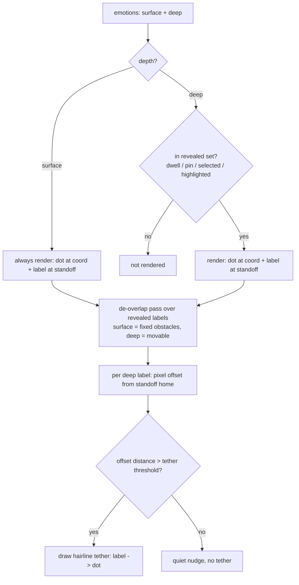

# feat: Coordinate-anchored words

## Summary

Invert the field's primitive: make the **coordinate point** the primary object and the **word** its label. Every emotion becomes a dot anchored to its coordinate; surface points wear their labels at rest, deep points name themselves on dwell. When a dense-zone reveal would stack labels, revealed deep labels **nudge apart** for legibility while their dots stay fixed, and a **hairline tether** connects any displaced label back to its true point. Depth is encoded into the dots (surface brighter/larger, deep dimmer/smaller) and into the label typography (surface = landmark, deep = fine detail). The result reads as a legible neighborhood — "you're here, and these are the feelings around here" — instead of a wall of overlapping text.

Built as a five-unit chain, each eyeballable on the running dev server before the next.

---

## Problem Frame

In a dense zone, dwelling reveals up to `DEEP_REVEAL_CAP` (6) deep words **at their true coordinates**, layered on top of the already-bright surface words in the same patch — a wall of stacked, overlapping labels. Dimming cannot fix this: two labels at one point are still stacked text.

The deep reveal is **informational, not a selection menu** (see origin: `docs/brainstorms/2026-07-20-001-coordinate-anchored-words-requirements.md`). Its job is to show the user the coordinate is close to what they feel. So the whole revealed cluster must read cleanly as a description of the spot. The fix is a layout mechanic — anchor words to points, then de-overlap and tether — not a styling pass alone.

---

## Requirements

- **R1.** At rest: all 39 surface points render as **dot + label**; all 149 deep points are fully hidden; surface dots are a visibly brighter/larger tier than any dot that later appears. (origin: rest model)
- **R2.** On dwell/pin in a dense zone: no two *revealed* labels visibly overlap.
- **R3.** Any revealed label displaced past a distance threshold from its dot shows a faint hairline tether to that dot; labels within the threshold show no tether (quiet nudge only).
- **R4.** Every rendered word's **dot sits exactly at its true coordinate** at all times — de-overlap moves the label, never the dot.
- **R5.** The resting field stays calm (no deep dots/labels); the surface-vs-deep hierarchy is legible from the **dots alone**, before any word is read.
- **R6.** `pnpm lint:spacing` stays green.
- **R7.** Surface and deep labels are distinct typographic tiers: surface slightly larger/letterspaced (landmarks); deep smaller but high-contrast/weight when revealed so it stays legible; selected/highlighted gold treatment unchanged. (origin: folds in the superseded `docs/plans/2026-07-08-003-feat-typographic-depth-plan.md`)

---

## Key Technical Decisions

- **KTD1. The dot + label are one anchored unit, rendered by `EmotionWord`.** The dot renders at the true coordinate; the label renders relative to the dot. Keeping both in one component means "surface always, deep on reveal" falls out of the existing render gate in `EmotionField` (surface always mapped; deep filtered to the revealed set) with no new gating.
- **KTD2. Emotion dots are bone; pins stay gold.** Emotion dots use the bone token (`--oura-text-3` / `--oura-text-1` family); the user's pins keep `--oura-gold`. The two mark types are kept deliberately distinct (user-chosen coordinate vs. system-offered vocabulary). (origin: D2)
- **KTD3. Dot opacity/size is steady and depth-encoded — not tied to proximity opacity.** The label keeps its proximity-driven opacity; the dot holds a steady faint presence so the starfield reads as calm texture. Surface dots sit a step brighter/larger than deep dots.
- **KTD4. Label standoff is a small fixed offset above the dot.** This makes the dot visible at rest and primes the "label attached to point" grammar. A uniform translation of every label preserves relative label gaps, so `lint:spacing` (which models label centers at coordinates) stays valid without re-tuning. (origin: D1)
- **KTD5. De-overlap moves deep labels only; surface labels are fixed obstacles.** Surface words are the map's stable reference frame. The pass treats surface label boxes as immovable and pushes revealed deep labels off them and off each other. (origin: D3)
- **KTD6. De-overlap is a small iterative bounding-box separation over the revealed set**, computed in a `useMemo` keyed on the revealed ids + dwell center/pins + container size, emitting a per-label pixel offset. The set is tiny (≤6 deep + nearby surface), so a few fixed passes are cheap and deterministic.
- **KTD7. The label→dot tether is a new small component reusing `Tether.tsx`'s visual vocabulary** (gold gradient stroke, ~1px width, `pathLength` draw), not that file — its endpoints both live inside the field plane over a short span, unlike the pin→card thread. Reuse: the token colors, the `useReducedMotion` gate, and the `toPercent` mapping from `src/utils/fieldGeometry.ts`.
- **KTD8. Isolate dot rendering for the future zone-halo.** Keep the dot as a self-contained render fragment so a later swap from hard dot to soft radial zone (the origin's "emotions as zones" future direction) is a contained change that leaves the anchoring/label/tether grammar untouched.

---

## High-Level Technical Design

Per-render layout pipeline for the field, once dots are anchored to points:

The dot layer (U1) and standoff (U2) are static per point. De-overlap (U3) recomputes only when the revealed set or geometry changes. Tether (U4) is a pure function of the U3 offset. Typography (U5) is styling on the label, orthogonal to layout.

---

## Implementation Units

### U1. Coordinate dot layer

- **Goal:** Every rendered word carries a bone dot at its exact coordinate; depth is encoded in the dot (surface brighter/larger, deep dimmer/smaller). Surface dots show at rest; deep dots appear only within the existing reveal gate.
- **Requirements:** R1, R4, R5
- **Dependencies:** none
- **Files:** `src/components/EmotionField/EmotionWord.tsx`
- **Approach:** Add a dot render inside `EmotionWord`, positioned at the coordinate (the component already computes `left`/`top` from `emotion.x/-emotion.y`). Give the dot a steady, depth-encoded opacity and size from KTD3 — independent of the label's proximity `opacity` — using the bone tokens (KTD2). Keep the dot render as a self-contained fragment (KTD8). Deep words are already filtered to the revealed set in `EmotionField`, so no gating change is needed for "surface dots at rest, deep dots on reveal." The label stays centered on the coordinate for now (U2 lifts it).
- **Patterns to follow:** the `toPercent`/`left`/`top` math already in `EmotionWord.tsx`; the pin dot styling in `EmotionField.tsx` (size/opacity/`borderRadius`) as a sibling reference — but bone, not gold, and quieter than a pin.
- **Test scenarios:** no test runner — verify visually.
  - At rest: 39 faint bone dots visible across the field; no deep dots present.
  - Surface dots read as a brighter/larger tier than deep dots that appear on dwell.
  - Dwell in a cluster: deep dots fade in at their coordinates alongside the deep labels; leaving clears them.
  - A dot sits exactly under/at its label's coordinate (dot marks the true point).
- **Verification:** screenshot of the idle field shows a calm bone starfield of surface dots only; a dwell screenshot shows deep dots appearing at coordinates. Emotion dots are visually distinct from the gold pin.

### U2. Label standoff

- **Goal:** The label sits at a small fixed offset above its dot, so the dot is visible at rest and the "label attached to point" gap is established from first glance.
- **Requirements:** R1, R4
- **Dependencies:** U1
- **Files:** `src/components/EmotionField/EmotionWord.tsx`
- **Approach:** Shift the label render up by a small fixed pixel standoff relative to the dot (adjust the label's transform/offset; the dot stays at the coordinate). Apply the same standoff to surface and deep labels so the grammar is uniform. This becomes the label's "home" position that U3's de-overlap offset adds onto.
- **Patterns to follow:** the existing `transform: translate(-50%, -50%)` positioning in `EmotionWord.tsx` — bias the label's vertical component by the standoff.
- **Test scenarios:** no test runner — verify visually, plus lint.
  - At rest: every surface dot is clearly visible with its label just above it; no label covers its own dot.
  - Standoff is consistent across surface and deep labels.
  - Re-run `pnpm lint:spacing`: stays green (uniform translation preserves relative label gaps — KTD4). If it regresses, the standoff was applied non-uniformly; correct that rather than re-tuning the lint.
- **Verification:** idle screenshot shows label-above-dot with a consistent gap; `lint:spacing` green.

### U3. De-overlap pass for revealed deep labels

- **Goal:** Revealed deep labels nudge apart so no two revealed labels overlap; dots stay fixed. This is the core density fix.
- **Requirements:** R2, R4
- **Dependencies:** U2
- **Files:** `src/components/EmotionField/EmotionField.tsx`, `src/components/EmotionField/EmotionWord.tsx`, new `src/components/EmotionField/deoverlap.ts` (pure layout helper)
- **Approach:** In `deoverlap.ts`, implement a small iterative bounding-box separation (KTD6): inputs are the revealed label boxes (estimated width from label length + the surface/deep font metrics the lint already models; height from line height) at their standoff home positions, plus container size; surface boxes are fixed, deep boxes are movable (KTD5); output is a `Map<id, {dx, dy}>` pixel offset for deep labels. Run it in a `useMemo` in `EmotionField` keyed on the revealed deep id set + `dwellCenter` + `pins` + `size`. Pass each deep word's offset into `EmotionWord` as a new optional prop; `EmotionWord` adds it to the label transform (on top of the U2 standoff). Surface `EmotionWord`s receive no offset.
- **Patterns to follow:** the label-width estimation model in `scripts/lint-emotion-spacing.mjs` (`CHAR_W_SURFACE`/`CHAR_W_DEEP`, `LINE`, `PAD`) — mirror those constants so runtime separation and the static lint agree on box sizes; the existing `useMemo` maps (`deepOpacityMap`, `dwellOpacityMap`) in `EmotionField.tsx` for the keying/shape pattern.
- **Test scenarios:** no test runner — verify visually.
  - Dwell in the densest cluster (e.g., Q3 anger band): revealed deep labels separate so none visibly overlap another revealed label.
  - Revealed deep labels do not overlap the fixed surface labels in the same patch.
  - Each deep label's dot stays put at its coordinate while the label is displaced.
  - Sparse zone: little or no displacement — labels barely move from their standoff home.
  - Moving the cursor / clearing the reveal: labels return to home smoothly (spring), no jump.
- **Verification:** before/after screenshots of a dense dwell show stacked labels resolved into a legible, non-overlapping cluster; dots unmoved.

### U4. Label→dot tether

- **Goal:** When de-overlap pushes a label past a threshold from its dot, a faint hairline connects label → dot, keeping the coordinate truthful and visible; sub-threshold labels show no tether.
- **Requirements:** R3, R4
- **Dependencies:** U3
- **Files:** new `src/components/EmotionField/WordTether.tsx`, `src/components/EmotionField/EmotionField.tsx` (or `EmotionWord.tsx` for co-located render)
- **Approach:** New small SVG component (KTD7) drawing a short thin gold stroke from the displaced label's rendered position to its dot at the coordinate. Draw only when the offset distance from U3 exceeds a threshold constant (tune in Q3). Reuse `Tether.tsx`'s style (gradient stroke, ~1px, `pathLength` intro), the `useReducedMotion` gate, and `toPercent` from `src/utils/fieldGeometry.ts`. Render beneath labels, above dots (z-order between the dot layer and the label). Because both endpoints are inside the field plane, this needs no rail/`getBoundingClientRect` choreography like the pin tether.
- **Patterns to follow:** `src/components/EmotionField/Tether.tsx` for stroke styling, gradient def, and reduced-motion handling — adapted to a short intra-plane segment.
- **Test scenarios:** no test runner — verify visually.
  - A strongly displaced deep label shows a clean hairline back to its dot.
  - A barely-nudged label (below threshold) shows no tether.
  - The tether points to the dot's true coordinate, not the label's home standoff position.
  - Reduced-motion: tether appears without the draw animation.
  - Clearing the reveal removes tether and label together (no orphan line).
- **Verification:** dense-dwell screenshot shows displaced labels each tethered to their fixed dot; lightly-nudged labels have none.

### U5. Depth-tiered typography

- **Goal:** Surface and deep labels read as distinct typographic tiers; deep stays legible at its smaller size when revealed; selected/highlighted gold treatment unchanged.
- **Requirements:** R7, R6
- **Dependencies:** U1 (dots present); layout-independent otherwise
- **Files:** `src/components/EmotionField/EmotionWord.tsx`, `scripts/lint-emotion-spacing.mjs` (only if surface font width changes)
- **Approach:** Extend the existing depth branch (`emotion.depth === 'surface' ? 'text-sm' : 'text-xs'`) in `EmotionWord.tsx`: surface gains a size step and/or more letterspacing (landmark); deep keeps the smaller size but raises weight/contrast as its opacity climbs so it stays legible when revealed (tie weight to the revealed state so any idle-ambient deep doesn't look bold). Preserve the `isSelected`/`isHighlighted` gold color/shadow branches unchanged. If the surface font width grows, update `CHAR_W_SURFACE` in the lint to match the new rendered width, then re-run.
- **Patterns to follow:** the existing depth and `isSelected`/`isHighlighted` style branches in `EmotionWord.tsx`.
- **Test scenarios:** no test runner — verify visually, plus lint.
  - Idle field: surface labels read as calm landmarks, not shouty at the ambient floor.
  - Dwell: revealed deep labels are legible at their smaller size (weight/contrast carries them).
  - Surface vs deep at similar screen positions: the tier difference is perceptible at a glance.
  - Selected word: still gold with glow; highlighted (card pill) word: still the highlight treatment — both unchanged.
  - Re-run `pnpm lint:spacing`: green (if a surface size bump widened labels, `CHAR_W_SURFACE` was updated to match).
- **Verification:** idle + dwell screenshots show a clear surface/deep hierarchy; `lint:spacing` green.

---

## Scope Boundaries

### In scope
- The five-unit readout chain: dots, standoff, de-overlap, tether, depth typography.

### Deferred to Follow-Up Work
- **Emotions as zones/radii** — the origin's future direction (a system point as a soft area you move within). U1/KTD8 keeps dot rendering isolated so this stays a contained later change; not built here.
- **Link card pills to field words** (`docs/plans/2026-07-08-004-...`) — separate; would gain a natural target (pulse the dot) once dots exist.
- **Companion-rail tray** (`docs/plans/2026-07-08-001-...`) — unrelated layout change.

### Superseded
- `docs/plans/2026-07-08-003-feat-typographic-depth-plan.md` — its content is folded in as U5 within the points-first model.
- `docs/plans/2026-07-08-002-feat-spotlight-reveal-plan.md` — largely provided already by existing proximity (far field held at the ambient floor); this plan leans on that rather than adding a separate dimming pass.

---

## Risks & Dependencies

- **Starfield noise (R5 risk).** 39 always-on dots could read as clutter rather than calm texture. Mitigation: KTD3 keeps dots faint and steady; tune opacity/size by eye in U1 before proceeding.
- **Runtime/lint box-model drift.** U3's separation and the static lint must agree on label box sizes or de-overlap will look wrong at the edges. Mitigation: mirror the lint's width/height constants in `deoverlap.ts` (U3 patterns).
- **Standoff regressing the lint.** A non-uniform standoff would change relative label gaps. Mitigation: apply the standoff uniformly (KTD4); re-run `lint:spacing` in U2.
- **Tether visual density.** Too many tethers at once re-introduces clutter. Mitigation: threshold-gate tethers (U4) so only genuinely displaced labels draw one; tune the threshold (Q3).

---

## Open Questions (execution-time tuning)

- **Q1.** Does a deep dot appear a beat *before* its label (dot leads, reinforcing "the point was always there"), or arrive together? Decide by eye in U1.
- **Q2.** Dot sizes and opacities for the surface/deep tiers — tune in U1.
- **Q3.** Tether distance threshold — tune in U4 so quiet nudges stay tether-free and real displacements draw one.
- **Q4.** On a persistent pin (vs. transient dwell), do revealed deep labels stay nudged+tethered indefinitely, or settle differently? Observe in U3/U4 and adjust if the persistent case feels heavy.

---

## Sources & Research

- Origin requirements: `docs/brainstorms/2026-07-20-001-coordinate-anchored-words-requirements.md`
- Existing reveal mechanic: `src/components/EmotionField/EmotionField.tsx`, `src/hooks/useProximity.ts` (`VISIBILITY_RADIUS`, `DEEP_REVEAL_CAP`), `src/hooks/useFieldGesture.ts` (dwell)
- Rendering + tokens: `src/components/EmotionField/EmotionWord.tsx`, `src/index.css` (`--oura-gold`, `--oura-text-*`)
- Tether vocabulary: `src/components/EmotionField/Tether.tsx`; geometry: `src/utils/fieldGeometry.ts`
- Spacing lint (box model): `scripts/lint-emotion-spacing.mjs`
- Data: `src/data/emotions.ts` (39 surface, 149 deep)
