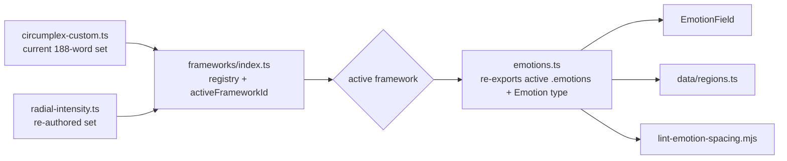

# feat: Radial-intensity field

## Summary

Fill the empty center of the emotion field by re-authoring the vocabulary onto a **radial-intensity model** — *angle = quality of feeling, radius = intensity*. Each word keeps its angular direction (its cluster's quality) and gets its radius redistributed by intensity, so mild variants populate the inner ring and intense variants reach the edge; the very core (r < ~0.15) stays a deliberate, wordless still point. The always-visible tier becomes **one anchor per spoke** (per cluster), so the resting field reads as an even ring rather than a donut. The vocabulary is refactored into a **hotswappable framework** abstraction — the current set stays selectable, and the radial set ships as the first alternative framework. A **light signaling** cue makes the intensity gradient and the still center feel intentional. Everything stays compatible with the coordinate-anchored dots/de-overlap/tethers shipped in PR #8, and actively *relieves* the outer-ring density that work addresses.

## Problem Frame

The field is a donut: 0 words within r ≤ 0.20, 5 within r ≤ 0.40, but 65% of the 188 words crowd the r 0.70–1.00 outer ring (see origin: `docs/brainstorms/2026-07-21-radial-intensity-field-requirements.md`). A user with a mild feeling lands in an empty center with no vocabulary to recognize, and the emptiness reads as unfinished. Because the emptiness is a **radius** problem (clusters start at r≈0.6–0.7 and reach outward, leaving the inner ring bare) — not an angular one — the fix is to redistribute radius by intensity, not to move words angularly. Render-only fixes (crop, fisheye, reshape) are rejected upstream: they compress the outer ring and fight PR #8.

---

## Requirements

- **R1.** Mild low-intensity vocabulary populates the inner ring (r ≈ 0.15–0.40), so placing a pin near center surfaces recognizable words. (origin Goal 1, SC1)
- **R2.** The resting field reads as an evenly-spaced ring of spoke anchors, not a donut. (origin Goal 2, SC3)
- **R3.** Radius encodes intensity (mild inner → intense outer), softly signaled without a legend. (origin Goal 3)
- **R4.** The re-audit relieves — does not worsen — the over-crammed outer ring, and stays compatible with the PR #8 dots/de-overlap/tethers. (origin Goal 4)
- **R5.** Each word keeps its angular direction so quality-of-feeling is preserved. (origin Goal 5)
- **R6.** The vocabulary is a named, hotswappable framework: the current set is preserved as a selectable framework, and the radial set is authored as a new one anchored to a circumplex-native source. (origin Key Decisions)
- **R7.** The very core (r < ~0.15) stays a wordless still point. (origin Key Decisions)
- **R8.** `pnpm lint:spacing` stays green, re-baselined to the new coordinates (no surface-surface overlaps among the ~17 anchors).

---

## Key Technical Decisions

- **KTD1. Framework = a named dataset + registry; `emotions.ts` becomes a thin re-export of the active framework.** A `Framework` is `{ id, name, emotions: Emotion[] }`. A registry maps id → framework; one is marked active. `src/data/emotions.ts` re-exports the active framework's array and the `Emotion` type, so every existing consumer (`EmotionField`, `src/data/regions.ts`, the spacing lint) keeps importing `emotions` unchanged. This preserves PR #8 compatibility with zero consumer edits. (R6, R4)
- **KTD2. Keep each word's angle; redistribute only its radius by intensity.** For every word, `angle = atan2(y, x)` is preserved; the new radius comes from its rank in its cluster's intensity ordering, mapped onto `[R_INNER ≈ 0.18, R_OUTER ≈ 1.0]`. This fills the inner ring and relieves the outer ring while keeping quality-of-feeling exactly where it was. (R1, R4, R5, R7)
- **KTD3. Spokes = the existing 17 clusters.** The `cluster` field already partitions the vocabulary into angular families (joyful, angry, sad, …). Each cluster is a spoke; its words form that spoke's radial intensity gradient. No new taxonomy is invented. (R2, R3)
- **KTD4. One mid-intensity anchor per spoke = surface; the rest = deep.** `depth` is reassigned so exactly one word per cluster (a mid-radius representative) is always visible; its mild-inner and intense-outer siblings reveal on dwell/pin. This replaces the flat 39-surface / 149-deep split with ~17 anchors. (R2)
- **KTD5. Author the radial set anchored to a circumplex-native source.** The field *is* the Russell circumplex (valence × arousal), where radius = intensity holds with zero translation — so the intensity ordering per cluster is sourced from a circumplex-native reference (e.g. Russell's affect terms, the Geneva Emotion Wheel, or valence/arousal norms), not from a wheel (Plutchik/Willcox) whose radius means something else. Exact source is an authoring detail; the method is fixed. (R6)
- **KTD6. Light signaling is render-only and sits beneath the labels.** A wordless still-center marker plus an optional faint radial intensity gradient live in `EmotionField` below the word/dot/tether layers, so they never interfere with PR #8's rendering. Tuned by eye. (R3, R7)

---

## High-Level Technical Design

Framework indirection — consumers never learn there are multiple frameworks; they import `emotions` as today:

The radial re-map, per spoke (cluster), is a polar transform that keeps angle and rewrites radius:

- For each cluster, order its words by intensity (from the circumplex-native source).
- Keep `angle = atan2(y, x)` per word.
- Assign `radius` by intensity rank across `[R_INNER, R_OUTER]`; insert authored mild variants where the cluster's mildest member still sits beyond the inner ring.
- Recompute `x = radius·cos(angle)`, `y = radius·sin(angle)`; the core `r < ~0.15` receives no words.

*(Directional — R_INNER/R_OUTER and per-cluster spacing are tuned during U2.)*

---

## Implementation Units

### U1. Framework data abstraction

- **Goal:** The vocabulary becomes a named, hotswappable framework; the current set is preserved as the default; existing consumers keep working unchanged.
- **Requirements:** R6, R4
- **Dependencies:** none
- **Files:** `src/data/frameworks/index.ts` (new, registry + active id), `src/data/frameworks/circumplex-custom.ts` (new, the current set moved here), `src/data/emotions.ts` (becomes a thin re-export of the active framework's `emotions` + the `Emotion`/`EmotionDepth` types)
- **Approach:** Define a `Framework` type (`{ id, name, emotions }`). Move today's array into `circumplex-custom.ts` verbatim. `index.ts` holds the registry and the active-framework id (a constant for now — UI selection is deferred). `emotions.ts` re-exports the active framework's array as the named `emotions` export and re-exports the `Emotion` type, so `EmotionField`, `regions.ts`, and the lint import path are untouched. Default active = the current set, so this unit is behavior-neutral.
- **Patterns to follow:** the existing `Emotion`/`EmotionDepth` types and the module-level `emotions` export in `src/data/emotions.ts`.
- **Test scenarios:** no test runner — verify by build + parity.
  - `tsc` + `vite build` clean; `EmotionField`, `regions.ts`, lint all still resolve `emotions`.
  - App at rest renders identically to before (active = current set → no visual change).
  - `pnpm lint:spacing` still green (data unchanged, path resolves).
- **Verification:** the app is visually unchanged and builds clean; the current vocabulary now lives behind the framework registry.

### U2. Radial-intensity framework authoring

- **Goal:** Author the radial set — keep angle, redistribute radius by intensity, fill the inner ring, keep the core still, add mild variants where missing — and make it the active framework.
- **Requirements:** R1, R3, R4, R5, R7, R6
- **Dependencies:** U1
- **Files:** `src/data/frameworks/radial-intensity.ts` (new), `src/data/frameworks/index.ts` (register + set active)
- **Approach:** Per KTD2/KTD3: for each of the 17 clusters, order its words by intensity (sourced per KTD5), keep each word's angle, and assign radius by intensity rank across `[R_INNER ≈ 0.18, R_OUTER ≈ 1.0]`; recompute x/y. Author mild inner variants for clusters whose mildest word still sits beyond the inner ring (e.g. the high-arousal families that currently floor at r≈0.6). Leave r < ~0.15 empty. Preserve `cluster`. Set `radial-intensity` active in the registry. Tune R_INNER/R_OUTER and per-cluster spacing by eye against the field.
- **Technical design:** the polar re-map in the High-Level Technical Design section is the authoring recipe — directional, not literal coordinates.
- **Patterns to follow:** the row format of `src/data/emotions.ts` (so the lint regex keeps parsing); the cluster mean-angles already in the data.
- **Test scenarios:** no test runner — verify by a radial-histogram script + visual.
  - Radial histogram: inner ring r 0.15–0.40 populates meaningfully; outer r 0.70–1.00 drops well below 65%; r < ~0.15 stays ~empty. (Covers R1, R4, R7)
  - Angle preserved: spot-check that each re-placed word's `atan2(y,x)` matches its pre-audit angle (within tolerance for authored variants). (Covers R5)
  - Each cluster spans inner→outer (a mild member near the inner ring, an intense member near the edge). (Covers R3)
  - In-browser: dwelling down a spoke reveals a mild→intense progression; a low-intensity pin surfaces recognizable mild words.
- **Verification:** the radial histogram flattens per the success criteria and the field reads as filled, with quality-of-feeling unchanged.

### U3. Anchor-per-spoke surface/deep reassignment

- **Goal:** Exactly one mid-intensity anchor per spoke is always visible; the rest of each spoke reveals on dwell/pin.
- **Requirements:** R2
- **Dependencies:** U2
- **Files:** `src/data/frameworks/radial-intensity.ts` (depth flags)
- **Approach:** For each cluster, mark one mid-radius representative `depth: 'surface'` and every other member `depth: 'deep'`. Target ~17 surface anchors. Choose anchors that are recognizable, mid-intensity words so the resting ring reads as sensible landmarks.
- **Patterns to follow:** the existing `depth` field and the surface/deep partition in `EmotionField` (which needs no change — it reads `depth`).
- **Test scenarios:** no test runner — verify visually + count.
  - At rest: exactly one surface word per cluster (~17 total), no deep words shown.
  - The resting anchors are distributed around the field (not bunched into an unreadable clump) — one per angular family.
  - Deep reveal still works mechanically (dwell/pin surfaces the spoke's other members).
- **Verification:** the resting field is an even ring of ~17 anchors; reveal behavior is unchanged.

### U5. Re-baseline the spacing lint

- **Goal:** `lint:spacing` passes against the new coordinates and the new (~17-word) surface set.
- **Requirements:** R8
- **Dependencies:** U2, U3
- **Files:** `scripts/lint-emotion-spacing.mjs`
- **Approach:** Point the lint at the active framework's data file (or confirm the `emotions.ts` re-export path still resolves for its parse). Confirm no surface-surface overlaps among the ~17 anchors (they are sparse, so this should pass easily). Re-tune `CHAR_W_*`/`PAD`/`LINE` only if the new layout requires it; the advisory surface-deep/deep-deep counts will change and stay advisory.
- **Patterns to follow:** the existing overlap model and constants in `scripts/lint-emotion-spacing.mjs`.
- **Test scenarios:** no behavioral code — lint check.
  - `pnpm lint:spacing` → OK, no surface-surface overlaps.
  - The parse guard still matches all rows in the active framework file (no silent under-parse).
- **Verification:** `lint:spacing` green against the radial set.

### U4. Light-signaling affordance

- **Goal:** A wordless still-center cue and a soft intensity-gradient signal make the radial structure feel intentional, without a legend.
- **Requirements:** R3, R7
- **Dependencies:** U2 (so signaling is tuned against real coordinates)
- **Files:** `src/components/EmotionField/EmotionField.tsx` (and optionally a small presentational component under `src/components/EmotionField/`)
- **Approach:** Add a quiet still-point marker at the center and/or a faint radial gradient that darkens toward the edge (or brightens toward center) to hint intensity grows outward. Render beneath the word/dot/tether layers (KTD6) so PR #8 visuals are untouched; respect `prefers-reduced-motion`. Tune opacity/scale by eye — subtle, in the app's bone/gold palette.
- **Patterns to follow:** the existing crosshair/axis-label rendering and z-index layering in `EmotionField.tsx`; the palette tokens in `src/index.css`.
- **Test scenarios:** no test runner — verify visually.
  - The center reads as an intentional still point, not a gap.
  - The intensity gradient is perceptible as "stronger outward" without any text/legend.
  - Reduced-motion: no animation; static cue only.
  - No regression: dots, de-overlap, tethers, and reveal all render unchanged over the signaling layer.
- **Verification:** screenshots show a calm, intentional center and a subtle outward-intensity read; PR #8 visuals intact.

### U6. Reveal tuning for the populated center

- **Goal:** A dwell/pin near the now-populated center reveals a legible, capped set rather than an over-dense cluster.
- **Requirements:** R1, R4
- **Dependencies:** U2
- **Files:** `src/hooks/useProximity.ts` (constants), `src/components/EmotionField/EmotionField.tsx` (if reveal maps need adjustment)
- **Approach:** With mild words now near center, check that `VISIBILITY_RADIUS` (0.35) and `DEEP_REVEAL_CAP` (6) still produce a comfortable central reveal; the inner ring is denser than before, so a central dwell could pull more nearby words. Adjust the cap or radius only if central reveals feel cramped against the de-overlap pass. By-eye.
- **Patterns to follow:** the reveal/de-overlap interaction in `EmotionField.tsx` and the constants in `src/hooks/useProximity.ts`.
- **Test scenarios:** no test runner — verify visually.
  - Dwell near center: the revealed set is capped and legible (de-overlap keeps it readable).
  - Dwell in an outer family: unchanged from today.
- **Verification:** central reveals feel as comfortable as outer ones; no over-crowding.

---

## Scope Boundaries

### In scope
- The framework abstraction, the radial re-audit, anchor-per-spoke reassignment, light signaling, lint re-baseline, and reveal tuning (U1–U6).

### Deferred to Follow-Up Work
- **Framework-selection UI** — a user-facing switcher between frameworks. The abstraction ships; choosing a framework at runtime is a later addition (active framework is a constant for now).
- **Additional framework datasets** — Plutchik/Willcox/other sets as loadable frameworks, once the abstraction is proven by the radial set.
- **Reveal-model changes** beyond constant tuning (e.g. center-responds-on-approach blended labels) — a larger interaction reframe from the brainstorm, out of scope.

### Rejected upstream (not revisited here)
- Render-only fixes (crop/rescale, fisheye/non-linear warp, non-square field shapes) — they re-crowd the outer ring and fight PR #8.

---

## Risks & Dependencies

- **PR #8 compatibility.** The dots/de-overlap/tethers read whatever coordinates exist, so they adapt automatically — but the de-overlap box model and the lint share `CHAR_W_*` constants. Mitigation: U5 re-baselines the lint; U6 checks central-reveal density against de-overlap.
- **Authoring quality (U2).** A mechanical radius re-map can place words at psychologically odd spots. Mitigation: tune per-cluster by eye; keep angle fixed so quality never drifts; source intensity ordering from a circumplex-native reference.
- **Angular bunching.** The 17 clusters bunch by quadrant, so ~17 anchors won't be perfectly evenly spaced by angle. Accepted: this is semantically honest (there genuinely are more positive-activated families), and the fix targets the radial gap, not angular evenness.
- **Lint path coupling.** The lint reads a fixed data path; the framework refactor (U1) must keep that path resolving. Mitigation: U1 keeps `emotions.ts` as the re-export the lint already targets, or U5 repoints it.

---

## Open Questions (execution-time)

- **Which circumplex-native source** to anchor the intensity ordering to (Russell affect terms vs Geneva Emotion Wheel vs valence/arousal norms) — decide during U2 authoring; the method is fixed regardless.
- **R_INNER / R_OUTER and per-cluster radial spacing** — tuned by eye in U2.
- **Light-signaling form** — still-point marker vs soft gradient vs both — decided by eye in U4.
- **Reveal constants** — whether `VISIBILITY_RADIUS` / `DEEP_REVEAL_CAP` need adjustment — observed in U6.

---

## Sources & Research

- Origin requirements: `docs/brainstorms/2026-07-21-radial-intensity-field-requirements.md`
- Prior feature this must stay compatible with: `docs/plans/2026-07-20-001-feat-coordinate-anchored-words-plan.md` (PR #8)
- Data + structure: `src/data/emotions.ts` (188 words, 17 clusters), `src/data/regions.ts`
- Field + reveal: `src/components/EmotionField/EmotionField.tsx`, `src/hooks/useProximity.ts` (`VISIBILITY_RADIUS`, `DEEP_REVEAL_CAP`)
- Spacing guard: `scripts/lint-emotion-spacing.mjs`
