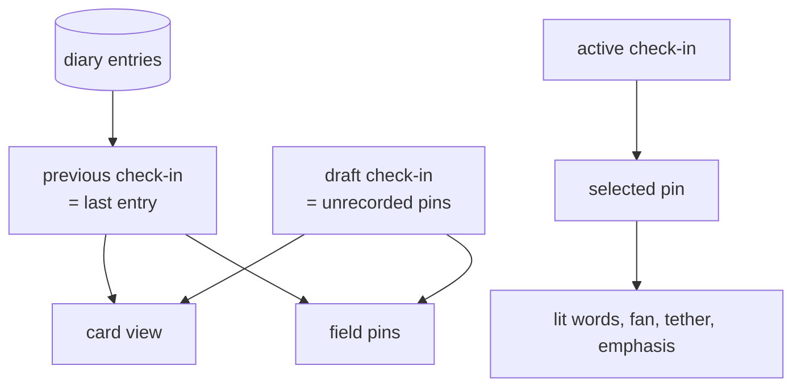
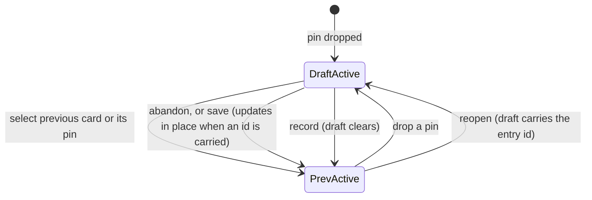

# feat: The check-in as the unit of record

## Summary

Make the check-in the app's unit of record: a previous check-in derived from the last diary entry sits collapsed and read-only above the draft check-in, selection becomes check-in-scoped, and recording clears the draft so saved and unsaved work can never look alike. Reopening a previous check-in updates its record in place instead of appending a duplicate.

---

## Problem Frame

Recording does not clear the working pins, and the history view always exits to the field. So the natural path after saving — record, land on the completion screen, tap into history, press back — returns the user to a field holding already-recorded pins under a live save button. Pressing it appends a second identical entry, because recording always mints a new id.

The state model is the cause and the vocabulary hides it. The drawer calls the working set "This session" while the returning mirror calls a recorded entry "Last check-in": two names for two things, one of which also means "browser session". Nothing on screen distinguishes a draft from a record.

The fix is structural rather than decorative. Once a pin belongs to either the previous check-in or the draft, the distinction is *where it lives*, not a badge the user has to learn.

---

## High-Level Technical Design

### State shape

Today `pins` is a single flat array holding whatever is on the field, and the returning mirror is a separate branch that only renders when that array is empty. Both collapse into one derivation.

Deriving the previous check-in from the last diary entry rather than from leftover working pins is what makes the mirror merge fall out: the returning surface and the just-recorded surface become the same thing, reached differently.

### Selection resolution

Selection is currently one pin id resolved against `pins`, with a fallback to the newest pin. It becomes a pair — which check-in is active, and which pin within it — resolved against that check-in's pins.

Reopen has no state of its own. It is `DraftActive` carrying the reopened entry's id — see Key Technical Decisions.

---

## Requirements

Carried from origin with the same IDs. Full text in `docs/brainstorms/2026-08-17-check-in-state-legibility-requirements.md`.

**Vocabulary**

- R1. "Check-in" is the user-facing unit; "session" does not appear in user-facing copy.
- R2. The drawer header names what it shows in check-in terms.

**Draft and previous check-in**

- R3. Card view shows the most recent previous check-in above the draft.
- R4. A previous check-in renders collapsed by default.
- R5. A previous check-in is read-only — no coordinate adjustment, no naming.
- R6. A previous check-in is distinguishable from the draft without expanding it.
- R7. Recording replaces the previous check-in on show; the displaced one stays in history.
- R8. A previous check-in holds all pins recorded together.
- R9. The returning mirror and the previous check-in are one surface.

**Field**

- R10. A previous check-in's pins remain on the field after recording.
- R11. They are distinguishable from draft pins on the field.

**Selection**

- R12. Exactly one check-in is active at a time.
- R13. Activating a check-in briefly glows its pins and the field, then settles.
- R14. Within the active check-in, one pin is selected and its card is the selected card.
- R15. Selecting a pin on the field activates its check-in and selects that pin.
- R16. Dropping a pin activates the draft, selects the new pin, and brings its cards forward.
- R17. Activating a check-in does not reopen it.

**Save**

- R18. Save records the draft and only the draft.
- R19. Save is unavailable when the draft holds nothing new.
- R20. Recording never produces a second entry for an already-recorded check-in.
- R21. The save affordance communicates how much is pending.

**Reopen**

- R22. A previous check-in offers an explicit reopen affordance.
- R23. Reopening restores adjustment and naming.
- R24. A reopened check-in stays recorded while being edited.
- R25. Saving a reopened check-in updates its existing record.
- R26. Abandoning a reopened check-in leaves its record unchanged.

**Discard**

- R27. Discarding affects only the draft.
- R28. The discard affordance cannot be read as deleting recorded history.

---

## Key Technical Decisions

**The previous check-in derives from the last diary entry, not from leftover working pins.** It makes the returning-mirror merge automatic — the returning surface and the just-recorded surface become one derivation — and it survives a page reload, which a session-only model would not. Cost: the field reads from storage on load, which `useDiary` already does.

**Recording clears the draft.** The ambiguous state is removed at the source rather than labelled. Every requirement about telling saved from unsaved becomes a consequence of this rather than a separate feature.

**Selection becomes a pair, resolved at render.** `App.tsx` already resolves the selected pin at render with a fallback rather than reconciling in an effect, and derives lit words, fan, tether and emphasis from that one value. Keep that shape and widen the input from a pin id to an active-check-in plus pin id, so those four consumers cannot drift apart.

**Reopen is a draft-with-an-id, not a new state machine.** A reopened check-in reuses the draft path and carries the id of the entry it came from; saving updates that entry instead of appending. This avoids a third pin category and makes abandonment free — the entry was never removed.

**The activation glow follows the existing one-shot pulse pattern.** `AxisRadiance` already plays a self-dissolving pulse keyed on a counter, measured at pulse start rather than from a resize-driven dependency. Reuse that shape; do not key the glow on geometry.

**Store gains update-by-id; the append path is untouched.** `appendEntry` keeps its pruning behavior. A sibling `updateEntry` writes in place by id and no-ops on a missing id.

---

## Implementation Units

### U1. Update a recorded entry by id

- **Goal:** The diary store can replace an existing entry in place.
- **Requirements:** R25
- **Dependencies:** none
- **Files:** `src/data/checkIn.ts` (new), `src/store/diary.ts`, `src/hooks/useDiary.ts`, `scripts/test-check-in.ts` (new), `package.json`
- **Approach:** Put the pure logic in a new `src/data/checkIn.ts` — update-entry-over-an-array, plus the previous-check-in derivation (U2) and the active-check-in/pin resolution (U3) — so `scripts/test-check-in.ts` can assert it under Node. `npx tsx` has no `localStorage`, so a script importing `src/store/diary.ts` directly would throw on load; the pure module is the runnable seam. Then add `updateEntry(entry)` beside `appendEntry` as a thin storage wrapper over that function, matching by id and preserving array order **and the entry's original timestamp** — the timestamp records when the check-in happened, not when it was corrected, and `sessionsForDay` in `src/utils/diaryAggregation.ts` and the row sort in `src/utils/diaryCsv.ts` both key on it. Expose it through `useDiary` alongside `record`, refreshing `entries` so the previous-check-in derivation does not go stale after a re-save. Missing id is a no-op rather than an append — an update for an entry that was pruned must not resurrect it. Register a `check:checkin` script following the existing `check:*` convention.
- **Patterns to follow:** the `pickCueIndex` / `nextCue` split in `src/data/groundingCues.ts` — pure logic is unit-tested, the storage-backed wrapper is verified live in the app; `appendEntry` / `readDiary` in `src/store/diary.ts` for the try/catch-and-degrade posture; `scripts/test-pin-adjust.ts` for assertion style.
- **Test scenarios:**
  - Updating an existing entry replaces its pins and leaves its id, position, and original timestamp unchanged.
  - Updating preserves every other entry in the diary.
  - Updating an id that is not present leaves the diary unchanged and does not append.
  - Updating survives a diary at the prune ceiling without dropping entries.
  - A corrupt or unavailable store degrades quietly, matching `readDiary`.
- **Verification:** `npm run check:checkin` passes; `npm run check:csv` still passes against an updated entry.

### U2. The check-in model in app state

- **Goal:** Working pins become the draft check-in; the previous check-in derives from the last recorded entry; recording clears the draft.
- **Requirements:** R3, R7, R8, R18, R20
- **Dependencies:** none
- **Files:** `src/App.tsx`, `src/types.ts`, `src/data/checkIn.ts`, `scripts/test-check-in.ts`
- **Approach:** Keep the pin array as the draft. Derive the previous check-in at render, next to the existing `lastCoord` derivation, from the most recent diary entry **whose id is not the one the draft carries** — so a reopened check-in leaves the previous group for the duration of the edit and appears only as the draft, never in both places at once. On record, clear the draft so the recorded entry becomes the previous check-in through that same derivation — not through a second stored copy. The previous check-in renders whenever a last entry exists, regardless of how old it is; there is no age cutoff. `handleNewSession` still resets the draft, selection, and view, but it no longer clears the previous check-in — that is now derived from storage rather than stored, and survives a reload by design. Keep the derivation itself in the pure `src/data/checkIn.ts` from U1 so `check:checkin` can assert it.
- **Patterns to follow:** the existing render-time derivations around `src/App.tsx` `hasHistory` / `lastCoord` / `selectedPin` — derive rather than store, and never reconcile in an effect.
- **Test scenarios:**
  - Covers AE1. Recording a one-pin draft leaves the draft empty and one entry recorded.
  - Covers AE2. With a draft cleared by recording, no further record call can produce a second entry for it.
  - Covers AE6. A check-in recorded with three pins surfaces all three as the previous check-in.
  - The previous check-in is the most recent entry when several exist.
  - The previous check-in excludes the entry whose id the draft carries, so a reopened check-in resolves to exactly one group.
  - A weeks-old entry still resolves as the previous check-in — age does not retire it.
  - With no history and no draft, neither a previous check-in nor a draft is present.
- **Verification:** `npm run check:checkin` passes; recording twice in a row without new pins cannot produce two entries.

### U3. Check-in-scoped selection

- **Goal:** Selection resolves as an active check-in plus a pin within it, and the field's derived state follows.
- **Requirements:** R12, R14, R15, R16, R17
- **Dependencies:** U2
- **Files:** `src/App.tsx`, `src/components/EmotionField/EmotionField.tsx`, `src/hooks/useFieldGesture.ts`, `src/data/checkIn.ts`, `scripts/test-check-in.ts`
- **Approach:** Replace the flat selected-pin resolution with a pair resolved at render against the active check-in's pins, keeping the existing fallback-to-newest behavior within that check-in. `highlightedIds`, the tether, and the emphasized pin all continue to derive from the resolved pin so they cannot drift. Dropping a pin activates the draft. Activation never changes read-only state.

  **Active-check-in fallback.** The active half of the pair gets the same render-time fallback the selected pin already has: when it is unresolvable or has been displaced, it resolves to the draft if the draft holds pins, otherwise to the previous check-in, otherwise to none. This covers the two states that would otherwise dangle — a fresh user with no history and no draft, and the moment recording displaces the entry the pointer referred to.

  **Field-pin selection.** R15 has no mechanism today: pin dots render with `pointerEvents: 'none'`, and `useFieldGesture`'s `onPointerUp` unconditionally calls `onRelease(...)`, so every release anywhere on the field mints a new pin. Add hit-testing against existing pin positions in `onPointerUp` before a release is treated as a drop — a release landing within one pin-radius-plus-touch-slop of an existing pin selects that pin, activates whichever check-in owns it, and suppresses the drop. Give each dot a padded invisible touch target so the 4–12px visual dot is not the hit area. Dwell and drag-reveal are unaffected: the branch is decided at release, not at press.
- **Patterns to follow:** `src/App.tsx` `selectedPin` / `effectiveSelectedPinId` / `highlightedIds` — one resolved value feeding every consumer.
- **Test scenarios:**
  - Covers AE9. Dropping a pin while the previous check-in is active makes the draft active and selects the new pin.
  - Selecting a previous check-in's pin activates that check-in and selects that pin.
  - Removing the selected pin falls back to the newest pin within the same check-in, not across check-ins.
  - At most one check-in is active, and exactly one whenever a draft or a previous check-in exists.
  - Recording while the previous check-in is active resolves the active check-in to the newly recorded entry rather than leaving the pair dangling.
  - Activating a check-in leaves its read-only state unchanged.
  - With an empty draft and a previous check-in present, the previous check-in is the active one.
- **Verification:** `npm run check:checkin` passes; `npm run check:fan` still passes, since lit words remain derived from the resolved pin.

### U4. Previous check-in pins on the field

- **Goal:** A recorded check-in's pins stay on the field, readable as recorded rather than live.
- **Requirements:** R10, R11
- **Dependencies:** U2, U3
- **Files:** `src/components/EmotionField/EmotionField.tsx`, `src/App.tsx`, `src/index.css`
- **Approach:** Generalize the single ghost pin the field already draws for the last entry into the previous check-in's full pin set. Keep the drop-anchor, travel-line and adjust-ghost overlays bound to the draft only — a recorded pin has nothing in flight.

  **Recorded-pin treatment.** Distinguish by hue, not only by quietness. `src/index.css` has no second accent today, so add `--oura-recorded: #7C93A8` and a `--oura-recorded-dim` alongside the gold tokens — the same rough luminance as `--oura-gold`, rotated cool, so recorded reads as settled next to the draft's warmth. A recorded pin renders in that hue below the draft pin's base opacity and with no mount pulse-ring. **The hue survives emphasis:** selecting a previous check-in's card (or its pin) brightens within `--oura-recorded` rather than switching to gold, so R11's distinction holds through selection and through U5's activation glow instead of being erased by them. Recorded pins remain selectable throughout.
- **Patterns to follow:** the existing `ghostPin` prop and its `lastCoord` source in `src/App.tsx`; the gold pin rendering and `emphasizedPinId` handling in `src/components/EmotionField/EmotionField.tsx`.
- **Test scenarios:** none as automated assertions — this unit is rendering. Verify manually: a recorded multi-pin check-in shows every pin; recorded pins read as distinct from draft pins at a glance, by hue, both at rest and while selected; a weeks-old check-in's pins render correctly beneath a fresh draft; adjust overlays never attach to a recorded pin.
- **Verification:** With one recorded check-in and one draft pin on screen, the two groups are distinguishable without opening a card, and stay distinguishable when the recorded pin is the selected one.

### U5. Activation glow

- **Goal:** Changing the active check-in announces itself, then settles.
- **Requirements:** R13
- **Dependencies:** U3
- **Files:** `src/components/EmotionField/EmotionField.tsx`, `src/App.tsx`
- **Approach:** A one-shot glow on the newly active check-in's pins and the field, keyed on a counter that increments when the active check-in changes — not on geometry, and not on every selection change within a check-in. Honors `useReducedMotion` by settling immediately; note that `AxisRadiance` does not honor it today, so this is new behavior rather than reuse.

  **Two patterns, not one.** `AxisRadiance`'s legs run from the field's center to the four fixed axis-label edges and have no notion of a pin coordinate, so it cannot glow a check-in's pins. Take from it only the lifecycle discipline — a counter-keyed one-shot measured at play time — and apply that to the field half of the glow. For the pin half, reuse the field's existing per-pin pulse-ring / breathing-halo animation, which already renders at a specific coordinate.
- **Patterns to follow:** `src/components/EmotionField/AxisRadiance.tsx` for the lifecycle only — a pulse keyed on a `play` counter with size measured at pulse start, which is what keeps it from restarting on field resize; the per-pin pulse-ring / breathing-halo rendering already in `src/components/EmotionField/EmotionField.tsx` for the pin glow itself.
- **Execution note:** The field resizes when the drawer and mirror swap. Verify the glow does not re-fire on resize before calling this done — that exact bug shipped once already in the axis pulse.
- **Test scenarios:** none as automated assertions. Verify manually: activating the previous check-in glows once and settles; selecting a different pin *within* the active check-in does not re-glow; resizing the field does not re-glow; reduced motion settles instantly.
- **Verification:** Glow fires once per active-check-in change and never on resize.

### U6. Drawer: two check-in groups, save and discard semantics

- **Goal:** The card view shows a collapsed read-only previous check-in above the draft, with save and discard scoped to the draft.
- **Requirements:** R2, R4, R5, R6, R19, R21, R27, R28
- **Dependencies:** U2, U3
- **Files:** `src/components/EmotionPreview/EmotionDrawer.tsx`, `src/components/EmotionPreview/CoordinateCard.tsx`, `src/App.tsx`
- **Approach:** Group the card list into previous and draft. The previous group renders **one collapsed `CoordinateCard` row per pin**, mirroring the draft list's per-pin cards — this keeps the two groups structurally parallel, so R6's "distinguishable without expanding" is a matter of treatment rather than a different layout, and gives R14's "selected card" a concrete row to refer to. `CoordinateCard` has no collapsed mode today, so this is new rendering, not a flag on an existing one. Tapping a collapsed row is **inspect-only**: it reveals that pin's detail and selects it, with sliders and naming still disabled — deliberately distinct from the explicit reopen control in U7, so R17 holds. Each row passes a read-only flag that disables the sliders and the tap-to-name affordances added in the adjustable-pin work. Save reflects only the draft's count and is unavailable when the draft is empty. Rename the discard control so it cannot read as deleting history, and scope it to the draft. Replace the "This session" header with check-in vocabulary.
- **Patterns to follow:** `src/components/EmotionMirror/MirrorCard.tsx` for the collapsed-peek shape and its exported peek geometry; the existing `layout` motion wrapper per card in `src/components/EmotionPreview/EmotionDrawer.tsx`.
- **Test scenarios:** none as automated assertions — rendering and copy. Verify manually, covering AE3 and AE5: a previous check-in's card cannot be adjusted or named; tapping a collapsed row inspects and selects without reopening; save reads the draft count only and is unavailable with an empty draft; discarding removes draft pins and leaves the previous check-in and its record intact.
- **Verification:** With a previous check-in and a one-pin draft on screen, save refers to one pin and discard leaves the recorded entry untouched.

### U7. Reopen a recorded check-in

- **Goal:** A previous check-in can be reopened, edited, and re-saved into its existing record.
- **Requirements:** R22, R23, R24, R25, R26
- **Dependencies:** U1, U2, U6
- **Files:** `src/App.tsx`, `src/components/EmotionPreview/EmotionDrawer.tsx`, `src/components/EmotionPreview/CoordinateCard.tsx`, `scripts/test-check-in.ts`
- **Approach:** Reopening moves the entry's pins into the draft and carries its id. While reopened, the entry stays in the diary but drops out of the previous-check-in derivation (U2), so it renders once, as the draft. Saving a draft that carries an id updates that entry; saving one without an id appends. Abandoning drops the draft and leaves the entry as it was.

  **Reopen is unavailable while the draft holds pins.** The control renders disabled until the draft is recorded or discarded. There is one draft, so a reopen that started from a non-empty draft would either absorb unsaved pins into an existing record on save or destroy them on abandon — both violate R18 and R27, and the origin's F5 assumes a clean draft.

  **The reopen control.** `CoordinateCard`'s only interactive header element today is the draft's `×` remove button, which R5 disables for a recorded card. Put a labeled reopen control in that vacated slot on the previous check-in's collapsed row, as the sole trigger for this transition — distinct from U6's tap-to-inspect.

  **After saving a reopen.** Saving a draft that carries an id returns to the field with that check-in active. `handleRecord` unconditionally runs `setView('complete')` today; keep the completion screen on the append path only, so correcting an old check-in does not end on a celebration.
- **Test scenarios:**
  - Covers AE4. Reopening, adjusting, then abandoning leaves the original entry at its original coordinate.
  - A reopened check-in renders in exactly one group — as the draft, not also as the previous check-in.
  - Reopening is refused while the draft holds pins, and the draft is left untouched.
  - Saving a reopened check-in updates its entry and does not change the diary length.
  - Saving a draft with no carried id appends a new entry.
  - Reopening, then recording, then reopening again still yields one entry for that check-in.
  - A reopened check-in's pins are adjustable and nameable again.
- **Verification:** `npm run check:checkin` passes; the diary length never grows when a reopened check-in is saved.

### U8. Merge the returning mirror into the previous check-in

- **Goal:** The last recorded check-in is presented on one surface, whether reached by returning or by just recording.
- **Requirements:** R1, R9
- **Dependencies:** U2, U6
- **Files:** `src/App.tsx`, `src/components/EmotionMirror/MirrorCard.tsx`, `src/components/EmotionPreview/EmotionDrawer.tsx`
- **Approach:** Collapse the three-way empty-state branch — returning mirror, first-run demo, active drawer — so the previous check-in covers the returning case. Carry forward the mirror content worth keeping (relative time, the relational line, the rhythm strip) into the previous check-in's surface rather than dropping it. The first-run demo branch is unaffected. Finish the vocabulary sweep so no user-facing copy says "session".

  **The tray needs a peek state.** `EmotionDrawer` has no collapsed mode — it renders a sheet at `maxHeight: '46vh'` and `stopPropagation`s pointer events across its whole box — while `MirrorCard`'s 52px peek is what keeps the field pinnable on landing. U6's collapse is card-level; this is tray-level. Move the peek handle, the expanded state, and the `PEEK_BAR_HEIGHT` / `PEEK_SAFE_PAD` geometry into the drawer's sheet variant, carrying the render-phase collapse reset and the field-press dismiss handler with them.

  **Three things hang off the removed branch, not one.** `showMirror` gates the field inset, the constellation replay entry point, and the render-phase reset that re-collapses the tray on every landing. Re-gate all three on the previous check-in's presence. Missing the second makes replay unreachable; missing the third lets an expanded tray carry over from a history visit and re-cover the field — the regression that reset was written to prevent.
- **Patterns to follow:** `src/App.tsx` empty-state selection around `showMirror` / `showDemo` and the `fieldBottom` inset; `PEEK_BAR_HEIGHT` / `PEEK_SAFE_PAD` exported from `src/components/EmotionMirror/MirrorCard.tsx`.
- **Test scenarios:** none as automated assertions. Verify manually, covering AE8: a returning user sees the last check-in once, not twice; the field still ends at the top of the collapsed tray on a 390px viewport; the constellation replay entry point is still reachable; the tray is collapsed on every landing, including a return from history; a first-run user with no history still gets the gesture demo; no user-facing copy says "session".
- **Verification:** On reload with history present, exactly one surface describes the last check-in, and the field bottom still meets the collapsed tray.

---

## System-Wide Impact

- **Diary consumers.** History, CSV export, and constellation replay all read entries. Closing the duplicate path changes what they show for existing users only insofar as new duplicates stop appearing; entries already duplicated stay duplicated. No migration is planned — see Open Questions.
- **Entry mutability.** Entries have been append-only. After U1 they can change after being written, which every consumer that assumed immutability should be checked against.
- **Selection is load-bearing.** Lit words, the radial fan, the tether, and pin emphasis all derive from one resolved pin. U3 widens that input, so a regression there surfaces in four places at once.

---

## Risks & Dependencies

- **Selection refactor breadth.** U3 touches the value four visual systems depend on. Mitigation: keep the render-time resolution shape rather than introducing stored selection state, and lean on `check:fan` to catch lit-word regressions.
- **Glow re-firing on resize.** The field resizes on drawer and mirror transitions, which is exactly how the axis-pulse bug reached production. Mitigation: key the glow on an active-check-in counter and measure at play time, per U5's execution note.
- **Interaction coverage is manual.** Five of eight units have no automated assertions, because the repo has pure-logic check scripts and no component-test harness. The logic units carry real coverage; the rendering units rest on review and manual verification.
- **`SelectionControls.tsx` carries a second discard affordance** that appears to predate the coordinate model. If it is still reachable, U6's discard rename must cover it too.

---

## Scope Boundaries

- Editing or deleting past check-ins from inside the history view.
- Showing more than one previous check-in in the card view.
- Carrying an unsaved draft across a page reload.
- Auto-save.
- Renaming the diary, history, and constellation surfaces to match the check-in vocabulary.

### Deferred to Follow-Up Work

- Adding a component-test harness so interaction requirements can be asserted rather than verified by hand.
- Deduplicating entries already written by the old duplicate path.
- Removing `src/components/EmotionField/SelectionControls.tsx` if it proves unreachable.

---

## Open Questions

- What session duration means for a reopened and re-saved check-in — the original sitting, the edit, or the sum. Resolvable during U7; `sessionDurationMs` is currently stamped once at record.
- The visual treatment marking a card as recorded, beyond being collapsed. Frank's comparison-prototype method suits this better than a written decision, and it does not block U6.
- Whether activating a recorded pin should light the field's words and fan as loudly as a draft pin does. Falls out of U3 as written; worth a look once it can be seen.

---

## Sources / Research

- `src/App.tsx` — recording sets the completion view without clearing pins; history exits to the field regardless of entry; the three-way empty-state branch; render-time selection resolution and the derived `highlightedIds`.
- `src/hooks/useDiary.ts` — `record` appends with a fresh id on every call; no update path exists.
- `src/store/diary.ts` — `appendEntry` with prune-at-ceiling behavior, and the degrade-quietly posture of `readDiary`.
- `src/components/EmotionPreview/EmotionDrawer.tsx` — the action bar and the "This session" header.
- `src/components/EmotionMirror/MirrorCard.tsx` — the returning surface, its collapsed-peek geometry, and the exported constants the field inset depends on.
- `src/components/EmotionField/EmotionField.tsx` — the ghost pin, the emphasized-pin sonar rings, and the tether.
- `src/components/EmotionField/AxisRadiance.tsx` — the one-shot pulse pattern and the resize-restart bug it was fixed for.
- `STRATEGY.md` — session completion rate and the habit-formation track are the signals this work moves.
- `docs/brainstorms/2026-08-04-adjustable-pin-card-requirements.md` — the adjustable card whose affordances U6 disables on recorded check-ins.
