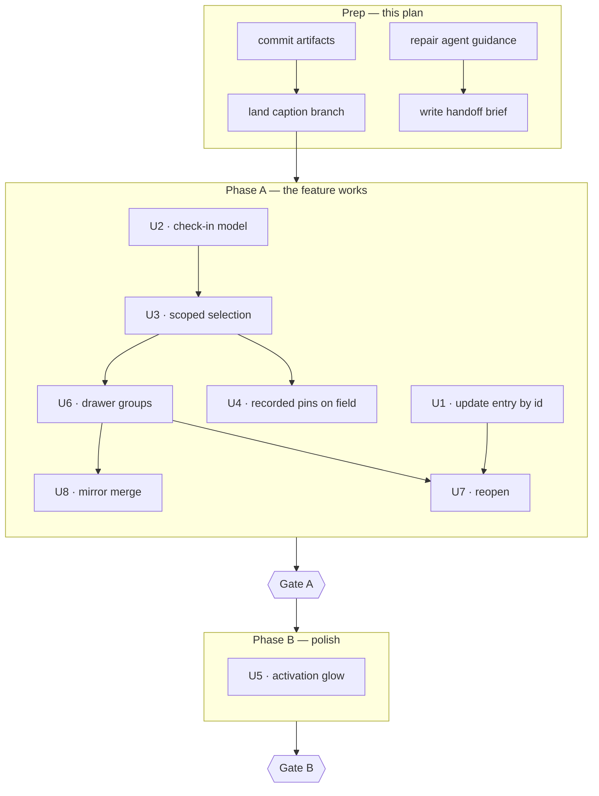

# chore: Hand off the check-in unit-of-record work

## Summary

Make the check-in unit-of-record work executable by a session or person who was not present when it was planned. The technical plan is implementation-ready; its surroundings are not — the planning artifacts are untracked, the baseline branch is unsettled, the repo's agent-facing guidance describes an app that no longer exists, and some of what the 2026-08-17 review decided lives only in a session transcript. This plan settles those four things and writes down how the eight units land.

**Who executes what.** The first pass through the origin plan is being run by a session that carries the full planning and review context. The guidance repair and the handoff brief therefore serve the *next* session rather than this one — which is why they do not gate implementation.

It does not reopen any technical decision in the origin plan.

---

## Problem Frame

The check-in plan survived a six-persona review and absorbed fifteen findings. As a document it is ready. As a handoff it is not.

Four gaps sit between the plan and someone executing it. The plan and its brainstorm have never been committed, so the work has no tracked origin and a fresh clone cannot see it. The most recent work sits on a pushed branch with no pull request, three commits ahead of `main`, so there is no settled point to branch from. `AGENTS.md` is empty and `CLAUDE.md` still describes the pre-build product — d-pad traversal, no history surfaced to the user, "Tech Stack: Not yet decided" — which is the first thing an agent session reads and is now actively wrong. And a little of what the review produced is recorded nowhere: the origin plan already carries its three open questions and the `SelectionControls.tsx` risk, but not the concerns the reviewers raised without turning into findings, nor the fact that the recorded-pin hue is an untested proposal.

The common failure this prevents is a fresh session reading stale guidance, branching from the wrong place, and rediscovering by hand what was already decided.

---

## Requirements

- R1. The check-in plan and its brainstorm are tracked in git.
- R2. Implementation starts from a settled `main`.
- R3. The guidance an agent session reads first describes the app as it actually is.
- R4. The unresolved calls from the 2026-08-17 review travel with the work.
- R5. The delivery sequence and the verification gate for each phase are written down.
- R6. Handoff does not reopen the origin plan's technical decisions.

---

## Key Technical Decisions

**Repair the agent-facing guidance rather than flag it.** `CLAUDE.md` is the entry point for any agent session in this repo and it currently contradicts the shipped app on tech stack, interaction model, and scope. Flagging it in a handoff note would leave the next session reading the wrong document first. This is adjacent cleanup by the usual rule, but the deliverable is "a fresh session can execute," and stale entry-point docs defeat that directly.

**Merge the caption branch before implementation starts.** `fix/quiet-caption-dissolve` is three commits ahead of `main` and zero behind, pushed, with no pull request — finished work sitting in limbo. Branching check-in work from `main` while that sits unmerged means the caption changes to `CoordinateCard.tsx` arrive mid-stream, and U6 and U7 both touch that same file. Landing it first removes a rebase collision rather than deferring one.

**Split delivery at the core-loop boundary, not the test-coverage boundary.** Phase A is the five units that close the actual defect — the store update, the check-in model, scoped selection, the drawer groups, and reopen. Phase B is the three that make it look right on the field. This follows the standing rule that the core loop lands before cosmetics, and it has a structural payoff: every Phase B unit's dependencies are satisfied entirely by Phase A, so the three are mutually independent and can be taken in any order.

**The handoff brief is a separate short document, not more sections in the plan.** The origin plan is a decision artifact and should stay one. Session state, watch-items, and unresolved calls have a different lifetime — they go stale as the work lands, while the plan does not.

**Nothing here reopens the origin plan.** The fifteen review findings were applied yesterday. This plan sequences and packages that work; where it disagrees with the origin plan, the origin plan wins.

---

## High-Level Technical Design

The eight origin units, grouped by phase, with the dependency edges that force the ordering.

Only committing the artifacts and landing the caption branch gate implementation. Repairing the guidance and writing the brief serve the next session, so they run alongside rather than in front.

**Why Phase A is nearly everything.** Two of the origin's units cannot be deferred without making Phase A unverifiable. The mirror merge has to be in, because until it collapses the empty-state branch the drawer only renders when the draft is non-empty — and reopen is disabled in exactly that state, so the reopen control has no reachable state at all. Recorded pins on the field have to be in, because they carry the requirement that a recorded check-in's pins survive recording, and without them half of scoped selection cannot be exercised. What is genuinely deferrable is the activation glow, which is the one unit that is pure motion polish.

---

## Delivery Sequence

**Prep.** P1 and P2 before Phase A starts. P3 and P4 any time — they serve the next session, not this one.

**Phase A — the feature works.** U1, U2, U3, U4, U6, U8, U7 in that order. At the end of Phase A a user can save, return from history, and press save again without minting a duplicate; a recorded check-in's pins stay on the field and are selectable; and reopening a recorded check-in updates it in place.

Seven units is more than one pull request should carry. Split it at the model/surface seam: U1, U2, U3 land the store and state model together, then U4, U6, U8, U7 land the surfaces. The first is script-verifiable on its own; the second is where the feature becomes visible.

*Gate A:* `npm run check:checkin` passes, and `check:fan`, `check:csv`, `check:pin`, `check:cues` still pass. Manually: save a one-pin check-in, enter history, come back, and confirm the save affordance is unavailable rather than live. With an empty draft and history present, confirm exactly one surface describes the last check-in and its reopen control is reachable. With a recorded multi-pin check-in, confirm every recorded pin is on the field and tapping one activates that check-in. Reopen, adjust, save, and confirm the diary length is unchanged. And because the mirror merge lands here: on a 390px viewport the field still ends at the top of the collapsed tray, the constellation replay entry point is still reachable, the tray is collapsed on every landing including a return from history, and no user-facing copy says "session."

**Phase B — polish.** U5 alone. Manual verification only; the origin plan carries no automated assertions for it.

*Gate B:* activating a check-in glows once and settles. Selecting a different pin within the already-active check-in does not re-glow. Resizing the field does not re-glow. Reduced motion settles instantly.

Phase A is two pull requests at the seam described above. Phase B is one small one, judged by eye.

---

## Implementation Units

### P1. Commit the planning artifacts

- **Goal:** The check-in work has a tracked origin a fresh clone can see.
- **Requirements:** R1
- **Dependencies:** none
- **Files:** `docs/brainstorms/2026-08-17-check-in-state-legibility-requirements.md`, `docs/plans/2026-08-17-001-feat-check-in-unit-of-record-plan.md`, `docs/plans/2026-08-18-001-chore-check-in-work-handoff-plan.md`
- **Approach:** Commit all three documents together on the branch that lands the caption work, or on a docs branch of its own. The repo has a precedent for this — `477e2d9 docs: brainstorm + plan for adjustable pin card` committed a brainstorm and plan as one unit before implementation began. Follow that shape and that message form.
- **Patterns to follow:** commit `477e2d9` for the message convention and the pairing of brainstorm with plan.
- **Test scenarios:** Test expectation: none — this unit adds no behavior.
- **Verification:** `git status` reports no untracked files under `docs/`.

### P2. Land the caption work on main

- **Goal:** Implementation branches from a settled baseline.
- **Requirements:** R2
- **Dependencies:** P1
- **Files:** none in this repo — a pull request and merge.
- **Approach:** Open a pull request for `fix/quiet-caption-dissolve` and merge it. Three commits: the caption dissolve, the card height animation, and the interrupted-drag revert. The last of those closes an item left open from the PR #18 review, so the branch is complete rather than partial. It is zero commits behind `main`, so no rebase is needed. Confirm the branch is deleted after merge to match repo habit.
- **Patterns to follow:** PR #18 (`feat/adjustable-pin-card`) for the branch-to-merge shape used on this repo.
- **Test scenarios:** Test expectation: none — the behavior shipped with the branch's own commits.
- **Verification:** `main` contains the three caption commits; `git log --oneline main..fix/quiet-caption-dissolve` returns nothing. (The reverse range always lists the merge commit, so it cannot express this.)

### P3. Repair the agent-facing entry point

- **Goal:** The guidance a session reads first matches the app that exists.
- **Requirements:** R3
- **Dependencies:** none
- **Files:** `CLAUDE.md`, `AGENTS.md`
- **Approach:** `CLAUDE.md` is stale in four specific ways: it names no tech stack, describes d-pad traversal as the interaction model, states that no history is surfaced to the user, and lists open questions that were resolved by shipping. Replace those sections with what is true — React, TypeScript, Vite; coordinate-first pin planting on a 2D field; diary, history, CSV export, and constellation replay all present. Keep the spec-source pointer, but make it repo-relative or name the wiki by repo rather than by an absolute machine path. Populate `AGENTS.md` with the conventions an implementer needs and does not otherwise have: the `check:*` script convention, the pure-logic-plus-thin-wrapper testing split, that there is no component-test harness, and the branch-and-PR habit. Do not restate product strategy — `STRATEGY.md` owns that.
- **Patterns to follow:** the `check:*` scripts in `package.json` and the `pickCueIndex` / `nextCue` split in `src/data/groundingCues.ts` are the two conventions most worth writing down, because the check-in plan's U1 depends on both.
- **Test scenarios:** Test expectation: none — documentation only.
- **Verification:** Every claim in `CLAUDE.md` is checkable against the current `src/` tree. `AGENTS.md` is non-empty and names the test-script convention.

### P4. Write the handoff brief

- **Goal:** The unresolved calls from the review travel with the work instead of dying in a transcript.
- **Requirements:** R4, R5, R6
- **Dependencies:** P1
- **Files:** `docs/handoff/2026-08-18-check-in-handoff.md` (new)
- **Approach:** A short state-of-play document, not a restatement of the plan. Most of what a next session needs is already written down: the origin plan carries its own open questions — session duration on a re-save, the recorded-card treatment, how loudly an activated recorded pin should light the field — and its Risks section carries the `SelectionControls.tsx` reachability concern. Link to those sections; do not copy them, or the copy will drift the moment U7 resolves the first one. The brief's own payload is the small set nothing else holds: that the recorded-pin hue is an untested proposal rather than a decision, and the two watch-items the reviewers raised without them becoming findings — the diary hook never listens for storage events, so a second tab's view goes stale once entries can be updated in place, and the update path's silent no-op on a missing id could make an edit vanish while the interface implies success. Link the brainstorm, the origin plan, and this plan, and point at the Delivery Sequence above rather than restating it.
- **Patterns to follow:** none in-repo — `docs/handoff/` is new. Keep it under one screen; a brief that reads like a second plan will not be read.
- **Test scenarios:** Test expectation: none — documentation only.
- **Verification:** A reader who has not seen the review session can name the three open questions and the two watch-items without opening another document.

---

## Scope Boundaries

- Executing any of the eight check-in units. This plan gets them ready and says how they land.
- Reopening technical decisions in the origin plan.
- Choosing the recorded-pin color. It is carried forward as an open proposal.
- Renaming the metrics in `STRATEGY.md` — see Open Questions.

### Deferred to Follow-Up Work

- Adding a component-test harness so the origin plan's rendering units can be asserted rather than verified by hand. The origin plan already defers this; noted here because it is what makes Phase B's gate manual.
- Deduplicating diary entries already written by the old duplicate path.
- Verifying whether `SelectionControls.tsx` is reachable, and removing it if not.

---

## Risks & Dependencies

- **The guidance repair is judgment, not transcription.** `CLAUDE.md` mixes stale facts with product framing that is still accurate. Rewriting too aggressively loses the aesthetic and data-model framing that is still correct and still useful. Mitigation: correct the four specific stale claims named in P3 and leave framing prose alone.
- **P3 and P4 are unordered against everything else.** They serve the next session, not the one running Phase A, so nothing blocks them and they block nothing. The only cost of running them late is that a session starting before they land reads stale guidance.
- **The handoff brief goes stale by design.** It records session state, which changes as the work lands. Mitigation: date it in the filename, as done here, and treat it as disposable once Phase B closes.

---

## Open Questions

- Whether `STRATEGY.md`'s "session completion rate" metric should be renamed once "session" leaves the user-facing vocabulary. Raised by the review; it affects a strategy document rather than the implementation, so it does not block either phase.
- Whether the handoff brief should live in `docs/handoff/` or alongside the plan. A new directory for one file is a real cost; the alternative is a naming collision with plans in the same folder.

---

## Sources / Research

- `docs/plans/2026-08-17-001-feat-check-in-unit-of-record-plan.md` — the eight units, their dependencies, and the verification each one carries.
- `docs/brainstorms/2026-08-17-check-in-state-legibility-requirements.md` — the origin requirements.
- `git log`, `git status`, and `gh pr list` on 2026-08-18 — three commits ahead of `main` on `fix/quiet-caption-dissolve` with no open pull request; brainstorm and plan untracked.
- `CLAUDE.md` — names no tech stack, describes d-pad traversal, states no history is surfaced.
- `AGENTS.md` — empty.
- `package.json` — the `check:*` script convention the origin plan's U1 extends.
- `src/data/groundingCues.ts` — the pure-logic-plus-thin-wrapper split the origin plan's U1 follows.
- `STRATEGY.md` — habit formation and the spatial interaction model are the tracks this work serves.
