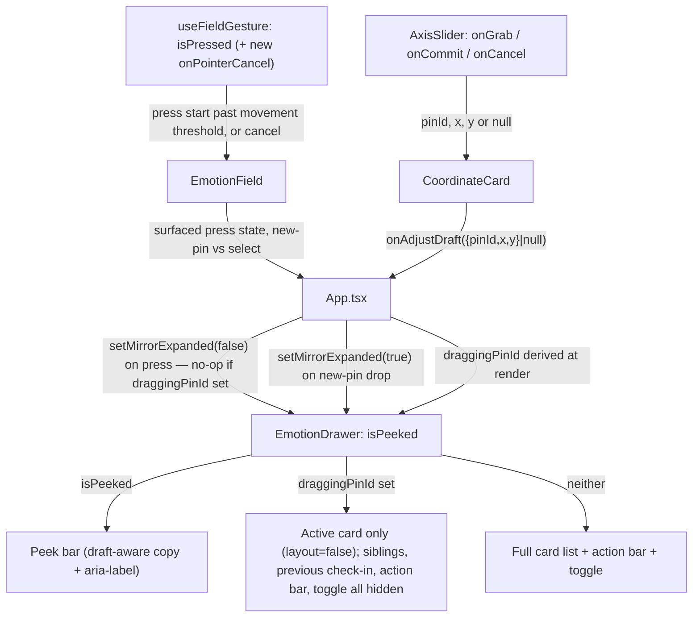

# Draft Tray Peek

## Summary

Extend the mobile bottom sheet's peek/collapse mechanism so it's reachable whenever the draft has pins, not only when empty — driven by two gestures that already exist but currently fight the tray: placing a new pin on the field, and adjusting an existing pin's position with a card slider. Both peek the tray for the duration of their gesture and restore it afterward, reusing the sheet's existing collapse machinery rather than inventing a new one.

## Problem Frame

`EmotionDrawer.tsx`'s sheet variant has a peek/collapse toggle (`isPeeked`, `EmotionDrawer.tsx:555`) built for the empty-draft "returning mirror" state. It's gated to `!canSave` (`pins.length === 0`) — the moment a pin exists, the toggle disappears and the sheet is stuck at `maxHeight: 46vh` (`EmotionDrawer.tsx:651`), permanently covering the bottom band of the field. That band is exactly where the field's live adjust-drag ghost/travel preview (`adjustDraft`, `App.tsx:81`) renders when a user drags a card slider to reposition a pin — so the one moment a first-time tracker most needs to see spatial feedback is the one moment the field is hidden (see origin doc's Problem Frame).

Planning surfaced two things beyond the origin doc's scope, both confirmed directly with the user during this planning session rather than assumed. First, the field's own new-pin-placement gesture (`useFieldGesture.ts`, press-and-drag to drop a pin) has the identical problem — the tray covers the field during placement too — and shares the exact same underlying mechanism, so it's folded in here. Second, reusing the tray's collapse state (`mirrorExpanded`) for a non-empty draft collides with an existing guard: `App.tsx:452-461`'s field-press-dismisses-tray handler fires on *any* field press while the tray is expanded, unconditional on draft state. Once the tray commonly sits expanded with pins present (the new default), that guard would eat the very first tap of every subsequent pin drop — a regression this plan closes as part of the same change.

## Key Technical Decisions

- **Reuse `mirrorExpanded`/`onToggle`/`isPeeked` for toggle availability, widening the gate.** `isPeeked` drops its `!canSave` clause (`!isReopened && !expanded` instead of `!isReopened && !canSave && !expanded`) so the same state and toggle serve both the empty-mirror and active-draft cases — no new state for this part.
- **The field's new-pin-placement press drives `mirrorExpanded` directly, gated on movement and on no active slider drag.** `useFieldGesture`'s `isPressed` (currently computed but never surfaced past the hook) is exposed upward through `EmotionField` to `App.tsx`. Two guards keep this safe: (1) the collapse only fires once the gesture crosses a small movement threshold, not on raw pointer-down — an ordinary tap-to-place-a-pin never triggers a visible collapse-then-reexpand flicker, mirroring the tap/drag distinction `useGesturePin.ts`'s `TAP_MAX_MOVEMENT` already draws for a different gesture; (2) the collapse call is a no-op whenever `draggingPinId` (below) is already set, so a second finger touching the field mid-slider-drag can never flip `mirrorExpanded` out from under an in-progress card drag. Re-expansion fires specifically when the press mints a *new* pin — not when it selects an existing one, since `EmotionField` already distinguishes these two release outcomes via separate `onPinRelease`/`onPinSelect` callbacks.
- **Slider-driven adjustment shrinks the card list to just the active card — it does not route through `isPeeked`.** Collapsing the whole sheet to the peek bar would unmount the `CoordinateCard` (and its `AxisSlider`) the user's finger is on mid-gesture. Instead, a new `draggingPinId: string | null` derived state (in `App.tsx`) drives `EmotionDrawer` to hide sibling cards, the returning-summary block, the previous-check-in's read-only card group, and the action bar, while keeping the active card mounted and in place.
- **Extend the existing `onAdjustDraft` payload with the pin id rather than adding a second callback.** `onAdjustDraft` currently carries `{x,y}|null` only (`CoordinateCard.tsx:296-335`), with no way for `App.tsx` to know *which* pin is being dragged. Widening it to `{pinId,x,y}|null` gives `App.tsx` one signal to derive `draggingPinId` from, instead of wiring a parallel `onDragStateChange` alongside it.
- **`draggingPinId` and the field's own press state both clear on cancel exactly like commit/release.** Per the existing lesson behind commit `e88860a` (an interrupted `AxisSlider` drag must revert, not commit), `draggingPinId` is threaded through `onGrab`/`onCommit`/`onCancel` uniformly. `useFieldGesture` currently has no `onPointerCancel` handling at all (unlike `AxisSlider`, which already handles this exact class of interruption) — this plan adds one, mirroring `AxisSlider`'s handler, so a lost pointer capture during pin placement resets `isPressed` and restores the tray instead of leaving it stuck peeked.
- **Sibling content hides by leaving the rendered tree, not by CSS-hiding while mounted — and the active card opts out of the resulting layout reflow.** Removing content (not just visually hiding it) is what actually shrinks the sheet's rendered height during a drag (consistent with the 2026-07-31 collapsible-tray precedent that a collapse must shrink the box, not just visually offset it) — a CSS-only hide would leave the sheet's `stopPropagation` footprint unchanged and defeat the point. Every card wrapper carries framer-motion's `layout` prop, so removing siblings would otherwise animate the still-mounted active card into the vacated space mid-drag — the exact "moving the active control mid-gesture" failure the origin doc rejected the floating-slider approach to avoid. The active card's wrapper sets `layout={false}` for the duration of the drag so it never repositions. The sheet's scroll container's scroll offset is captured before the shrink and restored after, so a user who had scrolled down to a card doesn't get silently returned to the top when siblings temporarily leave the list. Accepted trade-off, independent of the above: a genuinely simultaneous second-finger drag on a different card, exactly as siblings are removed, could lose that gesture's own cancel cleanup and leave a stale ghost-preview artifact on the field until the next slider interaction overwrites or clears it. Not engineered around — a real fix would mean tracking every pin's in-flight drag state independently of whether its card is visible, disproportionate to how rarely two sliders would be dragged in the same instant.
- **The in-sheet toggle handle is disabled while a drag is active**, using the native `disabled` attribute and the same dimmed treatment already applied to this file's other `!canSave`-gated buttons — not just an inert `onClick`. Otherwise a second-finger tap on it flips `mirrorExpanded` and routes into the true `isPeeked` branch, unmounting the active card — the same failure the previous two decisions guard against, reachable through a third door.
- **The field-press dismiss guard is rescoped from `mirrorExpanded` to `showMirror`.** It now only fires for the passive, empty-draft mirror it was built for; the new field-press peek (above) owns the active-draft case instead, so a second or third pin drop is never silently swallowed.
- **Peek-bar copy and its `aria-label` both branch on `pins.length > 0`, applied to both bar variants.** Both the collapsed peek bar and the in-sheet toggle handle currently hardcode "Last check-in" + `timeLabel` in their visible copy *and* in a separate hardcoded `aria-label` ("Expand/Collapse last check-in") — both surfaces get a draft-in-progress variant, or a screen-reader user hears the same "history" mislabeling the visible-copy fix was written to prevent. Resolved copy: **"Draft"** with a pin count when there's more than one (e.g. "Draft · 1 pin" / "Draft · 3 pins"), replacing "Last check-in" + `timeLabel` outright rather than leaving the exact text to implementation.
- **Delivery is one unit, not five independently-shippable ones.** U1, U2, and U3 exist to close a single regression together — U2's guard fix has no effect on its own, and U3's field-press peek is silently swallowed by the un-rescoped guard unless U2 has already landed. Each of U1-U3 states this explicitly in its own Goal, not only in Risks & Dependencies, so the constraint survives being read unit-by-unit rather than only as a plan-wide risk note.

## Requirements

**Toggle availability**

- R1. The peek toggle is reachable whenever the sheet-variant tray shows a draft with pins, not only when the draft is empty.
- R2. Toggling to peek reveals the field beneath, including the band the expanded tray would otherwise cover.
- R3. The reopened-check-in edit flow (`isReopened`) keeps its own Discard Edit / Update Check-in controls and never gains this toggle.

**Placing a new pin**

- R4. Pressing and dragging on the field to place or select a pin collapses the tray to the peek state for the duration of that gesture, regardless of the toggle's current state.
- R5. Completing a *new*-pin placement (the release mints a fresh pin) re-expands the tray to the full card list — every drop, not only the first.
- R6. Completing a press that instead selects an *existing* pin does not force the tray back open.
- R14. A plain tap (press-release with no meaningful movement) to place or select a pin never visibly collapses-then-reexpands the tray — the field-press peek only engages once the gesture crosses a small movement threshold.
- R15. The field-press peek is a no-op whenever a slider drag is already active, so a second touch on the field can never flip the tray state out from under an in-progress card drag.

**Adjusting an existing pin**

- R7. While a card slider is actively dragged, sibling pin cards, the returning-summary block, the previous-check-in's read-only card group, and the action bar all hide, leaving only the actively-dragged card mounted and visible.
- R8. The in-sheet toggle handle is unavailable, with a visible disabled affordance, for the duration of an active slider drag.
- R9. A cancelled slider drag (lost pointer capture, interrupted gesture) restores everything hidden by R7 exactly like a normal release.
- R10. Releasing a slider drag restores everything hidden by R7, not the peeked state.

**Defaults and existing-behavior preservation**

- R11. The tray's default state on a fresh pin drop is fully expanded, guaranteed by R5 rather than left to accident.
- R12. The field's pre-existing press-dismisses-expanded-tray guard no longer intercepts a field press once the draft has pins — R4 owns that gesture instead — so a pin drop is never silently swallowed as a dismiss tap.

**Peek bar content**

- R13. Both the collapsed peek bar and the in-sheet toggle handle show draft-in-progress copy instead of "Last check-in" whenever the draft has pins.
- R16. Each bar variant's `aria-label` reflects the same draft-in-progress vs. last-check-in distinction as its visible copy.

## High-Level Technical Design

Two independent gesture sources drive the same collapse state (`mirrorExpanded`) plus one new pin-scoped state (`draggingPinId`); `EmotionDrawer` reads both to decide what to render. The two sources are mutually exclusive by construction — the field-press path is a no-op whenever `draggingPinId` is set — so only one can be actively collapsing the tray at a time.

## Implementation Units

### U1. Widen the peek toggle to a non-empty draft

**Goal:** Make the existing peek/collapse toggle reachable whenever the draft has pins, and give both its bar variants draft-aware copy and `aria-label`. **Ships together with U2 and U3** — on its own, this unit reintroduces the R12 regression (see Risks & Dependencies).

**Requirements:** R1, R2, R3, R13, R16

**Dependencies:** none

**Files:**
- `src/components/EmotionPreview/EmotionDrawer.tsx`

**Approach:** Drop `!canSave` from `isPeeked`'s condition (`:555`) so it becomes `!isReopened && !expanded`. Widen the in-sheet toggle handle's render gate (`:657`) from `!isReopened && !canSave` to `!isReopened`. Both bar variants hardcode "Last check-in" + `timeLabel` in their visible copy (`:606-612`, `:685-691`) and a separate hardcoded `aria-label` ("Expand/Collapse last check-in") on their button elements — branch both the visible copy and the `aria-label` on `pins.length > 0`, replacing them with "Draft" plus a pin count above one (e.g. "Draft · 3 pins") per the resolved KTD. Rewrite the comment blocks at `:542-554` and `:630-639` that currently assert the old `!canSave`/`previousCheckIn`-present invariants as guarantees — they no longer hold once this gate widens, and the peeked-with-draft render path needs its own null-safe handling of `previousCheckIn`/`timeLabel` (both can now be null when peeking a draft with no prior check-in history).

**Patterns to follow:** The existing `isPeeked` derivation and `mirrorExpanded`/`onToggle` plumbing (`App.tsx:87, 570-571`) — no new state, only a wider condition.

**Test scenarios:**
- Happy path: draft has 2 pins, `isReopened` false — toggle is visible and tapping it collapses to the peek bar showing "Draft · 2 pins"; tapping again (or the peek bar itself) expands back to the full list.
- Happy path: draft is empty, `previousCheckIn` present — existing peeked-mirror behavior and copy are unchanged (regression check).
- Edge case: draft has pins but no prior check-in history (`previousCheckIn` null) — peeked bar renders draft-aware copy without crashing on a null `timeLabel`.
- Integration: `isReopened` true — neither bar variant renders the generic toggle; `editingSection`'s own Discard Edit / Update Check-in controls are unaffected.
- Accessibility: with a screen reader (or by inspecting the DOM), confirm the toggle's `aria-label` says "Draft" while pins are present, not "last check-in."

**Verification:** Manual/browser check per `AGENTS.md`'s testing split (no component-test harness) — confirm both bar variants show correct copy and `aria-label`, and the toggle correctly gates on `isReopened` alone.

---

### U2. Rescope the field-press dismiss guard

**Goal:** Stop the tray's existing "any field press dismisses the expanded tray" guard from swallowing pin-drop taps once the draft has pins. **Ships together with U1 and U3** — this unit has no observable effect until U1 lands, and U3 depends on this unit landing first.

**Requirements:** R12

**Dependencies:** U1 (the regression this fixes only becomes reachable once U1 makes peek — and therefore an expanded, pins-present tray — the common state)

**Files:**
- `src/App.tsx`

**Approach:** Change the `onPointerDownCapture` handler's dismiss condition (`:452-461`) from checking `mirrorExpanded` alone to checking `showMirror` (the existing empty-draft/previous-check-in flag, `:200`). The guard's job — dismiss the passive mirror on any field touch — stays exactly as-is for the empty-draft case; it simply stops firing once the draft has pins, where U3's field-press peek (below) takes over that gesture instead.

**Patterns to follow:** `showMirror`'s existing definition and the render-phase "derive rather than reconcile in an effect" convention `AGENTS.md:26` already applies to this file's state resets.

**Test scenarios:**
- Happy path: draft has 1 pin, tray expanded — pressing the field to place pin #2 registers the drop on the first press, not the second.
- Regression: draft empty, mirror expanded (`showMirror` true) — a field press still dismisses the mirror without dropping a pin, exactly as today.
- Edge case: draft has pins, tray manually peeked via U1's toggle then a field press starts a new pin drop — guard does not interfere (it's already scoped out for non-`showMirror` states).

**Verification:** Manual/browser check — drop two pins in sequence on mobile with the tray expanded between drops; both register on their first press.

---

### U3. Field-press peek during new-pin placement

**Goal:** Peek the tray for the duration of the field's press-and-drag pin-placement gesture, only once real movement occurs, only when no slider drag is already active, and re-expand it specifically when the gesture mints a new pin. **Ships together with U1 and U2** — the old dismiss guard (pre-U2) would otherwise intercept the press before this unit's logic ever runs.

**Requirements:** R4, R5, R6, R14, R15

**Dependencies:** U1, U2 (U2's guard fix must land first or together — otherwise the old guard intercepts the press before this unit's logic ever sees it)

**Files:**
- `src/hooks/useFieldGesture.ts`
- `src/components/EmotionField/EmotionField.tsx`
- `src/App.tsx`

**Approach:** `useFieldGesture` already computes `isPressed` (`:36`) but the hook's caller never receives it — only `isRevealed`, `revealCenter`, `dwellCenter`, and `handlers` are destructured in `EmotionField.tsx:126`. Surface it: either return `isPressed` for `EmotionField` to forward via a new prop (e.g. `onPressChange(pressed: boolean)`), or have `EmotionField` call a new prop directly from inside its existing `onPointerDown`/`onPointerMove`/`onPointerUp` wiring. Gate the collapse call on two conditions before it reaches `App.tsx`'s `setMirrorExpanded(false)`: (1) accumulated movement since press-start exceeds a small threshold (mirror `useGesturePin.ts`'s existing `TAP_MAX_MOVEMENT` tap/drag distinction rather than inventing a new one), so a plain tap never triggers the collapse at all (R14); (2) `draggingPinId` (from U4) is `null` — if a slider drag is already in progress, the field-press peek call is skipped entirely, so a second finger on the field can never unmount the actively-dragged card via this path (R15). On release, `EmotionField`'s `handleRelease` (`:98-124`) already branches between `onPinSelect` (existing pin, R6) and `onPinRelease` (new pin, R5) via its own hit-test — re-expand `mirrorExpanded` only from the `onPinRelease` path. Add a `onPointerCancel` handler to `useFieldGesture`'s `handlers` (there is none today, unlike `AxisSlider`'s equivalent handling) that resets `isPressedRef`/`isPressed` the same way a normal release would, so an interrupted press-drag (OS gesture, notification, palm on glass) doesn't leave the tray permanently peeked with no release ever having fired.

**Technical design:** Directional only — `EmotionField`'s existing `onPinRelease`/`onPinSelect` split is the natural seam; App's handler for `onPinRelease` (wherever it currently just appends to `pins`) is where the re-expand call belongs, so it fires exactly once, synchronously with pin creation, without introducing a second effect watching `isPressed`. The movement-threshold check and the `draggingPinId` check are both simple guards at the point `isPressed` would otherwise flip `mirrorExpanded` — neither requires new persistent state beyond what `useFieldGesture` already tracks (`revealCenterRef` at press-start vs. current position) plus `draggingPinId`, which U4 already derives.

**Patterns to follow:** `App.tsx:219-223`'s render-phase state-reset pattern (`mirrorWasShown`) for any transition-triggered reset this unit needs, per `AGENTS.md`'s "derive at render" convention. `useGesturePin.ts`'s `TAP_MAX_MOVEMENT` constant and tap-detection shape for R14. `CoordinateCard.tsx`'s `AxisSlider` `onPointerCancel` wiring as the direct precedent for the new cancel handler.

**Test scenarios:**
- Happy path: draft has 1 pin, tray expanded — pressing and dragging on the field past the movement threshold to place pin #2 peeks the tray; releasing over empty field space mints the pin and re-expands the tray.
- Happy path: same setup, but the release lands near an existing pin (R6) — tray stays peeked, no forced re-expand.
- Happy path (R14): a quick tap (press-release with negligible movement) to place a pin does not visibly collapse the tray at all — no flicker.
- Edge case (R15): a slider drag is already active (`draggingPinId` set) and a second finger presses the field — the tray's collapsed/expanded state is unaffected by the field press; the active card is never unmounted.
- Error path: the press is interrupted by a `pointercancel` (simulate via a system gesture or notification) instead of a normal release — the new cancel handler resets `isPressed` and the tray restores, rather than staying stuck peeked with no release ever having fired.
- Integration: `isReopened` true — this gesture is already blocked entirely for new-pin placement (per the existing "refuse a new pin drop while editing a previous check-in" fix); confirm this unit doesn't reintroduce a peek/re-expand cycle in that state.

**Verification:** Manual/browser check on a real touch device — the field is visibly uncovered during a genuine drag but never flickers on a quick tap, the tray reliably returns to expanded immediately after a new pin lands, and a cancelled press doesn't leave the tray stuck peeked.

---

### U4. Pin-scoped drag signal

**Goal:** Give `App.tsx` a `pinId`-aware signal for "which card's slider is currently being dragged," clearing correctly on both commit and cancel.

**Requirements:** Groundwork for R7-R10, R15

**Dependencies:** none

**Files:**
- `src/components/EmotionPreview/CoordinateCard.tsx`
- `src/components/EmotionPreview/EmotionDrawer.tsx`
- `src/App.tsx`

**Approach:** Widen `onAdjustDraft`'s payload from `{x,y}|null` to `{pinId,x,y}|null` (or equivalent) and thread `pin.id` through `dragAxis`, `cancelAxis`, and `commitAxis` (`CoordinateCard.tsx:296-335`) uniformly, so grab, commit, and cancel all report the same shape. `EmotionDrawer` forwards the widened callback unchanged (it already passes `onAdjustDraft` straight through to every `CoordinateCard`, `:264,303,319,485`). `App.tsx` derives `draggingPinId` at render from this one signal — no new `useEffect`.

**Execution note:** Verify the cancel path explicitly (a real interrupted drag, not just a normal release) before considering this unit done — per the `e88860a` lesson, this is exactly the path most likely to be overlooked.

**Patterns to follow:** `App.tsx:224-233`'s `resolveActiveSelection`, `AGENTS.md`'s named reference for deriving state at render.

**Test scenarios:**
- Happy path: drag pin B's X slider — `draggingPinId` becomes `pin-B`'s id for the duration, `null` again after release.
- Edge case: drag two axes on the same card in quick succession (X then Y without releasing) — `draggingPinId` stays stable at that one pin's id throughout, matching the existing `draftRef` simultaneous-axis handling.
- Error path: simulate a lost pointer capture mid-drag (`onPointerCancel`) — `draggingPinId` clears to `null` via the same path as a normal commit, not left stuck.

**Verification:** Manual/browser check — drag, release, and separately drag-and-cancel (e.g. via a system gesture that steals the pointer), confirming the signal clears in both cases.

---

### U5. Shrink tray chrome during an active drag

**Goal:** While `draggingPinId` is set, hide sibling cards, the returning-summary block, the previous-check-in's read-only card group, and the action bar (leaving the active card mounted, in place, and exempt from layout reflow) and disable the in-sheet toggle; restore everything, including scroll position, on release or cancel.

**Requirements:** R7, R8, R9, R10

**Dependencies:** U1 (toggle must already be reachable with pins for R8 to have something to disable), U4 (`draggingPinId`)

**Files:**
- `src/components/EmotionPreview/EmotionDrawer.tsx`
- `src/App.tsx`

**Approach:** When `draggingPinId` is non-null: filter the array passed into the card list's `AnimatePresence` down to just that pin — removing (not CSS-hiding) siblings so the existing exit-transition machinery (`:246-253`) animates them out and the sheet's rendered height actually shrinks; also skip rendering `returningSummary` and the `previousPins` read-only card group (`:428-505`) under the same condition, since both mount in the same scroll container as the draft cards and would otherwise keep the sheet too tall to reveal much of the field for any returning user; skip rendering `actionBar`; disable the in-sheet toggle handle with the native `disabled` attribute and this file's existing dimmed-button treatment. Set the active card's `motion.div` wrapper to `layout={false}` for the duration of the drag, so framer-motion's layout animation — otherwise triggered when siblings vacate space around it — never repositions the card the user's finger is on. Capture `scrollRef.current?.scrollTop` immediately before the shrink and restore it immediately after content returns, so a user who had scrolled to reach a card isn't silently returned to the top. Restore all of the above when `draggingPinId` returns to `null` (covers both R9's cancel path and R10's normal release, since both already clear the same signal from U4).

**Technical design:** Directional — `hiddenPins = pins.filter(p => draggingPinId === null || p.id === draggingPinId)` feeding the existing `cardList`/`AnimatePresence` construction, with `returningSummary`/`previousPins` gated the same way, rather than a parallel rendering path. The active card's `layout` prop becomes conditional (`layout={draggingPinId === pin.id ? false : true}`) instead of the current unconditional `layout`.

**Patterns to follow:** `EmotionDrawer.tsx:279-330`'s `editingCards` per-pin membership check (`expandedPinIds.has(pin.id)`) as the closest existing precedent for "some subset of sibling cards render differently," adapted to single-id comparison here.

**Test scenarios:**
- Happy path: expanded card list with 3 pins and prior check-in history, drag pin B's slider — pins A and C's cards, the returning-summary block, the previous-check-in card group, and the action bar all exit; pin B's card, with its live slider, stays mounted in place without repositioning; on release, everything reappears.
- Happy path: same setup, tap the in-sheet toggle mid-drag — nothing happens (native `disabled`), the active card is never unmounted.
- Edge case: the card list is scrolled down before the drag starts — after release, the list returns to its pre-drag scroll position rather than snapping to the top.
- Edge case: drag pin B, then immediately (before the restore animation settles) start dragging pin B again — chrome stays shrunk throughout without visual thrashing.
- Error path: cancel the drag (lost pointer capture) instead of releasing — everything restores, including scroll position, exactly as it would on a normal release (covers R9).
- Integration: `isReopened` true, dragging a slider inside `editingSection` — this unit's hide behavior does not apply there; `editingSection`'s own layout is unaffected (R7-R10 are scoped to the ordinary draft-cards path only, consistent with R3's exclusion).

**Verification:** Manual/browser check on a touch device — the field is visibly uncovered around the dragged card's position, the active slider never glitches, jumps, or loses the gesture when siblings exit, and a cancelled drag doesn't leave the tray stuck shrunk or the list scrolled to the wrong place.

## Scope Boundaries

- The field-press-placement extension (U3) and the field-press dismiss-guard fix (U2) were both confirmed directly with the user during this planning session, not inferred unilaterally — see Problem Frame.
- Selecting an existing pin while peeked (R6) intentionally does not force the tray open and does not show the field↔card tether, since the peeked branch never renders the card list at all — confirmed with the user as the desired behavior, distinct from a new-pin drop.
- The exact copy for the draft-in-progress peek bar/handle label is resolved in this plan (see Key Technical Decisions) rather than left open, closing the question the origin doc deferred to planning.
- A genuinely simultaneous two-finger drag on two different sliders during U5's sibling removal is a known, accepted edge case (see Key Technical Decisions) — not built against.
- The in-sheet toggle re-enabling immediately when `draggingPinId` clears, slightly before the sibling-restore spring animation visually settles, is accepted as harmless — a fast re-tap in that narrow window simply re-peeks a tray that's already most of the way back to full.
- Desktop rail is unaffected by this entire plan — it docks beside the field, not over it, so none of these requirements apply there (unchanged from the origin doc's own scope boundary).

## Risks & Dependencies

- U1, U2, and U3 are sequentially coupled and must ship as a single delivery: U2's guard fix has no effect until U1 makes an expanded, pins-present tray common, and U3's field-press peek is silently swallowed by the un-rescoped guard unless U2 lands first or together. Each unit's Goal now states this explicitly so it isn't only a plan-wide note; do not merge or review U1 in isolation.
- U4 and U5 depend on getting the cancel path right (per the `e88860a` precedent) — a missed cancel case would leave the tray visibly stuck shrunk, a regression a user would notice immediately. U3 carries the equivalent risk for the field-press gesture, which is why it adds its own cancel handling rather than relying on release alone.
- U5's `layout={false}` exemption for the active card and its scroll-position capture/restore are both new, specific mitigations for framer-motion/scroll behavior that isn't exercised elsewhere in this codebase the same way — verify both explicitly rather than assuming the existing `AnimatePresence` patterns cover them for free.

## Sources / Research

- `src/components/EmotionPreview/EmotionDrawer.tsx:126,174-227,428-505,542-627,630-709` — `canSave`, action bar, `returningSummary`/`previousPins`, the peeked and full-sheet render branches.
- `src/App.tsx:79-90,200-233,326-328,452-461,570-571` — `mirrorExpanded`, `adjustDraft`/`handleAdjustDraft`, `showMirror`, the render-phase `mirrorWasShown` reset, the field-press dismiss guard, `resolveActiveSelection`.
- `src/components/EmotionPreview/CoordinateCard.tsx:91-95,296-335` — `AxisSlider`'s live-value computation from `trackRef`, `draft`/`draftRef`, `dragAxis`/`cancelAxis`/`commitAxis`, and its existing `onPointerCancel` handling (the precedent for U3's new field-gesture cancel handler).
- `src/hooks/useFieldGesture.ts:36,110-166` — `isPressed`, the press/move/release handlers (no `onPointerCancel` today), `handleRelease`'s new-pin-vs-select hit-test consumed by `EmotionField.tsx:98-124`.
- `src/hooks/useGesturePin.ts` — `TAP_MAX_MOVEMENT`, the existing tap/drag distinction U3's movement-threshold gating mirrors.
- Commit `e88860a` — the `onPointerCancel` fix establishing that an interrupted drag must revert, not commit; the precedent for U3/U4/U5's cancel handling.
- `docs/plans/2026-07-31-001-feat-collapsible-checkin-tray-plan.md:42-48` — "collapse must shrink the box, not just translate it," the precedent behind U5's remove-don't-hide approach.
- `docs/plans/2026-08-04-001-feat-adjustable-pin-card-plan.md` (KTD3, KTD7) — the original `onAdjustDraft` shape and this repo's manual/browser verification convention for interaction-only units.
- `docs/brainstorms/2026-08-20-draft-tray-peek-requirements.md` — origin document for R1-R3, R7, R10, R11, R13 and the underlying problem frame. R4-R6, R8, R9, R12, R14, R15, and R16 are new discoveries from this planning session, not carried from the origin.
