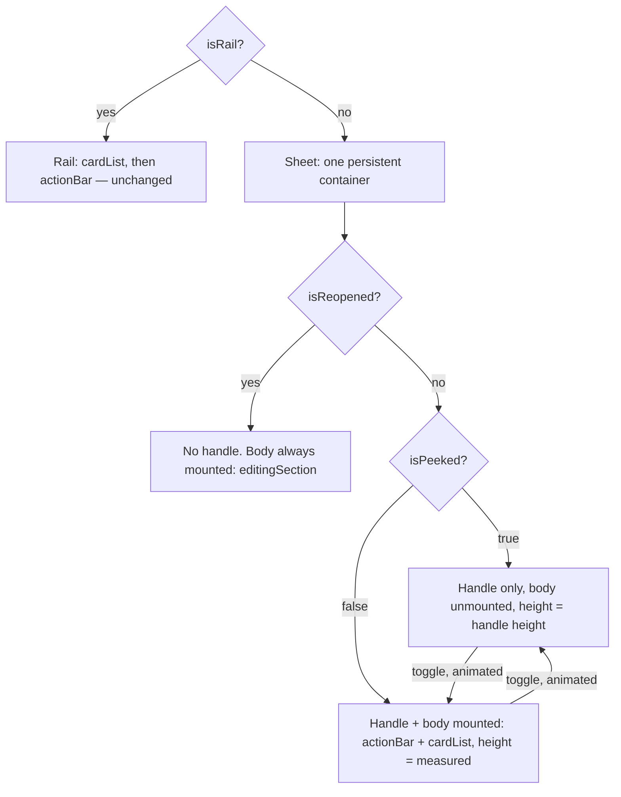

# fix: Mobile Draft Tray Layout and Peek Animation

## Summary

Three mobile-only (sheet variant) fixes to `EmotionDrawer`: hide
previous-check-in content once a fresh draft has pins so the draft renders
at the top; move Discard Draft / Save to a bottom-pinned bar; and animate
the peek ⇄ expanded transition instead of snapping between them.

## Problem Frame

`EmotionDrawer`'s sheet variant renders, in order, a returning-summary
block (relative time + "Recent rhythm" strip), the previous check-in's
read-only cards, then the draft's own cards
(`src/components/EmotionPreview/EmotionDrawer.tsx:452-532`). The moment a
mobile user drops their first pin, the new draft card lands below all of
that historical content, requiring a scroll to see it.

The action bar (Discard Draft / Save,
`src/components/EmotionPreview/EmotionDrawer.tsx:187-242`) renders before
the card list on the sheet (`:741-742`) but after it on the rail
(`:561/:564`), where it's already pinned to the bottom via
`cardList`'s `flex: 1; overflow-y: auto` layout.

The peek ⇄ expanded toggle (`isPeeked`, `:581`) is two structurally
separate `motion.div` returns (peeked `:590-661`, expanded `:673-744`) with
no shared layout between them. Toggling `isPeeked` swaps which subtree
mounts; each independently replays its own mount-only enter animation, so
the height change between the 52px peek bar and the 46vh expanded sheet
snaps rather than animates.

All three fixes are scoped to the sheet variant only. The rail docks
beside the field rather than over it, has no history-occlusion problem,
and already places its action bar after the card list.

## Key Technical Decisions

- **The history-hide condition excludes `isReopened`.** The origin
  document's "once the draft has pins" reads literally as `canSave`
  (`pins.length > 0`), but `canSave` is also true while editing a
  previous check-in in place (`isReopened`), where `pins` holds the whole
  reopened check-in rather than a fresh draft. The returning-summary block
  is deliberately kept visible throughout an edit today
  (`EmotionDrawer.tsx:167-172`), specifically so editing doesn't make it
  disappear. The new hide condition is `!isRail && !isReopened && canSave`
  — this preserves that existing, commented behavior rather than silently
  breaking it. (See AE4.)
- **Consolidate the mid-drag hide into the new, broader condition rather
  than layering a second guard.** `dragShrinkActive` (`:135`) already
  hides the returning-summary and previous-check-in blocks, but only
  while a slider drag is active — a strict subset of the new
  `!isRail && !isReopened && canSave` condition (a drag can only be active
  on a card that's already in the draft, which means the draft already
  has pins). `dragShrinkActive` keeps its other three responsibilities
  unchanged — filtering `visibleDraftPins` (`:264-266`), hiding the action
  bar during a drag, and dimming/disabling the toggle handle — none of
  which this plan touches.
- **Animate the peek ⇄ expand transition with a persistent container and
  measured height, not `layout` or `layoutId`.** `CoordinateCard.tsx`
  already solved the adjacent problem — animating a container's height
  around content that changes shape — with a `ResizeObserver` measuring a
  real DOM node into state, and a wrapping `motion.div` animating
  `height` with `overflow: hidden` (`CoordinateCard.tsx:232-242,
  484-487`). Its comment (`:225-231`) explains why framer-motion's
  `layout` prop was rejected: it re-measures only on the owning
  component's own re-render and animates via a scaling transform rather
  than a real layout reflow — both problems would recur here.
  `layoutId`-based shared-element transitions have no precedent anywhere
  in `src/` and would be a new idiom for one call site. The
  ResizeObserver-plus-animated-height approach is a direct extension of
  an already-established pattern in a sibling component.
- **Measure height once per transition, not continuously.** Leaving a
  `ResizeObserver` running against the mounted body for as long as it's
  expanded would turn every pin add/remove into an unintended sheet-level
  height animation, and would double up with `CoordinateCard`'s own
  per-card height animation reacting to the same DOM change. The
  measurement fires once, at the moment `isPeeked` toggles, to capture
  the transition's target height; once the transition settles into the
  expanded state, the container drops the JS-driven height and reverts to
  today's static `maxHeight: '46vh'`. This also keeps `cardList`'s
  `flex: 1; overflow-y: auto` (R6) working against a normal bounded
  ancestor at rest, rather than an ancestor sized to its own content.
- **The handle button persists across the toggle; only the action bar and
  card list mount/unmount.** Unmounting the handle itself on every toggle
  would drop keyboard/screen-reader focus from the control the user just
  activated, and would leave no persistent trigger to expand from peeked.
  Only its `aria-expanded`/`aria-label` text and chevron rotation vary
  with `isPeeked`. The handle still never renders while `isReopened`,
  matching the current `{!isReopened && (...)}` guard — the merge changes
  how the peek/expand transition animates, not when the handle appears.
- **Reuse the sheet's existing spring and reduced-motion gating rather
  than new constants.** The bottom-sheet mount/unmount transitions in
  this file already use `{ type: 'spring', stiffness: 300, damping: 35 }`
  (`:549, :596, :678`) and gate secondary motion (the chevron rotation) on
  `useReducedMotion` via `reduce ? { duration: 0 } : { duration: 0.25,
  ease: 'easeOut' }` (`:651`). The new height animation follows both
  conventions instead of introducing new timing values — this codebase
  has no shared spring-constants module; every call site hardcodes its
  own, so consistency comes from copying the neighboring value, not from
  a new shared file.
- **At rest, the peeked state's real DOM footprint must equal the
  handle's height — not a hidden-but-present larger box.** The original
  collapsible-tray design deliberately unmounts the sheet's body (rather
  than just translating or fading it) because the sheet's `onPointerDown`
  `stopPropagation` dead zone equals its rendered box; an
  animation that only visually compresses a still-present, still-sized
  body would leave a larger dead zone over the field than today. The new
  persistent container must unmount the body content (action bar + card
  list) once the collapse animation completes, the same way the current
  two-branch structure does by construction.

## High-Level Technical Design

The render decision tree collapses `isPeeked` and the expanded case into
one persistent container (still a separate return for `isRail`, unchanged).
The handle only ever appears on the `isReopened: no` side of the tree:



Directional sketch of the container shape (not implementation-ready):

```text
<motion.div style={sharedSheetStyle} animate={{ height: targetHeight }}
            transition={reduce ? { duration: 0 } : SHEET_SPRING}>
  {!isReopened && handleButton /* persistent; aria-expanded and chevron
                                   rotation vary with isPeeked, never
                                   unmounted by the toggle */}
  <AnimatePresence onExitComplete={handleBodyFullyHidden}>
    {bodyVisible && (
      <motion.div key="body" ref={bodyRef} exit={{ opacity: 0 }}>
        {isReopened ? editingSection : <>{actionBar}{cardList}</>}
      </motion.div>
    )}
  </AnimatePresence>
</motion.div>
```

`targetHeight` is measured once, at the moment `isPeeked` toggles — the
handle's own height (when it renders) plus the about-to-be-shown body's
natural height, clamped to `46vh` — not a `ResizeObserver` left running
continuously against the mounted body (see Key Technical Decisions).
Once the expand transition settles, the container drops the JS-driven
height and returns to today's static `maxHeight: '46vh'`, so `cardList`'s
`flex: 1` keeps a normal bounded ancestor at rest. Collapsing reverses
this: animate from the settled height down to the handle's fixed height,
then unmount the body (`onExitComplete`) once both the height shrink and
the body's fade have finished, so the peeked-at-rest DOM has no lingering
body node — mirroring `CoordinateCard.tsx`'s `captionHeight` pattern,
adapted to measure once per transition rather than continuously.
`bodyVisible` is `isReopened || !isPeeked`, matching today's `isPeeked`
semantics.

## Requirements

**History visibility with an active draft**

- R1. On the sheet variant, once a fresh draft (not a reopened check-in —
  see Key Technical Decisions) has any pins, the returning-summary block
  and the previous check-in's read-only pin cards both stop rendering.
- R2. The hide in R1 persists for as long as the draft has pins — there is
  no control to reveal the previous check-in's content again until the
  draft is saved or discarded.
- R3. With previous-check-in content hidden, the draft's own cards render
  as the top (and only) content in the sheet's scrollable card list.
- R4. The rail is unaffected by R1-R3: it keeps showing the previous
  check-in's group and the draft group side by side, as today.

**Action bar placement**

- R5. On the sheet variant, Discard Draft and Save render in a bar after
  the scrollable card list, not before it — matching the rail's existing
  placement.
- R6. The action bar stays pinned at the bottom of the sheet's visible area
  regardless of how many cards are in the list; the card list, not the
  action bar, is what scrolls.
- R7. Reopened-check-in editing (`isReopened`) is unaffected — its own
  local Discard Edit / Update Check-in row inside `editingSection` keeps
  its current position.

**Peek/expand transition animation**

- R8. Toggling between peeked and expanded on the sheet animates the
  height and position change rather than snapping between the two states.
- R9. The animation applies in both directions: collapsing to peek and
  expanding from peek.
- R10. The animation respects reduced-motion preference, consistent with
  the chevron rotation and other motion already gated on
  `useReducedMotion` in this component.

## Implementation Units

### U1. Hide previous-check-in content once a fresh draft has pins

- **Goal:** Replace the drag-only hide condition with a broader
  `!isRail && !isReopened && canSave` condition covering any fresh draft
  with pins, and remove the now-redundant narrower usage.
- **Requirements:** R1, R2, R3, R4
- **Dependencies:** None
- **Files:** `src/components/EmotionPreview/EmotionDrawer.tsx`
- **Approach:** Introduce a `hideHistory` value (`!isRail && !isReopened
  && canSave`) near the existing `dragShrinkActive` definition (`:135`).
  Replace the `!dragShrinkActive &&` guards on `returningSummary` (`:472`)
  and the previous-check-in cards block (`:488`) with `!hideHistory &&`.
  `dragShrinkActive` keeps its three other existing responsibilities
  (`visibleDraftPins` filtering at `:264-266`, action-bar hide, and
  handle disable/dim) unchanged — this unit does not touch those. Since
  `dragShrinkActive` implies `hideHistory` whenever it's true (a drag can
  only happen on a card already in the draft), no drag-time behavior
  regresses.
- **Patterns to follow:** The existing `dragShrinkActive` comment
  (`:256-263`) on removing content from the render tree rather than
  CSS-hiding it, so `AnimatePresence` exit transitions still fire and the
  sheet's real rendered height shrinks.
- **Test scenarios:**
  - Test expectation: none — presentational/layout change with no new
    pure-logic branch point; this repo has no component-test harness
    (`AGENTS.md`). Verify manually per AE1 and AE4.
- **Verification:** On a mobile viewport, dropping the first pin into an
  empty draft hides the returning-summary block and previous check-in
  cards, leaving only the new draft card. Reopening a previous check-in
  for editing still shows the returning-summary block, matching current
  behavior.

### U2. Move the action bar below the card list on the sheet

- **Goal:** Match the rail's existing layout — the card list scrolls, the
  action bar is a fixed sibling after it.
- **Requirements:** R5, R6, R7
- **Dependencies:** None
- **Files:** `src/components/EmotionPreview/EmotionDrawer.tsx`
- **Approach:** In the sheet's expanded-branch JSX (`:673-744`,
  specifically the handle-button-through-`cardList` inner content at
  `:690-742`), move the `{!isReopened && !dragShrinkActive && actionBar}` block to after
  `{cardList}` instead of before it. No style changes are needed —
  `cardList`'s existing `flex: 1; overflow-y: auto` (`:456-464`) already
  makes it the scrollable region, so the action bar naturally pins below
  it in the same flex column, mirroring the rail (`:561/:564`).
- **Patterns to follow:** `src/components/EmotionPreview/EmotionDrawer.tsx:543-566`
  (rail's existing `cardList` → `actionBar` order).
- **Test scenarios:**
  - Test expectation: none — presentational reordering with no new
    pure-logic branch point; this repo has no component-test harness
    (`AGENTS.md`). Verify manually per AE2.
- **Verification:** With 3+ draft pins on a mobile viewport, scrolling the
  card list up and down leaves Discard Draft / Save fixed at the bottom
  of the sheet.

### U3. Animate the peek ⇄ expand transition

- **Goal:** Merge the peeked and expanded sheet branches into one
  persistent container with an animated height, so toggling between them
  animates instead of snapping, while preserving the peeked state's
  genuinely small `stopPropagation` footprint at rest.
- **Requirements:** R8, R9, R10
- **Dependencies:** U1, U2 (land after so the container inherits their
  already-corrected content order rather than needing a second pass)
- **Files:** `src/components/EmotionPreview/EmotionDrawer.tsx`
- **Approach:** Replace the two early returns at `:590-661` (peeked) and
  `:673-744` (expanded) with a single `motion.div` that stays mounted
  whenever `!isRail`. The handle button is a persistent element inside it
  — never unmounted by the toggle, never rendered at all while
  `isReopened` (matching the current `{!isReopened && (...)}` guard) —
  with only its `aria-expanded`/`aria-label` and chevron rotation varying
  with `isPeeked`. The body (action bar + card list, or `editingSection`
  while `isReopened`) mounts/unmounts via `AnimatePresence` based on
  `isReopened || !isPeeked` (today's effective "show body" condition).
  Drive the container's `height` from a measurement taken once at the
  moment `isPeeked` toggles — handle height plus the about-to-be-shown
  body's natural height, clamped to `46vh` — following
  `CoordinateCard.tsx:232-242`'s pattern; not a `ResizeObserver` left
  running continuously against the mounted body, which would turn every
  pin add/remove while already expanded into an unwanted height
  animation and would break `cardList`'s bounded-ancestor assumption for
  `flex: 1` (R6). Once the transition settles, drop the JS-driven height
  and return to today's static `maxHeight: '46vh'`. Use the existing
  `{ stiffness: 300, damping: 35 }` spring for the height transition,
  gated by `reduce ? { duration: 0 } : ...` per `:651`'s existing
  convention. Preserve the presentational differences the two branches
  carry today (aria-label, border-radius, safe-area bottom padding)
  inside the unified structure.
- **Technical design:** See High-Level Technical Design above — directional
  only, not implementation-ready.
- **Patterns to follow:** `CoordinateCard.tsx:225-242, 484-546` (the
  established `ResizeObserver` + animated-height + `AnimatePresence`
  pattern this unit extends); the collapsible-checkin-tray plan's
  constraint that peeked must genuinely shrink the interactive box, not
  just compress it visually (`docs/plans/2026-07-31-001-feat-collapsible-checkin-tray-plan.md`).
- **Test scenarios:**
  - Test expectation: none — presentational/animation change with no new
    pure-logic branch point; this repo has no component-test harness
    (`AGENTS.md`). Verify manually per AE3.
- **Verification:** On a mobile viewport with an active draft, tapping the
  peek bar to expand and tapping the handle again to collapse both animate
  the height change smoothly in both directions. At rest in the peeked
  state, tapping the field beneath the peek bar (outside the handle)
  reaches the field, confirming the interactive footprint is genuinely
  small, not a larger hidden box. Reopening a previous check-in never
  shows a handle above `editingSection`, matching current behavior. Once
  settled in the expanded state with several pins, the card list still
  scrolls internally while Discard Draft / Save stay pinned at the bottom
  — confirming the container isn't stuck sizing itself to live content.
  With reduced-motion enabled, both transitions happen instantly.

## Acceptance Examples

- AE1. **Covers R1, R2, R3.**
  - **Given:** Draft is empty, sheet expanded, previous check-in's summary
    and cards are visible.
  - **When:** User drops the first pin.
  - **Then:** The returning-summary block and previous check-in cards stop
    rendering. The new draft card is the top (and only) item in the card
    list. They stay hidden as long as the draft holds pins, with no
    control to bring them back.

- AE2. **Covers R5, R6.**
  - **Given:** Sheet expanded with 3 draft pins, enough to require
    scrolling the card list.
  - **When:** User scrolls the card list up and down.
  - **Then:** Discard Draft and Save stay fixed at the bottom of the sheet,
    unaffected by scroll position.

- AE3. **Covers R8, R9.**
  - **Given:** Sheet peeked with an active draft.
  - **When:** User taps the peek bar to expand, then taps the handle again
    to collapse.
  - **Then:** Both transitions animate the height/position change; neither
    snaps.

- AE4. **Covers Key Technical Decisions (isReopened carve-out).**
  - **Given:** User reopens a previous check-in for editing (`isReopened`
    is true, `pins.length > 0`).
  - **When:** The sheet renders.
  - **Then:** The returning-summary block still renders, unlike a fresh
    draft — R1's hide only applies when `isReopened` is false. No
    peek/expand handle renders above `editingSection`, matching current
    behavior — U3's merge doesn't add one.

## Scope Boundaries

- Peeking back to view the previous check-in while the draft has pins —
  considered and rejected in the origin brainstorm. Fully inaccessible
  until the draft is saved or discarded.
- The mid-drag slider-shrink transition (`dragShrinkActive`'s other three
  responsibilities) — unaffected; R8-R10's animation requirement doesn't
  extend to it.
- Rail (desktop) layout — unaffected; it already places its action bar
  after the card list and has no comparable history-occlusion problem.
- No new automated tests — this repo has no component-test harness
  (`AGENTS.md`) and none of these three units introduce a new
  pure-logic branch point that would warrant extracting one.

## Risks & Dependencies

- Verification for all three units is manual/visual, not automated, per
  this repo's no-component-test-harness convention. Use the Verification
  notes and Acceptance Examples above as the manual check script.
- U3 depends on getting the "unmount at rest" behavior right — a
  height animation that leaves the body mounted-but-faded during idle
  peeked state would silently regress the interactive footprint the
  original collapsible-tray design was built to guarantee (see Key
  Technical Decisions). Confirm the peeked-at-rest DOM has no lingering
  body node, not just `opacity: 0`.
- Collapsing from expanded to peeked sequences two things that must not
  visually clip each other: the body's exit fade and the container's
  height shrink. Let the height animate down over the full spring
  duration while the body's fade finishes early within it, and unmount
  the body only after both complete — clipping a still-fading body
  mid-transition inside the shrinking, `overflow: hidden` container would
  look like a glitch rather than a collapse.

## Sources / Research

- `docs/brainstorms/2026-08-21-mobile-draft-tray-layout-requirements.md` —
  origin document (R1-R10, AE1-AE3, Key Decisions). AE4 and the Key
  Technical Decisions above are this plan's own additions, resolving
  detail the origin left to planning — not sourced from it.
- `src/components/EmotionPreview/EmotionDrawer.tsx:130-135, 264-266,
  452-532, 543-566, 581-744` — current structure of the hide condition,
  action bar placement, and peek/expand branches.
- `src/components/EmotionPreview/CoordinateCard.tsx:225-242, 484-546` —
  established `ResizeObserver` + animated-height + `AnimatePresence`
  pattern this plan extends, including the rationale for rejecting
  framer-motion's `layout` prop.
- `docs/plans/2026-07-31-001-feat-collapsible-checkin-tray-plan.md` —
  original peek mechanism; the load-bearing "collapse must shrink the
  real box, not just translate/fade it" constraint.
- `docs/plans/2026-08-20-001-feat-draft-tray-peek-plan.md` — prior work on
  this same component; the "remove from the tree, not CSS-hide" and
  scroll-position precedents.
- `AGENTS.md` — no-component-test-harness convention; the pure-logic vs.
  storage-backed testing split.
