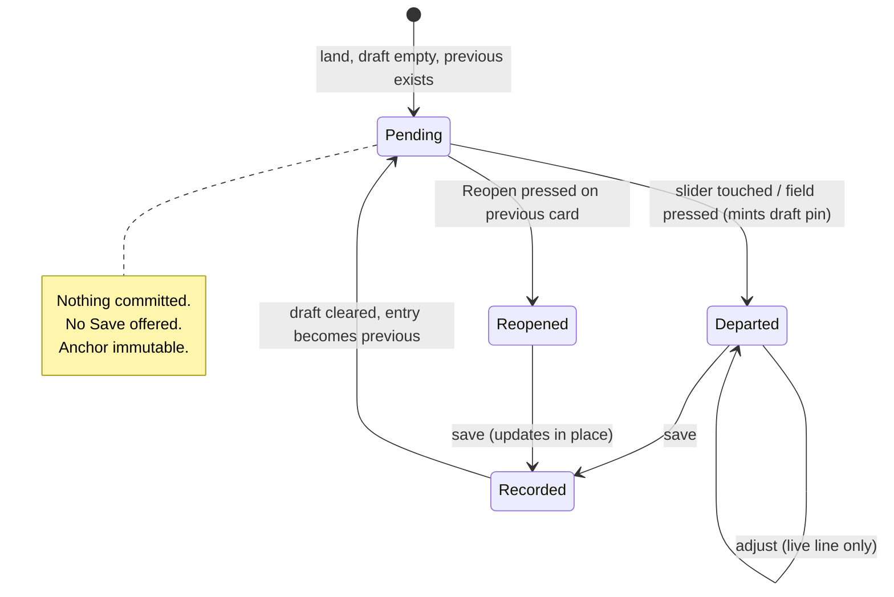

# feat: Card-first landing and the departure mark

## Summary

Give the field a handle on landing. When the draft is empty and a previous check-in exists, the check-in card renders **pre-positioned** at where you last were — sliders sitting on that coordinate, nothing committed. Touching a slider or the field **mints a new draft pin that departs from** that anchor; the previous check-in is never moved or edited by the gesture.

Alongside it, the four visual decisions that keep "you moved since Tuesday" from colliding with "you're adjusting today's pin": the previous check-in's anchor renders as a hollow cool ring with a relative-time label, the across-time connector animates once and slowly dissolves, the adjust line becomes live-only, and the card carries both an anchor tick and a plain-language delta.

---

## Problem Frame

After months of daily use the two axis sliders are still easier to orient around than the field. Landing on the field is abstract — the axis labels have to be read and mentally cross-producted before the plane means anything. No fluency has developed in that time.

The diagnosis is not that the field is complex. It is that:

1. **A slider always has a handle to react to.** The field asks the user to *generate* a coordinate rather than *adjust* one — recall instead of recognition, which is the inverse of this product's core thesis.
2. **It asks one question at a time.** The field asks both axes in a single gesture.
3. **Its labels sit on the control**, not stranded at the perimeter.

And the reason fluency never arrived: **the card only appears after the pin drop.** The interface that could teach the field's mapping is never on screen at the moment it would teach. It is a reward for having already done the hard part.

The blocker to fixing this is that the app's existing surface for "the previous check-in" is `readOnly` and offers **Reopen** — a gesture that pulls that check-in's pins into the draft and updates the record in place. Putting live sliders on that surface without care would make dragging them ambiguous with reopening, which is *literally* the overwrite the design must avoid.

---

## What Changed Since the Brainstorm

The brainstorm was written against the PR #16/#18 state of the app. Substantial work landed in PRs #19–#25 (the check-in unit-of-record and draft-tray series) that this plan is grounded in instead. Correcting the record:

- **`MirrorCard.tsx` no longer exists.** The returning-user mirror and the previous check-in merged into one surface, as decided in `docs/brainstorms/2026-08-17-check-in-state-legibility-requirements.md`. The brainstorm's "promote the mirror peek" framing is stale.
- **`--ui-recorded` (`#7C93A8`) is already shipped and live** in `src/components/EmotionField/EmotionField.tsx`. The brainstorm and the prototype both describe this as an unvalidated token never seen in context — **that is no longer true.** Recorded pins already render in the cool hue, dim at rest and brightening on emphasis. This plan does not introduce the hue; it changes the mark's *shape* and adds a label.
- **Previous check-in pins already persist on the field** as read-only context (`recordedPins` prop, `App.tsx:551`), already hit-testable for selection via `findNearbyPin`.
- **`derivePreviousCheckIn`, `resolveActiveSelection`, `withOrigin`, and `adjustPin`** all already exist in `src/data/`. The state model this plan needs is largely in place.

The net effect is that this plan is **narrower and better-supported** than the brainstorm implied. The remaining work is the pre-positioned card, the mark's shape and label, the connector, and the adjust-line lifecycle.

---

## Requirements

| ID | Requirement |
|---|---|
| R1 | When the draft is empty and a previous check-in exists, the card renders pre-positioned at that check-in's anchor pin, with nothing committed. |
| R2 | Touching a slider on the pre-positioned card mints a **new draft pin** at the current slider value. It never edits, moves, or reopens the previous check-in. |
| R3 | The previous check-in's pins are immutable for the duration of this gesture. Reopen remains the only path that edits a recorded check-in, and stays an explicit, separate control. |
| R4 | The landing card offers no Save action while in departure mode — nothing is pending until a pin is minted. |
| R4a | Departure and Reopen are simultaneously available on the landing card and are not mistakable for one another. |
| R5 | The previous check-in's anchor pin renders as a hollow ring in `--ui-recorded`, carrying a relative-time label (e.g. `TUE`). |
| R6 | On commit of a draft pin, a connector animates once from the anchor to the new pin, then slowly dissolves. It is never a persistent stroke. |
| R7 | The connector carries direction (an arrowhead); the adjust line never does. Direction is what distinguishes a movement between two moments from a correction within one. |
| R8 | The adjust line and its origin ring render **only while a slider or field drag is live**, and both disappear on release. |
| R9 | The card carries an anchor tick on each slider, visually distinct from the existing origin tick, plus a plain-language delta sentence. |
| R10 | All new motion respects `prefers-reduced-motion`. |
| R11 | Connector timing is tunable through `RevealTuning` and the admin panel, matching the `captionFadeOut/Hold/FadeIn` convention. |

---

## Key Technical Decisions

**KTD1 — The pending state is a *mode of the existing landing card*, not a second card.** *(Resolved 2026-08-24 — see LC1.)*
`showMirror` (`src/App.tsx:207`) is already, in its own words, "the tray is in its peek-eligible, nothing-new-to-add state" — the exact landing state this plan targets — and `EmotionDrawer` already renders the previous check-in's card there, `readOnly` with a Reopen control. Adding a separate draft-shaped card would put two cards on screen at landing and fight that architecture.

So the pending state **adds a departure affordance to the card that already lands**, rather than introducing a new surface. The two actions on that card are distinguished by *kind and by weight*, which is a stronger separation than styling alone:

- **Departure sliders** — a continuous control, pre-positioned at the anchor with `--ui-recorded` thumbs, that mints a *new* draft pin on first touch. This is the primary, obviously-interactive thing on the card.
- **Reopen** — demoted to a plain text link *beneath* the sliders and caption, not a bordered button in the header. The header's top-right corner carries no control at all while pending — it stays empty until a pin is minted, at which point this card reverts to its ordinary collapsed summary (see U2) and a separate draft card, with its own `×` Remove, takes over.

Compared against two button-shaped treatments (Reopen as a header button, with and without an added instructional label) in a live side-by-side, this reads as the clearest: nothing button-shaped ever competes with the slider for "the thing you touch here." Reopen becomes a deliberate escape hatch you'd look for, not a peer action sitting next to a continuous control. `readOnly` semantics for the previous check-in's *pins* are untouched — the sliders never write to them.

**KTD2 — Overwriting is prevented by the mechanic, not the styling.**
Overwriting is implied by *one mark that moves*. The anchor never moves; touching a slider mints a new pin. This is the same carve-out shape as the PR #26 fix — a fallback/implicit selection must not inherit the rights of an explicit one — applied one layer up.

**KTD3 — The adjust line and the connector are separated by persistence, not by styling.**
Dashes read as *absent/past*, which is history, not a live control. The adjust line is control feedback with no job after release, so it becomes live-only. This empties the persistent-stroke slot entirely, and — verified in the prototype — leaves the committed field with **zero dashed strokes and exactly one hollow ring**. The two-hollow-rings-differing-only-by-hue problem then exists only transiently under the user's finger.

**KTD4 — The connector is a fact stated once, not a control state.**
It animates in, holds, and dissolves. A transient stroke cannot be confused with a persistent adjustment line even at identical geometry, which is why it alone earns an arrowhead. It resumes mid-dissolve via a negative animation delay rather than restarting, so re-rendering during a drag does not retrigger it.

**KTD5 — Pure logic lands in a new `src/data/departure.ts`, tested under Node.**
The repo has no test runner; pure logic is asserted by `npx tsx scripts/test-*.ts`. Delta phrasing, relative-day labelling, and anchor resolution are pure functions and belong in that seam, matching why `src/data/checkIn.ts` exists (see its file header).

---

## High-Level Technical Design

### Card lifecycle on landing

### What is drawn on the field, by state

| State | Anchor mark | Connector | Adjust line | Origin ring |
|---|---|---|---|---|
| Pending (landing) | hollow ring + label | — | — | — |
| Dragging (first mint) | hollow ring + label | — | live | live |
| Just committed | hollow ring + label | animating, then dissolving | — | — |
| Adjusting a committed pin | hollow ring + label | — | live | live |
| At rest, post-commit | hollow ring + label | — | — | — |

The bottom row is the invariant worth protecting: **at rest the field carries zero dashed strokes and exactly one hollow ring.**

---

## Implementation Units

### U1. Departure pure logic

**Goal:** The pure functions the card and field both need, in a Node-testable seam.

**Requirements:** R5, R9

**Dependencies:** none

**Files:**
- `src/data/departure.ts` (create)
- `scripts/test-departure.ts` (create)
- `package.json` (add `check:departure`)

**Approach:**
- `departureAnchor(previousCheckIn)` — which pin today departs from. Returns the check-in's **newest** pin, matching `resolveActiveSelection`'s existing case-4 fallback so the card and the field cannot disagree about which pin is the anchor.
- `describeDelta(from, to)` — the plain-language sentence. Magnitude bands on each axis (below ~0.10 omitted entirely; then "a little" / plain / "much"), joined with "and", suffixed with the relative-day label. Returns a neutral "About where you were" when both axes fall under the threshold.
- `relativeDayLabel(timestamp, now)` — `TODAY` / `YESTERDAY` / weekday abbreviation within the last week / else a coarse age. Used both for the field label and the delta sentence's tail.

**Patterns to follow:** `src/data/checkIn.ts` (pure-logic module, no storage access, heavily commented rationale); `src/data/pins.ts` (small pure transforms); `scripts/test-check-in.ts` (assert-based script, no test runner).

**Test scenarios:**
- `departureAnchor` returns the last element of a multi-pin check-in's `pins` array; returns `null` for a null check-in and for one with an empty `pins` array.
- `describeDelta` with both deltas under threshold returns the neutral "about where you were" phrasing and names no axis.
- `describeDelta` with only the arousal axis over threshold names calm/activated and omits the valence clause entirely.
- `describeDelta` band boundaries: a delta just under and just over each band edge produces the expected qualifier, asserted on both the calmer and more-activated directions.
- `describeDelta` sentence is capitalised and terminally punctuated exactly once regardless of how many clauses survive.
- `relativeDayLabel` returns `TODAY` for same-day, `YESTERDAY` for one day back, a weekday abbreviation for 2–6 days back, and does not return a weekday for 8+ days back (which would be ambiguous with the current week).
- `relativeDayLabel` across a month and a year boundary does not throw and does not return a weekday for a stale timestamp.

**Verification:** `npm run check:departure` passes; `npx tsc -b` clean.

---

### U2. Departure mode — pre-positioned sliders on the landing card

**Goal:** The landing state stops being blank. The card that already lands gains pre-positioned sliders; touching one mints a departing draft pin.

**Requirements:** R1, R2, R3, R4

**Dependencies:** U1

**Files:**
- `src/components/EmotionPreview/CoordinateCard.tsx`
- `src/components/EmotionPreview/EmotionDrawer.tsx`
- `src/App.tsx`
- `scripts/test-departure.ts` (extend)

**Approach:**
- Add a `departure` presentation to `CoordinateCard`, active when the card is `readOnly` **and** `showMirror` is true. In this mode the card gains the two axis sliders — live and interactive, thumbs in `--ui-recorded` rather than gold, because this coordinate is not yours yet — and drops the header's Reopen **button** entirely (per LC1's resolution, below). No Save, no Remove, no recognize/derecognize.
- **Reopen relocates to a plain text link beneath the sliders and caption** (e.g. "reopen this entry instead"), still calling the same `onReopen`/`reopenDisabled` props — only its position and chrome change, not its wiring. The header's top-right corner renders nothing while in departure mode. This applies only to the departure call site (`EmotionDrawer.tsx` around the previous-check-in card, currently `:632-647`); the sibling-pin "Edit" call site (`:468-470`) is a different context — no sliders compete there — and keeps its existing compact header button unchanged.
- The `readOnly` branch at `CoordinateCard.tsx:462` currently suppresses the sliders entirely. That branch is what this unit opens up — the sliders return in departure mode, driving a *new* pin rather than the recorded one.
- A new `onDepart(x, y)` callback fires on the **first** slider interaction. `App` mints a draft pin through the existing `withOrigin` path so the new pin carries its own origin metadata from birth. Subsequent drags in the same gesture route to the existing `onAdjustDraft`/`onAdjust` path — the pin already exists by then, and `showMirror` has flipped false because `pins.length` is no longer 0.
- Because `showMirror` flips on the first mint, the mode transition is automatic: departure mode exists only while there is nothing in the draft. Once a pin is minted, **this card stops rendering the departure presentation and reverts to its ordinary collapsed read-only summary** — it does not morph into the draft's card. The newly minted pin gets its own, separate draft `CoordinateCard` (non-`readOnly`, gold thumbs, its own `×` Remove) through the drawer's existing non-readOnly rendering path. No extra state is needed and none can drift.
- **Do not** touch `onReopen` or `reopenDisabled`'s semantics, and do not make the recorded pins writable. Reopen still does exactly what it always did — only where it lives on the card changes.

**Execution note:** Add the U1 anchor-resolution assertions before wiring the spawn path, so "which pin is the anchor" is settled by a passing test rather than by reading two call sites.

**Patterns to follow:** the existing `readOnly` branch in `CoordinateCard.tsx:414` and `:462` (how the card already swaps its action surface by mode); `handleAdjustPin`/`handleAdjustDraft` in `src/App.tsx:364,380` for commit-on-release; `withOrigin` in `src/data/pins.ts`.

**Test scenarios:**
- Pure: the departure-mode predicate is true only for (empty draft AND previous check-in exists); false for a non-empty draft, and false when there is no previous check-in (the first-run path is unaffected).
- Manual: departure mode ends the instant the first pin is minted — the departure card (sliders, link) is replaced by its ordinary collapsed read-only summary, and a separate gold-thumbed draft card appears for the new pin, in the same frame.
- Manual: landing with a previous check-in shows sliders sitting exactly on the anchor coordinate, with no Save offered and no button in the header's top-right corner.
- Manual: the "reopen this entry instead" link is present and reachable beneath the sliders throughout the pending state, and disabled/hidden by the same `reopenDisabled` rule as before.
- Manual: dragging a slider mints exactly one draft pin; the anchor pin does not move; the diary entry count is unchanged until Save.
- Manual: dragging a slider does **not** trigger reopen — `draftId` stays null and the previous entry is not pulled into the draft.
- Manual: pressing the field directly (rather than a slider) from the pending state also mints a pin and leaves the anchor untouched.
- Manual: after Save, the new entry becomes the previous check-in and the card returns to `pending` against the *new* anchor.
- Manual: the sibling-pin "Edit" card (`EmotionDrawer.tsx:468-470`) is unaffected — still a compact header button, no link, no sliders.
- Manual: tapping "reopen this entry instead" behaves exactly as the old Reopen button did — pulls the check-in into the draft, updates in place on save.

**Verification:** landing renders a pre-positioned card with an empty header corner; one slider drag produces exactly one new draft pin; the reopen link is unchanged in behavior; the sibling "Edit" call site is untouched; `tsc`/`eslint` clean on changed files.

---

### U3. Card delta — anchor tick and plain-language line

**Goal:** The across-time reading lives in the card, where the mapping already reads fluently.

**Requirements:** R9

**Dependencies:** U1, U2

**Files:**
- `src/components/EmotionPreview/CoordinateCard.tsx`

**Approach:**
- Add a second tick to each `AxisSlider` at the anchor's value. It must be visually distinct from the existing origin tick (`CoordinateCard.tsx:175`, `var(--ui-text-3)`) — use `--ui-recorded-dim` plus the relative-day label, so the two ticks read as *different kinds of thing* rather than two of the same. This is the exact overload the field-side decisions were made to avoid, and it must not be reintroduced here.
- Render `describeDelta` beneath the existing "Does A or B fit?" question, in `--ui-recorded`, so the across-time statement is visually grouped with the anchor rather than with the emotion question.
- Suppress the delta line when the two ticks would coincide (delta under threshold on both axes) rather than printing a degenerate sentence.

**Patterns to follow:** the existing origin tick and its `pct()` positioning in `CoordinateCard.tsx:174-176`; the slot-only dissolve pattern from PR #18 for the caption region.

**Test scenarios:**
- Pure (U1-backed): the delta sentence rendered for a known anchor/current pair matches the expected string exactly.
- Manual: both ticks are visible and distinguishable when the anchor and the drop origin differ.
- Manual: when anchor and origin coincide, the two ticks overlap without producing a visual artifact or a doubled label.
- Manual: the delta line is absent in the pending state (nothing has departed yet) and appears once a pin is minted and moved.
- Manual: a long delta sentence wraps without changing the card's height enough to shift the field's layout on mobile.

**Verification:** ticks are distinguishable; the sentence matches U1's assertions; no layout shift at 390px.

---

### U4. Anchor mark — hollow ring and relative-time label

**Goal:** The previous check-in reads as settled history and as unmistakably *another check-in*.

**Requirements:** R5

**Dependencies:** U1

**Files:**
- `src/components/EmotionField/EmotionField.tsx`

**Approach:**
- Change the anchor pin's dot (`EmotionField.tsx:623-695`) from a filled dot to a hollow ring in `--ui-recorded`.
- **Reconcile with the existing breathing halo.** That block already renders an infinitely animating 10px ring in `--ui-recorded-dim` around every recorded pin. A hollow-ring mark plus a breathing ring is two concentric rings and will read as noise. Fold them: the mark becomes the ring, and the breathing animation moves onto the mark's own opacity rather than a second element.
- Render the relative-day label on the **anchor pin only**, not on every recorded pin — a multi-pin check-in would otherwise stamp N identical labels across the field.
- Non-anchor recorded pins keep their current filled-dot treatment, which preserves the existing draft-vs-recorded distinction while letting the anchor read as the departure point specifically.

**Patterns to follow:** the recorded-pin block's existing emphasis handling and `zIndex 9` layering; `--ui-recorded` / `--ui-recorded-dim` in `src/index.css`.

**Test scenarios:**
- Manual: the anchor renders as a hollow ring, legible against a dense word cluster (the low-arousal/negative region is the hard case).
- Manual: exactly one relative-day label is on screen for a multi-pin previous check-in.
- Manual: emphasis (selecting the anchor pin) still brightens within the recorded hue and does not switch to gold.
- Manual: a draft pin dropped directly on top of the anchor still reads as the live one on top (zIndex ordering preserved).
- Manual: with `prefers-reduced-motion`, the breathing animation is suppressed and the ring renders statically.

**Verification:** one ring, one label, legible in the densest region; emphasis and layering unchanged.

---

### U5. Adjust line becomes live-only

**Goal:** Empty the persistent-stroke slot so the across-time language has it uncontested.

**Requirements:** R8

**Dependencies:** none

**Files:**
- `src/components/EmotionField/EmotionField.tsx`

**Approach:**
The adjust overlay currently renders when `moved` is true **or** while `adjustDraft` is live (`EmotionField.tsx:560-590`, guard at `:574`). Drop the `moved` branch so the overlay renders only while `adjustDraft` is non-null. The origin ring is part of that overlay, so it leaves with the stroke — which is what resolves the two-rings collision structurally rather than cosmetically.

`pin.origin` metadata is **not** removed; it remains the anchor for the live overlay and is still carried in the diary record. Only the at-rest rendering changes.

**Execution note:** This unit is independently landable and independently revertable. Consider taking it first as a small standalone change to confirm the at-rest field reads correctly before the connector is added on top.

**Test scenarios:**
- Manual: at rest after a commit, the field shows no dashed stroke and no origin ring.
- Manual: during a slider drag, the dashed line and origin ring both appear; on release, both disappear.
- Manual: during a field drag on an existing pin, same appearance and disappearance.
- Manual: cancelling a drag (pointer-cancel) removes the overlay without committing a coordinate.
- Manual: the diary record for an adjusted pin still carries its `origin` after the change.

**Verification:** at rest, zero dashed strokes and zero origin rings; `origin` still present in the recorded entry.

---

### U6. Departure connector — animate once, slow dissolve

**Goal:** Say "you moved from here" once, then leave.

**Requirements:** R6, R7, R10, R11

**Dependencies:** U1, U5 — U5 first so the connector is never added while a persistent adjust line is still competing for the same visual slot. Independent of U4: the connector needs the anchor's *coordinate*, not its mark treatment.

**Files:**
- `src/components/EmotionField/DepartureTrace.tsx` (create)
- `src/components/EmotionField/EmotionField.tsx`
- `src/config/revealTuning.ts`
- `src/admin/components/AdminRevealTuning.tsx` (add a "Departure" section alongside the existing "Check-in card" section)

**Approach:**
- An SVG chevron from the anchor to the newly committed draft pin, in `--ui-recorded`, backed off at both ends so it touches neither mark. An open chevron rather than a filled triangle — the decision was a *soft* arrow.
- Lifecycle: fade in, hold, slow fade out, then unmount. Prototype values, carried as the initial defaults: `0.5s / 1.6s / 2.6s` (4.7s total). These are starting points for Frank to tune live, not settled numbers.
- Resume mid-dissolve via a negative animation delay keyed on elapsed time, so re-rendering during a subsequent drag does not restart it.
- Fires on **commit** of a draft pin, not on every coordinate change.
- `useReducedMotion` → render the stroke statically for the hold duration, or skip it entirely; prefer skipping, since a static permanent stroke would reintroduce exactly the persistent-line overload this design removes.

**Execution note:** Verify the *lifecycle* (fires once per commit, does not retrigger on drag, unmounts cleanly) with console instrumentation inside the effect body rather than by screenshot. Per `chrome-automation-hidden-tab-raf`, the automation tab runs `document.hidden = true`, so rAF-driven and CSS animation frames do not fire there. The animation's *feel* is a real-device confirm on Frank's visible tab.

**Patterns to follow:** `src/components/EmotionField/AxisRadiance.tsx` for a one-shot keyed on a play counter with size measured synchronously — including its PR #17 lesson that keying the effect on measured size causes resize-driven restarts; `src/config/revealTuning.ts` `captionFadeOut/Hold/FadeIn` for the tuning-knob naming convention.

**Test scenarios:**
- Manual (instrumented): committing a draft pin fires the trace exactly once; adjusting that pin afterwards fires zero additional times.
- Manual (instrumented): a field resize during the dissolve does not restart or clear the trace (the PR #17 failure mode).
- Manual (instrumented): the trace unmounts after the full duration and leaves no residual node.
- Manual: with `prefers-reduced-motion`, no animated stroke is produced and nothing persistent is left behind.
- Manual: with the anchor and the new pin very close together, the chevron either suppresses cleanly or renders without overlapping either mark.
- Manual: the admin panel's Departure sliders change the observed timing.

**Verification:** one fire per commit, no retrigger on adjust, clean unmount, reduced-motion safe, timings tunable.

---

## Scope Boundaries

### In scope
The pending card, the anchor mark and label, the connector, the live-only adjust line, and the card delta — for the **single most recent** previous check-in.

### Deferred to Follow-Up Work
- **Redirecting the welcome beat** to demonstrate the card sliders instead of pulsing at the perimeter axis labels (`AxisRadiance.tsx`). This was a recommendation in the brainstorm, **not one of the four decisions Frank made**, and it is a teaching cosmetic rather than core loop. Deferred on the standing "core loop before cosmetics" rule.
- **A fading trail of several past check-ins.** The mark treatment scales to it; nothing here depends on it.
- **A mini-field inside the card.** Raised in the brainstorm, explicitly not chosen.
- **Demoting the perimeter axis labels.** Only sensible once the card demonstrably carries orientation, which this plan does not yet prove.

### Non-goals
- Changing what a check-in records, or the diary schema.
- Changing Reopen's behavior or its update-in-place semantics.
- Changing the press-and-drag field gesture itself.

---

## Risks & Dependencies

| Risk | Mitigation |
|---|---|
| The pending card's slider drag is mistaken for editing the previous check-in — the exact failure this design exists to prevent. | KTD1 keeps the sliders on a draft-shaped card with a distinct thumb hue; U2 asserts `draftId` stays null through the gesture. |
| Two ticks on one slider reintroduce the overload the field-side decisions removed. | U3 requires the anchor tick to differ in hue *and* carry a label; flagged in review below as worth a live look. |
| Hollow ring plus the existing breathing halo reads as concentric noise. | U4 folds them into a single element rather than stacking. |
| Connector timing feels wrong on a real device. | Tunable from the admin panel by design; defaults are explicitly starting points. |
| Automation cannot verify animation feel (`document.hidden` pauses rAF and CSS animations). | U6 verifies lifecycle by console instrumentation; feel is a real-device confirm. |

**Dependency note:** U5 is independent and can land first. U1 gates U2/U3/U6. U4 and U5 are independent of each other, and U4 is independent of U6.

**`showMirror` note:** every unit here reads `showMirror` rather than re-deriving its condition. It already gates the mobile field inset (`src/App.tsx:214`), the replay entry point (`:681`), and the expanded-tray field-press carve-out (`:537`). Re-deriving the condition locally would let those drift apart, which is the failure mode its own code comment warns about.

---

## Open Questions

Carried forward deliberately — none of these block implementation, and none are settled by a visual treatment.

1. **Does a pre-positioned pin anchor the user toward "same as yesterday"?** If starting from the previous coordinate biases the reported feeling, the signal degrades in a way the UI cannot show. This is a data-quality question, and the diary now has enough history to answer it empirically by comparing delta distributions before and after this ships.
2. **Is the field's abstraction load-bearing?** The product principle *indirection reduces self-judgment* cuts against slider legibility — a slider asks a more mechanical, more exposing question. If part of why sliders feel easy is that they ask something less emotionally costly, then the card is scaffolding that should fade with fluency, not the destination.
3. **Which pin anchors a multi-pin previous check-in?** U1 uses the newest, matching `resolveActiveSelection`. For a check-in whose pins are far apart, the newest may not be the one the user thinks of as "where I was."
4. **Should the anchor label show on hover/proximity instead of always?** Always-on is specified; in the densest word regions a permanent label may add clutter the field can't afford.
5. **What happens on a very old previous check-in?** There is no age cutoff in `derivePreviousCheckIn`. Departing from a six-week-old coordinate may be more misleading than helpful, and the delta sentence's tail will read oddly.

---

## Low-Confidence Decisions

Flagged for review. Each was resolved with best judgement to keep the plan implementable, and each is cheap to reverse.

| # | Decision | Why it is low confidence |
|---|---|---|
| LC1 | ~~Departure sliders and Reopen coexist on one card, separated by affordance kind rather than by surface (KTD1).~~ **RESOLVED 2026-08-24.** Reopen is a plain text link beneath the sliders/caption, not a header button; the header's top-right corner is empty while pending. | Settled by a live, draggable three-way comparison (button top-right / link below / button top-right + spoken label — `wiki/concepts/emotion-selector/prototype-lc1-departure-card-variants.html`). The link-below treatment read clearest: nothing button-shaped ever sits next to the continuous control, so there's nothing to mistake it for. Frank picked it directly, no further iteration requested. KTD1 and U2 above are updated to match. |
| LC2 | **The anchor is the previous check-in's newest pin.** | Chosen for consistency with `resolveActiveSelection`'s existing fallback, not because it is known to match user intuition. See Open Question 3. |
| LC3 | **Non-anchor recorded pins keep the filled-dot treatment.** | Frank's decision said "the previous check-in" renders as a hollow ring; it did not distinguish anchor from non-anchor pins, because the prototype only ever showed one. Applying the ring to all recorded pins is the other reading. |
| LC4 | **The relative-day label is uppercase and abbreviated (`TUE`), matching the prototype.** | Untested against real long-gap cases. "3 WKS" in the same slot may read badly, and the format was never reviewed for anything but the recent-weekday case. |
| LC5 | **The connector fires on commit only, not on the first mint from the pending card.** | Arguably the departure is *most* meaningful at the moment of first minting. Firing on both could feel repetitive; firing only on first mint could feel absent during later adjustment. Not resolvable without seeing it move. |
| LC6 | **Delta threshold, band boundaries, and phrasing are carried from the prototype.** | Tuned by eye in a study, never against real diary data. The neutral "about where you were" band in particular may be too wide or too narrow. |
| LC7 | **Deferring the welcome-beat redirect.** | Justified by "core loop before cosmetics," but the brainstorm argued the welcome beat is precisely what teaches the mapping. If the card-first landing lands and fluency still does not follow, this deferral is the first thing to revisit. |

---

## Sources & Research

- **Origin:** frankbrain wiki, `EmotionSelector-Interaction.md` § Field Affordance — Card-First Landing (2026-08-24), including the DECIDED table. Outside this repo.
- **Prototype:** https://claude.ai/code/artifact/03e35c2a-6655-49f9-9e1b-a1cc65220c47 — all four treatments crossed and driven; source in the wiki at `wiki/concepts/emotion-selector/prototype-departure-mark.html`.
- **Prior in-repo requirements:** `docs/brainstorms/2026-08-17-check-in-state-legibility-requirements.md` (the check-in as the unit of record) — the architecture this plan builds on.
- **Prior plans:** `docs/plans/2026-08-04-001-feat-adjustable-pin-card-plan.md` (the card's sliders and origin ticks), `docs/plans/2026-08-20-001-feat-draft-tray-peek-plan.md`.
- **Code grounding:** `src/data/checkIn.ts`, `src/data/pins.ts`, `src/App.tsx`, `src/components/EmotionField/EmotionField.tsx`, `src/components/EmotionPreview/CoordinateCard.tsx`, `src/config/revealTuning.ts`, `src/index.css`.
- **Constraint carried from prior work:** the claude-in-chrome automation tab runs `document.hidden = true`, pausing rAF and CSS animation frames — animation *feel* cannot be verified through automation, only lifecycle.

No external research was run. The work is entirely internal to this codebase's own conventions, and local patterns for every layer this plan touches are strong.
