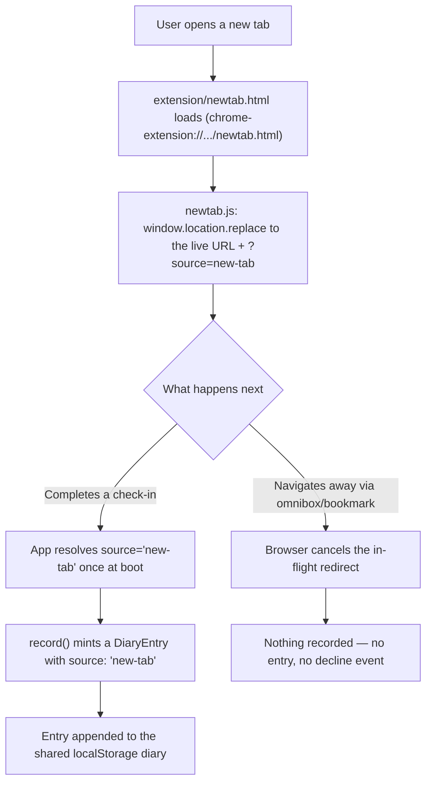

## Summary

A Chrome extension overrides the browser's New Tab page with a minimal local page that immediately redirects the whole tab to the live deployed app (`https://justsayknarf.github.io/emotions-wheel/`), appending a query parameter that tags the resulting check-in's source. Because the redirect is a real top-level navigation rather than an embed, the diary stays unified automatically — no sync layer, no storage-partitioning risk.

## Problem Frame

The origin brainstorm ([[docs/brainstorms/2026-08-25-newtab-checkin-entry-requirements.md]]) settled the product shape: full takeover on every new tab, the real field (no compact variant), dismiss via ordinary navigation, and a hard requirement that new-tab and direct-visit check-ins land in one diary. What it left to planning was the technical mechanism — and that mechanism carries real risk if chosen wrong: `chrome_url_overrides.newtab` cannot point at a remote URL directly, and if the eventual page loads the app in an iframe instead of navigating to it, Chrome's third-party storage partitioning can silently split the diary the whole feature depends on staying unified (flagged independently by two reviewers during doc review). Research below resolves this decisively.

## Requirements

Carried from the origin document (see it for full rationale); referenced here by the same R-IDs.

**Trigger surface**
- R1. Every new tab opened in Chrome shows the full Emotion Selector field as a complete takeover of the new-tab page.
- R2. No frequency or staleness gate limits how often the interstitial appears.
- R3. The check-in experience on the new tab is the same field/pin/card interaction as the main app.
- R4. The user can leave the interstitial at any time via ordinary browser navigation, with no dedicated skip control.

**Data model**
- R5. A completed check-in records which surface produced it (new-tab vs. direct site visit).
- R6. Check-ins from both surfaces land in one unified diary.

**Distribution**
- R7. The extension meets Chrome Web Store publishing requirements.

## Key Technical Decisions

- **Top-level redirect, not an iframe embed.** `chrome_url_overrides.newtab` must reference a local bundled HTML file — Chrome does not allow a manifest override to target a remote URL directly. That local page (`extension/newtab.html`) loads a tiny script that immediately runs `window.location.replace(...)` to the live GitHub Pages URL. This makes R6 hold by construction: a top-level navigation to the real origin gets that origin's actual `localStorage`, with none of the partitioning risk an iframe would introduce. A real, long-shipping Chrome Web Store extension ("New Tab Redirect!") uses this exact bundled-redirect pattern, which is strong precedent that it survives review. `location.replace` (not `.href`) so the local stub doesn't leave an extra back-history entry. This resolves the doc review's flagged uncertainty about storage-partitioning outright — that risk only applies to the iframe approach, which this plan does not use.
- **No `host_permissions` needed.** The Chrome storage-partitioning exemption that would otherwise require declaring `host_permissions` for the embedded origin is only relevant to the iframe approach. A plain `window.location.replace` from the extension's own script needs no special permission at all. Combined with `chrome_url_overrides` itself requiring no permission grant, the manifest can ship with an empty or near-empty `permissions`/`host_permissions` list — Chrome Web Store review treats narrow-to-no host permissions as low-friction, which directly serves R7.
- **Source tag travels as a URL query parameter, not a new messaging bridge.** The redirect target is `https://justsayknarf.github.io/emotions-wheel/?source=new-tab`. The app already has no existing mechanism for detecting "which surface loaded me" (confirmed absent in `src/App.tsx`/`src/main.tsx`), so a query param read once at boot is the lowest-carrying-cost way to pass that signal across a real page navigation — no `postMessage`, no shared state, nothing extension-specific baked into the app.
- **`source` lives on `DiaryEntry`, is optional, and follows the `origin?` precedent.** `src/types.ts`'s `PinEntry.origin?` already establishes the pattern for an optional field added after entries exist in `localStorage` — pre-existing entries simply lack it, and nothing needs a migration. `DiaryEntry.source?: 'web' | 'new-tab'` follows the same shape, defaulting to treating an absent value as `'web'` wherever it's read.
- **Correction/reopen preserves the original entry's source.** `updateEntryInList` (`src/data/checkIn.ts:37`) already preserves the original entry's `timestamp` and `sessionDurationMs` on correction via an explicit merge (`{ ...updated, timestamp: original.timestamp, sessionDurationMs: original.sessionDurationMs }`) — but that merge does not yet list `source`, so without an explicit addition a correction would silently drop it back to absent. U2 adds `source: original.source` to that same merge line, following the identical pattern.
- **Incognito is a platform limit, not a design choice.** Chrome does not allow extensions to override the New Tab page in Incognito windows at all. R1's "every new tab" does not — and cannot — extend there; Incognito windows show Chrome's native new tab, unchanged.

## High-Level Technical Design



## Implementation Units

### U1. Diary entry source field and resolution logic

**Goal:** Add the optional `source` field to the data model and a pure function that resolves it from a URL query string.

**Requirements:** R5, R6

**Dependencies:** None

**Files:**
- `src/types.ts` — add `source?: 'web' | 'new-tab'` to `DiaryEntry`
- `src/data/source.ts` — new pure module, `resolveEntrySource(search: string): 'web' | 'new-tab'`
- `scripts/test-source.ts` — new check script
- `package.json` — register `check:source`

**Approach:** Follow the `src/data/checkIn.ts` / `src/data/departure.ts` precedent: zero storage or DOM access, importable under `npx tsx`. `resolveEntrySource` reads a `source` query key; any value other than the literal `new-tab` (missing key, empty string, unrecognized value) defaults to `web` — a defensive default rather than trusting arbitrary query input verbatim.

**Patterns to follow:** `scripts/test-departure.ts`'s `check(name, ok, detail)` helper and PASS/FAIL/exit-code shape.

**Test scenarios:**
- Happy path: `resolveEntrySource('?source=new-tab')` returns `'new-tab'`.
- Happy path: `resolveEntrySource('')` (no query string) returns `'web'`.
- Edge: `resolveEntrySource('?foo=bar')` (unrelated param, no `source` key) returns `'web'`.
- Edge: `resolveEntrySource('?source=bogus')` (unrecognized value) returns `'web'`, not the raw value.

**Verification:** `npx tsx scripts/test-source.ts` passes; `tsc -b` passes with the new optional field.

---

### U2. Thread the resolved source through app boot and check-in recording

**Goal:** Resolve the source once at boot and record it on every newly minted check-in, without disturbing corrections.

**Requirements:** R5, R6

**Dependencies:** U1

**Files:**
- `src/App.tsx` — resolve `resolveEntrySource(window.location.search)` once (matching the existing derive-at-render convention, not an effect); pass it into `record()`
- `src/hooks/useDiary.ts` — `record()` accepts a `source` argument and sets it on the minted `DiaryEntry`
- `src/data/checkIn.ts` — add `source: original.source` to `updateEntryInList`'s existing merge object (line 37), alongside `timestamp`/`sessionDurationMs`

**Approach:** `record()`'s only construction site for a fresh `DiaryEntry` is in `useDiary.ts`; thread the value there rather than reaching into storage. No `useEffect` — resolve once, the same way `App.tsx` already treats other boot-time derived values. `updateEntryInList`'s merge object does not currently include `source` — add it explicitly, since `App.tsx`'s correction-path `updated` object never sets `source` and would otherwise silently strip it back to absent on every correction. After resolving the value once, strip the `source` query param from the URL via `history.replaceState(null, '', window.location.pathname)` — otherwise a later refresh, bookmark, or share of that same tab keeps re-resolving `source=new-tab` from the persisted query string and mistags every subsequent check-in from that tab indefinitely.

**Patterns to follow:** `App.tsx`'s existing derive-at-render style (see `AGENTS.md`); `updateEntryInList`'s existing field-preservation behavior for corrections.

**Test scenarios:**
- Test expectation: none — this unit is wiring U1's already-tested resolver into the view/hook layer with no new branching logic; verified live per the repo's testing split (anything touching `useDiary`/storage can't run under Node).
- Integration (manual verification): completing a check-in on a tab loaded with `?source=new-tab` produces a `DiaryEntry` with `source: 'new-tab'`; completing one without that param produces `source: 'web'`. Covers AE1.
- Integration (manual verification): reopening/correcting an existing entry preserves its original `source`, even when the correction itself happens on a tab without the query param present.

**Verification:** Manual check-in from a URL with `?source=new-tab` and without it; inspect the resulting `localStorage` entries.

---

### U3. Chrome extension shell — manifest and redirect stub

**Goal:** A minimal Manifest V3 extension that overrides the new tab page and redirects to the live app.

**Requirements:** R1, R2, R3, R4, R6, R7

**Dependencies:** U1 (for the query param contract)

**Files:**
- `extension/manifest.json` — new
- `extension/newtab.html` — new, no interactive content
- `extension/newtab.js` — new, single redirect call
- `extension/icons/icon16.png`, `icon48.png`, `icon128.png` — new (placeholder art acceptable for v1; see Risks & Dependencies)

**Technical design (directional):**
```
manifest.json:
  manifest_version: 3
  chrome_url_overrides: { newtab: "newtab.html" }
  permissions: []            # none needed
  host_permissions: []       # none needed — see Key Technical Decisions

newtab.html: bare <script src="newtab.js"> — no visible/interactive DOM

newtab.js:
  window.location.replace(
    "https://justsayknarf.github.io/emotions-wheel/?source=new-tab"
  )
```

**Patterns to follow:** None in this repo (confirmed no existing extension scaffolding); follow the "New Tab Redirect!" precedent structure (bundled local page → immediate top-level redirect).

**Test scenarios:**
- Test expectation: none — a static manifest and one hardcoded redirect call, no conditional logic.
- Integration (manual verification, unpacked install): opening a new tab redirects immediately to the live URL with `?source=new-tab`, with no visible interactive flash on the local stub (nothing to steal keyboard focus from the omnibox). Covers R1, R3.
- Integration (manual verification): the diary in the redirected tab includes previously-recorded web-originated entries — confirms shared, unpartitioned `localStorage` rather than a split store. Covers R6.
- Integration (manual verification): typing a URL into the omnibox and pressing enter immediately after opening a new tab cancels the in-flight redirect and navigates normally, with nothing recorded. Covers AE2, R4.
- Integration (manual verification): opening several new tabs in a row each independently shows the full interstitial — no gate. Covers AE3, R2.

**Verification:** `chrome://extensions` → load unpacked → open new tabs and confirm the behaviors above.

---

### U4. Chrome Web Store submission readiness

**Goal:** Prepare the extension for Web Store review, not just personal unpacked use.

**Requirements:** R7

**Dependencies:** U3

**Files:**
- `extension/manifest.json` — finalize `name`, `description`, `version`
- `extension/README.md` — new, single-purpose statement and permission justification for review notes

**Approach:** State the extension's single purpose plainly (shows a personal check-in field on new tab) since Chrome Web Store's Single Purpose policy scrutinizes New Tab overrides for scope creep. Because the manifest carries no `host_permissions` and no broad APIs, permission justification is minimal by construction (see Key Technical Decisions). A privacy disclosure notes that the extension itself collects nothing — all data lives in the loaded page's own `localStorage`, identical to visiting the site directly. The README covers this for repo purposes, but the Chrome Web Store dashboard has its own separate privacy-practices disclosure fields at submission time — filling those in is part of this unit, not satisfied by the README alone.

**Test scenarios:** Test expectation: none — documentation and listing content, not code.

**Verification:** Manifest's `name`/`description` read as a clear single-purpose statement; README covers what a reviewer needs (purpose, permissions, data handling) without overclaiming.

## Scope Boundaries

Carried from the origin document.

**Deferred for later**
- A frequency cap or "don't ask again" window.
- A compact/quick-tap check-in variant.
- Recording a "declined" signal when a tab is bypassed.
- Any browser besides Chrome.

**Outside this product's identity**
- The new tab replacing the deployed site as the sole entry point.

**Plan-local addition**
- Incognito windows show Chrome's native new tab — not a v1 gap to close, since Chrome does not permit New Tab overrides in Incognito at all.

## Risks & Dependencies

- **Full takeover with no gate and no skip control carries a real fatigue/uninstall risk** during multi-tab bursts (session restore, research sessions). This trade-off was named and deliberately accepted in the origin brainstorm rather than mitigated — recorded here as a monitored risk, not a new requirement, so the plan doesn't silently re-litigate a decision already made. If uninstalls or disabling become visible after shipping, the deferred frequency-cap window (already scoped out above) is the documented fallback.
- **New-tab loads depend on network availability**, unlike Chrome's native offline-safe new tab. No offline fallback is built in v1 (would require bundling a second, synced copy of the app — the exact sync-bridge complexity the redirect approach was chosen to avoid). Accepted for v1; worth revisiting if slow/offline loads prove disruptive in practice.
- **Chrome Web Store review outcome for an always-on, non-dismissible New Tab override is not fully certain** despite the "New Tab Redirect!" precedent — that extension lets users configure a target URL and disable the redirect, which this extension deliberately does not. Minimal permissions and a clear single-purpose statement (U4) are the mitigation; actual acceptance is only confirmed at submission.
- **Icon artwork does not exist yet** — no existing app icon/favicon in the repo to reuse. Placeholder art is acceptable to unblock U3/U4; real art is a low-cost follow-up, not a blocker.
- **Assumes the deployed URL stays `https://justsayknarf.github.io/emotions-wheel/`** — confirmed against the current `git remote` and `vite.config.ts`'s `base: '/emotions-wheel/'`; would need updating if the repo or Pages path ever moves.

## Acceptance Examples

Carried from the origin document, with how this plan satisfies each:

- AE1. Completing a check-in from a new tab tags the entry `source: 'new-tab'` and it lives in the same diary as web-originated entries — satisfied by U1/U2's data model change plus U3's shared-origin redirect (no partitioning).
- AE2. Typing a URL into the omnibox and navigating away without touching the field records nothing — satisfied by construction: the local redirect stub has no interactive content, and browser-native navigation always wins over an in-flight redirect.
- AE3. The full interstitial still appears on a new tab opened minutes after the last check-in — satisfied by R2's no-gate requirement; nothing in this plan adds staleness logic to suppress it.

## Sources / Research

- [Override Chrome pages — Chrome for Developers](https://developer.chrome.com/docs/extensions/develop/ui/override-chrome-pages) — `chrome_url_overrides.newtab` must reference a local file; incognito override is disallowed.
- [Storage and cookies — Chrome for Developers](https://developer.chrome.com/docs/extensions/develop/concepts/storage-and-cookies) — the `host_permissions` storage-partitioning exemption for embedded iframes, and why it's irrelevant to a top-level redirect.
- [Extensions quality guidelines FAQ — Chrome Web Store Program Policies](https://developer.chrome.com/docs/webstore/program-policies/quality-guidelines-faq) — Single Purpose policy and host-permission review scrutiny.
- [New Tab Redirect! — Chrome Web Store](https://chromewebstore.google.com/detail/new-tab-redirect/icpgjfneehieebagbmdbhnlpiopdcmna) — real, long-shipping precedent for the bundled-local-page-redirects-to-external-URL pattern.
- `src/types.ts`, `src/store/diary.ts`, `src/hooks/useDiary.ts`, `src/data/checkIn.ts` — current data model, storage, and check-in construction/correction paths.
- `vite.config.ts`, `.github/workflows/deploy.yml`, `git remote` — confirms the deployed URL and that GitHub Pages sends no frame-blocking headers (moot given the redirect approach, but confirms the fallback iframe approach was never blocked by headers either).
