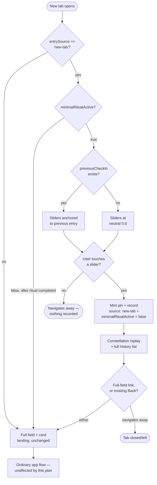

> **Superseded — never implemented.** This plan's approach (no `EmotionField`
> mount at all on the new-tab landing) was reconsidered before any of its
> units shipped, in favor of
> docs/plans/2026-08-27-001-feat-desktop-check-in-focus-plan.md, which did
> ship (PRs #31/#32). Kept for historical record only.
> [2026-09-02-001-feat-newtab-departure-float-plan.md](2026-09-02-001-feat-newtab-departure-float-plan.md)
> is current — it plans a follow-up change on top of the shipped
> desktop-check-in-focus landing, not this document's approach.

# New-tab minimal ritual

## Summary

Give the new-tab entry point its own pre-check-in landing: only the two departure sliders, no field, anchored to the previous check-in or neutral-centered for first-time users. A slider touch mints and records the check-in in one step and opens the constellation replay with the full history list beside it, instead of today's generic completion screen. The main web app's own landing is untouched.

---

## Problem Frame

The new-tab entry point (shipped in PR #29) currently loads the exact same landing as a direct web visit: a full field with surface words at rest, plus a rail or sheet carrying the previous check-in's card — which already carries the departure sliders. On the new-tab surface, that combined density reads as too much to parse before any decision to engage has been made, and the failure mode is bouncing off the tab entirely rather than hesitating over what to touch. For a surface meant to catch someone acting on autopilot, anything requiring parsing before the first touch works against its own purpose.

Repo research surfaced that this isn't a matter of narrowing an existing new-tab-specific code path — none exists. PR #29 only threads `entrySource` into `record()`'s tagging; nothing in `src/App.tsx` currently branches the *view* on it. This plan adds the first such branch.

---

## Requirements

**Landing (pre-check-in)**
- R1. The new-tab entry point's pre-check-in landing shows only the two departure sliders (and the relational caption, when available) — no field, no ghosted words, no drawer chrome.
- R2. When no previous check-in exists, the sliders start at the neutral center of each axis.
- R3. When a previous check-in exists, the sliders start pre-positioned at that entry, consistent with today's departure-slider behavior.
- R4. The main web app's own landing (direct site visits, not through the new-tab extension) is unchanged and continues showing today's full field + card.

**Completion & reveal**
- R5. Completing the minimal ritual (touching a slider) records the check-in, tagged with its new-tab source, and transitions to the constellation replay rather than today's generic completion screen — for new-tab-sourced entries specifically.
- R6. The constellation reveal shows the full history list alongside the replay, not just a recent window — for new-tab-sourced entries specifically; the existing "✦ replay" trigger's windowed view is unchanged.
- R7. From the constellation reveal, the user can open the ordinary full field view within the same tab.

---

## Key Technical Decisions

- **KTD1. Landing mode is gated on a session flag, not raw `entrySource`.** `minimalRitualActive` initializes to `entrySource === 'new-tab'` and flips to `false` as soon as the minimal ritual completes — the moment U3 mints and records the check-in — not only later, when the user opts into the full field via R7. Clearing it at completion (rather than only at the R7 link) means every exit from the constellation reveal, including `ConstellationReplay`'s existing Back/dismiss control, lands back on the ordinary full field rather than bouncing back to the sliders-only landing. Gating on `entrySource` alone would re-trigger the sliders-only landing every time `view` returns to `'field'` later in the same tab session. Extracted as `resolveLandingMode(entrySource, minimalRitualActive)` in a new `src/data/newTabLanding.ts` so it's covered by a `check:*` script, matching the existing `src/data/source.ts` / `checkIn.ts` / `departure.ts` pattern.
- **KTD2. First-time anchor is a synthetic pin, computed live, not stored.** With no previous check-in, the departure card renders against a synthetic `PinEntry` at `(0, 0)` with `regionDescription` computed fresh via `getRegionDescription(0, 0, emotions)` — there's no stored snapshot to read for a coordinate that was never actually recorded. Resolved by `resolveDepartureAnchorPin(previousCheckIn, emotions)` in the same module, which also flags the anchor as synthetic.
- **KTD3. The "reopen this entry instead" link is suppressed for a synthetic anchor.** Today the link renders unconditionally in departure mode and would otherwise point at a non-existent entry for first-time users, silently no-oping on tap. `CoordinateCard` gains an optional `hideReopenLink` prop, defaulting to today's always-render behavior, passed `true` only when the anchor is synthetic.
- **KTD4. The minimal ritual mints and records in one step, via a new handler — the existing two-step flow is untouched.** Today, minting a pin (dragging a departure slider) and recording a check-in (pressing "Done" in the drawer) are separate actions; there's no code path that does both from a single gesture. The sliders-only landing wires its own `onDepart` handler that builds the pin the same way `handlePinRelease` does, then calls `record([pin], sessionStartRef.current, 'new-tab')` directly (the existing `record()` signature takes a session-start timestamp, not a duration — it computes `sessionDurationMs` internally) and transitions straight to `'constellation'`. The existing `handleDepart` (mint-only) stays wired to the full app's departure card exactly as it is today.
- **KTD5. The full-history reveal is a new lightweight list, not the existing history view.** `DiaryHistory` is a standalone full-screen surface with its own header, day/week tabs, and CSV export — not built to sit beside another full-screen view. `ConstellationReplay` instead gains an optional `historyEntries` prop that renders `DiaryEntryRow` mapped over the full (unwindowed) entries array, with its own `openEntry`/`SessionDetailCard` state lifted so a tap on a constellation point and a tap on a list row open the same detail card.
- **KTD6. `WelcomeOverlay`'s somatic-cue text still shows on the sliders-only landing, repositioned.** It's ephemeral, dismissed-on-first-touch text, not persistent chrome, so it doesn't conflict with R1's "no drawer chrome." Its current positioning assumes a field-plane center that won't exist on a fieldless screen, so it needs a new center value for this layout. The existing dismiss-on-any-pointerdown-in-`'field'`-view logic already covers a slider touch without changes.
- **KTD7. Concurrent-new-tab localStorage races are accepted, not newly mitigated.** Each new tab is an independent page load reading `entries`/`previousCheckIn` once at mount; two tabs completing in a narrow window could both anchor to the same stale `previousCheckIn`. This is a pre-existing risk in the storage layer, not introduced by this plan — but this plan meaningfully increases how often multiple tabs are open in that state, since prompting a check-in is now new-tab's whole purpose. No `storage` event listener is added here (see Scope Boundaries).

---

## High-Level Technical Design



The one new piece of persistent state this plan introduces is `minimalRitualActive` — everything else is derived at render from existing state (`entrySource`, `previousCheckIn`, `view`), matching this codebase's existing "derive, don't effect" convention.

---

## Implementation Units

### U1. New-tab landing decision logic

**Goal:** Pure functions deciding landing mode and departure anchor, testable under Node without a browser.

**Requirements:** R1, R2, R3

**Dependencies:** none

**Files:**
- `src/data/newTabLanding.ts` (new)
- `scripts/test-newtab-landing.ts` (new)
- `package.json` (add `check:newtab-landing` script)

**Approach:** `resolveLandingMode(entrySource, minimalRitualActive): 'sliders' | 'full'` — `'sliders'` only when `entrySource === 'new-tab'` and `minimalRitualActive` is true. `resolveDepartureAnchorPin(previousCheckIn, emotions): { pin: PinEntry; isSynthetic: boolean }` — returns the previous check-in's own anchor pin unchanged when one exists (`isSynthetic: false`), else a synthetic pin `{ id: 'neutral-anchor', x: 0, y: 0, recognizedWords: [], regionDescription: getRegionDescription(0, 0, emotions) }` (`isSynthetic: true`).

**Patterns to follow:** `src/data/source.ts`, `src/data/checkIn.ts`, `src/data/departure.ts` — pure functions, no React, one `check:*` script per module.

**Test scenarios:**
- `resolveLandingMode('new-tab', true)` → `'sliders'`.
- `resolveLandingMode('new-tab', false)` → `'full'` (after the user opted into the full field via R7).
- `resolveLandingMode('web', true)` → `'full'` (entrySource guards regardless of the flag).
- `resolveLandingMode(undefined, true)` → `'full'` (defensive default matches `resolveEntrySource`'s own `'web'` default).
- `resolveDepartureAnchorPin` with a real `previousCheckIn` → returns that entry's own pin unchanged, `isSynthetic: false`.
- `resolveDepartureAnchorPin` with `previousCheckIn: null` → returns the synthetic `(0, 0)` pin with `regionDescription` computed fresh, `isSynthetic: true`.

**Verification:** `npm run check:newtab-landing` passes; script registered in `package.json`.

---

### U2. Sliders-only landing render branch

**Goal:** When the sliders-only landing is active, render only the departure sliders, caption, and a repositioned welcome overlay — no field, no drawer, no hint/demo/history chrome.

**Requirements:** R1, R2, R3

**Dependencies:** U1

**Files:**
- `src/App.tsx`
- `src/components/Welcome/WelcomeOverlay.tsx`
- `src/components/EmotionPreview/CoordinateCard.tsx`

**Approach:** Introduce `minimalRitualActive` state in `App.tsx`, initialized at mount to `entrySource === 'new-tab'`. Two separate render sites need to key off `resolveLandingMode(entrySource, minimalRitualActive)`, not just one: (1) `EmotionField` is mounted unconditionally today, as an always-present sibling that sits outside the `view === 'field'` chrome block entirely — it must gain its own `landingMode !== 'sliders'` condition, or it will keep rendering the field and surface words underneath the sliders card, defeating R1. (2) The existing `view === 'field'` chrome block (which already conditionally mounts `EmotionDrawer`, the hint, and `FirstRunDemo`) branches on `landingMode`: when `'sliders'`, it renders only `WelcomeOverlay` (with a fieldless center) and a standalone `CoordinateCard` (`readOnly`, `departure`, `pin={anchor.pin}`, `hideReopenLink={anchor.isSynthetic}`); when `'full'`, today's composition is unchanged. `WelcomeOverlay` gains an optional center-position prop so the sliders-only landing can pass a viewport center instead of the field-plane center it computes today.

**Technical design (directional, not implementation-specification):**
```
landingMode === 'sliders' ? null : <EmotionField ... />   // was previously always mounted

if (view === 'field') {
  landingMode === 'sliders'
    ? <WelcomeOverlay centerLeft="50%" ... />
        <CoordinateCard pin={anchor.pin} readOnly departure
          hideReopenLink={anchor.isSynthetic} onDepart={handleMinimalDepart} />
    : <existing full field + drawer composition, unchanged>
}
```

**Patterns to follow:** existing `view === 'field'` / `showMirror` composition in `src/App.tsx`; "derive at render, not in an effect" convention (AGENTS.md).

**Test scenarios:**
- Returning user (real previous check-in) opens a new tab → only sliders + caption render, pre-positioned at that entry, no field/words visible, and `EmotionField` does not mount (confirm no field canvas/words in the DOM, not just visually hidden). Covers AE1.
- First-time user (no diary entries) opens a new tab → sliders render at the neutral center, no field visible, `EmotionField` does not mount. Covers AE2.
- Direct visit to the app (no `?source=new-tab`) → unchanged full field + card renders. Covers AE5.
- On the sliders-only landing with a real previous entry, the "reopen this entry instead" link still renders and works.
- On the sliders-only landing with no previous entry (synthetic anchor), the reopen link does not render.

**Verification:** `tsc -b` and `vite build` clean; the five scenarios above confirmed live in a visible Chrome tab (not the automation hidden tab — canvas/rAF and layout timing can't be verified there) with `?source=new-tab` in the URL, loaded before the mount-time query-string strip runs.

---

### U3. Atomic mint-and-record path for the minimal ritual

**Goal:** A single slider touch on the sliders-only landing mints the pin and records the check-in in one step, tagged `source: 'new-tab'`.

**Requirements:** R5

**Dependencies:** U1, U2

**Files:**
- `src/App.tsx`

**Approach:** New `handleMinimalDepart(x, y)` builds a `PinEntry` at the committed coordinate the same way `handlePinRelease` does, then calls `record([pin], sessionStartRef.current, 'new-tab')` directly — matching `useDiary.record()`'s actual signature, which takes a session-start timestamp and computes `sessionDurationMs` internally, the same argument `handleRecord` already passes today — and transitions to `'constellation'`. Wired as `CoordinateCard`'s `onDepart` prop only on the sliders-only landing (U2); the existing `handleDepart` (mint-only, feeding the full app's two-step drag-then-Done flow) is left untouched. If `record()` throws (e.g., storage quota), `handleMinimalDepart` does not transition `view` — the user stays on the sliders landing rather than reaching a constellation reveal for an entry that was never saved, matching this repo's existing best-effort, try/catch-guarded storage posture rather than adding new error UI.

**Patterns to follow:** existing `handlePinRelease` pin construction; `useDiary.record()`'s existing signature already accepts `source`.

**Test scenarios:**
- Touching either slider on the sliders-only landing produces exactly one new `DiaryEntry` with `source: 'new-tab'` and one pin at the committed coordinate. Covers AE3.
- The untouched axis's value on the newly recorded pin matches the anchor's value for that axis (real anchor or neutral).
- The recorded entry's `sessionDurationMs` is a small positive number (elapsed time since the tab opened), not a corrupted near-current-epoch value — confirms the session-start timestamp, not a duration, was passed to `record()`.
- The ordinary web app's departure card (via `EmotionDrawer`) still requires the existing drag-then-Done flow — this handler doesn't alter that path (regression check).
- An interrupted drag (pointer cancel mid-gesture) reverts via the existing `AxisSlider`/`cancelAxis` path and mints nothing.

**Verification:** the four scenarios above confirmed live in a visible tab; `npm run check:pin` and `npm run check:departure` still pass (regression on the untouched two-step flow's pure logic).

---

### U4. Constellation + full history reveal for new-tab completions

**Goal:** On completing the minimal ritual, replace the generic completion screen with the constellation replay plus a full history list beside it, sharing one detail overlay.

**Requirements:** R6

**Dependencies:** U3

**Files:**
- `src/components/Constellation/ConstellationReplay.tsx`
- `src/App.tsx`

**Approach:** `ConstellationReplay` gains two new optional props: `historyEntries?: DiaryEntry[]` (when present, renders `DiaryEntryRow` mapped over the full, unwindowed array beside the existing pulse-trace visualization) and lifts its `openEntry`/`SessionDetailCard` state so a tap on a constellation point and a tap on a list row open the same detail card. The existing "✦ replay" trigger keeps calling `ConstellationReplay` without `historyEntries`, so its current windowed-only behavior is unchanged. `App.tsx` passes the full `entries` array as `historyEntries` only when `'constellation'` was reached via U3's minimal-ritual completion, not via the existing replay button.

**Patterns to follow:** `src/components/DiaryHistory/DiaryEntryRow.tsx` (list-row reuse); `ConstellationReplay`'s existing `SessionDetailCard` usage.

**Test scenarios:**
- After a minimal-ritual completion, the replay renders alongside a list showing every entry, including the one just recorded. Covers R6.
- Tapping a list row opens the same detail card as tapping a constellation point; only one detail card is open at a time.
- The existing "✦ replay" button flow (mirror card, unrelated to this feature) still shows the windowed replay with no list — confirms the new props don't change its default behavior (regression check).

**Verification:** `tsc -b` and `vite build` clean; the three scenarios above confirmed live in a visible tab (the pulse-trace animation itself is hidden-tab-rAF-blocked and can't be verified via automation).

---

### U5. Link from the reveal into the full field view

**Goal:** From the constellation reveal, open the ordinary full field + card view in the same tab, and stop the sliders-only landing from reappearing for the rest of that tab's session.

**Requirements:** R7

**Dependencies:** U4

**Files:**
- `src/App.tsx`
- `src/components/Constellation/ConstellationReplay.tsx`

**Approach:** `ConstellationReplay` gains an `onOpenFullField?: () => void` prop, rendered as a link, passed only from the minimal-ritual completion path. Its handler calls `setView('field')` — `minimalRitualActive` was already cleared at completion time in U3 (KTD1), so this link doesn't need to clear it again, and neither does `ConstellationReplay`'s existing, unrelated "← Back" button (wired to `onDismiss`, also just `setView('field')`): by the time either exit fires, U2's landing-mode gate already resolves to `'full'` regardless of which one the user taps. The ordinary field + card composition renders, including the just-recorded entry as the new `previousCheckIn`/departure anchor via the existing `derivePreviousCheckIn` derivation. No bespoke state is needed to surface the new pin.

**Patterns to follow:** existing `setView` transition pattern in `src/App.tsx`.

**Test scenarios:**
- From the reveal, tapping the full-field link opens the ordinary field + card view in the same tab, with the just-recorded entry visible as the previous check-in. Covers AE4.
- From the reveal, tapping the pre-existing "← Back" control instead of the new link also opens the ordinary full field view, not the sliders-only landing (confirms `minimalRitualActive` was already cleared at completion, not only by the new link).
- After leaving the reveal by either exit, further interaction in that tab does not re-trigger the sliders-only landing.

**Verification:** the two scenarios above confirmed live in a visible tab.

---

## Acceptance Examples

- AE1. Given a returning user with a previous check-in opens a new tab, when the tab loads, then the sliders render pre-positioned at that entry with no field visible. Covers R1, R3. (U2)
- AE2. Given a first-time user with no previous check-ins opens a new tab, when the tab loads, then the sliders render at the neutral center with no field visible. Covers R1, R2. (U2)
- AE3. Given the sliders-only landing, when the user touches a slider, then the check-in mints, records with a new-tab source, and the constellation replay renders with the full history list alongside it. Covers R5, R6. (U3, U4)
- AE4. Given the constellation reveal after a check-in, when the user selects the link to the full field, then the ordinary field + drawer view opens in the same tab. Covers R7. (U5)
- AE5. Given a direct visit to the deployed site (not through the new-tab extension), when the page loads, then today's unchanged full field + card landing renders, not the sliders-only version. Covers R4. (U2)

---

## System-Wide Impact

- **`CoordinateCard`'s prop surface grows** (`hideReopenLink`). Its only existing call site (`EmotionDrawer.tsx`) doesn't pass it, so today's always-render reopen-link behavior there is unaffected.
- **`ConstellationReplay`'s prop surface grows** (`historyEntries`, `onOpenFullField`). Its only existing call site (the mirror card's "✦ replay" button) doesn't pass either, so its current windowed-replay-only behavior is unaffected.
- **`App.tsx`'s view state machine gains a second path into `record()`.** `handleMinimalDepart` (U3) and the existing `handleRecord` (Done button) both call `record()`, but with different tagging/transition consequences — keep them structurally separate rather than merging, so a future change to one doesn't silently alter the other.
- **`WelcomeOverlay` gains a second positioning mode.** Its existing field-plane-center positioning for direct web visits must be unaffected by the new fieldless-center prop added for the sliders-only landing.

---

## Risks & Dependencies

- **Concurrent-new-tab localStorage races increase in likelihood, not in kind** (KTD, accepted). Two new tabs completing within a narrow window could both anchor to the same stale `previousCheckIn`; no entry is lost, but a currently-open tab's list/constellation could show stale data until refreshed.
- **Hidden-tab rAF automation limitation applies to most of this feature's live verification.** `WelcomeOverlay`'s dissolve, the departure-trace animation, and `ConstellationReplay`'s pulse-trace can't be verified via Claude-in-Chrome automation (Chrome pauses `requestAnimationFrame` in a hidden tab) — every unit's live-verification scenarios above must run in a visible tab.
- **No component-test harness exists in this repo.** Everything beyond U1's pure logic is verified live, matching this repo's existing testing split (`localStorage` doesn't exist under Node, so anything touching `src/store/diary.ts` is untestable via `check:*` scripts).
- **`WelcomeOverlay`'s fieldless-center positioning has no direct precedent to crib from** — it's the first layout this repo has needed without a field plane to anchor against, so it needs live visual confirmation rather than just a type-check.
- **The sliders-only landing is new-tab's sole entry point, so a failed `record()` call is more exposed than in the old two-step flow.** U3's approach keeps the user on the sliders landing rather than transitioning to a constellation reveal for an entry that was never saved (see U3), but this doesn't add retry or error messaging — it matches the app's existing silent-failure posture (`readDiary`/`appendEntry` are already best-effort, try/catch-guarded), just applied more deliberately at this one call site.

---

## Scope Boundaries

**Deferred for later**
- A frequency or staleness gate on the new-tab interstitial — already deferred in the original newtab-checkin-entry brainstorm, unchanged here.

**Outside this product's identity**
- Applying the sliders-only landing to the main web app's own entry point. The web app keeps its full field + card landing; this is a new-tab-specific exception.

**Deferred to Follow-Up Work**
- A `storage` event listener to keep an already-open tab's `entries`/`previousCheckIn` fresh against concurrent-tab writes (KTD7) — not needed for this plan to ship correctly, since no entry is ever lost, only a stale in-tab view.

---

## Dependencies / Assumptions

- Reuses the existing `ConstellationReplay` and `DiaryEntryRow` components rather than building new ones.
- Assumes the entry source and previous-check-in state are both available at the point the landing renders — already true today via `resolveEntrySource` and `derivePreviousCheckIn`.

---

## Sources / Research

- `docs/brainstorms/2026-08-26-newtab-minimal-ritual-requirements.md` — origin document; Requirements, Key Decisions, Scope Boundaries carried forward from here.
- `docs/plans/2026-08-25-001-feat-newtab-checkin-entry-plan.md` and its implementation notes — confirmed shipped shape of `entrySource` resolution (lazy `useState` initializer, stripped from the URL on mount) that this plan builds on.
- `src/App.tsx` — confirmed no existing `entrySource`-conditional view branch; `handleRecord` is the sole `'complete'` transition point; `showMirror`/drawer-mount conditions gate today's departure card on a real `previousCheckIn`.
- `src/components/EmotionPreview/CoordinateCard.tsx` — departure-mode body (readOnly + departure props), current anchor-tick and caption sourcing (`pin.regionDescription.relational`, a stored snapshot).
- `src/components/Constellation/ConstellationReplay.tsx`, `src/utils/recentEntries.ts` — confirmed today's replay is opt-in only and windowed to 14 days / 10 entries, with no existing full-history-list plumbing.
- `src/components/DiaryHistory/DiaryEntryRow.tsx` — reuse candidate for the full history list, self-contained with no dependency on `DiaryHistory`'s tab/chart machinery.
- `src/components/Welcome/WelcomeOverlay.tsx` — confirmed it already coexists with the departure card today and dismisses on any pointerdown in `'field'` view; its `fieldCenterLeft` positioning has no equivalent on a fieldless screen.
