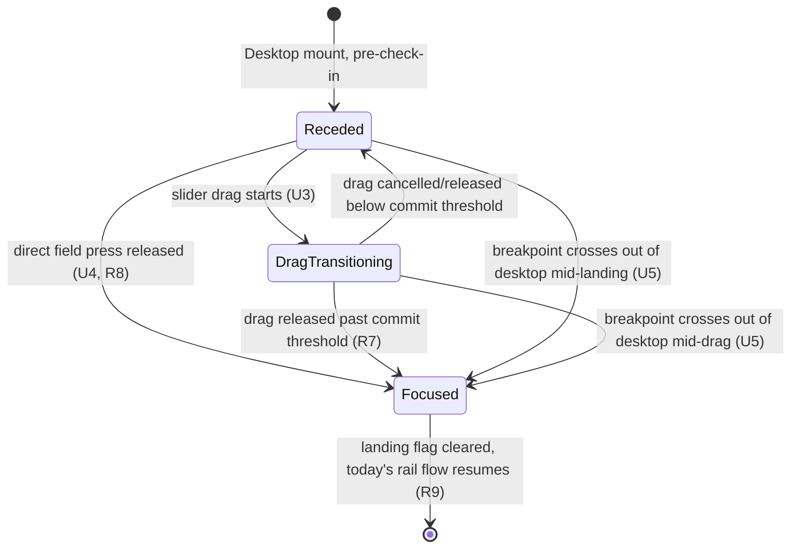

# feat: Desktop check-in focus

## Summary

On desktop, the pre-check-in landing recenters around the previous check-in card: front and center, sliders pre-positioned at the last entry (or neutral for first-time users), with the field receded behind it via scale + blur. The field stays directly pressable throughout. A slider drag or a direct field press each independently transition the layout back to today's side-by-side rail, after which the rest of the check-in flow is unchanged.

---

## Problem Frame

Today's desktop landing shows the field and the previous-check-in rail side by side at full visual weight the moment the app loads. The rail's card already carries departure sliders — a lower-friction, recognition-based way to record a check-in than generating a coordinate from scratch on the field. But the field's own word density, rendered at full prominence next to the card, competes with that faster path for the eye's first landing point, observed directly as hesitation before a pin drop. This plan makes the card the landing's first read by receding the field behind it, while keeping the field one press away.

---

## Key Technical Decisions

- **`EmotionDrawer` gains a third `variant: 'focus'`, not a new component.** `EmotionDrawer` already owns all previous-check-in card content plus Save/Discard/history/reopen chrome, switching between `'rail'` and `'sheet'` (`src/App.tsx:709`, `src/components/EmotionPreview/EmotionDrawer.tsx`). The front-and-center treatment reuses that same state and those same handlers under a third variant that changes positioning/sizing only, rather than introducing a parallel component tree that could drift from the rail/sheet behavior. Resolves the brainstorm's Outstanding Question on where the card's affordances live front-and-center.
- **The recede transform is applied to the same element whose rect drives field gesture math, and gesture-time coordinate normalization reads dimensions live rather than from cached `ResizeObserver` state.** `EmotionField.tsx` caches its container's width/height via a `ResizeObserver`-populated `size` state (`EmotionField.tsx:118-125`), and `useFieldGesture.ts` divides pointer offsets by that cached state to normalize coordinates. `ResizeObserver`'s `contentRect` reflects the untransformed layout box — a CSS `transform: scale()` never triggers a resize entry — so once `recedeProgress` scales the wrapper, the offset (from a transform-aware `getBoundingClientRect()`) and the divisor (the stale, pre-transform cached size) would desync, undershooting press coordinates at any partial recede. This plan changes gesture-time coordinate normalization to read `rect.width`/`rect.height` live from the same `getBoundingClientRect()` call used for the offset — not from the cached `size` state — whenever a gesture is active, so position and dimension stay mutually consistent under any transform. Applying the transform to the same wrapper (not an outer, non-participating container) remains necessary but is not by itself sufficient; this coordinate-normalization change is required alongside it to avoid the class of dead-zone bug PR #16 hit when a mobile tray's visual and interactive boxes diverged.
- **The direct-field-press transition (R8) is a fixed-duration, non-progressive animation, distinct from the drag-progressive one.** `useFieldGesture.ts`'s `onPointerUp` already fires on every press-release regardless of drag distance, with no movement threshold gating it — the natural attach point for "press triggers the same transition." Since R8 has no drag phase to key progress off of, it eases receded → focused over a fixed tunable duration rather than reusing the drag's distance-based progress mapping. Resolves the brainstorm's Outstanding Question on how R8 visually plays out.
- **Recede/return parameters are new tunable knobs, not hardcoded constants.** Scale factor, blur radius, transition duration/easing, and the drag commit threshold (below) are added to `src/config/revealTuning.ts` and exposed in `src/admin/components/AdminRevealTuning.tsx`, following the existing `REVEAL_KNOBS`/`DEPARTURE_KNOBS` pattern. Consistent with the brainstorm's Scope Boundaries, which defer exact intensity/timing as a tuning concern rather than a planning-time decision — this plan ships sensible defaults live-tunable afterward, matching how prior features in this project (departure-mark's dissolve timing, the axis-pulse) were tuned post-implementation.
- **The front-and-center landing is a one-shot, session-scoped flag, not a value re-derived from `previousCheckIn` on every render.** Set on mount when desktop (`sideBySide`) and pre-check-in, cleared once either transition completes. This means completing the very first check-in mid-session does not re-trigger the landing treatment for the entry that was just recorded — the rest of that session continues in today's rail per R9, mirroring the one-shot `landingMode`-style flag already used for the sibling new-tab minimal-ritual plan.
- **A drag commit threshold decides interrupted-drag direction; press and resize interruptions resolve via state-driven `animate`, never a manually-stepped timeline.** If a slider drag is released or cancelled before crossing the threshold (default 50% of the drag's progress), the transition eases back to fully receded; past it, forward to fully focused. Because the transition is driven by target state (`recedeProgress`) rather than an imperative timeline, a resize or tab-blur mid-tween simply re-targets to whatever the current correct end-state is on the next render, rather than freezing mid-animation.
- **The front-and-center card's drag-progress signal is new plumbing, not a reuse of `adjustDraft`/`draggingPinId`.** `CoordinateCard`'s departure branch (`dragDeparture`/`commitDeparture`) tracks a local `liveDraft` and, on release, calls `onDepart?.(next.x, next.y)` directly — it never calls `onAdjustDraft`, so `adjustDraft`/`draggingPinId` in `App.tsx` (the mechanism the mobile sheet's existing `dragShrinkActive` fade keys off) stays `null` throughout a departure-card drag. This plan threads a separate drag-progress callback from `dragDeparture` through `EmotionDrawer` to `App.tsx`, distinct from `adjustDraft`, to drive `recedeProgress` — this is new signal-plumbing, not a rewire of the existing `draggingPinId` mechanism.
- **The landing flag is gated on `entrySource !== 'new-tab'`, not left implicit.** `entrySource` (resolved in `src/data/source.ts`) has no effect on which UI renders today — it only tags saved entries. The sibling new-tab plan that would give `new-tab` sessions their own landing is unbuilt, so without an explicit guard, a desktop-width `new-tab` session with a previous check-in would incorrectly receive this plan's front-and-center treatment, violating R4/AE6, regardless of which plan ships first. The landing flag's mount condition explicitly excludes `entrySource === 'new-tab'` so this plan is correct standalone, independent of build order.
- **The neutral-centered first-time anchor is implemented independently of the sibling new-tab plan's equivalent helper.** The unbuilt `docs/plans/2026-08-26-001-feat-newtab-minimal-ritual-plan.md` proposes a `resolveDepartureAnchorPin` returning a synthetic `{ id: 'neutral-anchor', x: 0, y: 0, ... }` pin when no previous check-in exists. This plan adds the same synthetic-pin shape directly to `src/data/departure.ts`'s existing `departureAnchor()` rather than depending on that plan's unbuilt code, since either plan could land first. Flagged for de-duplication at implementation time if both have shipped.

---

## Requirements

**Landing**
- R1. On desktop, the pre-check-in landing shows the previous check-in card front and center, with the field receded behind it (scaled down and slightly blurred), replacing today's side-rail placement.
- R2. When no previous check-in exists, the card renders a neutral-centered variant with sliders at the neutral center of each axis, with the same field-receded treatment behind it.
- R3. Mobile's landing is unchanged — the PR #16 collapsed-peek tray stands.
- R4. The new-tab entry point is unchanged — it continues on the separately-planned sliders-only-no-field landing.

**Interaction**
- R5. The receded field stays directly touchable — a press anywhere on it drops a pin, the same as today.
- R6. No explicit "select from field instead" control is added to the card.

**Transition**
- R7. Starting a slider drag on the front-and-center card begins a continuous transition: the recede reverses and the layout eases toward today's side-rail arrangement as the drag progresses.
- R8. A direct press on the receded field also triggers the same transition, keyed to the press itself rather than a drag phase.
- R9. Once the transition completes, the rest of the check-in flow (draft cards, Save/Discard, history) behaves exactly as it does today.

---

## Key Flows

- F1. Desktop landing, returning user
  - **Trigger:** User opens the desktop app with an existing previous check-in.
  - **Steps:** The card renders front and center, pre-positioned at the previous entry; the field renders receded behind it. The user drags a slider or presses the field directly. The transition begins immediately, easing the field into focus and the layout toward today's rail. The rest of the flow proceeds unchanged.
  - **Outcome:** A pin is dropped through either path, landing back in today's familiar draft flow.
  - **Covered by:** R1, R5, R7, R8, R9

- F2. Desktop landing, first-time user
  - **Trigger:** User with no previous check-ins opens the desktop app.
  - **Steps:** The card renders front and center in its neutral-centered variant, field receded behind it. From the first touch onward, F1 applies.
  - **Outcome:** Same as F1, with no previous-entry anchor.
  - **Covered by:** R2, R5, R7, R8, R9

---

## Acceptance Examples

- AE1. Given a returning desktop user, when they open the app, then the previous check-in card renders front and center, pre-positioned at their last entry, with the field visibly receded (scaled and blurred) behind it. Covers R1.
- AE2. Given a first-time desktop user, when they open the app, then the card renders front and center with sliders at the neutral center, field receded behind it. Covers R2.
- AE3. Given the receded-field landing, when the user presses the field directly instead of touching the card, then a pin drops at that coordinate and the focus transition begins. Covers R5, R8.
- AE4. Given the receded-field landing, when the user begins dragging a card slider, then the field recede reverses progressively as the drag continues, easing toward today's rail layout. Covers R7.
- AE5. Given a mobile session, when the user opens the app, then today's collapsed-peek tray renders unchanged — no front-and-center card, no field recede. Covers R3.
- AE6. Given a new-tab session, when the tab opens, then the separately-planned sliders-only-no-field landing renders, not this front-and-center treatment. Covers R4.

---

## High-Level Technical Design

The landing/transition behavior is a small state machine layered on top of the existing `sideBySide` rail/sheet split, with two independent trigger paths and two interruption sources (drag cancel, breakpoint cross) that must resolve to a defined end state rather than freezing mid-animation:

`Receded` and `DragTransitioning` only exist while `sideBySide` is true and the one-shot landing flag is set; any exit from `sideBySide` (mobile breakpoint) or from the landing flag (transition complete) drops straight to today's existing rail/sheet behavior, which this plan does not otherwise change.

---

## Implementation Units

### U1. Container-level recede transform for the field

**Goal:** Give the field a whole-container scale + blur treatment, driven by a single `recedeProgress` value (0 = focused/today's rail, 1 = fully receded/front-and-center), where none exists today.

**Requirements:** R1, R5 (visual bounds must stay pressable)

**Dependencies:** None

**Files:**
- `src/App.tsx` (field wrapper around `fieldPlaneRef`, `src/App.tsx:589-631`)
- `src/hooks/useFieldGesture.ts` (gesture-time coordinate normalization: read `rect.width`/`rect.height` live instead of the cached `ResizeObserver` size)
- `src/components/EmotionField/EmotionField.tsx:118-125` (the `ResizeObserver`-populated `size` state this plan stops relying on for gesture-time math)
- `src/config/revealTuning.ts` (new knobs: recede scale factor, blur radius, base transition duration/easing)
- `src/admin/components/AdminRevealTuning.tsx` (new `Knob[]` group for the recede transform, following `REVEAL_KNOBS`/`DEPARTURE_KNOBS`)

**Approach:** Add a `recedeProgress: number` (0-1) driving `transform: scale(...)` and `filter: blur(...)` on the same wrapper element `fieldPlaneRef` is attached to — not an outer non-participating container. Because `getBoundingClientRect()`'s cached counterpart (`EmotionField.tsx`'s `ResizeObserver`-derived `size` state) does NOT reflect CSS transforms, `useFieldGesture.ts` must read `rect.width`/`rect.height` live from the same `getBoundingClientRect()` call it already uses for the pointer offset, rather than from that cached state, whenever a gesture is active (see Key Technical Decisions) — this is required, not optional, for hit-testing to stay correct at any partial recede. The receded field carries a pointer/hover affordance (e.g. `cursor: pointer` plus a subtle highlight on hover) so it continues to read as interactive rather than decorative background once visually backgrounded. The card's own pointer-events capture its full rendered footprint; the field is only reachable outside the card's bounds, so there's no ambiguous overlap to resolve. Reduced-motion (`useReducedMotion`) collapses the transform instantly to its target value rather than tweening, consistent with `AGENTS.md`'s convention that most (not all) motion honors it.

**Patterns to follow:** `src/config/revealTuning.ts` + `AdminRevealTuning.tsx` (existing tunable-knob pattern); `EmotionField.tsx`'s `recedeStrength`/`recedeActive` naming (per-word today) as a naming precedent, though this is a new container-level mechanism, not a reuse of that per-word logic.

**Test scenarios:**
- `recedeProgress = 0` renders no scale/blur (matches today's rail visually).
- `recedeProgress = 1` renders the tuned scale factor and blur radius.
- With `useReducedMotion` true, changing `recedeProgress` applies the target style with no tween.
- A pin dropped near the edge of the receded field, at a real, partial (non-zero, non-one) `recedeProgress`, lands at the coordinate visually pressed, not an offset one — confirms gesture math reads live dimensions rather than the stale cached size (regression guard for the PR #16 dead-zone bug class, and the primary check for this unit's coordinate-normalization fix).
- Hovering the receded field shows the pointer/hover affordance.

**Verification:** `tsc -b` and `vite build` clean; the scenarios above confirmed live in a visible Chrome tab at a desktop viewport width (canvas/rAF-adjacent visual confirmation can't be done in the automation hidden tab), specifically pressing near the visual edge of the receded field at partial `recedeProgress`, not just its center.

---

### U2. Front-and-center landing mode and `EmotionDrawer` `'focus'` variant

**Goal:** Introduce the one-shot desktop landing state and the card's front-and-center presentation, including the neutral-centered first-time variant.

**Requirements:** R1, R2, R3, R4, R6, R9

**Dependencies:** U1 (recede transform the landing activates)

**Files:**
- `src/App.tsx` (new landing-flag state, gating on `sideBySide` + pre-check-in + first mount)
- `src/components/EmotionPreview/EmotionDrawer.tsx` (new `variant: 'focus'` alongside existing `'rail'`/`'sheet'`)
- `src/data/departure.ts` (extend `departureAnchor()` with a synthetic neutral-center pin when `previousCheckIn` is null)
- `scripts/test-departure.ts` (new assertions for the neutral-anchor case)

**Approach:** A boolean landing flag (e.g. `desktopLandingActive`) is initialized once on mount from `sideBySide && entrySource !== 'new-tab' && previousCheckIn resolution complete`, independent of later changes to `previousCheckIn` in the same session (Key Technical Decisions). While active, `EmotionDrawer` renders with `variant="focus"` instead of `"rail"`, reusing its existing Save/Discard/history/reopen props and internal state unchanged — only layout/positioning differs (centered overlay vs. side rail), so no new state duplication is introduced. Focus order in the `'focus'` variant follows the new visual priority — the card's content (sliders, caption, affordances) is reachable first via keyboard tab order, consistent with it being the primary landing element. `departureAnchor()`'s signature is extended with a new `emotions` parameter and returns a synthetic pin `{ id: 'neutral-anchor', x: 0, y: 0, recognizedWords: [], regionDescription: getRegionDescription(0, 0, emotions) }` when `previousCheckIn` is null, mirroring the shape proposed (unbuilt) in the sibling new-tab plan without depending on its code. R6 requires no code change — no "select from field" control is added.

**Patterns to follow:** `EmotionDrawer`'s existing `variant` prop and `isRail`/`isDraftSheet` branching; `src/data/departure.ts`'s existing pure-function shape (no React), matching `AGENTS.md`'s pure-logic-plus-thin-wrapper convention.

**Test scenarios:**
- Desktop mount with a real previous check-in → `EmotionDrawer` renders `variant="focus"`, card pre-positioned at that entry's coordinate. Covers AE1.
- Desktop mount with no previous check-in → `EmotionDrawer` renders `variant="focus"` with the synthetic `(0, 0)` anchor. Covers AE2.
- Desktop mount, Save completes the very first check-in mid-session → landing flag stays cleared for the remainder of the session (does not re-trigger `'focus'` for the newly-recorded entry). Regression guard for the first-check-in edge case.
- Mobile viewport (`sideBySide` false) → `EmotionDrawer` never renders `'focus'`; today's `'sheet'` variant is unchanged. Covers AE5.
- New-tab entry (`entrySource === 'new-tab'`) → the landing flag's mount condition excludes it explicitly, so today's rail/sheet rendering is unaffected regardless of whether the sibling new-tab plan has shipped. Covers AE6.
- `departureAnchor(null, emotions)` returns the synthetic `(0, 0)` pin with a valid `regionDescription`; `departureAnchor(realPreviousCheckIn, emotions)` returns the previous check-in's own anchor pin, matching today's single-argument behavior now that the function takes the new `emotions` parameter.
- Keyboard-only navigation on the `'focus'` variant reaches the card's sliders and affordances before the (non-card) page content, consistent with the card's new front-and-center priority.

**Verification:** `tsc -b`/`vite build` clean; `npm run check:departure` passes including new assertions; the scenarios above confirmed live at desktop and mobile viewport widths, including a keyboard-only pass over the `'focus'` variant.

---

### U3. Drag-triggered progressive transition

**Goal:** Wire the card slider's existing drag signal to `recedeProgress`, so dragging a slider progressively reverses the recede (R7).

**Requirements:** R7

**Dependencies:** U1, U2

**Files:**
- `src/App.tsx` (map drag progress to `recedeProgress` and the card's own transition value)
- `src/components/EmotionPreview/CoordinateCard.tsx` (new drag-progress callback out of `dragDeparture`/`commitDeparture`, since this branch doesn't call `onAdjustDraft`)
- `src/components/EmotionPreview/EmotionDrawer.tsx` (thread the new drag-progress callback through to `App.tsx`; drive the card's own position/size transition from the same progress value)

**Approach:** `CoordinateCard`'s departure branch (`dragDeparture`/`commitDeparture`) tracks a local `liveDraft` and calls `onDepart?.(next.x, next.y)` on release — it does not call `onAdjustDraft`, so `adjustDraft`/`draggingPinId` never becomes non-null for this drag (see Key Technical Decisions). This unit adds a new drag-progress callback (0 at drag start, 1 at the slider's full travel or a defined commit distance), threaded from `dragDeparture` through `EmotionDrawer` to `App.tsx` as new plumbing, distinct from `adjustDraft`. That single progress value drives two things in lockstep: `recedeProgress` (the field's scale/blur, easing toward focused as the drag advances) and the card's own position/size (easing from centered-overlay toward its rail position/size) — R7's "the layout eases toward today's side-rail arrangement" describes both moving together, not the field alone. On release or cancel, compare final progress to the tuned commit threshold (default 50%, per Key Technical Decisions): below it, ease both back to their receded/centered state; at or above it, ease both to focused/rail and clear the landing flag per U2/R9. A cancelled drag is treated as a release below threshold unless progress had already passed it.

**Patterns to follow:** The existing mobile sheet's drag-triggered fade in `EmotionDrawer.tsx` (`dragShrinkActive`), as a precedent for drag-driven visual state generalized here to a different signal source and two coordinated target values (field + card) rather than one. That mechanic uses a plain CSS transition rather than framer's `animate` because layering it into a spring `animate` "didn't take reliably" per its own code comment — evaluate whether the field/card transition values need the same plain-CSS-transition treatment for smoothness.

**Test scenarios:**
- Dragging a slider past the commit threshold and releasing → both the field and the card complete their transition to focused/rail; landing flag clears. Covers AE4, contributes to F1.
- Dragging a slider partway (below threshold) and releasing → both ease back to fully receded/centered; landing flag remains active.
- Dragging a slider partway and cancelling (pointer cancel) below threshold → same as above (reverts).
- Dragging past the threshold, then cancelling → transition still completes to focused/rail (cancellation after commit doesn't reverse progress already committed).
- At a partial drag progress (mid-drag, not release), both the field's recede and the card's position/size reflect that same intermediate progress value — not just their start/end states.
- The ordinary rail/sheet drag-shrink behavior (mobile, or desktop after the landing flag has cleared) is unaffected — regression check against `dragShrinkActive`.

**Verification:** `tsc -b`/`vite build` clean; the scenarios above confirmed live at a desktop viewport, since drag-feel and transition smoothness can't be judged from the automation hidden tab.

---

### U4. Press-triggered discrete transition

**Goal:** A direct press on the receded field also triggers the transition to focused, without a drag phase to key progress off of (R8).

**Requirements:** R5, R8

**Dependencies:** U1, U2

**Files:**
- `src/App.tsx` (wire the field's press-release, while the landing flag is active, to the fixed-duration transition)
- `src/hooks/useFieldGesture.ts` (expose the release signal if not already surfaced beyond pin-drop)

**Approach:** `useFieldGesture.ts`'s `onPointerUp` already calls `onRelease` unconditionally on any press-release, regardless of drag distance (no movement threshold gates it) — this is the attach point. While the landing flag is active, a field release both drops a pin (today's existing behavior, unchanged) and eases both `recedeProgress` (1 to 0) and the card's own position/size (centered-overlay to rail, same target values U3 drives) over the tuned fixed duration (Key Technical Decisions), then clears the landing flag per R9. This is a single discrete animation for both field and card, not the drag-progress mapping from U3.

**Patterns to follow:** `useFieldGesture.ts`'s existing `onPointerUp`/`handlers.onPointerUp` wiring; the app's existing pattern of deriving visual state at render rather than reconciling it in an effect (`AGENTS.md`).

**Test scenarios:**
- Pressing the receded field directly (not touching the card) drops a pin at the pressed coordinate and starts the fixed-duration transition. Covers AE3.
- The transition triggered by a direct press reaches the same end state (focused, landing flag cleared) as a completed drag transition from U3 — no divergent downstream state between the two trigger paths. Covers R9.
- A field press while the landing flag is already inactive (post-transition) behaves exactly as today's ordinary pin-drop — regression check.
- Interrupting the press-triggered animation mid-tween (e.g., a resize event, see U5) resolves to a defined end state rather than a frozen partial recede.

**Verification:** `tsc -b`/`vite build` clean; the scenarios above confirmed live at a desktop viewport.

---

### U5. Breakpoint and interruption resilience

**Goal:** Ensure the landing/transition state resolves cleanly when interrupted by a browser resize crossing the desktop breakpoint, rather than left in an undefined mid-transition state.

**Requirements:** R7, R8, R9 (correctness under interruption, not new user-facing behavior)

**Dependencies:** U1, U2, U3, U4

**Files:**
- `src/App.tsx` (landing flag / `recedeProgress` reconciliation against `sideBySide` changes)
- `src/hooks/useSidePanelLayout.ts` (confirm no changes needed; verify its live `matchMedia` listener behavior is read correctly by the landing logic)

**Approach:** `useSidePanelLayout` is a live listener, not a one-time check, so `sideBySide` can flip to `false` mid-landing or mid-drag (e.g., a window resize below 900px). When that happens, immediately clear the landing flag and let `EmotionDrawer` fall back to its existing `'sheet'` variant — the receded/transitioning states only exist while `sideBySide` is true, per the High-Level Technical Design state diagram. Because `recedeProgress` and the landing flag are target-state values consumed by `animate` (not an imperative timeline), this reconciliation is a plain state update on the next render, not a special-cased animation interrupt.

**Patterns to follow:** `AxisRadiance.tsx`'s established lesson that one-shot animations must key on a trigger and measure state at play time, not depend on live size — the recede/return transition should follow the same discipline so a `sideBySide` resize doesn't leave it re-keying mid-tween.

**Test scenarios:**
- Resizing the window from desktop to mobile width while the landing flag is active (no drag/press yet) → landing flag clears immediately, `EmotionDrawer` renders `'sheet'`, field recede resets to focused.
- Resizing from desktop to mobile mid-drag (U3's `DragTransitioning` state) → same as above; the in-progress drag's transition is abandoned cleanly, not left partially applied.
- Resizing from mobile back to desktop after the landing flag has already cleared (post-first-visit) → today's ordinary rail behavior, landing treatment does not re-trigger (consistent with U2's one-shot-per-session flag).

**Verification:** `tsc -b`/`vite build` clean; the three scenarios above confirmed live by resizing a real browser window across 900px during each state.

---

## Scope Boundaries

**Deferred for later**
- Applying this same front-and-center treatment to the new-tab entry point, or reconciling it with the sliders-only-no-field plan there.
- Exact scale/blur intensity, transition timing, and the drag commit threshold's precise value — shipped as tunable defaults (Key Technical Decisions, U1) rather than fixed here, consistent with the brainstorm's own deferral.

**Outside this product's identity**
- Reversing the mobile collapsed-peek decision from PR #16. That was a deliberate, separate bet made for mobile's own reasons and stands unchanged here.

---

## Risks & Dependencies

- **Sibling-plan divergence risk.** The unbuilt `docs/plans/2026-08-26-001-feat-newtab-minimal-ritual-plan.md` proposes an equivalent synthetic neutral-anchor helper. Building both independently (Key Technical Decisions) risks two slightly different implementations of the same concept landing in the codebase if both ship — worth a dedup pass at whichever implementation happens second.
- **New container-level blur on a word-dense, per-word-animating field.** `EmotionField` already animates many individual word opacities; layering a container-level `filter: blur()` on top (a first for an interactive, non-decorative element in this codebase) is worth a live performance check during implementation, though not expected to be prohibitive given the field is otherwise idle during the receded state.

---

## Sources / Research

- `src/App.tsx:125-259, 569-767` — current desktop rail layout (`sideBySide` via `useSidePanelLayout`, `RAIL_WIDTH`, `fieldPlaneRef`), the always-mounted field, and the single `view === 'field'` block housing both.
- `src/components/EmotionPreview/EmotionDrawer.tsx` — existing `'rail'`/`'sheet'` variant split and the drag-triggered `dragShrinkActive` fade this plan's transition generalizes (plain-CSS-transition choice noted in its own code comment).
- `src/components/EmotionField/EmotionField.tsx:37-236` — confirms no existing whole-field opacity/blur/transform control; today's dimming is per-word only (`deepOpacityMap`, `dwellOpacityMap`).
- `src/hooks/useFieldGesture.ts` — `onPointerUp`/`onGestureActiveChange` gesture handling, rect-based coordinate normalization, and the existing tap/drag movement threshold pattern this plan's commit threshold echoes.
- `src/data/departure.ts` — existing `departureAnchor()`/`isDepartureEligible()` this plan extends for the neutral-anchor case.
- `src/config/revealTuning.ts`, `src/admin/components/AdminRevealTuning.tsx` — existing tunable-knob pattern this plan's new recede parameters follow.
- `docs/plans/2026-08-24-001-feat-departure-mark-plan.md` — direct predecessor establishing the departure-sliders-as-recognition-over-recall premise this plan extends to the desktop landing.
- `docs/brainstorms/2026-08-26-newtab-minimal-ritual-requirements.md` and `docs/plans/2026-08-26-001-feat-newtab-minimal-ritual-plan.md` — the sibling new-tab treatment (unbuilt) this plan doesn't touch, and the source of the neutral-center synthetic-pin pattern this plan mirrors independently.
- `docs/plans/2026-07-31-001-feat-collapsible-checkin-tray-plan.md`, `docs/plans/2026-08-21-001-fix-mobile-draft-tray-layout-plan.md` — prior lesson that a collapsed/receded element's hit-box must match its visual box, motivating this plan's KTD on applying the transform to the same rect-measured element.
- `src/components/EmotionField/AxisRadiance.tsx` — prior lesson that one-shot animations must key on a trigger and measure at play time rather than re-keying on live size, applied to U5's interruption handling.
- `CLAUDE.md` — "Z-axis transitions" as the app's stated aesthetic principle motivating the depth-recede choice over plain opacity dim.
- `STRATEGY.md` — check-in frequency and session completion rate as the habit-formation metrics this plan serves.
