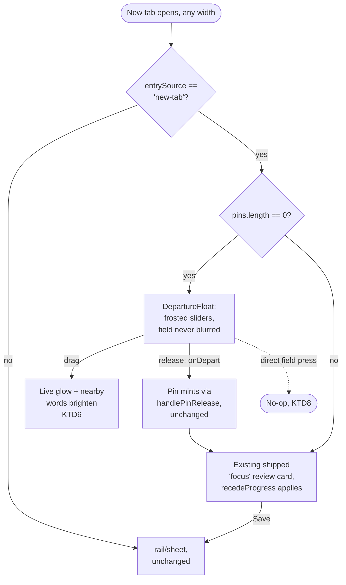

# New-tab departure float

## Summary

Replace the pre-mint moment of the shipped desktop-check-in-focus landing
(docs/plans/2026-08-27-001-feat-desktop-check-in-focus-plan.md) with a
card-less pair of departure sliders on a frosted glass strip, over a field
that is never blurred/scaled down and brightens locally around the live
drag coordinate. The instant a pin mints, today's shipped post-mint focus
review card takes over completely unchanged. Applies to every new-tab
session regardless of viewport width.

---

## Problem Frame

Confirmed by reading the shipped code (not assumed): `desktopLandingActive`
in [src/App.tsx](../../src/App.tsx) already puts departure sliders
front-and-center and already reveals the field as a slider drags
(`desktopFieldProgress` → `recedeProgress`, driving a blur+scale transform
on the field wrapper). But `EmotionDrawer.tsx`'s `shared` style
(`background: rgba(12, 14, 18, 0.97)`, `backdropFilter: blur(20px)`) is the
outer panel for every variant including `'focus'` — nearly opaque — and
`recedeProgress` starts at 1 (fully blurred, scaled to
`tuning.fieldRecedeScale`) at rest, only easing toward 0 as a drag
progresses. So the landing's resting state is: an almost-opaque card,
centered in a field that's been blurred and shrunk to near-invisibility.
That's what the original landing screenshot shows.

The reveal is also coarse: `recedeProgress` blurs/scales the *whole*
field uniformly. It doesn't brighten words near the slider's actual live
value — that only happens through `dwellCenter`/`useProximity` in
[EmotionField.tsx](../../src/components/EmotionField/EmotionField.tsx),
driven today only by hovering/pressing the field directly, never by the
departure card's own slider drag. `CoordinateCard.tsx`'s
`onDepartureDragProgress` callback reports only a 0–1 progress float
(`departureDragProgress` in `src/data/departure.ts`) — the live {x, y}
itself is computed locally (`dragDeparture`'s `next`) but never surfaced.

This plan replaces the pre-mint experience only. It does not touch the
post-mint review card (recognize/derecognize, caption, Save) or the
`'rail'`/`'sheet'` departure-slider affordance from
docs/plans/2026-08-24-001-feat-departure-mark-plan.md, which renders
independently of this landing whenever the draft is empty and a previous
check-in exists.

---

## Key Technical Decisions

- **KTD1. `desktopLandingActive`'s `sideBySide` gate is removed.**
  [App.tsx:166](../../src/App.tsx#L166) changes from
  `sideBySide && entrySource === 'new-tab'` to `entrySource === 'new-tab'`
  alone. `drawerVariant`'s existing ternary (`desktopLandingActive ?
  'focus' : sideBySide ? 'rail' : 'sheet'`) already checks
  `desktopLandingActive` first, so a mobile-width new-tab session now
  correctly resolves to `'focus'` (and, via KTD2, the new pre-mint
  rendering) without further changes there. `fieldWidth`/`railRevealed`
  already key off `sideBySide` independently of variant and don't need to
  change — a mobile-width focus/pre-mint landing was already full-bleed by
  virtue of `sideBySide` being false.
  Naming (`desktopLandingActive`, `desktopFieldProgress`, etc.) is left
  unchanged — a "desktop"-prefixed flag that now also applies on mobile is
  a real naming debt, but renaming it is scoped out (see Scope Boundaries)
  to keep this plan's diff reviewable.

- **KTD2. A new pre-mint rendering path in `EmotionDrawer`, gated on
  `isFocus && pins.length === 0 && (neutralDepartureEligible ||
  departureEligible)`.** Checked *before* the existing `if (isFocus) {
  ... }` branch (around
  [EmotionDrawer.tsx:941](../../src/components/EmotionPreview/EmotionDrawer.tsx#L941)),
  so it intercepts only the zero-pins departure moment; the instant a pin
  mints (`pins.length > 0`), the existing `isFocus` branch renders exactly
  as it does today — same opaque `shared` panel, same `cardList`/
  `actionBar`, same `recedeProgress` behind it. Nothing about the
  post-mint path changes. This new branch renders a new component
  (`DepartureFloat`, KTD3) instead of the `shared`-wrapped `motion.div` —
  no group headers, no `actionBar`/Save button (release commits
  immediately, same as `commitDeparture`'s existing unconditional-mint-on-
  release behavior; there's nothing to explicitly save separately from
  planting the pin).

- **KTD3. `AxisSlider` is extracted out of `CoordinateCard.tsx` into its
  own module** (`src/components/EmotionPreview/AxisSlider.tsx`), exporting
  the component plus its `ACCENT` palette and `endLabelStyle`. `
  CoordinateCard.tsx` imports it back unchanged — no behavior change
  there. This lets the new `DepartureFloat` component (KTD2) reuse the
  identical slider visuals/gesture logic rather than duplicating or
  forking it, since `DepartureFloat` needs the sliders without any of
  `CoordinateCard`'s surrounding card chrome, header, or caption/tag
  machinery it doesn't use.

- **KTD4. `DepartureFloat` renders the frosted strip and owns its own
  drag state**, structured like `CoordinateCard`'s existing departure body
  (`dragDeparture`/`commitDeparture`/`cancelDeparture`,
  `departureGestureActiveRef`) but trimmed to only what a card-less
  landing needs: two `AxisSlider`s, the relational caption, and (returning
  users only) the "reopen this entry instead" link. The frosted strip
  itself: `background: rgba(13,15,20,0.42)`, `backdrop-filter: blur(18px)
  saturate(1.15)`, `border: 1px solid var(--ui-border)`, receding during
  an active drag to `rgba(13,15,20,0.14)` / `blur(7px)` / no border —
  values validated in design exploration (see Sources), tunable later the
  same way `CARD_DRAG_BACKGROUND` is today. On commit, calls `onDepart`
  exactly as `CoordinateCard`'s departure body does today — no change to
  what happens once a pin mints.

- **KTD5. The live departure coordinate is newly surfaced**, not just its
  progress. `onDepartureDragProgress`'s signature grows a coordinate:
  `(progress: number, phase: 'drag' | 'commit' | 'cancel', coord: {x:
  number; y: number}) => void` (or a sibling callback,
  `onDepartureDrag?: (coord: {x,y} | null) => void`, fired on `drag` and
  cleared with `null` on `commit`/`cancel` — kept as a separate callback
  rather than overloading the existing one, so nothing about the existing
  progress-consumers in App.tsx has to change shape). `DepartureFloat`
  fires it from the same `dragDeparture`/`commitDeparture`/
  `cancelDeparture` call sites `CoordinateCard`'s departure body already
  uses. App.tsx threads it into a new piece of state,
  `departureDraftCoord: {x,y} | null`, passed to `EmotionField` (KTD6).

- **KTD6. `EmotionField` gains a `departureDraft?: {x,y} | null` prop**
  that participates in both existing reveal systems rather than adding a
  third:
  - *Surface words:* the existing `proximity = useProximity(surfaceEmotions,
    revealCenter, isRevealed, selectedIds)` call becomes `useProximity(
    surfaceEmotions, departureDraft ?? revealCenter, departureDraft !==
    null || isRevealed, selectedIds)` — a departure drag behaves like an
    active press for proximity purposes, consistent with it being a
    deliberate gesture, not passive hover.
  - *Deep words:* folded into `deepOpacityMap`'s existing pin-based
    `source` (no dwell delay — same reasoning: a drag is deliberate, not
    hover) rather than `dwellCenter` (which carries `DWELL_DELAY_MS`,
    tuned for passive hovering). `source` becomes `[...normal pins-or-
    emphasized-pin logic, ...(departureDraft ? [{ x: departureDraft.x, y:
    departureDraft.y }] : [])]` — cast to whatever minimal shape
    `deepOpacityMap`'s loop actually reads (`x`/`y` only; it doesn't
    touch `id` beyond the outer `pins` iteration variable, so a
    plain coordinate object works without a synthetic `PinEntry`).
  - *Glow marker:* a small new render block (soft radial gradient, gold,
    ~130px, matching `AxisSlider`'s own gold thumb gradient for visual
    consistency) at `departureDraft`'s field-space position, shown only
    while `departureDraft !== null`. No travel line, no origin ring — there
    is no minted pin yet to draw either from; `DepartureTrace`'s existing
    one-shot animated trace on commit is untouched and still fires
    normally once `handleDepart` runs.

- **KTD7. `recedeProgress`'s formula changes to exclude the pre-mint
  state.** [App.tsx:239](../../src/App.tsx#L239) changes from
  `desktopLandingActive ? 1 - desktopFieldProgress : 0` to
  `desktopLandingActive && pins.length > 0 ? 1 - desktopFieldProgress : 0`
  — the blur/scale recede only ever applies once a pin has minted (the
  post-mint review card, unchanged from today). Pre-mint, the field
  renders at its normal scale and clarity throughout — KTD6's localized
  glow/word-brightening is the only reveal effect during that phase.
  `desktopFieldProgress`/`desktopFocusLive` themselves are untouched —
  still reset to 0/false on mount and only ever driven by
  `handleDepartureDragProgress`'s existing `'commit'`/`'cancel'` phases,
  which now only matter once `pins.length > 0` (i.e., they're read again
  on the very next commit, which is also the transition into the
  post-mint state).

- **KTD8. Direct field-press no longer mints during the pre-mint
  state.** `handleFieldPress` ([App.tsx:617](../../src/App.tsx#L617))
  gains a guard: if `desktopLandingActive && pins.length === 0`, it
  returns without calling `handlePinRelease` (a no-op press) instead of
  minting. Once `pins.length > 0` (post-mint), or outside this landing
  entirely, behavior is unchanged. This is the first concrete instance of
  "pin drops require confirmation" — scoped to this one call site.

---

## High-Level Technical Design

---

## Implementation Units

### U1. Landing scope + recede-formula changes

**Goal:** New-tab sessions get this landing on every viewport width; the
field stays unblurred until a pin exists.

**KTDs:** KTD1, KTD7, KTD8

**Files:** `src/App.tsx`

**Approach:** Remove the `sideBySide &&` clause from `desktopLandingActive`'s
initializer (KTD1). Change `recedeProgress`'s formula to gate on
`pins.length > 0` (KTD7). Add the `pins.length === 0` guard to
`handleFieldPress` (KTD8).

**Test scenarios:**
- Mobile-width viewport, `entrySource === 'new-tab'`: `drawerVariant`
  resolves to `'focus'`, not `'sheet'`.
- Pre-mint (`pins.length === 0`), any width: `recedeProgress` is 0
  regardless of `desktopFieldProgress`.
- Post-mint (`pins.length === 1`): `recedeProgress` follows
  `desktopFieldProgress` exactly as today.
- A direct press on the field while pre-mint does not create a pin or
  call `handlePinRelease`; the same press post-mint mints as today.

**Verification:** live, in a visible tab at both a desktop and a mobile
emulated width — `recedeProgress`/blur behavior isn't observable via a
`check:*` script.

---

### U2. Extract `AxisSlider`

**Goal:** Make the slider reusable outside `CoordinateCard` without
duplicating it.

**KTDs:** KTD3

**Files:**
- `src/components/EmotionPreview/AxisSlider.tsx` (new)
- `src/components/EmotionPreview/CoordinateCard.tsx`

**Approach:** Move the `AxisSlider` function component, `ACCENT`, and
`endLabelStyle` verbatim into the new file; `CoordinateCard.tsx` imports
them back. No behavioral change — this is a pure extraction.

**Test scenarios:** Existing departure/adjust slider behavior in
`CoordinateCard` (rail/sheet, ordinary adjust) is visually and
behaviorally unchanged — regression check only, no new behavior to verify.

**Verification:** `tsc -b` clean; live regression check of the ordinary
(unchanged) rail/sheet departure and adjust sliders.

---

### U3. `DepartureFloat` component

**Goal:** The frosted, card-less pre-mint landing.

**KTDs:** KTD4, KTD5

**Dependencies:** U2

**Files:** `src/components/EmotionPreview/DepartureFloat.tsx` (new)

**Approach:** Two `AxisSlider`s (Calm/Activated, Negative/Positive) on a
frosted `
` (KTD4's values), plus the relational caption and (only
when `hideReopenLink` is false — same prop shape as `CoordinateCard`'s
existing one) the reopen link. Drag/commit/cancel logic mirrors
`CoordinateCard`'s existing departure body (`dragDeparture`/
`commitDeparture`/`cancelDeparture`/`departureDragProgress`), reporting
both the existing progress callback and the new coordinate callback
(KTD5). A `dragging` boolean (local state, set true on any axis
pointerdown, false on pointerup) toggles the frosted-strip's recede
styling.

**Test scenarios:**
- Dragging either slider fires the new coordinate callback with the live
  value on every frame, and clears it (`null`) on release.
- Releasing mints exactly one pin via `onDepart`, matching
  `CoordinateCard`'s existing departure commit behavior (same coordinate,
  same one-shot `DepartureTrace` fire in `App.tsx`'s `handlePinRelease`).
- An interrupted drag (pointercancel) reverts and fires the coordinate
  callback with `null`, minting nothing — matches `cancelDeparture`'s
  existing semantics.
- The frosted strip's background/blur visibly changes between resting and
  dragging states.
- With no previous check-in, sliders start at neutral center and no
  reopen link renders; with one, sliders start pre-positioned and the
  link renders.

**Verification:** live, visible tab — drag gesture and CSS transition
behavior aren't `check:*`-testable.

---

### U4. Field-side live reveal

**Goal:** The field brightens locally around the live departure
coordinate instead of (pre-mint) not reacting at all.

**KTDs:** KTD6

**Dependencies:** U3

**Files:**
- `src/components/EmotionField/EmotionField.tsx`
- `src/App.tsx`

**Approach:** New `departureDraft?: {x,y} | null` prop on `EmotionField`,
threaded from a new `departureDraftCoord` state in `App.tsx` (set by
`DepartureFloat`'s new coordinate callback via `EmotionDrawer`). Feeds the
surface-word `useProximity` call and the deep-word `deepOpacityMap`
source as described in KTD6, plus the new glow marker render block.

**Test scenarios:**
- Dragging a departure slider brightens surface words near the live
  coordinate and dims others, matching the same opacity/scale curve
  ordinary field hovering already produces.
- Deep words within `VISIBILITY_RADIUS` of the live coordinate appear
  immediately (no 1.2s dwell delay), and disappear immediately when the
  coordinate moves back out of range or the drag ends.
- The glow marker tracks the live coordinate during a drag and disappears
  on release/cancel.
- With `departureDraft` null (not dragging, or outside this landing
  entirely), field behavior is pixel-for-pixel unchanged from today.

**Verification:** live, visible tab — proximity/opacity behavior isn't
`check:*`-testable (no component-test harness in this repo, per
AGENTS.md's testing split).

---

### U5. Wire `EmotionDrawer`'s new pre-mint branch

**Goal:** Route to `DepartureFloat` instead of the opaque panel, exactly
when KTD2 specifies.

**KTDs:** KTD2

**Dependencies:** U3, U4

**Files:**
- `src/components/EmotionPreview/EmotionDrawer.tsx`
- `src/App.tsx`

**Approach:** Add the `isFocus && pins.length === 0 && (neutralDepartureEligible
|| departureEligible)` branch before the existing `if (isFocus)` return,
rendering `DepartureFloat` with the same anchor/anchorLabel/onDepart props
the existing departure `CoordinateCard` already receives, plus the new
coordinate callback (U3) threaded up to `App.tsx`'s `departureDraftCoord`
state (U4) and down into `EmotionField` (U4).

**Test scenarios:**
- Pre-mint, `isFocus`: `DepartureFloat` renders, not the opaque `shared`
  panel.
- The instant a pin mints (`onDepart` fires), the next render falls
  through to the existing, unchanged `isFocus` branch — opaque panel,
  `cardList`, `actionBar`, all exactly as today.
- `'rail'`/`'sheet'` variants are entirely unaffected — this branch is
  gated on `isFocus` alone.

**Verification:** live, visible tab, full walkthrough: land pre-mint →
drag → release → confirm post-mint card is pixel-identical to today's
shipped behavior → Save → confirm rail reveal is unchanged.

---

## Acceptance Examples

- AE1. Given a mobile-width viewport and `entrySource === 'new-tab'`, when
  the tab loads, then the frosted floating sliders render (not the
  ordinary sheet). Covers KTD1.
- AE2. Given the pre-mint landing, when nothing has been touched yet,
  then the field renders at full clarity/scale with no blur. Covers KTD7.
- AE3. Given the pre-mint landing, when a slider is dragged, then a glow
  and nearby words brighten toward the live coordinate, and the frosted
  strip thins. Covers KTD4, KTD6.
- AE4. Given the pre-mint landing, when a slider is released, then a pin
  mints and the existing shipped post-mint review card renders, unchanged
  from today. Covers KTD2, KTD5.
- AE5. Given the pre-mint landing, when the field itself (not a slider) is
  pressed directly, then nothing mints. Covers KTD8.
- AE6. Given the post-mint review card, when Save is pressed, then the
  rail reveals exactly as it does today. Regression check — nothing in
  this plan touches that path.

---

## System-Wide Impact

- **`EmotionField`'s prop surface grows** (`departureDraft`). Every other
  caller (there is only one, `App.tsx`) passes it as `null`/omitted
  outside this landing, so field behavior elsewhere is unaffected.
- **`onDepartureDragProgress`'s call sites grow a parameter** (or gain a
  sibling callback, per KTD5) — `CoordinateCard`'s existing departure body
  (used by `'rail'`/`'sheet'`) either also reports it harmlessly (nothing
  currently consumes it there) or the sibling-callback approach leaves it
  entirely unwired there, whichever KTD5's implementation lands on.
- **`AxisSlider` becomes a shared module** — a future change to slider
  visuals/gesture now affects both `CoordinateCard` and `DepartureFloat`
  from one place, which is the intent, not a risk.
- **`recedeProgress`'s meaning narrows** (post-mint only) — any future
  code reading it pre-mint would now always see 0 where it used to see a
  live 0–1 value; grep confirms `App.tsx` and `EmotionField.tsx` are its
  only two readers today.

---

## Risks & Dependencies

- **No component-test harness exists in this repo** (AGENTS.md) — every
  unit above beyond pure-logic pieces is verified live, matching the
  existing testing split.
- **Hidden-tab rAF automation limitation applies** to the glow marker,
  frosted-strip transition, and any framer-motion animation touched here
  — verify in a visible tab, not the automation's hidden one (same
  limitation noted in the prior desktop-check-in-focus plan).
- **`useProximity`'s `isPressed` parameter now has two live sources**
  (internal `useFieldGesture` state, and this plan's `departureDraft`) —
  KTD6's `departureDraft !== null || isRevealed` combination needs a live
  check that dragging a slider while *also* somehow hovering the field
  (unlikely given they're different elements, but not impossible with a
  second pointer) doesn't produce a flickering or contradictory proximity
  state. Flagged for live verification in U4, not assumed safe.
- **`departureDraft` and the ordinary `adjustDraft` overlay are visually
  distinct but occupy similar field-space** — confirm during U4/U5 that a
  departure-drag glow and a post-mint adjust-drag ghost never render
  simultaneously (they shouldn't: `adjustDraft` requires an `emphasizedPinId`,
  which doesn't exist pre-mint) but worth an explicit live check given
  both read/write similar-looking field-space coordinates.

---

## Scope Boundaries

**Deferred for later**
- Renaming `desktopLandingActive`/`desktopFieldProgress`/`desktopCardProgress`/
  `desktopFocusLive` now that "desktop" no longer describes their scope.
- Extending pin-drop confirmation-gating (KTD8's pattern) to direct
  field-tap outside this landing.
- A live travel-line from the anchor ring to the departure drag coordinate
  (`DepartureTrace`-style, but continuous during drag rather than one-shot
  on commit) — the validated design only calls for a glow marker; a travel
  line is a plausible future enhancement, not part of this plan.

**Outside this product's identity**
- Any change to the main web app's own direct-visit (`'web'`) landing.
- The `'rail'`/`'sheet'` departure-slider affordance
  (docs/plans/2026-08-24-001-feat-departure-mark-plan.md) — unaffected by
  this plan.

---

## Dependencies / Assumptions

- Builds directly on shipped state/handlers in `App.tsx`
  (`desktopLandingActive`, `departureEligible`/`neutralDepartureEligible`,
  `departureAnchor`, `handleDepartureDragProgress`, `handlePinRelease`,
  `handleDepart`) — none of them are replaced, only extended or narrowed
  in scope (KTD1, KTD7, KTD8).
- Assumes `useProximity`/`deepOpacityMap`'s existing shapes accept a bare
  `{x, y}` coordinate without requiring a full `PinEntry` — confirmed by
  reading `useProximity.ts` (takes `revealCenter: {x,y} | null`) and
  `EmotionField.tsx`'s `deepOpacityMap` loop (reads only `.x`/`.y` off
  each `source` entry).

---

## Sources / Research

- [src/App.tsx](../../src/App.tsx) — `desktopLandingActive`,
  `recedeProgress`, `handleDepartureDragProgress`, `handleFieldPress`,
  `handlePinRelease`, `handleDepart` — read in full to confirm the shipped
  mechanism this plan extends and exactly where each KTD's change lands.
- [src/components/EmotionPreview/EmotionDrawer.tsx](../../src/components/EmotionPreview/EmotionDrawer.tsx) —
  confirmed the `shared` opaque-panel style, `isFocus`'s existing content
  structure, `neutralDepartureEligible`/`departureEligible` gating, and
  that departure cards also render independently in `'rail'`/`'sheet'`
  (out of scope here).
- [src/components/EmotionPreview/CoordinateCard.tsx](../../src/components/EmotionPreview/CoordinateCard.tsx) —
  confirmed `AxisSlider`'s current location/shape,
  `CARD_DRAG_BACKGROUND`/`CARD_DRAG_BORDER` precedent, and that
  `onDepartureDragProgress` reports progress only, not coordinate.
- [src/components/EmotionField/EmotionField.tsx](../../src/components/EmotionField/EmotionField.tsx) —
  confirmed `dwellCenter`/`deepOpacityMap`/`useProximity` wiring, the
  existing `adjustDraft` ghost-overlay pattern (post-mint only), and
  `recedeProgress`'s current role (pointer affordance only — the actual
  transform lives one level up in `App.tsx`).
- [src/hooks/useProximity.ts](../../src/hooks/useProximity.ts) —
  confirmed `useProximity`'s exact signature and opacity/scale curve this
  plan reuses unmodified.
- [src/hooks/useFieldGesture.ts](../../src/hooks/useFieldGesture.ts) —
  confirmed `DWELL_DELAY_MS`/dwell semantics, and why this plan treats a
  departure drag as press-equivalent rather than dwell-equivalent.
- [src/data/departure.ts](../../src/data/departure.ts) — confirmed
  `departureAnchor`, `isDepartureEligible`, `departureDragProgress`
  signatures, all reused unchanged.
- docs/plans/2026-08-27-001-feat-desktop-check-in-focus-plan.md — the
  shipped baseline this plan is a follow-up to.
- docs/plans/2026-08-24-001-feat-departure-mark-plan.md — the general
  `'rail'`/`'sheet'` departure-slider affordance this plan does not touch.
- docs/brainstorms/2026-09-02-newtab-departure-float-requirements.md —
  origin document; Key Decisions/Requirements carried forward from here.
- In-session design exploration — validated the frosted-strip fill/blur
  values (KTD4) and the drag-recede treatment against a live, interactive
  mockup before this plan was written.
