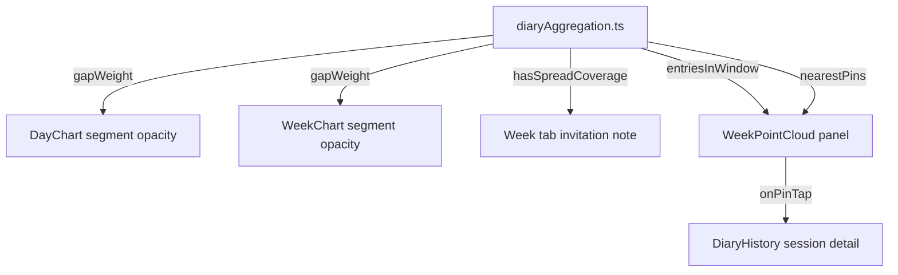

# feat: Sparse check-in legibility

## Summary

Give the Day/Week history charts one shared, gap-aware rule for how much visual weight a line segment gets, add a threshold-gated invitation note to the Week tab, and add a small point-cloud panel there showing where recent check-ins have landed independent of timing.

## Problem Frame

`DayChart` and `WeekChart` today disagree on how they treat missing data: `WeekChart` hard-breaks its line at any day with zero entries, while `DayChart` connects every check-in in a day with a fixed-weight line regardless of how many hours separate them — an 8am and an 11pm check-in read as continuous. Neither chart signals how much evidence a given segment actually represents, and there's no room today to suggest, without shame, that more check-ins would make the picture clearer. See origin for full problem framing and the deferred categorical-breakdown risk analysis.

---

## Key Technical Decisions

**KTD1 — One shared pure function, chart-specific parameters.** `R2` in the origin asks for "the same underlying weighting rule" on both charts. Applying identical raw-hour constants to both fails in practice: `WeekChart`'s best case (two adjacent days) is already a 24-hour gap, which would read as heavily faded under Day-chart-scale constants. The plan uses one shared function, `gapWeight(gapMs, fullWeightMs, decayMs)`, with each chart passing its own `fullWeightMs`/`decayMs` tuned to its native granularity (hours for `DayChart`, days for `WeekChart`). This satisfies R2's actual intent — eliminating the two-different-rules inconsistency, one function backing both — without producing a WeekChart that always looks faint.

**KTD2 — Opacity only, not stroke width.** One visual dimension is enough signal for "how much evidence," and varying both opacity and thickness would compound two encodings for one variable. Matches `CLAUDE.md`'s "no chart aesthetics" bar.

**KTD3 — A render floor, not a literal zero.** Below a fixed weight (`MIN_RENDER_WEIGHT = 0.08`), a segment is not drawn at all — this is the formula's own limiting case reproducing today's "no line across an empty day" behavior (R3), rather than a special-cased second rule.

**KTD4 — `MIN_SPREAD_DAYS = 4`.** Origin's working assumption ("on the order of 4 days") is adopted as the concrete default. It's a named, easily-tunable constant, not a scope decision — visual tuning against real data is expected during implementation.

**KTD5 — The point-cloud panel extends `MiniCircumplex`, it doesn't fork it.** `MiniCircumplex` already has precedent for an opt-in prop that changes behavior for one unfamiliar call site without touching existing ones (`showAxes`, added "off by default so the existing diary-history call site... is unaffected"). Tap-to-open-detail (R9) is added the same way: an optional `onPinTap` prop, undefined by default, so the two existing read-only call sites (`SessionDetailCard`, `SavedCheckInSummary`) are untouched.

**KTD6 — Day-key consolidation folded in, not deferred.** `WeekChart.tsx` has its own local `toDateKey`, duplicating the private `dateKey` already in `src/utils/diaryAggregation.ts`. The new distinct-day-spread check needs that same key; exporting the existing one and having `WeekChart` import it removes the duplicate rather than adding a third copy.

---

## High-Level Technical Design

`src/utils/diaryAggregation.ts` becomes the single source of the new pure logic; every UI piece in this plan reads from it rather than computing its own version of "how much time passed" or "how many days had data."

---

## Requirements

**Line rendering**

- R1. Both charts render each line segment's opacity as a continuous function of the time-gap it spans, via `gapWeight`, replacing today's fixed-opacity segments.
- R2. `DayChart` and `WeekChart` call the same `gapWeight` function, each with its own granularity-appropriate parameters (see KTD1).
- R3. A gap whose computed weight falls at or below `MIN_RENDER_WEIGHT` renders no segment at all, preserving the no-interpolation guarantee across a period with zero check-ins.
- R4. Check-in dots keep their current fixed opacity regardless of surrounding gaps — only connecting segments vary.

**Invitation note (Week tab)**

- R5. The Week tab shows an invitation note only while `hasSpreadCoverage` is false for the visible 30-day window; the note disappears once coverage is met.
- R6. The note's copy invites more check-ins ("Patterns get clearer with more check-ins.") and never references missed days, streaks, or obligation.
- R7. No numeric progress indicator accompanies the note.

**Point-cloud panel (Week tab)**

- R8. The Week tab includes a panel plotting every pin from every entry in the visible 30-day window on a circumplex, via an extended `MiniCircumplex`.
- R9. Tapping a point opens that pin's owning entry's session detail, via a new `onPinTap` callback on `MiniCircumplex`.
- R10. The panel always renders, including with zero entries in the window — at zero it shows only the empty circle and axes, with no additional empty-state copy, since the invitation note already carries that message.
- R11. When a tap falls within a small tolerance radius of more than one pin, the panel presents a picker listing the overlapping entries instead of opening one arbitrarily.

---

## Implementation Units

### U1. Shared pure logic in `diaryAggregation.ts`

**Goal:** Export the existing day-key helper and add the gap-weight and spread-coverage pure functions everything else in this plan depends on.

**Requirements:** R1, R2, R3, R5, R11 (supporting logic)

**Dependencies:** None

**Files:**
- `src/utils/diaryAggregation.ts` (modify — export the existing private `dateKey`; add `entriesInWindow`, `distinctDayCount`, `hasSpreadCoverage`, `MIN_SPREAD_DAYS`, `gapWeight`, `MIN_RENDER_WEIGHT`, `nearestPins`, `PIN_OVERLAP_RADIUS`)
- `scripts/test-chart-density.ts` (new)
- `package.json` (modify — add `"check:density": "npx tsx scripts/test-chart-density.ts"`)

**Approach:** `gapWeight(gapMs, fullWeightMs, decayMs)` returns `1` when `gapMs <= fullWeightMs`, else `Math.exp(-(gapMs - fullWeightMs) / decayMs)`. `hasSpreadCoverage(entries, minDays = MIN_SPREAD_DAYS)` counts entries (with ≥1 pin) by `dateKey` and compares the distinct-key count to `minDays`. `entriesInWindow(entries, days)` filters entries whose `dateKey` matches any of the given days' keys — used with `last30Days()` for the Week tab's window. `nearestPins(pins, target, radius = PIN_OVERLAP_RADIUS)` computes Euclidean distance in the existing `(x, y)` pin-coordinate space (not pixels, so it's independent of the panel's rendered size) and returns every pin — including `target` itself — within `radius`; R11's picker fires whenever this returns more than one pin.

**Patterns to follow:** `dailyAggregates`'s existing bucket-by-`dateKey` loop in the same file; `scripts/test-pin-adjust.ts` for the check-script shape (plain `check(name, ok, detail)` helper, exit non-zero on failure).

**Test scenarios:**
- `gapWeight` returns exactly `1` at `gapMs === fullWeightMs` and below it.
- `gapWeight` decreases monotonically as `gapMs` grows past `fullWeightMs`, never negative, approaches `0` for very large gaps.
- `hasSpreadCoverage` is `false` for entries spanning 3 distinct days at `minDays = 4`, `true` at exactly 4.
- `hasSpreadCoverage` counts three same-day entries as one distinct day, not three.
- `entriesInWindow` excludes an entry one day outside the given range and includes one on the first/last day of the range.
- `nearestPins` returns only the target pin when no other pin is within `radius`; returns multiple when others are within it; excludes a pin exactly one unit past the radius boundary.
- Regression: for a fixed sample entry set, `dailyAggregates`'s output is unchanged after `dateKey` is exported (guards the refactor introduced no behavior change).

**Verification:** `npm run check:density` exits 0.

---

### U2. `WeekChart` gap-aware segments

**Goal:** Replace the hard break-at-empty-day rule with `gapWeight`-driven per-segment opacity, and remove the duplicate local day-key helper.

**Requirements:** R1, R2, R3

**Dependencies:** U1

**Files:**
- `src/components/DiaryHistory/WeekChart.tsx` (modify)

**Approach:** Replace `buildSegments` (which returns contiguous non-null runs for one `<polyline>` each) with per-adjacent-pair `<line>` (or single-segment `<polyline>`) elements, each computing its gap in ms from the two days' dates and setting `opacity={baseOpacity * gapWeight(gapMs, WEEK_FULL_WEIGHT_MS, WEEK_DECAY_MS)}`, skipping the element when that weight is at or below `MIN_RENDER_WEIGHT`. Suggested starting parameters: `WEEK_FULL_WEIGHT_MS = 24h`, `WEEK_DECAY_MS = 48h` (adjacent days render at full weight; a 4-day gap renders faint; a 7+ day gap falls below the render floor) — treat as tunable, confirm by eye against seeded data per KTD4's spirit. Import `dateKey` from `diaryAggregation.ts` in place of the local `toDateKey`; drop the now-unused `buildSegments` helper.

**Patterns to follow:** The existing per-series opacity split (valence at `0.9`, arousal at full) — multiply that existing base by `gapWeight`, don't replace it.

**Test scenarios:** Covered by U1's pure-function tests; this unit is wiring with no new pure logic. `Test expectation: covered by U1's check script plus live verification below.`

**Verification:** In the browser (per `AGENTS.md`, no component-test harness — verify live), seed a 30-day window with (a) daily check-ins, (b) a 4-day gap, (c) a 10+ day empty stretch, and confirm segments fade and vanish as described. Confirm a day with zero entries still shows no dot (unchanged).

---

### U3. `DayChart` gap-aware segments

**Goal:** Apply the same shared function to the Day tab's intra-day polyline, fixing the 8am/11pm-style false-continuity case.

**Requirements:** R1, R2, R4

**Dependencies:** U1

**Files:**
- `src/components/DiaryHistory/DayChart.tsx` (modify)

**Approach:** Same per-segment restructuring as U2, computing each gap from consecutive sessions' timestamps within the day. Suggested starting parameters: `DAY_FULL_WEIGHT_MS = 6h`, `DAY_DECAY_MS = 18h` (check-ins within 6h render at full weight; a same-day 15h gap renders visibly faded, not gone). Dots (R4) are untouched — no opacity change to the `<circle>` fill elements.

**Patterns to follow:** U2's implementation, once landed — same shared function, same multiply-onto-existing-base-opacity approach.

**Test scenarios:** `Test expectation: covered by U1's check script plus live verification below.`

**Verification:** In the browser, seed a day with (a) two check-ins 2h apart (near-full weight expected), (b) two check-ins 15h apart (visibly faded), and confirm both render distinctly from each other and from today's fixed-weight baseline.

---

### U4. Week-tab invitation note

**Goal:** Render the gated, invitation-framed note.

**Requirements:** R5, R6, R7

**Dependencies:** U1

**Files:**
- `src/components/DiaryHistory/DiaryHistory.tsx` (modify — `WeekTabContent`)

**Approach:** In `WeekTabContent`, compute `hasSpreadCoverage(entriesInWindow(entries, last30Days()))` and render a plain text row with the note copy only when `false`. No icon, no border, no card treatment, no counter — text only, styled at the same register as the existing tab-bar/header micro-copy (small, `--ui-text-3`).

**Patterns to follow:** `DayTabContent`'s empty-state copy (`"No check-ins on this day."`) for tone and sizing.

**Test scenarios:** `Test expectation: covered by U1's check script (the gating logic is pure); this unit is presentation wiring.`

**Verification:** In the browser, seed sparse data (below 4 distinct days) and confirm the note renders; add check-ins past the threshold and confirm it disappears without a page reload artifact (React re-render only).

---

### U5. Week point-cloud panel

**Goal:** Add the tappable point-cloud panel below the Week chart.

**Requirements:** R8, R9, R10, R11

**Dependencies:** U1, U4 (both touch `WeekTabContent`; land U4 first to avoid a merge-order footgun in the same function)

**Files:**
- `src/components/DiaryHistory/MiniCircumplex.tsx` (modify — add optional `onPinTap?: (pinId: string) => void`)
- `src/components/DiaryHistory/WeekPointCloud.tsx` (new)
- `src/components/DiaryHistory/DiaryHistory.tsx` (modify — thread `setOpenEntry` into `WeekTabContent`, render `WeekPointCloud`)

**Approach:** `MiniCircumplex`'s `onPinTap`, when provided, makes each pin's dot tappable — add a larger transparent hit-target overlay per dot (mirroring `DayChart`'s visible-dot-plus-transparent-hit-circle pattern, translated to this component's absolutely-positioned-div layout) so touch targets aren't limited to the 4px visible dot. `WeekPointCloud` takes `{ entries, onOpenEntry }`, computes `entriesInWindow(entries, last30Days())`, flattens to `{ pin, entry }` pairs, and renders `<MiniCircumplex pins={pins} showAxes onPinTap={pinId => ...}>` with a `size` around `112` (larger than the `72`/`80` used at other call sites, since here the cloud is the panel's primary content, not a small accessory) — always, even when `pins` is empty (R10), with no extra copy in that case since the invitation note already covers it. On tap, resolve the tapped pin via `nearestPins(pins, tappedPin)`: exactly one result opens that pin's owning entry directly via a `Map` built once per render; more than one opens a small popover listing each overlapping entry (label by its relative time, reusing the existing `formatRelative` helper), any of which can be selected to call `onOpenEntry` (R11).

**Patterns to follow:** `SavedCheckInSummary.tsx`'s `showAxes` usage; `DayChart.tsx`'s dot-plus-transparent-hit-circle tap pattern; `MiniCircumplex`'s own code comment on why `showAxes` defaults off (apply the identical reasoning to `onPinTap` defaulting to `undefined`); `formatRelative` in `src/utils/formatDate.ts` for the popover's per-entry label.

**Test scenarios:** `Test expectation: nearestPins's own logic is covered by U1's check script; this unit is layout/interaction wiring over that already-tested function, plus live verification below.`

**Verification:** In the browser, seed the window with several entries including at least one multi-pin entry and at least two entries whose pins fall within `PIN_OVERLAP_RADIUS` of each other. Confirm every pin appears as a point; tapping an isolated pin opens the matching entry's session detail directly; tapping in the overlapping cluster opens a picker listing each of those entries, and selecting one opens its detail. Seed an empty window and confirm the panel still renders (empty circle, axes, no extra copy). Confirm the two existing `MiniCircumplex` call sites (`SessionDetailCard`, `SavedCheckInSummary`) render unchanged (no tap behavior, no visual diff).

---

## Acceptance Examples

- AE1 (origin). Two check-ins four days apart in the Week window → the connecting segment renders near its faintest surviving weight (well above the render floor at 4 days under the suggested Week-chart parameters) and the invitation note is shown. **Covers R1, R5.**
- AE2 (origin). An 8am/11pm same-day pair on `DayChart` → the connecting segment's opacity visibly reduces, consistent with how a comparable multi-day gap fades on `WeekChart`. **Covers R1, R2.**
- AE3 (origin). Check-ins land on 6 distinct days in the visible window → the invitation note does not render. **Covers R5.**
- AE4 (origin). A 7+ day empty stretch inside the visible window → weight falls at or below the render floor and no segment is drawn across it. **Covers R3.**
- AE5 (origin). A single entry in the visible window → the point-cloud panel shows that one point; the line chart shows a lone dot with no segment. **Covers R10.**
- AE6 (plan-added). Tapping a point in the point-cloud panel for an entry with 3 pins opens that entry's session detail regardless of which of its 3 pins was tapped. **Covers R9.**
- AE7 (plan-added). After the `dateKey` export/consolidation in U1, `WeekChart`'s per-day aggregate values for a fixed sample dataset are identical to their pre-change values. **Covers KTD6 (regression safety for the refactor).**
- AE8 (plan-added, decision). Zero entries fall in the visible 30-day window → the point-cloud panel still renders (empty circle and axes) with no additional empty-state copy, alongside the invitation note. **Covers R10.**
- AE9 (plan-added, decision). Two entries' pins land within `PIN_OVERLAP_RADIUS` of each other → tapping there opens a picker listing both entries rather than silently opening one. **Covers R11.**

---

## Scope Boundaries

Carried from origin, unchanged:

**Deferred for later**
- Categorical/contextual breakdowns (day-of-week, holiday, time-of-day) — see origin's Key Decisions for the bucket-sparsity, multiple-comparisons, and self-selection risk rationale.
- Any explicit trend narrative or summary text beyond the line chart itself.

**Outside this product's identity**
- Streak counters, progress-toward-threshold indicators, or check-in reminder notifications.
- Any change to where the constellation/pulse-trace lives in navigation, or its role relative to the tabular history view.

---

## Risks & Dependencies

- The suggested `gapWeight` parameters (`DAY_FULL_WEIGHT_MS`/`DAY_DECAY_MS`, `WEEK_FULL_WEIGHT_MS`/`WEEK_DECAY_MS`) and `MIN_SPREAD_DAYS` are informed defaults, not validated against real usage — expect a visual tuning pass against seeded data during implementation (same verification approach already used for the preceding legend/color fix on this branch).
- This plan builds directly on the valence/arousal color-and-legend fix already committed on this branch (`ChartLegend`, `--ui-recorded` for arousal) — implement against that state, not around it.
- Removing `WeekChart`'s `buildSegments` hard-break changes previously-shipped rendering behavior; AE7 exists specifically to catch an accidental data-level regression, but the *visual* change (fading instead of hard-breaking) is deliberate, not a bug to avoid.

---

## Sources / Research

- `docs/brainstorms/2026-09-12-sparse-checkin-legibility-requirements.md` — origin document; full problem frame, deferred-work rationale, and external research (Correll & Gleicher confidence-to-saliency mapping; Bearable/Daylio gating precedent).
- `src/components/DiaryHistory/MiniCircumplex.tsx` — existing `showAxes` opt-in comment, the direct precedent for this plan's `onPinTap` opt-in (KTD5).
- `AGENTS.md` — "no component-test harness" / pure-logic check-script convention this plan's test scenarios follow.
