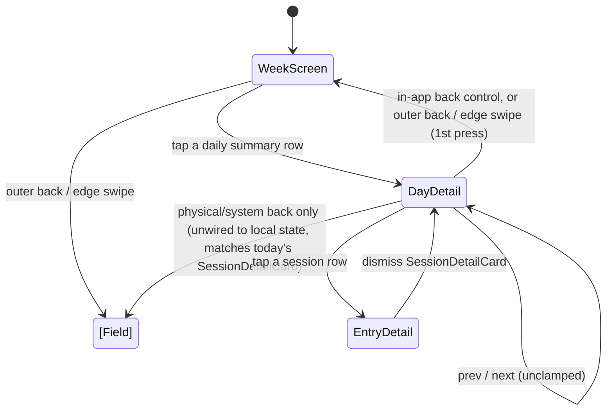

# feat: Unify History's Day/Week tabs into one week view

## Summary

Replace `DiaryHistory`'s Day/Week tabs with one screen: a read-only 7-day trend chart, a reverse-chronological list of daily summary rows below it, and day-detail (the current hour-scale chart + session list) reached by tapping a row, rendered as a local-state child view with its own back control rather than a sibling tab.

## Problem Frame

The Day/Week tab split (see origin: `docs/brainstorms/2026-09-17-history-unified-week-view-requirements.md`) forces users to manually flip between two disconnected screens to see a pattern across an irregular check-in cadence, and the point-cloud panel added in the prior sparse-checkin-legibility work compounded this with a third, inconsistently-sized representation of the same data. Two rounds of local research (repo-pattern research, flow/edge-case analysis) confirmed the origin doc's architecture is sound and surfaced the specific implementation forks this plan resolves below.

## Key Technical Decisions

- **Day-detail is local component state, not a `useViewHistory`/`AppView` extension.** `useViewHistory` (`src/hooks/useViewHistory.ts`) tracks exactly one flat `AppView` value (`src/types.ts:1`) and has no concept of a nested child state. The codebase's own existing convention for nested overlays — `ConstellationReplay`'s `openEntry` (`src/components/Constellation/ConstellationReplay.tsx:30`), `DiaryHistory`'s current `activeTab`/`selectedDate`/`openEntry` (`src/components/DiaryHistory/DiaryHistory.tsx:20-27`) — is plain local `useState` dismissed by an explicit in-UI control. Day-detail follows the same pattern, with one distinction that matters for origin R10's "two distinct steps" requirement: only the *physical/system* back button (browser back gesture) stays unwired and exits `history` directly from any depth, unchanged from today's `SessionDetailCard` behavior — but the screen's own **in-app** controls are not exempt from R10 just because they predate this change. Both the outer "← Back" header button and the edge-swipe gesture are themselves in-app controls, so they must be gated on `dayDetailFor` the same as the new day-detail-local back control: while `dayDetailFor` is set, they clear it (returning to the week screen) instead of calling the outer `onBack`; only when it's `null` do they reach the outer `onBack` and exit History. This is a correction from an earlier draft of this plan, which left the outer header/swipe unconditionally wired and would have let a user skip the week screen entirely from day-detail.
- **Day-detail's per-day spread indicator (`MiniCircumplex`, origin R9) renders read-only — no `onPinTap`.** The day's own session list, rendered right below it, already provides direct entry access. Wiring tap-to-open would require rebuilding `WeekPointCloud`'s overlap-picker disambiguation logic (`src/components/DiaryHistory/WeekPointCloud.tsx:26-46,69-110`) — exactly the complexity this plan retires. Origin's Dependencies section over-listed `onPinTap`; this corrects it.
- **`SessionDetailCard`'s existing dismiss behavior needs no change.** Because day-detail is local component state (not a pushed history entry), `SessionDetailCard` opening on top of it and closing naturally lands back on day-detail — the "stack" falls out of the component tree, not an explicit push/pop mechanism. No new wiring needed for this to behave correctly.
- **The empty-day-detail "Start a check-in" button and post-check-in return state need no code changes.** The existing empty-state button already wires straight to `DiaryHistory`'s outer `onBack` (`src/components/DiaryHistory/DiaryHistory.tsx:199-215`), exiting to the field regardless of which day was being viewed — already the sensible behavior since a new check-in always dates to today (`src/hooks/useDiary.ts:13`), never the viewed day. `DiaryHistory` already fully remounts fresh state on re-entry, so returning after a check-in naturally resets to the week screen.
- **A fully-empty week reuses the existing `hasSpreadCoverage`-gated invitation copy unchanged.** A user with zero entries ever cannot reach this screen at all — `App.tsx` gates the History nav entry on `entries.length > 0` (`src/App.tsx:1324`) — so the only "empty" case this screen handles is a quiet week within existing history, which the current copy already addresses.
- **Row dot cap is 5**, with a `+k` overflow marker beyond that (origin R6) — a visual-tuning constant in the same spirit as `DayChart`/`WeekChart`'s existing gap-weight constants, adjustable by eye later.
- **Daily summary rows mark the current day distinctly and share a date-label format with `WeekChart`'s day columns**, reusing `DayTabHeader`'s `isToday` convention (`src/components/DiaryHistory/DayTabHeader.tsx:22`). Extends origin R4/R7: the trend chart and the row list deliberately read in opposite directions (oldest-left vs. newest-first), so a shared "today" marker and label format make cross-referencing a chart point to its row trivial instead of requiring the reader to count backward.
- **Timezone/midnight staleness while a user is idle on the open screen is an explicit non-goal.** `dateKey`/`last7Days`/`sessionsForDay` (`src/utils/diaryAggregation.ts`) are local-time and recompute correctly on the next render or re-entry; no new design is needed for a user parked open across local midnight.
- **`DailySummaryRow` is keyboard-operable, not a plain `onClick` div.** It's the sole navigation surface into a day (per the first decision above), unlike `DiaryEntryRow` which is one of several paths to an entry — that raises the bar past `DiaryEntryRow`'s current pattern (`src/components/DiaryHistory/DiaryEntryRow.tsx:39-45`, no `role`/`tabIndex`/focus style). Use a native `<button>` (or `role="button"` + `tabIndex={0}` + Enter/Space handling) with a visible focus style. The dimmed empty-day state keeps a visible hover/press treatment distinct from `RhythmStrip`'s fully-decorative dimming (`src/components/EmotionMirror/RhythmStrip.tsx:34-37`, which has no interactivity at all), so a dimmed-but-tappable row doesn't read as disabled.

## Requirements

**Week screen**

- R1. The History screen defaults to a single view showing a rolling 7-day window (today minus 6 through today), replacing the Day/Week tab split.
- R2. The existing trend chart (`WeekChart.tsx`) renders at the top with its gap-weighted fading logic unchanged, but is purely visual — no tap targets.
- R3. Below the trend chart, one daily summary row renders per day in the window, newest day first.
- R12 (new, added during planning — see Key Technical Decisions). Daily summary rows and the trend chart share a consistent date-label format, and the row for today is marked distinctly.

**Daily summary rows**

- R4. Each row shows the day's date label and one small dot per check-in that day, positioned/colored per that check-in's averaged valence/arousal.
- R5. A day with zero check-ins renders as a dimmed, dot-less row that still occupies its place in the list and remains tappable.
- R6. A day with more check-ins than the display cap (5) shows the capped dots plus a `+k` overflow marker for the remainder.

**Day detail (child view)**

- R7. Tapping a daily summary row opens the existing day-detail view (hour-scale chart, that day's session list) as a child of the week screen, not a sibling tab.
- R8. Day-detail retains its current unclamped prev/next paging — a user can page past the 7-day window indefinitely, same as today.
- R9. When the opened day has more than one check-in, day-detail additionally shows a read-only `MiniCircumplex` of just that day's pins.

**Navigation**

- R10. From day-detail, an in-app back control returns to the week screen as a distinct step from exiting History entirely (a second, separate back action).
- R11. No entry point to Constellation Replay is added to this screen.

## Acceptance Examples

- AE1. **Covers R4, R5.** Given a 7-day window where 3 days have zero check-ins, when the screen renders, then those 3 rows show only a dimmed date label and no dots, each still occupying its row position.
- AE2. **Covers R4, R6.** Given a day with more than 5 check-ins, when that day's row renders, then it shows 5 dots plus a `+k` marker, where k is the remaining count.
- AE3. **Covers R5, R7.** Given a day with zero check-ins, when the user taps that day's row, then day-detail opens showing the existing empty state ("No check-ins on this day" / "Start a check-in").
- AE4. **Covers R8.** Given the user is viewing day-detail for the oldest day in the window, when they tap "previous", then day-detail navigates to the day before the window without error.
- AE5. **Covers R9.** Given a day with 3 check-ins, when day-detail opens for that day, then a read-only `MiniCircumplex` renders showing all 3 pins. Given a day with exactly 1 check-in, no `MiniCircumplex` renders.
- AE6. **Covers R10.** Given the user has drilled into day-detail, when they tap the day-detail-local back control, they land on the week screen; from there, a subsequent outer back (header button or edge swipe) exits History entirely. The same first-step outcome holds if the user instead uses the outer "← Back" header button or the edge swipe directly from day-detail — both are gated on `dayDetailFor` and return to the week screen rather than exiting History in one step. Only the physical/system back gesture bypasses this and exits History directly from day-detail, unchanged from today's `SessionDetailCard` behavior.
- AE7 (new). **Covers R5, R7.** Given a fully empty 7-day window (0 check-ins across all 7 days, but the user has entries further in the past), when the screen renders, then all 7 rows show dimmed with no dots and the existing sparse-coverage invitation copy renders above the row list, unchanged from today's wording.
- AE8 (new). **Covers R5, R7, R8.** Given the user taps "Start a check-in" from an empty day-detail for a day other than today (reached via prev/next paging), then the app exits straight to the field screen, the same as tapping it from today's empty state.

## Implementation Units

### U1. Make the trend chart read-only

**Goal:** Drop `WeekChart`'s tap interactivity (R2).

**Requirements:** R2

**Dependencies:** none

**Files:**
- `src/components/DiaryHistory/WeekChart.tsx` (modify)
- `src/components/DiaryHistory/DiaryHistory.tsx` (modify — stop passing `onDayTap`)

**Approach:** Remove the `onDayTap` prop from `WeekChart`'s `Props` interface and the per-column `<rect>` tap-target block (`WeekChart.tsx:134-146` — confirmed the only interactive surface in the file). Update the one call site.

**Patterns to follow:** None needed — pure removal.

**Test scenarios:**
- Test expectation: none -- pure UI removal with no new behavior; existing `check:density` coverage of `WeekChart`'s rendering math is untouched.

**Verification:** `WeekChart` renders identically apart from no longer responding to taps on its day columns; `npm run lint` / `tsc -b` clean.

---

### U2. Retire the point-cloud panel and its dead pin-overlap logic

**Goal:** Delete `WeekPointCloud` (Key Technical Decisions) and remove the now-unused pin-overlap machinery it alone depended on.

**Requirements:** (supports the removal implied by origin's Key Decisions; no R-ID of its own — this is cleanup, not new behavior)

**Dependencies:** none

**Files:**
- `src/components/DiaryHistory/WeekPointCloud.tsx` (delete)
- `src/components/DiaryHistory/DiaryHistory.tsx` (modify — remove the import and render call)
- `src/utils/diaryAggregation.ts` (modify — remove `nearestPins` and `PIN_OVERLAP_RADIUS`, `diaryAggregation.ts:144-159`)
- `scripts/test-chart-density.ts` (modify — remove the `nearestPins` test cases)

**Approach:** Grep the repo for any other consumer of `nearestPins`/`PIN_OVERLAP_RADIUS` before deleting (research found only `WeekPointCloud.tsx` uses them, but verify at implementation time since the codebase has changed since research ran). If `euclideanDist`/`SELECTION_RADIUS` (imported into `diaryAggregation.ts` from `src/hooks/useProximity.ts` solely to power `nearestPins`) become unused after this removal, drop that import too.

**Patterns to follow:** None — pure deletion.

**Test scenarios:**
- `check:density` continues to pass after removing the `nearestPins` fixtures and assertions.
- Test expectation for the component deletion itself: none -- removing a component with no remaining callers.

**Verification:** `WeekPointCloud.tsx` no longer exists; no dangling imports; `npm run check:density`, `npm run lint`, `tsc -b` all clean.

---

### U3. Add the daily summary row component and its dot-cap helper

**Goal:** Build the new row (R3, R4, R5, R6, R12) as a standalone, reusable component.

**Requirements:** R3, R4, R5, R6, R12

**Dependencies:** none

**Files:**
- `src/components/DiaryHistory/DailySummaryRow.tsx` (create)
- `src/utils/diaryAggregation.ts` (modify — add `MAX_ROW_DOTS` constant and a `capDots(count, cap)` pure helper returning shown/overflow counts)
- `scripts/test-chart-density.ts` (modify — add cases for `capDots`)

**Approach:** `DailySummaryRow` takes a day's `Date` and that day's `DiaryEntry[]` (from `sessionsForDay`, already exported) plus an `onSelect(date)` callback. It renders a date label (matching `WeekChart`'s `toLocaleDateString('en-US', { weekday: 'short' })` format per R12), a "today" marker when `dateKey(date) === dateKey(new Date())` (mirroring `DayTabHeader`'s `isToday` check, `DayTabHeader.tsx:22`), and one small dot per session with a non-null `sessionAverage` — filter out zero-pin entries first (`sessionAverage` returns `null` for those, `diaryAggregation.ts:10-11`), matching `DayChart.tsx:53-54`'s `if (avg === null) continue` pattern, before both the dot render and the `capDots` input — capped at `MAX_ROW_DOTS` through `capDots`, or a dimmed empty treatment when there are no renderable sessions. Root element is a native `<button>` (or `role="button"` + `tabIndex={0}` + Enter/Space handling) with a visible focus style — it's the sole navigation surface into a day (Key Technical Decisions), so it needs to be keyboard-operable, unlike `DiaryEntryRow` which is only one of several paths to an entry. The dimmed empty-day state keeps a visible hover/press treatment and `cursor: pointer`, distinct from `RhythmStrip`'s fully-decorative (non-interactive) dimming, so it doesn't read as disabled.

**Patterns to follow:** `src/components/DiaryHistory/DiaryEntryRow.tsx` (row shape, spacing, divider); `src/components/EmotionMirror/RhythmStrip.tsx` (dimmed empty-day token choices only, not its lack of interactivity); `src/components/DiaryHistory/DayTabHeader.tsx:22` (`isToday` convention); `src/components/DiaryHistory/DayChart.tsx:53-54` (null-`sessionAverage` filtering).

**Test scenarios:**
- `capDots(3, 5)` → `{ shown: 3, overflow: 0 }`.
- `capDots(7, 5)` → `{ shown: 5, overflow: 2 }` (AE2).
- `capDots(0, 5)` → `{ shown: 0, overflow: 0 }`.
- Component: a day with 0 sessions renders dimmed with no dots and remains tappable (AE1).
- Component: a day matching today's `dateKey` renders the "today" marker.
- Component: a day containing a zero-pin entry doesn't render a dot for it and doesn't count it toward the `capDots` input.
- Component: the row is reachable and activatable via keyboard (Tab + Enter/Space) with a visible focus indicator.
- Component: the dimmed empty-day row shows a hover/press state, distinguishing it from a disabled control.

**Verification:** `npm run check:density` covers `capDots`; the component renders correctly for 0/1/many-under-cap/over-cap sessions in a manual pass once wired into U4.

---

### U4. Unify `DiaryHistory` around the week screen and nest day-detail

**Goal:** Replace `TabBar`-driven tab switching with the unified week screen (R1, R3) and day-detail as a local-state child view with in-app back navigation (R7, R8, R10, R11, AE3, AE6, AE7, AE8).

**Requirements:** R1, R3, R7, R8, R10, R11

**Dependencies:** U1, U2, U3

**Files:**
- `src/components/DiaryHistory/DiaryHistory.tsx` (modify — substantial rewrite of `WeekTabContent`/`DayTabContent` into one flow)
- `src/components/DiaryHistory/TabBar.tsx` (delete — sole consumer was `DiaryHistory.tsx`; verify no other import before deleting)

**Approach:** Replace `activeTab`/`selectedDate` with a single `dayDetailFor: Date | null` (null → week screen; a `Date` → day-detail for that day). The week screen renders `WeekChart` (from U1) followed by the existing sparse-coverage invitation paragraph (unchanged, `hasSpreadCoverage`-gated) followed by seven `DailySummaryRow`s (from U3, newest-first — reverse `last7Days()`'s oldest-first order when mapping), each `onSelect` setting `dayDetailFor`. Day-detail renders `DayTabHeader` + `DayChart` + the session list / empty state (today's `DayTabContent` body, unchanged) beneath a new small in-app back control (a "← Week" style header row following the token pattern of `DiaryHistory`'s existing outer header, `DiaryHistory.tsx:76-97`) that clears `dayDetailFor`. `shiftDate`'s existing unclamped prev/next logic (`DiaryHistory.tsx:34-40`) now operates on `dayDetailFor` instead of `selectedDate`, unchanged otherwise (R8). `openEntry`/`SessionDetailCard` stay exactly as they are — an overlay layered on top of whichever content (week screen or day-detail) is currently rendered, requiring no new dismiss logic (Key Technical Decisions). The outer "← Back" header button and the edge-swipe gesture are gated on `dayDetailFor`: while it's set, both clear `dayDetailFor` (returning to the week screen) instead of calling the outer `onBack`; only when `dayDetailFor` is `null` do they reach the outer `onBack` and exit History (R10, AE6). Physical/system back (the browser back gesture) stays unwired to this local state and exits History directly from either screen, unchanged from today. The week-screen↔day-detail swap uses a `framer-motion` fade/slide transition, consistent with this file's existing `motion.div` empty-state pattern (`DiaryHistory.tsx:183-185`), rather than an instant hard cut.

### High-Level Technical Design

`EntryDetail` (`SessionDetailCard`) is an overlay, not a distinct `AppView`/history-stack entry — it renders on top of whatever `dayDetailFor` currently holds and dismissing it simply removes the overlay, landing back on that same content. Only the outer `History ↔ Field` transition is a real `useViewHistory` push; `WeekScreen ↔ DayDetail` and `DayDetail ↔ EntryDetail` are both local component state. The outer "← Back" button and edge-swipe are in-app controls, not the physical back button, so R10's two-distinct-steps requirement applies to them too (Key Technical Decisions) — only the physical/system back gesture is exempt, matching `SessionDetailCard`'s existing unwired behavior.

**Patterns to follow:** `DiaryHistory.tsx`'s existing header token styles (`DiaryHistory.tsx:76-97`) for the new in-app back control; `DayTabHeader.tsx`'s chevron/label styling for consistency.

**Test scenarios:**
- Tapping a populated day row opens day-detail showing that day's `DayChart` and session list.
- Tapping an empty day row opens day-detail's existing empty state with "Start a check-in" (AE3).
- Day-detail's in-app back control returns to the week screen; a subsequent outer back (from the week screen) exits History (AE6).
- From day-detail, the outer "← Back" header button and the edge-swipe gesture also return to the week screen first, not straight to History exit — both are gated on `dayDetailFor` (AE6).
- Day-detail's prev/next paging navigates past the 7-day window without error (AE4, unchanged behavior re-verified after the state rename).
- Opening `SessionDetailCard` from day-detail's session list and dismissing it returns to day-detail, not the week screen.
- A fully-empty 7-day window renders all 7 rows dimmed with the existing invitation copy still shown (AE7).
- "Start a check-in" tapped from a non-today empty day-detail exits to the field (AE8).
- **Integration:** `check:density`'s existing coverage of `entriesInWindow`/`hasSpreadCoverage` still governs whether the invitation copy renders, now feeding both the week screen's copy and the row list from the same `windowEntries` computation.

**Verification:** Manual pass through the full navigation graph above (week → day-detail → entry detail → back → back); `npm run lint`, `tsc -b`, `npm run build`, `npm run check:density` all clean.

---

### U5. Add the per-day `MiniCircumplex` to day-detail

**Goal:** Show a read-only spread indicator for days with more than one check-in (R9, Key Technical Decisions).

**Requirements:** R9

**Dependencies:** U4

**Files:**
- `src/components/DiaryHistory/DiaryHistory.tsx` (modify — day-detail render branch)

**Approach:** When the day-detail's session list has more than one entry, flatten those sessions' pins into one array (the same flattening `WeekPointCloud` used before its removal, `WeekPointCloud.tsx:20`, minus the `entryByPinId`/tap-disambiguation machinery) and render `<MiniCircumplex pins={...} showAxes />` with no `onPinTap` (Key Technical Decisions — read-only). Position it near the existing `DayChart` in day-detail's layout; exact placement is a UI-detail call at implementation time.

**Patterns to follow:** `WeekPointCloud.tsx`'s pin-flattening step only (not its tap handling, which is being retired); `SessionDetailCard.tsx:81`'s existing read-only `MiniCircumplex` usage as the closest precedent for a non-interactive instance.

**Test scenarios:**
- A day with 3 check-ins shows a `MiniCircumplex` rendering all 3 sessions' pins (AE5).
- A day with exactly 1 check-in shows no `MiniCircumplex` (AE5).
- A day with 0 check-ins (empty state) shows no `MiniCircumplex` (day-detail renders the empty state instead, not this branch).

**Verification:** Manual visual check that the indicator appears only for >1-check-in days and reflects that day's actual pin spread.

---

## Scope Boundaries

- Infinite/scrollable browsing beyond the 7-day window is not built now (origin). `DailySummaryRow`s are assembled from a plain array in U4, not a fixed-slot layout, so this stays additive later.
- No cross-link to Constellation Replay is added (R11).
- `SessionDetailCard`, CSV export, and day-detail's `DayChart`/session list content are unchanged — this plan re-parents day-detail's navigation, not its content.
- Timezone/midnight staleness while a screen is left open and idle is an explicit non-goal (Key Technical Decisions).
- `AGENTS.md`'s testing table is stale relative to `package.json`'s actual `check:*` scripts (missing several existing entries) — noticed during research, out of scope for this plan.

## Risks & Dependencies

- Deleting `nearestPins`/`PIN_OVERLAP_RADIUS` (U2) and `TabBar.tsx` (U4) assumes no consumer beyond what research found — both units call for a fresh repo-wide grep immediately before deletion as cheap insurance against a stale finding.
- `DiaryHistory.tsx` is the single largest touch point across four units (U1, U2, U4, U5) — U4's rewrite should be reviewed against U1/U2's landed diffs to confirm no conflicting edits before it starts, and U5's later addition should be reviewed against U4's landed shape for the same reason, even though all are sequenced to land in order.

## Sources / Research

- `src/hooks/useViewHistory.ts:12-21` — `AppView`-keyed, single-value history sync; no nested-state support today.
- `src/components/Constellation/ConstellationReplay.tsx:30` and `src/components/DiaryHistory/DiaryHistory.tsx:20-27` — existing local-state convention for nested overlays this plan follows for day-detail.
- `src/components/DiaryHistory/WeekPointCloud.tsx:20-46,69-110` — the pin-flattening technique (reused in U5) and the tap-disambiguation logic (retired, not reused).
- `src/App.tsx:1324` — History nav gated on `entries.length > 0`, which resolves the "brand-new user" empty-state question.
- `src/hooks/useDiary.ts:13` (and `src/App.tsx:937`) — new check-ins always date to today, informing the "Start a check-in from a past day" resolution.
- `src/components/DiaryHistory/DayTabHeader.tsx:22` — `isToday` convention, reused for R12's today marker.
- `src/components/EmotionMirror/RhythmStrip.tsx:34-37` — dimmed empty-day visual precedent.
- `scripts/test-chart-density.ts` — existing check-script pattern to extend for `capDots` and to trim for the removed `nearestPins` cases.
- `STRATEGY.md:46-50` — "Reflection surface" track, confirming this work sits in an intentionally tracked product area.
